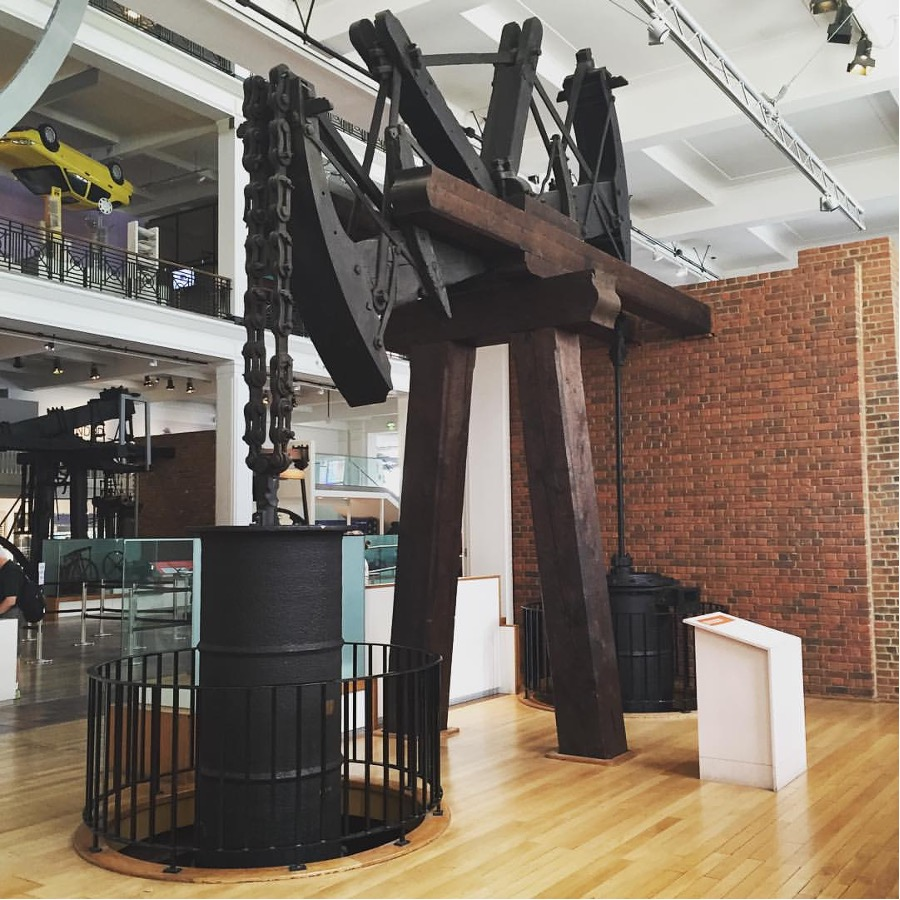
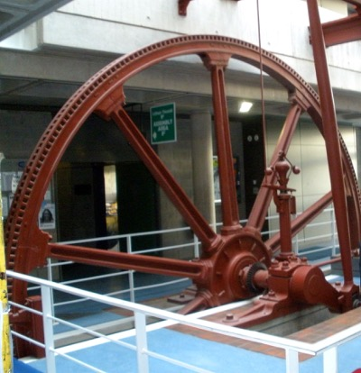
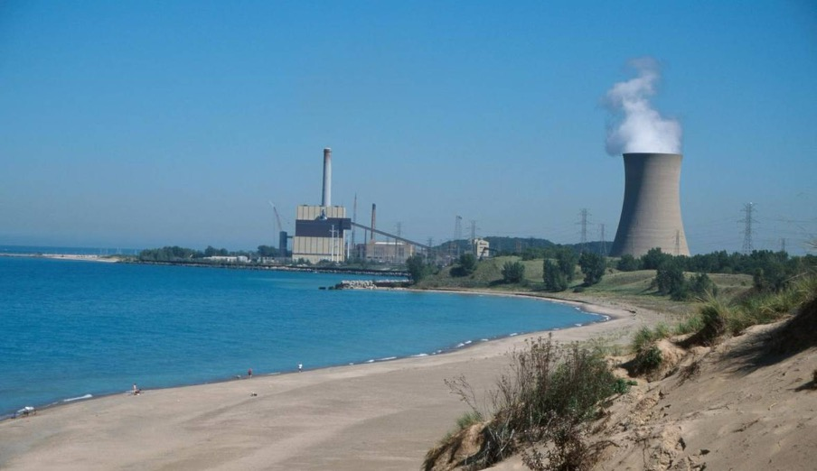
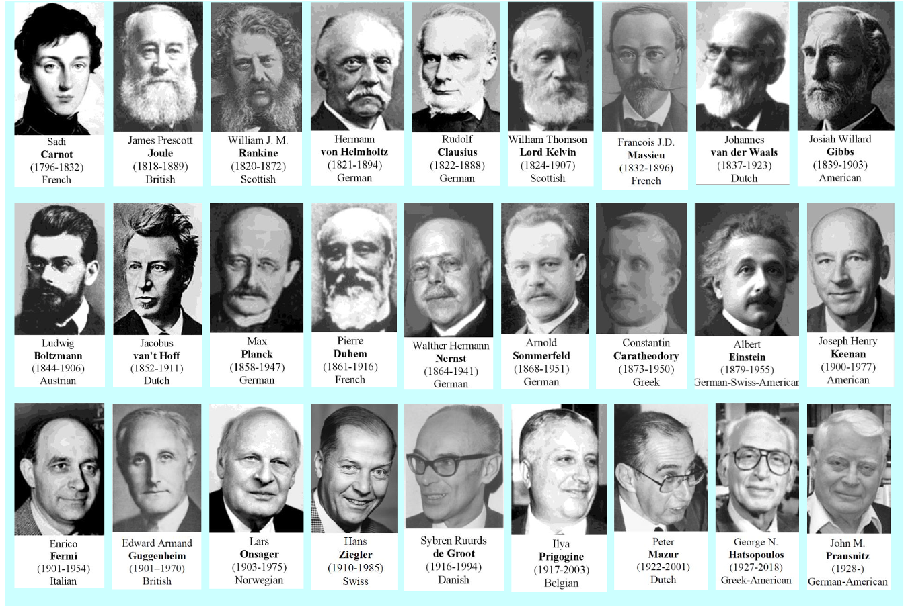
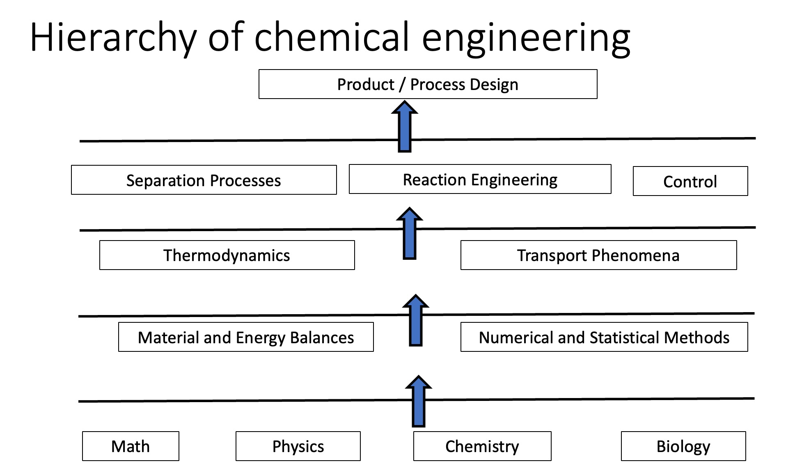
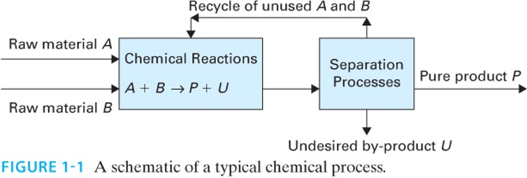

# Course Administration

::: {.callout-note}
## Instructor Note
Please make sure to review the syllabus and course schedule posted on Canvas. If you have questions about policies or course details, you can probably find the answer in the syllabus.
:::
 
- Review of syllabus  
  - **Exams:** Wednesdays during 75 minute tutorial time. See schedule for dates.  
  - **Tutorial:** Weekly problem-solving sessions using example exam questions. 
  - **Quizzes:** All extra credit - meant to encourage you to read the textbook  
  - **Homework:** Graded via Gradescope (0–4 scale)  
  - **Honor code:** Group HW allowed; write solutions individually  
  - **Reading:** Textbook (Dahm & Visco); it is a companion to these notes, and the readings are posted for each class. Weekly readings are the basis for quizzes.  
  - **Office hours:** In-person  
  - **Late homework:** 50% deduction for first 24-hours, then no credit
  - **Review of honor code**
  - **AI policy:** See the syllabus for details

---

# Origins of Thermodynamics

:::: {.columns}

::: {.column width="55%"}
- From the Greek:
  - θέρμη *therme* = heat, warmth 
  - Δύναμις *dynamis* = power, force
- **Thermodynamics = “getting power or work from heat.”**

This reflects its historical development: engineers built machines that extracted work from heat.  @fig-steam-engine shows an early beam engine (a type of steam engine) built by the partnership of Matthew Boulton and James Watt. The engine was constructed in 1777 and worked until 1848. It is the oldest surviving Watt engine in the world. 

Thermodynamics is much broader than just heat engines, as we will see!

:::

::: {.column width="45%"}
{#fig-steam-engine width=70%}
:::

::::

- Engineer: from the Latin *ingenium* (ingenious, engine)
- Engineers are practical people who devised "engines" to extract work from heat
- Catapults (developed by military engineers) were called "siege engines"
- Thermodynamics is crucial to the identity of *engineering*, and so is a foundational topic
- 
## Examples of engines

:::: {.columns}

::: {.column width="55%"}
- The pump in @fig-dublin-pump was used to dewater coal mines, and is in the lobby of the Engineering building at City College, Dublin.
:::

::: {.column width="5%"}
:::

::: {.column width="40%"}  
{#fig-dublin-pump width=70% fig-align="center"}
:::

::::

:::: {.columns}

::: {.column width="55%"}
- @fig-micity-power is a 680 MWe power plant just west of campus in Michigan City.
- What kind of a plant is this? 
- Why did they put it along the shores of Lake Michigan?
:::

::: {.column width="5%"}
:::

::: {.column width="40%"}  
{#fig-micity-power width=70% fig-align="center"}
:::

::::

## Historical Figures in Thermodynamics

{#fig-thermo-people width=90% fig-align="center"}

- @fig-thermo-people shows many of the key people who helped establish the foundations of thermodynamics.
  
### James Joule (Manchester, England)
- Demonstrated the **mechanical equivalent of heat** (1845) via his famous "paddle wheel" experiment 
- Established that work can be converted into heat  
- SI unit of energy named in his honor  
- Fun fact: ran a brewery with his father and performed experiments in his spare time.

### William Thomson (Ireland and Scotland)
- Built theoretical foundations using Joule’s measurements  
- Developed the **absolute temperature scale**  
- Later knighted as Lord Kelvin

### J. Willard Gibbs (United States)
- Created the **mathematical foundation** of thermodynamics  
- Introduced concepts of free energies & chemical potentials  
- Coined the term **statistical mechanics**  
- Invented vector calculus  
- Yale professor (1871–1903)

### Hermann von Helmholtz (Germany)
- Medical doctor  
- Key contributor to the **First Law** (conservation of energy, 1847)  
- Helmholtz energy \(A\) named after him; “Arbeit” = work (German)

### John M. Prausnitz (Germany, United States)
- Key 20th-century figure in chemical engineering thermodynamics  
- Founder of modern models for phase equilibrium (UNIQUAC, UNIFAC)

---

# Where Thermodynamics Fits in the Curriculum

:::: {.columns}

::: {.column width="50%"}
@fig-curriculum shows how thermodynamics connects mathematical and scientific foundations to engineering analysis and design.

- **Base:** Math, chemistry, physics  
- **Fundamental tools:** Introductory material balances, numerical methods, statistics  
- **Core Concepts:** Thermodynamics, transport, materials  
- **Engineering tools:** Reaction engineering, separations, process control  
- **Capstone:** Process and product design
:::

::: {.column width="5%"}
:::

::: {.column width="45%"}  
{#fig-curriculum width=70% fig-align="center"}
:::

::::

---

# A Fundamental Engineering Concept

We often write transport and driving-force relationships as:

$$
J = - L \nabla X
$$ {#eq-transport}

where in @eq-transport, 

- J =  flux  
- X =  driving force  
- L =  transport coefficient  

General idea: **rate of change or production = driving force × mobility (or inverse resistance).**

**Thermodynamics** is concerned with driving forces. **Transport phenomena** is concerned with mobility.

---

# Chemical Process Example

:::: {.columns}

::: {.column width="40%"}
- @fig-process shows a generic chemical process whereby raw materials A and B are converted in a reactor to form desired product P and undesired product U. 
- A separation process is required to purify P from U and recycle unreacted A and B. 
- Thermodynamics is involved in all aspects of this process
  - Chemical reaction equilibria
  - Phase equilibria for the separation process
  - Heating and cooling required to run the reactor and separator
  - Power to run pumps, compressors, other equipment
  - Limits on how efficient the process can be

:::

::: {.column width="5%"}
:::

::: {.column width="55%"}  
{#fig-process width=90% fig-align="center"}
:::

::::

# How this class differs from other classes

- This class is similar to mechanical engineering thermodynamics, in that we treat 1st and 2nd law, power
cycles, refrigeration, etc. 
- We focus less on motive power, and more on molecular-level phenomena, phase diagrams, equations of state
- For the most part, we will only deal with pure compounds
- Preparation for 2nd class phase equilibria and separations, where mixtures and reactions are treated; unique to Cheg.

# Beyond Engineering
- policy issues need thermodynamics
    - green and renewable energy
    - electric cars
    - biofuels
    - CO$_2$ capture
    - data centers
    - grid
    - energy efficiency
- Law, business
    - what is feasible, efficient, possible?

- An educated person in the 21st century must have a basic understanding of the 1st and 2nd laws!

**Albert Einstein:** "A theory is the more impressive the greater the simplicity of its premises, the more different kinds of things it relates, and the more extended its area of applicability. Therefore the deep impression that classical thermodynamics made upon me. It is the only physical theory of universal content which I am convinced will never be overthrown, within the framework of applicability of its basic concepts."

**C. P. Snow:** “A good many times I have been present at gatherings of people who, by the standards of the traditional culture, are thought highly educated and who have with considerable gusto been expressing their incredulity of scientists. Once or twice I have been provoked and have asked the company how many of them could describe the Second Law of Thermodynamics. The response was cold: it was also negative. Yet I was asking something which is the scientific equivalent of: Have you read a work of Shakespeare's?

I now believe that if I had asked an even simpler question -- such as, What do you mean by mass, or acceleration, which is the scientific equivalent of saying, Can you read? -- not more than one in ten of the highly educated would have felt that I was speaking the same language. So the great edifice of modern physics goes up, and the majority of the cleverest people in the western world have about as much insight into it as their neolithic ancestors would have had.”

<!-- CP Snow, Einstein --> 