# Last class
- Course admin
- Origins of thermodynamics
  - Engines (engineer!)
  - Key people
- Where thermo fits in the curriculum and beyond

# Systems and Boundaries

- It is important to have clear definitions when we are discussing thermodynamic concepts. 
  - **System**:  Specific portion of space we are concerned with
  - **Surroundings**: everything other than the system
  - **Universe**: system + surroundings
  - **Process**:  specific time period or event being analyzed
  - **Control volume**: space inside boundaries of a system

- Soon, we will discuss a *Rankine cycle*, which is represented by @fig-rankine-system. The cycle consists of a pump, a condenser, a heat exchanger, a boiler, and a turbine.  

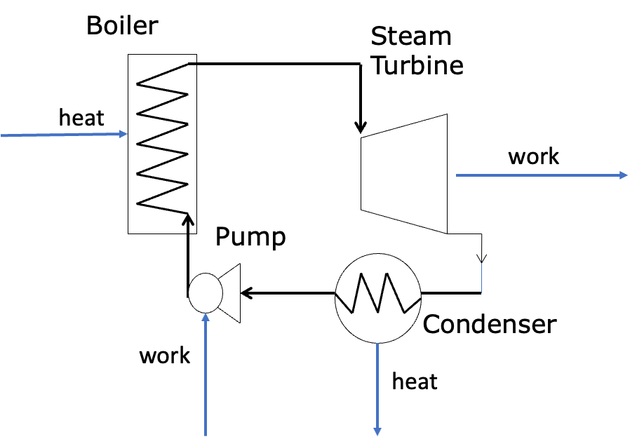{#fig-rankine-system width=4in fig-align="center"}

- We can define many parts of the cycle as the *system*
  - The pump could be the system, in which case everything else is the surroundings
  - Maybe all the equipment is the system
- **Boundaries** separate *systems* from the *surroundings* 
  - **Open**: mass can exchange between system and surroundings
  - **Closed**: mass cannot exchange between system and surroundings
  - **Adiabatic**: heat (defined soon!) cannot cross the boundary (can still have work cross boundary)
  - **Diathermal**: heat can cross the boundary
  - **Isolated**: neither energy (defined soon!) nor mass can cross the boundary  (the universe is the ultimate isolated system)
  - **Isochoric**: volume does not change (i.e. rigid boundary)
  - **Isobaric**: pressure does not change (moveable boundary, i.e. floating piston)
  - **Isothermal**: temperature does not change (diathermal boundary)

- **Two types of systems**

:::: {.columns}

::: {.column width="50%"}
-  **Simple system**: no internal boundaries or restraints; all parts of the system can exchange mass and energy
- @fig-simple-system is an example of a simple system

:::

::: {.column width="5%"}
:::

::: {.column width="45%"}  
{#fig-simple-system width=90% fig-align="center"}
:::

::::

:::: {.columns}

::: {.column width="50%"}
-  **Composite system**: two or more simple systems separated by boundaries
- @fig-composite-system is an example of a composite system made up of simple systems A, B, C, and D

:::

::: {.column width="5%"}
:::

::: {.column width="45%"}  
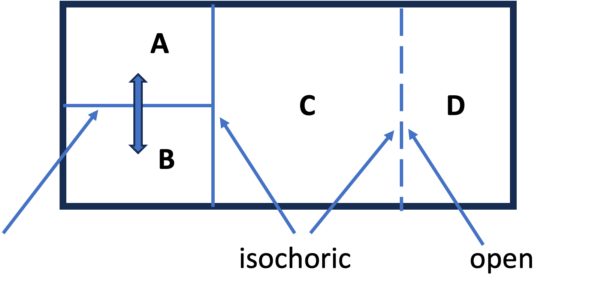{#fig-composite-system width=90% fig-align="center"}
:::

::::

# Equilibrium and Steady State
- Thermodynamics is concerned with systems at **equilibrium**
  - A system is at *equilibrium* when there are no “driving forces” to change a “state property”. 
  - **State property**: defined formally later, but think of pressure, temperature, concentration, etc.
  - Examples of **driving forces**: pressure gradient (mechanical), temperature gradient (thermal), etc.
  - **Steady state** is a related concept; it occurs when the *properties of a system are constant with respect to time*.
- Consider a *heat exchanger* that uses warm water to heat the air in your dorm, such as that shown in @fig-heat-exchanger    

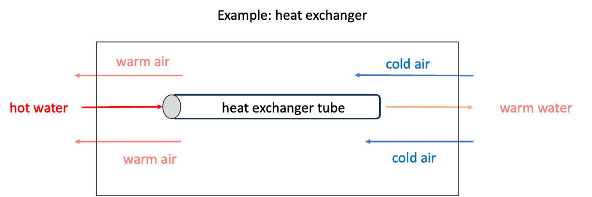{#fig-heat-exchanger width=6in fig-align="center"}

- Hot water enters a tube on the left and cold air enters a "shell" surrounding the tube on the right. 
- The hot water gives up energy via *heat* (defined shortly) to the air and gradually cools down as it moves from left to right, while the air warms up as it moves from right to left.
- This is the basic idea of how a heat exchanger works. 
- Is this system at equilibrium? Is it at steady state?

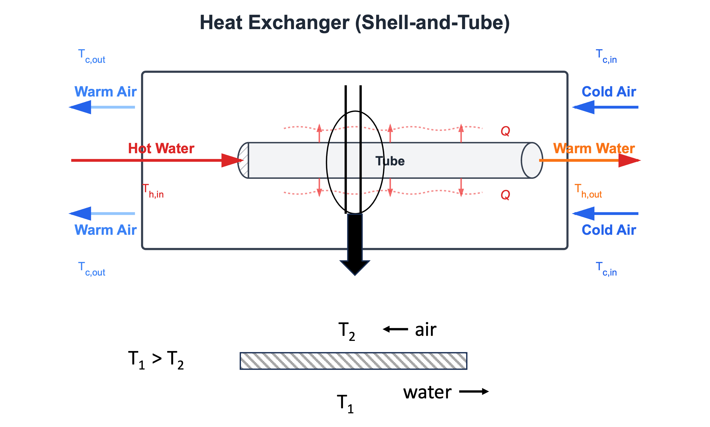{#fig-heat-exchange-detail width=6in fig-align="center"}

- @fig-heat-exchange-detail shows more detail of the heat exchanger. If we consider a vertical cross section at a mid-point along the tube, we see that across the thin metal tube surface, the water is at a higher temperature $T_1$ than the air, which is at $T_2$.
- If there are no overall changes in the inlet temperatures and flows of air and water, eventually this system will reach **steady state**, in that the temperatures of air and water *at any point along the tube* will not change. 
- However, there are temperature gradients between the air and the water, and along the tube between inlet and outlet water and air flows, as shown in @fig-T-gradient.

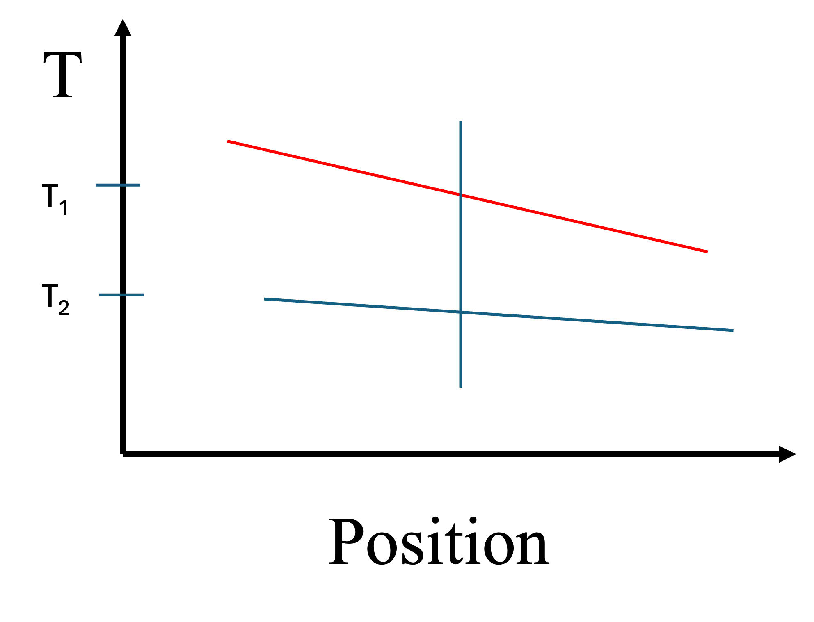{#fig-T-gradient width=6in fig-align="center"}

  - The *system* of the heat exchanger is therefore not at equilibrium. 
  - However, we could imagine a small element of water (or air) at a fixed position. It's *state variables* (i.e. temperature, pressure) would be constant, so we could apply thermodynamics to that volume element of fluid.
  - We will apply these concepts of equilibrium and steady-state a lot in this class.

::: {.callout-note}
## Thought Experiment
Are the wooden desks in the classroom "at equilibrium"? Hint: *thermodynamics* tells us about driving forces, and *kinetics* tells us about rates. 
:::

# Basic Definitions
- **System**: A specific portion of space that we are concerned with. **Always** define your system before starting to work a problem. Systems have boundaries.
- **Process**: A specific time period or event you are analyzing.
- **Control volume**: The space inside the boundaries of the system.
- **Surroundings**: Everything except the system.
- **Boundaries**
  - **Open**: mass can exchange between the system and the surroundings, as in @fig-open-tank

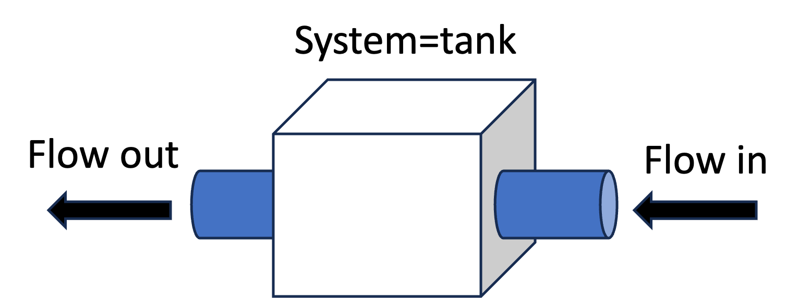{#fig-open-tank width=4in fig-align="center"}

  -  **Closed**: mass cannot exchange between the system and the surroundings, as in @fig-closed-tank. Composite systems can be closed with open simple systems being part of the overall composite system.

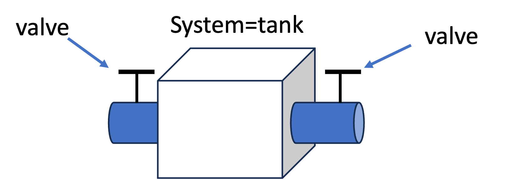{#fig-closed-tank width=4in fig-align="center"}  

  - **Adiabatic**: Heat (defined soon) cannot cross a system boundary. However, *work* (also to be defined soon) can cross an adiabatic boundary. See @fig-adiabatic-system.

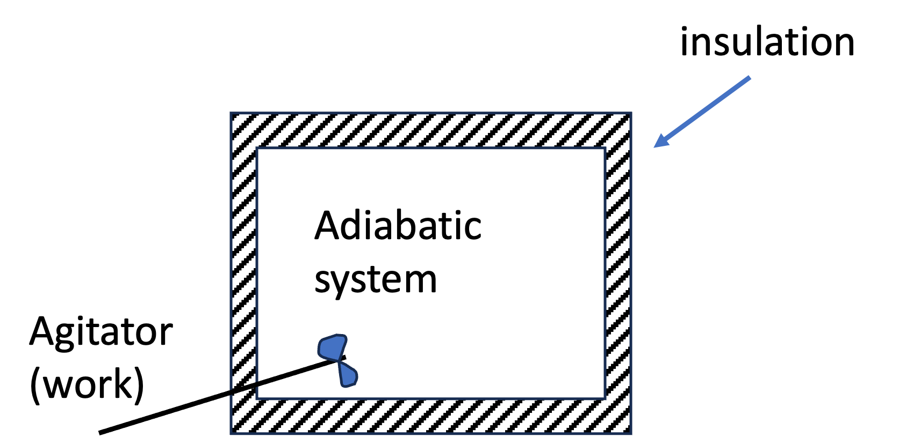{#fig-adiabatic-system width=4in fig-align="center"}

  - **Diathermal**: Heat can cross the boundary (i.e. metal walls, no insulation).
  - **Isolated**: Neither energy (defined soon!) nor mass may cross the system boundary. 
  - **Isochoric**: No volume change - rigid walls.
  - **Isobaric**: Pressure does not change (volume can change) 
  - **Isothermal**: A system with diathermal walls in contact with a heat bath (temperature is constant)

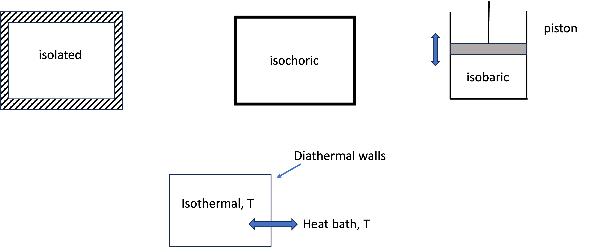{#fig-other-boundaries width=6in fig-align="center"}

- **Thermodynamic process**: A specific series of events that take place over a specific time, taking the *system* from an *initial state* to a *final state*. See @fig-process

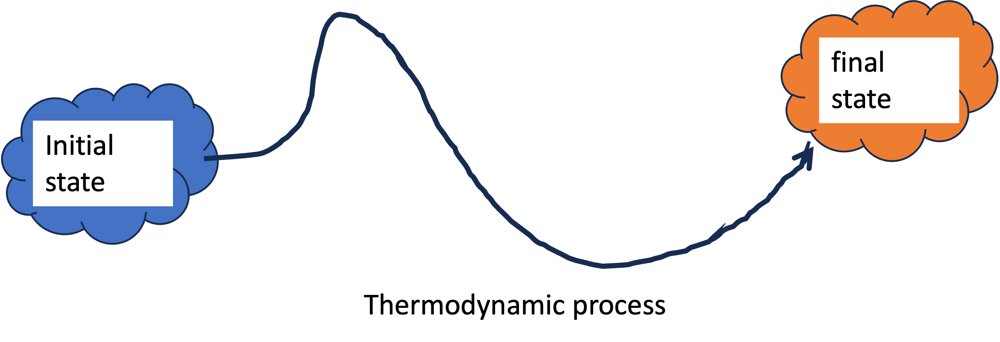{#fig-process width=6in fig-align="center"}

# Energy and Work
- **Energy** is a key concept of thermodynamics.
- Thomas Young first used the term in 1807 and it was loosely related to what we now call kinetic energy.
- Later, energy was defined as "**the capacity to do work**".
- But what is work?
  - **Work** occurs whenever an object is moved against an opposing force. 
  - Mathematically, we define work (a scalar) via @eq-work
  $$
  W \equiv \int \vec{F_E} \cdot d \vec{x}
  $$ {#eq-work}

::: {.callout-note}
## work in your textbook
Your textbook defines work in terms of scalars as $W=\int F d\ell$, but to get the sign "right" you have to know the signs on $F$ and $d \ell$. It is best to use vectors for force and displacement. We will work an example later to make this clearer.
:::  

{#fig-sliding-block width=4in fig-align="center"}

@fig-sliding-block shows how to do a calculation of work. First, define the system (in this case the block).

Friction between the block and the surface resists motion, so unless we do *work* on the system, nothing happens. 

If we push on the block in the positive x-direction with an external force $\vec{F}_E$, the block is displaced in the positive x-direction by an amount $dx$. It gains energy via the work done on it.

The integral over the path gives the work done on the system. Since both the force and displacement vectors are positive, the work is positive. We say positive work means work was done *on the system*. 

There are three "types" of energy

- **Kinetic energy**: the capacity to do work via *motion*. Gaspard-Gustave de Coriolis coined the term “kinetic energy” in 1829.

$$E_{KE}= \frac{1}{2} mv^2$$ {#eq-kinetic-energy}

- **Potential energy**: the capacity to do work via *position* or *configuration*. This term was coined by William Rankine in 1853. For potential energy to make sense, there needs to be some sort of external field (i.e. gravity, electric potential) or a device (i.e. a spring) involved.
  - For a *gravitational potential* where $m$ is the object mass, $g$ is the gravitational constant, and $h$ is the relative position withing the external gravitational field, the potential energy is
  
$$E_{PE} = m g h$$ {#eq-potential-energy-gravity}
  
  - For a *harmonic spring* with force constant $k$ and where $x$ is the displacement of the spring from it's zero energy state, the potential energy is
  
$$E_{PE} = \frac{1}{2} k x^2$$ {#eq-potential-energy-spring}
 
- **Internal energy**: the kinetic and potential energy of the molecules that make up the substance. We will say more about this later.

Objects can do work via their energy (kinetic, potential, internal) and in so doing, they can change their energy and the energy of the surroundings. But we observe that the *total energy* is constant. This leads to the First Law.

**First Law of Thermodynamics**: It has been *observed* that energy is a *conserved quantity*. After a thermodynamic process occurs, the *energy of the system and surroundings is the same*. 

Consider the example of an ideal frictionless pendulum shown in @fig-pendulum. The system (the ball) converts its kinetic energy to potential energy and back again along a trajectory. At any given point, the total energy is constant
$$ E_{tot} = E_{KE} + E_{PE}$$ {#eq-E-total}

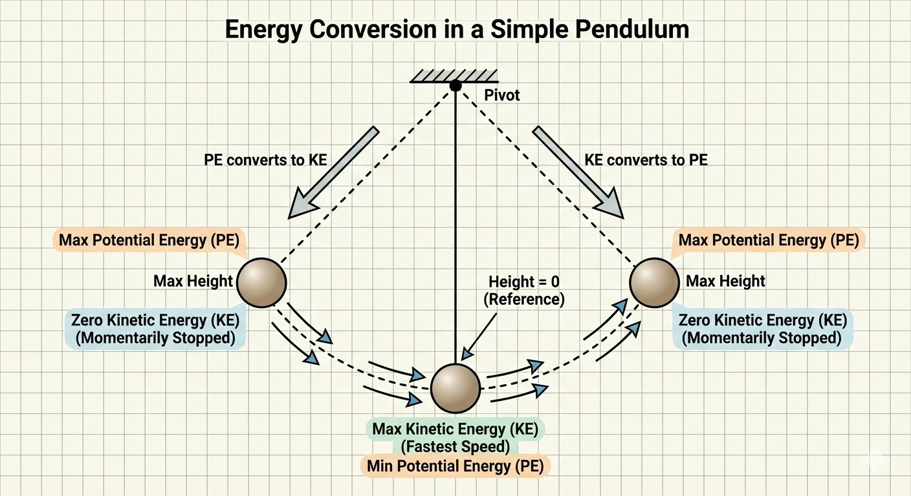{#fig-pendulum width=4in fig-align="center"}

Bodies in motion have kinetic energy, and so they can do work. Consider the following example.  

 

## Example: Work Calculation (Block vs. Spring)

Let's consider a specific numerical example to calculate work by hand and using Python.

A block of mass **$m = 5.0 \text{ kg}$** is sliding on frictionless ice with a velocity of **$v = 4.0 \text{ m/s}$**. It strikes a plunger attached to a spring with a spring constant **$k = 2000 \text{ N/m}$**. See @fig-block-spring-image.

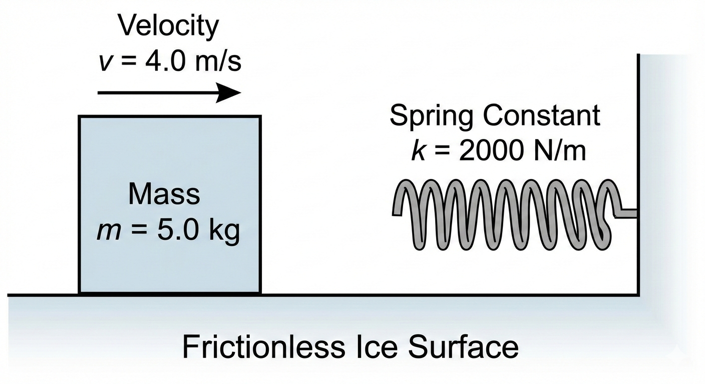{#fig-block-spring-image width=6in fig-align="center"}

We wish to calculate the work done **on the block** and **on the spring** as the block comes to a complete stop.

## Problem Setup: System & Boundary Definition

Before calculating the work, we must strictly define our system, boundary, and surroundings to determine what constitutes "external" work.

* **The System:** We define the **Block** (mass $m$) as our system.
* **The Boundary:** The boundary is the physical surface of the block.
* **The Surroundings:** The spring, the ground, and the air are part of the surroundings.

**Why this matters:**
Because the spring is in the *surroundings*, the force it exerts on the block acts **across the boundary**. As the boundary moves (displacement $dx$), energy is transferred *from* the block *to* the spring in the form of **Work**.

$$W_{b} = \int_{x_1}^{x_2} \vec{F} \cdot d\vec{x}$$

Since the force of the spring opposes the displacement of the boundary, we expect that the Work done on the system is **negative** (energy leaves the block).

**Calculation by Hand:**

- Initial kinetic energy of the block: $KE_i = \frac{1}{2}mv_i^2 = 0.5 \times 5.0 \times 4.0^2 = 40 \text{ J}$. The block can be considered to be a $h=0$ and so it has no potential energy.
  
- The spring is harmonic, with $PE_{spring}=\frac{1}{2} k x^2$; its initial position is $x_i=0$ so it has no initial potential energy. It is also not moving, so it has no kinetic energy.
  
- The block will contact the spring and compress it. It will stop when all its kinetic energy is transferred to the spring, or when its kinetic energy is zero and the spring potential energy is $PE = KE_i = \frac{1}{2}kx_f{^2} = 40 J$, where $x_f$ is the final or maximum compression distance of the spring.
  
- The force of the spring on the block is the negative derivative of the potential energy, $\vec{F}_{spring} = -\nabla_x \frac{1}{2}kx_f{^2} = -k x_f$.
   
- Maximum compression or final position of the spring will be: $x_{f} = \sqrt{m v_i^2/k} = 0.2m$
  
- Using @eq-work, $W \equiv \int \vec{F_E} \cdot d \vec{x}$
  
  System = block: 
  $W = \int_0^{+0.2} -k x \, dx = - \frac{1}{2} k x^2 |^{0.2}_0 = -40 J$. 
  
  The work on the block is -40 J. In other words, the block gives up energy by doing work on the surroundings (the spring). 
  
  **What if the spring was the system?**
  We use the same equations, but now the external force on the spring is in the same direction as the spring compression, or a positive value: $W = \int_0^{+0.2} +k x \, dx = + 40 J$. 
  
  The block (surroundings) did work on the system (the spring), the spring experienced positive work, and so it gained energy from the surroundings.  

- **Remember**: for a given system, when work is negative energy *leaves* the system via the work. When work is positive, energy *enters* the system via work. Be careful in defining the system, boundaries, and surroundings.

We can also use Python to calculate the work done by numerically integrating the force over the displacement.

::: {.callout-tip icon=false}
## Interactive Example
I have prepared a Jupyter Notebook that performs this calculation and plots the work as the area under the force-displacement curve.

::: {.content-visible when-format="html"}
[**View Interactive Notebook**](lecture02_example.ipynb)
:::

::: {.content-visible when-format="pdf"}
*Note: This example is available as an interactive Jupyter Notebook on the course website.*
:::
:::

At the point where the block has no velocity and the spring is under maximum compression, all the kinetic energy of the block was converted to potential energy of the spring *via work*. **Work is not energy; it is a mechanism for transferring energy**.

**What happens next?** The compressed spring will uncompress, thereby generating an external force on the block on the -x direction. The block will start moving to the left (-x direction) until the spring returns to its initial position. Assuming no friction, the block will then have the same kinetic energy it had before striking the spring, but its velocity will be 4 m/s in the -x direction. 

- Work through the math for this case. You will see that if the block is the system, the work on it will be positive (both the force and displacement vectors are in the -x direction, therefore making the work be positive). This makes sense: the block regains its kinetic energy via work done on it by the surroundings (the spring).
- If you consider the system to be the spring, the force is in the +x direction while the displacement is in the -x direction; the work on the spring is negative, meaning it loses energy to the block.