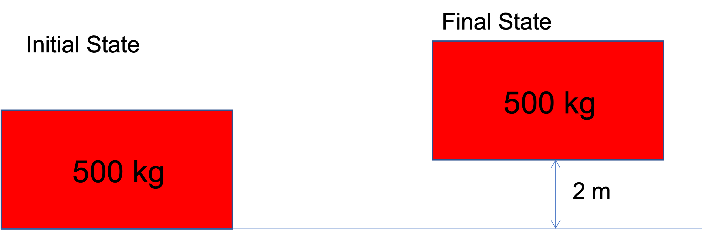
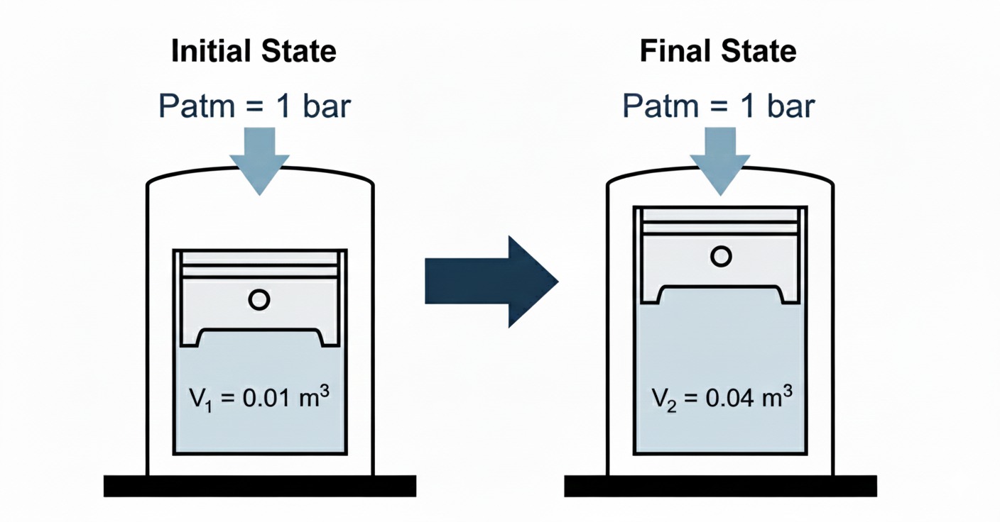
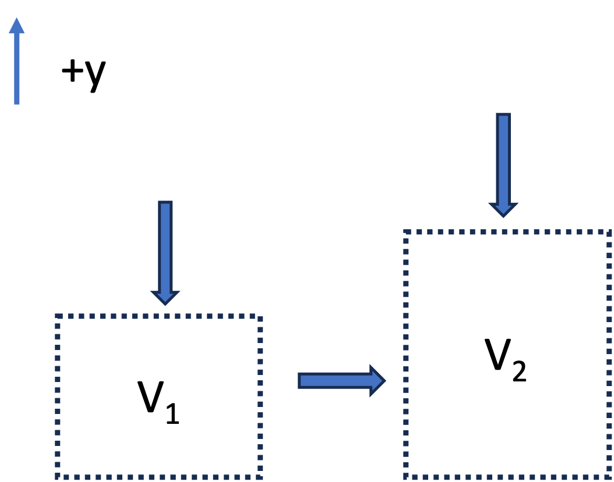
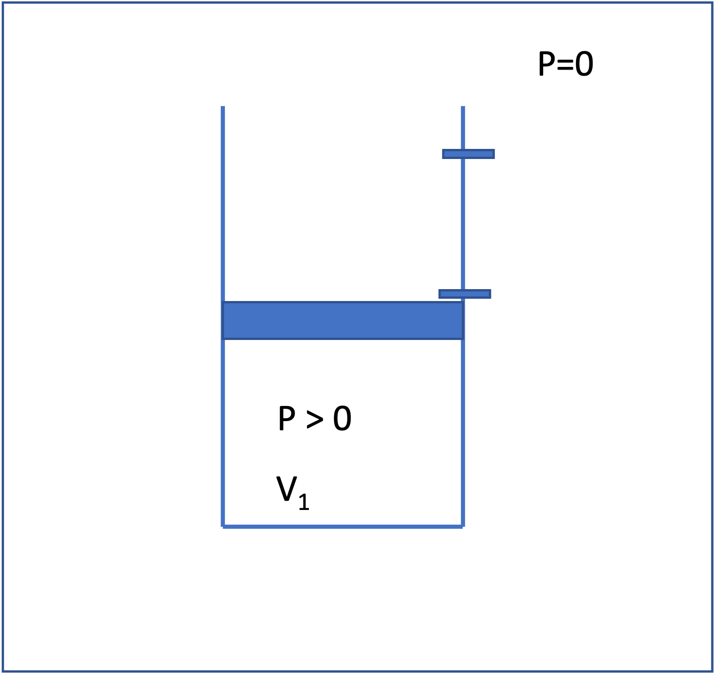
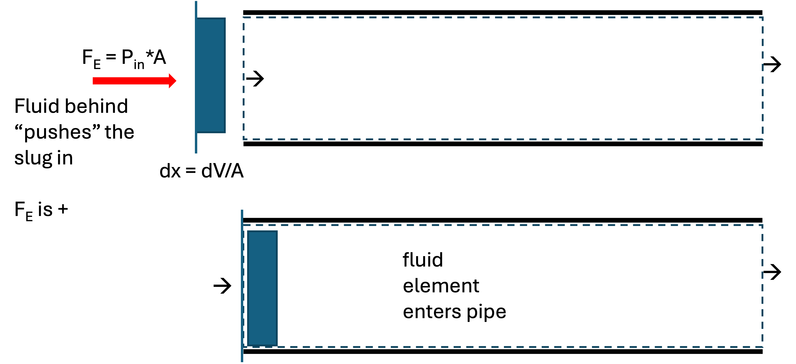
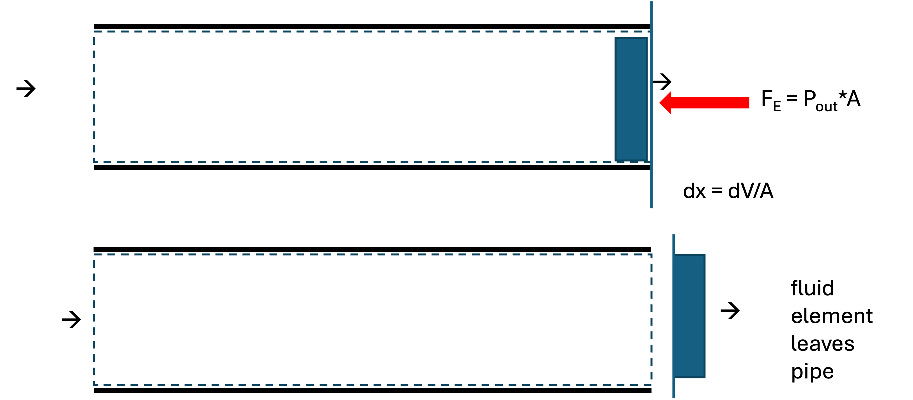
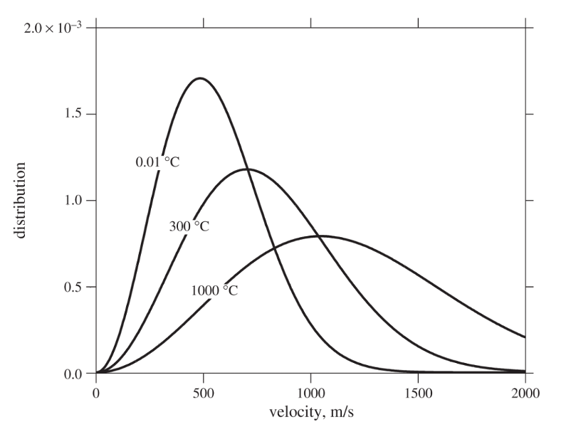
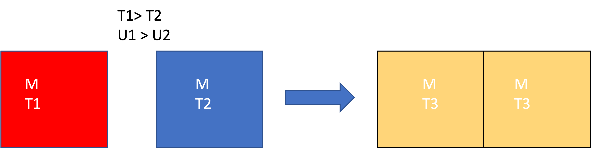
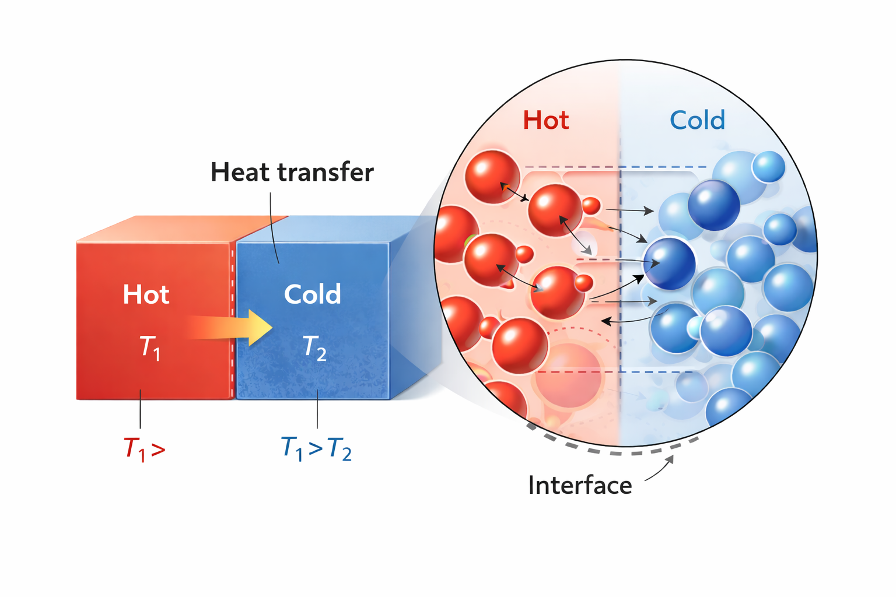

# Last class
- Systems, boundaries, other definitions
- Different forms of energy
- First Law
- Calculating work

## What you should be able to do after this lecture

By the end of class you should be able to:

1. **Calculate work** for: displacement of objects in external fields; expansion and contraction (piston and cylinder problems); fluid flow
2. Describe what **internal energy** is
3. Apply the **Maxwell-Boltzmann equation** to compute molecular kinetic energy
4. Describe what **heat** is, and how it differs from work and energy. 
5. Apply an **energy balance** to a closed system

---

# Review of Mechanical Work
As defined in the previous lecture, **Work ($W$)** is the energy transfer associated with a force acting through a distance.

$$
W = \int \vec{F} \cdot d\vec{x}
$$ {#eq-work-gen}

In this course (IUPAC convention), we define work done **on** the system as positive ($W > 0$). Work done **by** the system (energy leaving) is negative ($W < 0$).

It is straightforward to calculate work when objects are lifted (or dropped) in a gravitational field. 

---

Consider the example in @fig-block-raising:

{#fig-block-raising width=4in fig-align="center"}

**System**: Block of mass 500 kg

**Direction of force**: $\vec{F}$ is in the +h direction. We must push *on* the system upward for it to move. $F = mg$

**Displacement**: 2 m in the +h direction

**Expectation**: The process of lifting the system (block) will raise its potential energy. We therefore expect work to be *positive*, since by our convention, positive work corresponds to adding energy to the system.

**Do the calculation**

$$W = \int_0^{2m} mg dh = (500 kg) \cdot (9.8 m/s^2) * (2 m) = 9800 J$$

**Comment**

Work was done *on* the block (somehow) and it resulted in an increase in the potential energy of the block. We know from the First Law that this energy had to come from somewhere. Clearly, the block won't just jump up 2 m on its own, so something is missing in the image!

---

# Other kinds of work

In addition to moving objects up and down (we can call this "external field" work, $W_{ef}$), there are three other important kinds of work.

1. **Expansion-contraction work** ($W_{ec}$): Typically a fluid expanding or contracting to raise or lower a piston or move an object.
2. **Flow work** ($W_f$): Associated with fluids flowing into and out of something.
3. **Shaft work** ($W_s$): Work associated with some mechanical device; we often represent it as an agitator or impeller attached to a shaft, hence the name. Common examples of equipment that involve shaft work are pumps, compressors, turbines, and mixers.

---

## Expansion & Contraction Work (Piston-Cylinder)
A very common form of work in thermodynamics is the expansion or compression of a gas in a piston-cylinder device.

Consider a gas contained within a cylinder with a moveable piston, such as that in @fig-piston-initial-final. 

{#fig-piston-initial-final width=4in fig-align="center"}

Let's consider the case shown here, where the gas expands from some initial volume $V_1$ to a larger volume $V_2$.

**System**: gas in cylinder.

**Surroundings**: piston, walls of cylinder, air outside, etc. 

**What are the forces on the system?** Consider a free body diagram, as shown in @fig-gas-fbd.

{#fig-gas-fbd width=4in fig-align="center"}
 
- The atmosphere exerts a pressure $P_{atm}$ against a piston area $A_p$. The force is $F_{atm} = - P_{atm} A_p$ (the negative sign means it is in the negative y-direction). 
- The mass of the piston exerts a force downward $F_p = -m_p g$
- If the piston moves upward, the walls of the piston will have frictional resistance with the cylinder walls. This will result in a negative force downward, $F_f$. The exact form of $F_f$ is complex.
- If the piston moves a distance $dy$:

1.  **Force:** $F_{atm} = -(P_{atm} A_p) -(m_p g) - F_f$
2.  **Displacement:** $dy$
3.  **Volume Change:** $dV = A_p dy$

The work of expansion is thus

$$
W = \int_{V_1}^{V_2} -P_{atm} dV - \int_{V_1}^{V_2} (m_p g /A_p) dV - \int_{V_1}^{V_2} (F_f/A_p) dV
$$ {#eq-piston-diff}

If we make simplifying assumptions that the system is frictionless and the piston mass is negligible, the
$$
W = - \int_{V_1}^{V_2} P_{atm} dV
$$ {#eq-piston-int}

If the atmospheric pressure is constant, then

$$
W = - P_{atm} (V_2-V_1)
$$ {#eq-PV-work}

Notice that if the gas was compressed by an external atmospheric pressure $P_{atm}$, the equations are exactly the same, and we still get @eq-PV-work, except: 

- **Expansion** ($dV > 0$): $W < 0$ (Energy leaves system).
- **Compression** ($dV < 0$): $W > 0$ (Energy enters system).

**Expansion into a Vacuum**

What would be the work associated with a gas expanding against a vacuum, as in @fig-piston-vacuum? (We remove the first stop and the piston goes up until it strikes the top stop).

{#fig-piston-vacuum width=4in fig-align="center"}

The equation is the same as we derived earlier. Neglecting friction and the mass of the piston, the work is
$$W = -\int P_{ext} dV = -P_{ext} (V_2 - V_1) = 0
$$ {#eq-PV-vacuum}

That is, *no work* is done, because there is no force opposing the expansion. The energy of the gas does not change for this case, even though the volume of the gas does change. This is an interesting result and we will come back to this concept later when talking about *reversible processes*. 

## Flow Work (PV work)

We have analyzed "expansion-contraction" for a *closed* system, $W_{ec} = -\int P_{ext} \, dV$,
but work is also associated with fluid flow. 

The key idea is that **pressure forces do work to push fluid across the control surface**.
That work is called **flow work**.

Consider steady flow through a pipe segment, as shown in @fig-flowwork-cv.

{#fig-flowwork-cv width=90%}

Focus on a thin “slug” of fluid crossing the inlet; this is the system. See @fig-slug-in. The surrounding upstream fluid exerts a pressure force on the inlet face to push the fluid into the pipe:

$$
F_{in} = P_{in}A
$$ {#eq-Fin}

where the sign is positive because the force is in the direction of displacement $dx$. The slug is pushed a distance $dx$ into the control volume, where $A$ is the cross sectional area of the pipe. 

$$
dW_{in} = F_{in}\,dx = (P_{in}A)\,dx = (P_{in}A) \,(dV/A) = P_{in}\,dV
$$ {#eq-dwin}

where $dV = A \,dx$ is the volume of the slug.

{#fig-slug-in width=60%}

Integrating @eq-dwin and dividing by time gives the **rate** of inlet flow work:

$$
\dot W_{in} = P_{in} \,\dot V_{in}
$$

where $(\dot V)$ is the volumetric flow rate at the inlet plane.

At the outlet, a pressure force also acts on the control surface. The fluid element has to push 
against the downstream fluid to "leave" the pipe. This force is therefore in the negative $x$ direction.

{#fig-slug-out width=60%}

$$
\dot W_{out} = -P_{out}\,\dot V_{out}
$$

So the **net flow work rate** is

$$
\dot W_{f} = \dot W_{in} + \dot W_{out}
               = P_{in}\dot V_{in} - P_{out}\dot V_{out}
$$ {#eq-flowwork-rate}

**Note**: Flow work is evaluated **at the planes where flow crosses the control surface**

---

**Worked example**

Let's solve for the flow work associated with the system shown in @fig-flowwork-cv.
Water flows through a pipe at $\dot m = 100~\text{kg/min}$,
with $P_{in}=300~\text{kPa}$ and $P_{out}=290~\text{kPa}$.
Assume liquid water is incompressible with $\rho = 1000~\text{kg/m}^3$.

Volumetric flow rate:
$$
\dot V = \frac{\dot m}{\rho}
       = \frac{100~\text{kg/min}}{1000~\text{kg/m}^3}
       = 0.10~\text{m}^3/\text{min}
$$

Inlet flow work rate:
$$
\dot W_{in} = P_{in}\dot V
            = (300~\text{kPa})(0.10~\text{m}^3/\text{min})
            = 30{,}000~\text{J/min}
$$

Outlet flow work rate:
$$
\dot W_{out} = -P_{out}\dot V
             = -(290~\text{kPa})(0.10~\text{m}^3/\text{min})
             = -29{,}000~\text{J/min}
$$

Net flow work rate:
$$
\dot W_{f} = 1{,}000~\text{J/min} \approx 16.7~\text{W}
$$

**Interpretation**: because $(P_{in} > P_{out})$, **net work must be supplied to push the water through the control volume** (with our sign convention). This would typically be supplied by a pump, but you could imagine if the pipe was not level, gravity could supply the needed work.

---

## Shaft Work
Energy can also be transferred via a rotating shaft (e.g., a turbine, pump, mixers, or engine crankshaft).
Windmills and water wheels convert the kinetic energy of a flowing fluid into shaft work. 

For a constant torque $\tau$ rotating through an angle $\theta$:

$$
W_{s} = \tau \theta
$$ {#eq-shaft}

or in terms of power ($\dot{W}$) and angular velocity ($\omega$):

$$
\dot{W}_{s} = \tau \omega
$$ {#eq-shaft-power}

We typically don't compute shaft work using @eq-shaft or @eq-shaft-power, but we instead use other thermodynamic properties to "back calculate" $W_s$, or we are given $W_s$ as a design variable. More on this later...

# Internal Energy ($U$)

Imagine we have two blocks of the same mass and same material sitting next to each other, as in @fig-blocks-T1-T2.

{#fig-blocks-T1-T2 width=60%}

Neither block is moving and they are at the same height. The only difference is that block 1 is hotter than block 2 ($T_1 > T_2$). Even though the two blocks have the same macroscopic potential and kinetic energy, we intuitively guess that block 1 has "more energy" than block 2.

To account for this, we define a property called **Internal Energy ($U$)**, which represents the sum of all microscopic forms of energy within the system. This includes:

- **Molecular Kinetic Energy:** Translation, rotation, and vibration of molecules (related to temperature).
- **Molecular Potential Energy:** Intermolecular forces between the molecules (related to things like phase and density).

Thus, we can write the total energy of a closed system as
$$
E_{total} = U + KE_{macro} + PE_{macro}
$$

We often drop the "macro" subscripts, remembering that $KE$ and $PE$ apply to the overall kinetic and potential energy of the system. All the "microscopic" kinetic and potential energy is lumped into $U$.

For many situations of interest in chemical engineering, changes in internal energy are much, much larger than changes in macroscopic potential or kinetic energy. Thus, often we can make the approximation that $\Delta E \approx \Delta U$.

---

## Maxwell–Boltzmann distribution and molecular kinetic energy

Internal energy arises from microscopic degrees of freedom. For gases (and, to a good approximation, liquids at moderate conditions), an important contribution comes from **molecular kinetic energy** associated with random thermal motion.

At thermodynamic equilibrium, **molecular velocities are not all the same**. Instead, they are distributed according to the **Maxwell–Boltzmann distribution**, which specifies the probability that a molecule has a speed between $(v)$ and $(v+dv)$.

For a gas of molecules of mass ($m$) at temperature ($T$), the speed distribution is

$$
f(v)
= 4\pi v^2
\left( \frac{m}{2\pi k_B T} \right)^{3/2}
\exp \left(-\frac{m v^2}{2k_B T}\right)
$$ {#eq-MB-dist}

where:

* $k_B$ is Boltzmann’s constant, and
* $f(v)\,dv$ is the fraction of molecules with speeds in the interval ($[v, v+dv]$). @eq-MB-dist is plotted in @fig-MB-dist for water at different temperatures.

{#fig-MB-dist width=60%}

Several important molecular‐scale averages follow directly from this distribution:

* **Average molecular speed**
  $$
  \langle v \rangle
  = \left( \frac{8k_B T}{\pi m} \right)^{1/2}
  $$

* **Average squared molecular speed**
  $$
  \langle v^2 \rangle
  = \frac{3k_B T}{m}
  $$

The average *translational kinetic energy* of a molecule is therefore

$$
\left\langle \tfrac{1}{2} m v^2 \right\rangle
= \tfrac{3}{2} k_B T
$$

This result is fundamental: **temperature is a direct measure of the average molecular kinetic energy**. So in @fig-blocks-T1-T2, block 1 has more internal energy than block 2 because it is hotter and thus its molecules have greater kinetic energy than the molecules of block 2.

::: {.callout-tip icon=false}
## Interactive Example
I have prepared an interactive Jupyter Notebook that allows you to model the distribution of molecular velocities as a function of temperature and species.

::: {.content-visible when-format="html"}

[**Download notebook (.ipynb)**](lecture03_example.ipynb)

[**Open notebook (web)**](lecture03_example.ipynb)

<a href="lecture03_example.ipynb" download><strong>Download notebook (.ipynb)</strong></a>

:::

::: {.content-visible when-format="pdf"}
*Note: This example is available as an interactive Jupyter Notebook on the course website.*
:::
:::

---

### Effect of temperature on the distribution

@fig-MB-dist shows that as temperature increases:

* The distribution **shifts to higher velocities**
* The distribution **broadens**, meaning a wider range of molecular speeds
* Both the average speed $\left < v  \right >$ and average kinetic energy increase

In @fig-MB-dist, you can see that increasing temperature moves the peak to the right and lowers it while preserving the total area under the curve (the number of molecules).

> **Key physical point:**
> Even at a fixed temperature, some molecules are moving much faster than average, while others are much slower. Thermodynamic properties emerge from *ensemble averages*, not from individual molecular behavior.

---

### Connection to internal energy

Because the average molecular kinetic energy scales linearly with temperature, the **translational contribution to internal energy for an ideal gas depends only on temperature**.

On a molar basis,

$$
\underline{U}_{\text{trans}} = \tfrac{3}{2} RT
$$

Additional contributions to internal energy (rotation, vibration, intermolecular potential energy) become important for real gases and liquids (we will talk about this later), but the Maxwell–Boltzmann distribution provides the foundational link between **microscopic motion** and **macroscopic thermodynamic properties**.

---

# Heat ($Q$) vs. Work ($W$)

What happens if we bring the hot and cold blocks into contact, as in @fig-block-together?

{#fig-block-together width=60%}

we know from experience that the temperatures will equalize, and $T_3 = \frac{1}{2} (T_1+T_2)$ for blocks of the same material and equal mass. Also, $\underline{U}_3 = \frac{1}{2} (\underline{U}_1 + \underline{U}_2)$

Why does this happen? The "fast" molecules of block 1 hit the slower molecules of block 2 when they are in contact. Kinetic energy is transferred from the hotter atoms to the colder atoms. This occurs at the interface, but the hot atoms at the surface collide with other atoms in the interior of the block. We say that **heat** is **conducted** from the hot block to the cold block. This process, of exchanging energy through molecular collisions of atoms at different temperatures, is called **heat**.

{#fig-hot-cold-interface width=60%}

**Heat**: Energy transferred as a result of a temperature difference, with energy going from hot to cold (see @fig-hot-cold-interface). 

So there are two modes of energy transfer:

1.  **Work ($W$):** Energy transfer driven by a **Force** acting through a distance. It is an *orderly* transfer of energy, typically facilitated by some type of device.
2.  **Heat ($Q$):** Energy transfer driven strictly by a **Temperature Difference** ($\Delta T$). It is a *random* transfer of energy that occurs without any kind of device. 

Heat and Work are not equivalent; as we will see, work is more "valuable" than heat. 

The overall closed-system energy balance can thus be written as:

$$
\Delta E = \Delta U + \Delta E_{KE} + \Delta E_{PE}= Q + W
$$ {#eq-first-law-closed}

All this says is that there can be interactions with the surroundings via heat and work, which can result in changes in the three types of energy of the system. Note that $W$ can involve expansion/contraction or shaft work. Since the system is closed, there is no flow work. The time-dependent energy balance for a closed system (consistent with eqn 3.34 in your text is)

$$ \frac{d}{dt} \left [ M \left (\hat{U} + \frac{v^2}{2} +gh \right ) \right ] = \dot{W}_s + \dot{W}_{EC} + \dot{Q}
$$ {#eq-first-law-closed-time}

where the dots over the work and heat symbols indicate a rate (energy/time or power).

Note that in @eq-first-law-closed and @eq-first-law-closed-time, the extensive energy change is considered (in @eq-first-law-closed-time, mass $M$ is multiplied by specific energy units). Be careful about units in all calculations!

@eq-first-law-closed can also be written for the surroundings. The net result is that 

$$ (Q+W)_{sys} = -(Q+W)_{surr}
$$

and thus the First Law is

$$\Delta E_{sys} + \Delta E_{surr} = 0
$$.
