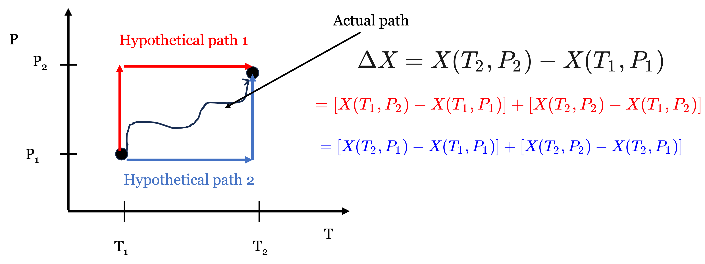
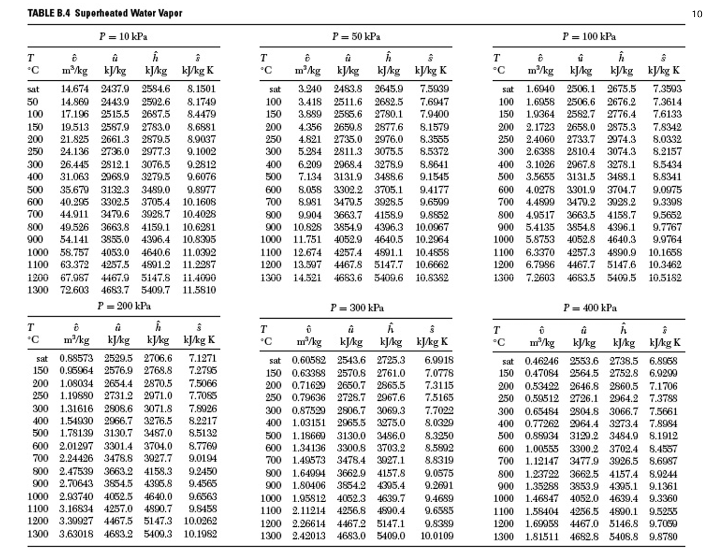
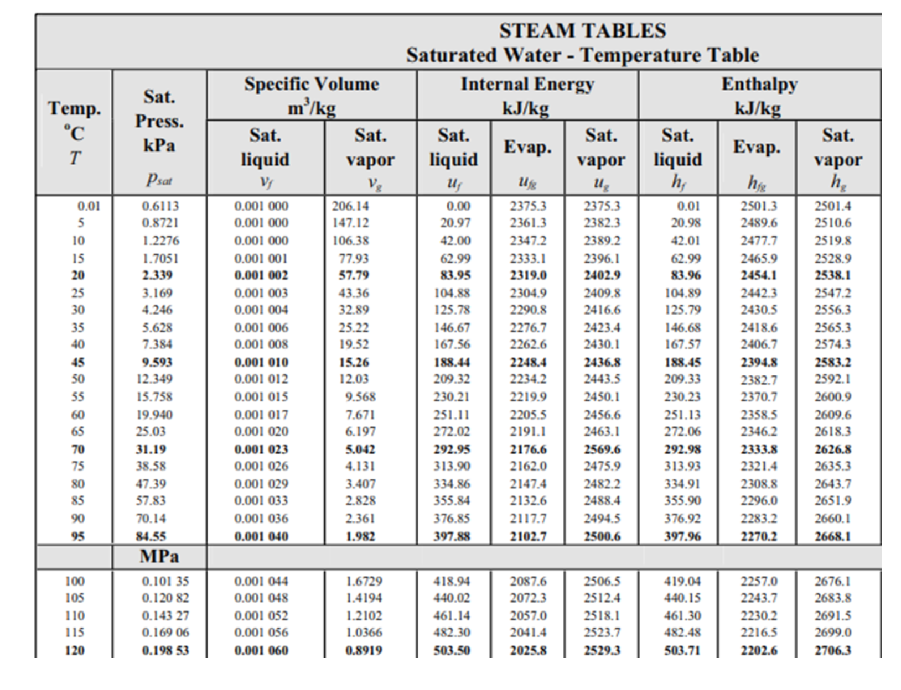
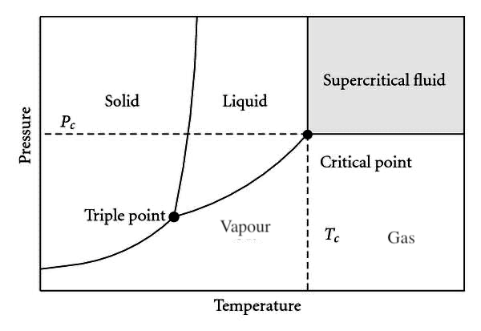
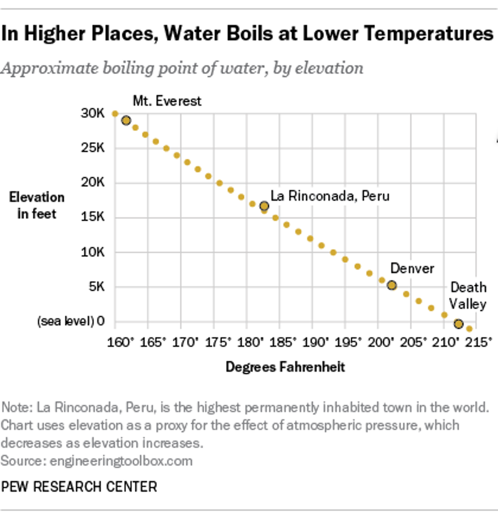
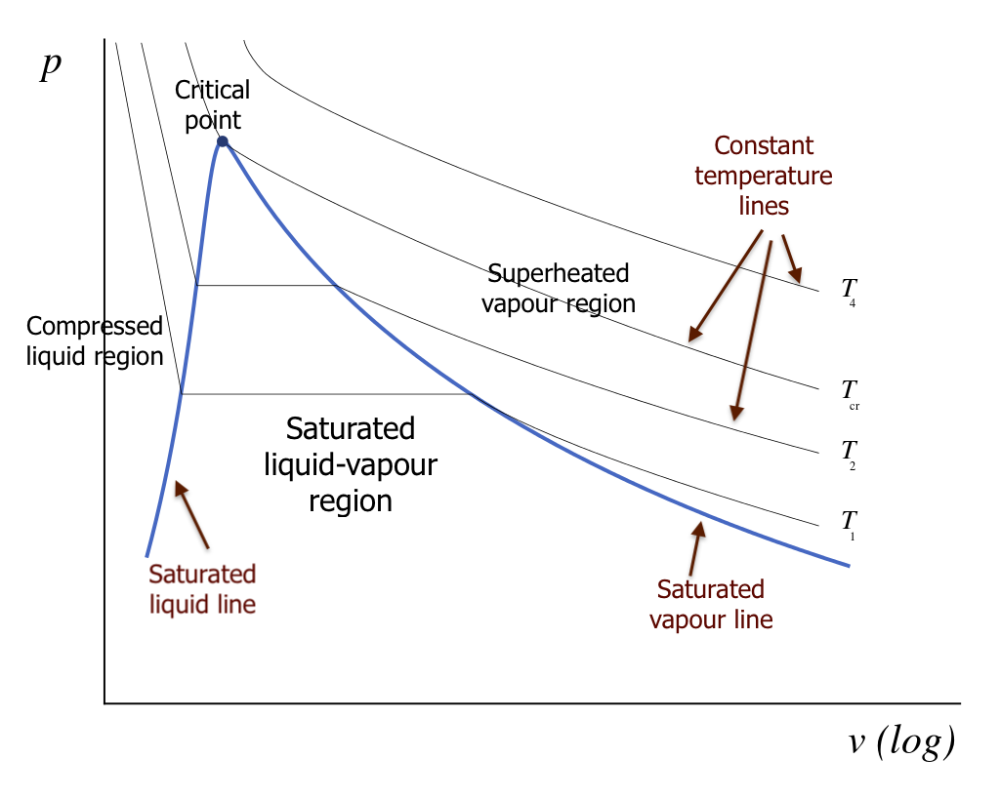
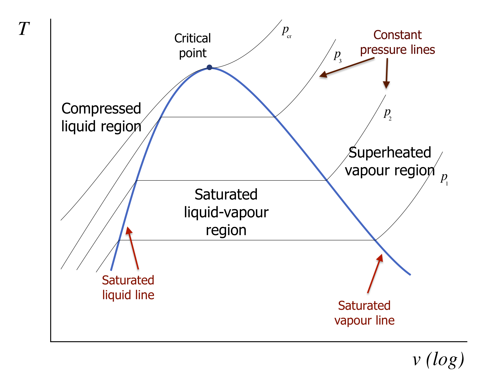
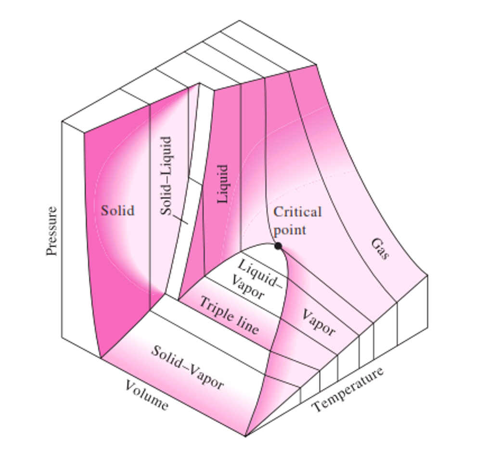

# Last Class

- Forms of work

- Internal energy

- Maxwell-Boltzmann distribution

- Heat

## What you should be able to do after this lecture

By the end of class you should be able to:

1. State the **fundamental postulate** of classical thermodynamics and explain what it implies for **state specification** of a pure substance.
2. Define **equilibrium** and distinguish **state variables** from **path-dependent quantities**.
3. Explain why **differences of state variables** depend only on the end states, not the path.
4. Use the **Gibbs phase rule** to determine degrees of freedom for single-phase and multiphase regions (including the triple point).
5. Interpret **P–T** and **P–V** diagrams for a pure substance, including **saturation lines**, **critical point**, **triple point**, and **normal boiling point**.
6. Describe how the **3D P–V–T surface** unifies the common 2D projections.

---

**Brief review - Heat and Work**

- Heat ($Q$) and Work ($W$) are NOT energy

- Heat and Work are mechanisms to change the energy of a system

- Energy is kinetic, potential, and internal

- Work is the “orderly” transfer of energy. It has direction and typically requires some device to facilitate it

- Heat is “disorderly” transfer of energy. It is spontaneous given a temperature difference and results from random molecular collisions.

- Heat and Work are therefore not equivalent.

- Internal energy is molecular kinetic and potential energy

- Kinetic: Temperature

- Potential: “molecular position” => more on this later

---

# Fundamental postulate of thermodynamics

The **fundamental postulate** underlies all of equilibrium thermodynamics:

> **Fundamental postulate (classical thermo):**  
> *Isolated systems with no external forces acting on them will approach unique equilibrium states characterized by the mass of each distinct species in the system and two independently variable properties.*

For a **pure substance** (single chemical component), this has a powerful implication:

> If you specify **two independent intensive properties** (e.g., $T$ and $P$, or $T$ and $\underline{V}$, or $P$ and $\hat{V}$, etc.), then **all other intensive properties are determined**. 

## State variables and equilibrium

A **state variable** (state function) is a property determined solely by the equilibrium state of the system. Examples include:

- $T$, $P$, $\hat{V}$ (specific volume), $\rho$ (density)

- $\underline{U}$ (molar internal energy), $\hat{H}$ (specific enthalpy), $\underline{S}$ (molar entropy) *(later)*

For a pure substance, we can write  relationships like:
$$
\underline{U} = \underline{U}(T,P), \quad \underline{V} = \underline{V}(T,P), \quad \underline{H} = \underline{H}(T,P), \;\text{etc.}
$$

Because state variables describe equilibrium states, they have **no memory** of how the system got there.

The Fundamental Postulate means that we could also have relationships like
$$
\underline{V} = \underline{V}(T, \underline{U}), \quad P = P(T,\underline{V}), \quad \underline{U} = \underline{U}(T,\underline{H}), \;\text{etc.}
$$

---

## Differences in state variables do not depend on the path

Consider two equilibrium states, 1 and 2. For any state variable $X$,
$$
\Delta X = X_2 - X_1
$$

That is, differences in state variables on depend on the endpoints. This is one of the most practical ideas in thermodynamics:

> Even if the **real process path** from state 1 to state 2 is complicated, we can compute $\Delta X$ using **any convenient (hypothetical) path**, as long as it connects the same endpoints. 

### Convenient thermodynamic paths

A common strategy is to split a change into two steps—e.g., first change $P$ at constant $T$, then change $T$ at constant $P$ (or vice versa), as shown in @fig-paths-1-2

{#fig-paths-1-2 width=85%}

$$
\Delta X
= X(T_2,P_2) - X(T_1,P_1)
$$

One convenient decomposition is:
$$
\Delta X
=
\underbrace{X(T_1,P_2)-X(T_1,P_1)}_{\text{step 1: change }P\text{ at fixed }T_1}
+
\underbrace{X(T_2,P_2)-X(T_1,P_2)}_{\text{step 2: change }T\text{ at fixed }P_2}
$$

Or alternatively:
$$
\Delta X
=
\underbrace{X(T_2,P_1)-X(T_1,P_1)}_{\text{step 1: change }T\text{ at fixed }P_1}
+
\underbrace{X(T_2,P_2)-X(T_2,P_1)}_{\text{step 2: change }P\text{ at fixed }T_2}
$$

> **Key point:** A *real* path might involve simultaneous changes in $T$ and $P$ in a complicated way, but for a state variable we are free to choose a **thermodynamic path** that is easier to evaluate.

### Path-dependent quantities (contrast)

Not everything is a state variable. The most important counterexamples are:

- heat $Q$

- work $W$

These depend on the process details (path), not just end states. (We will make this precise as we proceed.) But for now, remember that **heat and work are NOT state variables**; they depend on path or the actual thermodynamic process.

---

##  Gibbs phase rule

The fundamental postulate suggests that we need only specify two independent quantities for a pure substance, and all other state variables are set. This is a remarkable statement. Although macroscopic substances are made up of more than $10^{23}$ atoms, we need only specify two variables like $T$ and $P$ and **all properties** are fixed. You have seen this before when looking up properties in steam tables (@fig-superheat-water-ST). You can look up the density (inverse specific volume) or internal energy of water at a given $T$ and $P$ when water is either subcooled or superheated.

{#fig-superheat-water-ST width=75%}

At the same $T$, properties change with changing $P$. Likewise, at the same $P$, properties change with changing $T$.

Something different happens when you look at the *saturated* steam tables (@fig-sat-water-ST)

{#fig-sat-water-ST width=75%}

Here, we only specify one variable (i.e. $T$) and all the other properties are set. The pressure **must** be the saturation pressure, whereas when the system was in the superheated state, there could be multiple pressures at the same temperature. Does this violate the Fundamental Postulate? No! The requirement that the system be in phase equilibrium imposes a constraint that takes one of the independent variables away. 

The **Gibbs phase rule** tells us how many independent variables can be specified for any system:
$$
F = C - \Pi + 2
$$ {#eq-Gibbs-rule}
where:

- $F$ = degrees of freedom (number of independent intensive variables you can set)

- $C$ = number of chemical components

- $\Pi$ = number of phases present (solid, liquid, vapor, etc.) 

### Pure substances ($C=1$)

For a pure substance ($C=1$):

- **Single phase** ($\Pi=1$):  
  $$
  F = 1 - 1 + 2 = 2
  $$
  Two independent intensive variables (e.g., $T$ and $P$) specify the state. 

- **Two phases** ($\Pi=2$), e.g., liquid + vapor:
  $$
  F = 1 - 2 + 2 = 1
  $$
  Only one independent intensive variable can be chosen. Example: specifying $T$ fixes the saturation pressure $P_{\text{sat}}(T)$. That is what we see in the saturated steam tables, but the same could be true of we had solid and liquid in phase equilibrium.

- **Three phases** ($\Pi=3$), solid + liquid + vapor:
  $$
  F = 1 - 3 + 2 = 0
  $$
  No freedom: the system must be at the **triple point**, where all thermodynamic properties are specified.

---

# Physical properties of pure substances and phase behavior

We will focus heavily on **pure substances** in this course. The most accessible “primary” measurable properties are:

- pressure $P$

- temperature $T$

- molar volume $\underline{V}$ (or specific volume $\hat{V}$, or density, $\rho$)

Collectively, this is often described as **P–V–T behavior**. 

The fundamental postulate tells us: for a pure substance in equilibrium, **two** independent intensive variables are enough to determine the state. That is why 2D projections like P–T and P–V diagrams are so useful. It is also why the steam tables are set up as they are.

---

## P–T diagrams for a pure substance

A **P–T phase diagram** shows where solid, liquid, and vapor are stable. A typical diagram includes:

- sublimation line (solid–vapor)

- fusion/melting line (solid–liquid)

- vaporization/boiling line (liquid–vapor)

- triple point

- critical point

{#fig-pt-diagram width=60%}

### 5.1 Triple point

The **triple point** is the unique point where solid, liquid, and vapor coexist:

- $\Pi=3$, $C=1$ $\Rightarrow$ $F=0$  

So $T$ and $P$ are both fixed at the triple point. 

### Boiling point and saturation pressure

On the liquid–vapor coexistence line:

- $\Pi=2$, so $F=1$.

Thus at a **given pressure** there is a **single temperature** at which boiling occurs, and at a given temperature there is a **single saturation pressure**:

$$
P_{\text{sat}} = P_{\text{sat}}(T)
$$
As $T$ increases, $P_{\text{sat}}(T)$ increases. 

**Normal boiling point:** the temperature at which liquid and vapor coexist at $P=1\ \text{bar}$.
If you live in the mountains, you may see that some cooking directions are modified. That's because water boils at a lower temperature at high elevation (see @fig-bp-elevation).

{#fig-bp-elevation width=50%}

### Melting and sublimation lines

- **Melting line (solid–liquid):** locus of points where solid and liquid coexist.
- 
- **Sublimation line (solid–vapor):** locus of points where solid and vapor coexist.

Different substances have different slopes for these lines (water is a famous exception in some respects), but the phase-rule logic is universal.

### Critical point and supercritical fluid

The **critical point** is the unique endpoint of the liquid–vapor coexistence curve where the distinction between liquid and vapor disappears. It is characterized by:

- critical temperature $T_c$

- critical pressure $P_c$

For $T>T_c$ and $P>P_c$, the substance is a **supercritical fluid** (no liquid–vapor phase boundary). 

---

## P–V diagrams for a pure substance

A **P–V diagram** shows pressure versus (molar or specific) volume, often with **isotherms** (constant $T$ curves).

A typical set of isotherms looks like those in @fig-PV-isotherms :

{#fig-PV-isotherms width=85%}

### Saturated liquid and saturated vapor lines

For $T<T_c$, an isotherm intersects a two-phase region where **liquid and vapor coexist**. The boundaries are:

- **Saturated liquid line**: states that are “just about to boil” (quality $x=0$)
- 
- **Saturated vapor line**: states that are “just about to condense” (quality $x=1$)

Together these form the **vapor dome** on many property diagrams.

Inside the two-phase region:

- pressure is fixed at $P_{\text{sat}}(T)$

- $\underline{V}$ depends on the phase fractions

### Quality (two-phase mixtures)

For a liquid–vapor mixture, we often define the **vapor quality** $x$:
$$
x = \frac{m_v}{m_\text{total}}
$$

For any specific property $y$ that is additive on a mass basis (e.g., $\underline{V}$, $\underline{U}$, $\underline{S}$),
$$
y = (1-x)\,y_\ell + x\,y_v
$$
where:

- subscript $\ell$ denotes saturated liquid

- subscript $v$ denotes saturated vapor

This relation becomes a practical tool once we start using property tables and charts.

### How saturation pressure changes with temperature (reading the diagram)

A useful qualitative fact seen in the diagrams:

- At higher $T$ (but still $T<T_c$), the saturation pressure is larger:
  $$
  P_{\text{sat}}(T_2) > P_{\text{sat}}(T_1) \quad \text{if } T_2>T_1
  $$

- At a fixed pressure, increasing temperature tends to increase the specific volume in the vapor region.

These are the kinds of trends we will use repeatedly in problem solving.

---

## T-V diagrams for a pure substance

You can also plot $T$ vs $\underline{V}$; @fig-TV-isotherms shows an example of what such a plot looks like for the liquid and vapor regions of a pure substance.

{#fig-TV-isotherms width=85%}

## 3-D representation: the P–V–T surface

The P–T and P–V diagrams are **projections** of a more complete picture: the **3D P–V–T surface**, as shown in @fig-PVT-surface.

{#fig-PVT-surface width=70%}

Key ideas:

- The two-phase equilibria form **surfaces/lines** on this 3D object.
- 
- The triple point in a P–T diagram corresponds to a **triple line** in 3D (where three phases coexist).
- 
- The critical point is a special point on the liquid–vapor boundary where the two-phase region ends.

A helpful way to interpret the surface is to imagine processes such as **isobaric heating** (constant $P$) and observe how the state moves across single-phase regions and possibly through two-phase coexistence. 

---

# Summary and what comes next

- The fundamental postulate tells us: for a pure substance, **two** independent intensive variables determine the equilibrium state.
- State variables have no path dependence: $\Delta X$ depends only on endpoints.
- The Gibbs phase rule explains degrees of freedom:
  - single phase (pure): $F=2$
  - two phases (pure): $F=1$
  - triple point (pure): $F=0$
- P–T and P–V diagrams are essential tools for visualizing phase behavior.
- The P–V–T surface unifies these projections.

**Next lecture:** we will begin using quantitative property relations/tables/charts to compute properties and state changes for pure substances in a systematic way.

