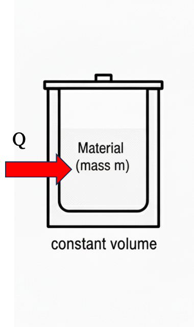
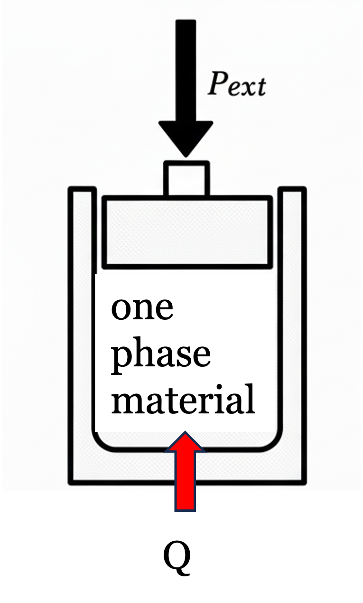
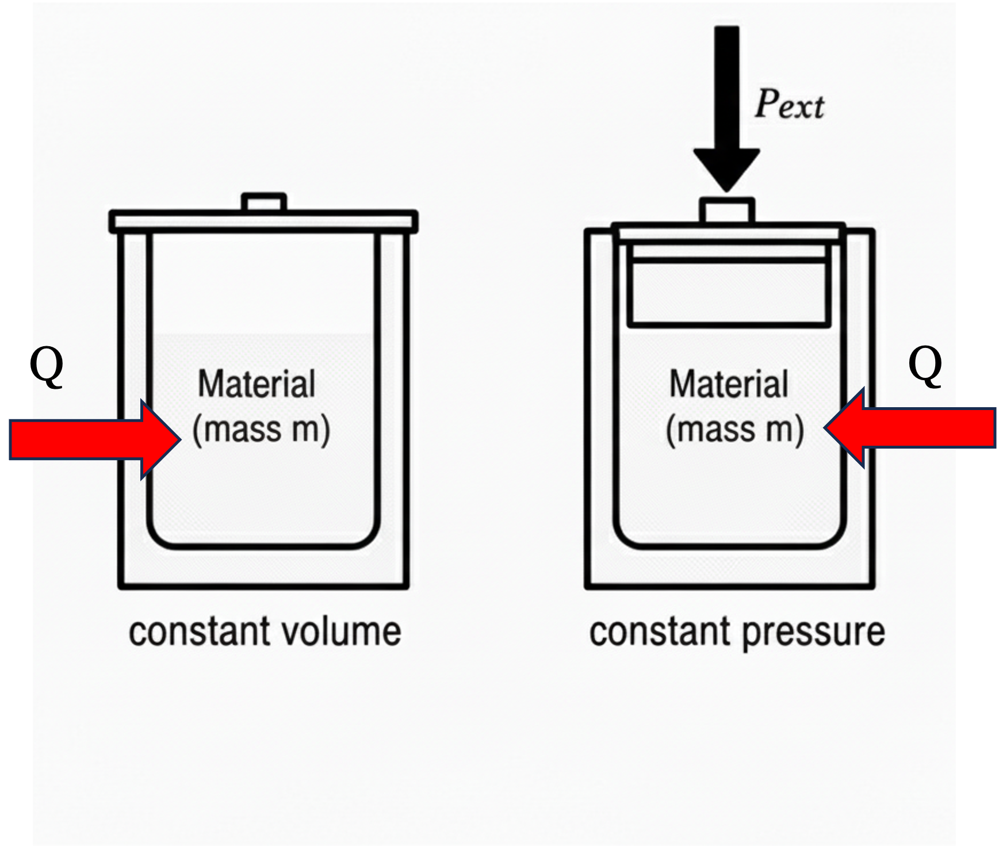
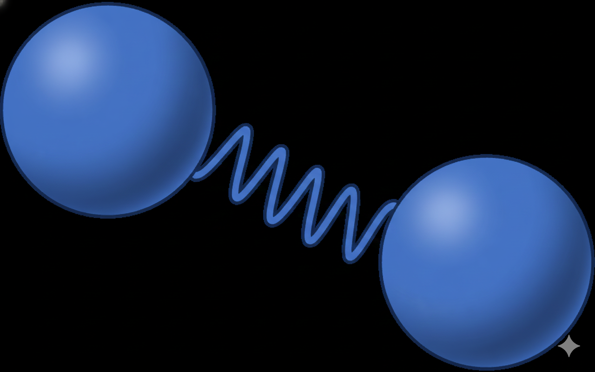

# Last Class

- Fundamental postulate of thermodynamics

- State variables

- Gibbs phase rule

- Pure component phase diagrams

## What you should be able to do after this lecture

By the end of class you should be able to:

1. Define what enthalpy is and why it is important
2. Understand and mathematically define constant volume and constant pressure heat capacity
3. Describe the molecular basis for heat capacity
4. Define the relationship between $C_P$ and $C_V$ for an ideal gas

---

**Brief review - Heat and Work**

- Heat ($Q$) and Work ($W$) are NOT energy

- Heat and Work are mechanisms to change the energy of a system
  - $Q, W > 0$ heat and work *into* the system
  - $Q, W < 0$ heat and work *out of* the system 

- Energy is kinetic, potential, and internal

- Work is the “orderly” transfer of energy. It has direction and typically requires some device to facilitate it

- Heat is the “disorderly” transfer of energy. It is spontaneous given a temperature difference and results from random molecular collisions.

- Heat and Work are therefore not equivalent.

- Internal energy is molecular kinetic and potential energy

  - Kinetic: Temperature

  - Potential: “molecular position” $\rightarrow$ more on this later

---

**Reminder - First Law closed system**

{#fig-closed-system width=30%}

For a closed system, such as that shown in @fig-closed-system, the First Law can be written in differential form as

$$dE = dE_P + dE_K + dU = \delta Q + \delta W_{ec} + \delta W_s  + \delta W_{ef}
$$ {#eq-energy-balance} 

- Energy of a system can be changed by work or heat

- Work: expansion-contraction, shaft, and external field. If the system were *open*, we would have to consider $W_f$ as well. We will get to this soon.

- Energy change terms are written as "exact" differentials ($d$) because they are path independent and only depend on initial and final states.

- Heat and work are "inexact" differentials, written using the Greek "delta" sign $\delta$, to signify that they are path dependent. We will get more into the mathematics of this later, but to compute heat or work, we need to specify the path of the integral, unlike with exact differentials.

<!-- TODO: For \(Mdx+Ndy\), it's exact if \(\partial M/\partial y=\partial N/\partial x\) (Clairaut's Theorem). -->

# Enthalpy 

Thermodynamic properties are *state variables*. Therefore, intensive properties only depend on two independent variables, so they can be plotted or tabulated as in

- $P$-$T$ and $P$-$\hat{V}$ diagrams

- Steam tables

State variables can also be *combined* to form new state variables. For example, $P$ and $\underline{V}$ are state variables. We can combine them with molar internal energy $\underline{U}$ to form a new state variable

$$\underline{H} \equiv \underline{U} + P\underline{V} 
$$ {#eq-enthalpy}
where @eq-enthalpy is the definition of **enthalpy** $H$. Like other state variables, the total enthalpy $H$ depends on only two independent variables and mass. The intensive forms of enthalpy ($\hat{H}$ and $\underline{H}$) depend on only two independent variables for a pure substance. That is: $\underline{H}(T,P)$, etc. 

@eq-enthalpy was written in molar terms, but we can also define the extensive enthalpy and specific enthalpy in a similar manner
$$H \equiv U + PV 
$$

$$ \hat{H} \equiv \hat{U} + P\hat{V}
$$

It might seem strange to define a new state variable $H$, but we will soon see that it is convenient to use for open systems and other calculations. For example, recall that "flow work" was defined as

$${W}_{f} = P {V} = {m} (P \hat{V})
$$ {#eq-flow-work}

or in time-dependent form

$$\dot{W}_{f} = P \dot{V} = \dot{m} (P \hat{V})
$$ {#eq-flow-work-time}

Shortly, we will write down the energy balance for open systems, and we will find that flow work into and out of a system changes the system's internal energy. It will be convenient to use enthalpy for the open system energy balance.

# Heat Capacity

## Constant Volume Heat Capacity
Imagine a closed, isochoric, one-phase system that is stationary. A differential amount of heat $\delta Q$ is added to the system ($\delta Q > 0$), as shown in @fig-heat-v

{#fig-heat-v width=30%}

Applying an energy balance (@eq-energy-balance)

$$dE = \cancel{dE_P} + \cancel{dE_K} + dU = \delta Q + \cancel{\delta W_{ec}} + \cancel{\delta W_s}  + \cancel{\delta W_{ef}}
$$

$$dE = dU = \delta Q
$$ {#eq-ebalance1}

Since $\delta Q > 0$, we know $dU > 0$. Intuitively we expect that if heat is added to a closed system, it will get "hotter" (i.e. the temperature will increase). Increasing internal energy means the "molecular" potential and kinetic energies must also increase. Remember that molecular kinetic energy is related to temperature via the Maxwell-Boltzmann equation, so this makes sense.

**How much does the temperature increase for a given amount of added heat?**
We define a new state variable called the **constant volume molar heat capacity**, $\underline{C}_V$, that applies to the change in internal energy of a system when heat is added at constant volume:

$$\underline{C}_V \equiv \left ( \frac{\partial \underline{U}}{\partial T }  \right )_V = \left ( \frac{\partial {Q}}{\partial T }  \right )_V
$$ {#eq-heat-capacity}

The subscript $V$ on the partial derivatives (and on $C$) reminds us that this is a *constant volume process*. We need to know that, since heat is being added and $Q$ is not a state variable; the amount of heat depends on "path" or the way the heat is added. Interestingly, though, everything else in @eq-heat-capacity is in terms of state variables. So if a finite amount of heat was added in some manner, we could still calculate the change in internal energy by considering only the initial and final temperatures. Separating and integrating @eq-heat-capacity

$$\Delta \underline{E} = \Delta \underline{U} = \underline{U}_2 - \underline{U}_1 = \int_1^2 \underline{C}_V dT
$$ {#eq-cv-int}

It is very important to note that the "path" of integration in @eq-cv-int does not matter! This is because everything is in terms of state variables. The process in @fig-heat-v was a constant volume process, but we recast the problem of computing the change in internal energy into a problem involving only state variables. If the temperature of a material changes from $T_1$ to $T_2$, @eq-cv-int can be used to compute its change in internal energy, regardless of whether the process that changes the temperature was constant volume or not. All you need to know is the heat capacity $\underline{C}_V$ of the material as a function of temperature. This is a subtle point - make sure you understand it! Also pay attention to units. The units on $\underline{C}_V$ are energy/(mol temperature), such as $kJ/mol \cdot K$. If we used the specific heat capacity, $\hat{C}_V$, the units might be $kJ/kg \cdot K$. Often (and most of the time in these notes), heat capacity will be referred to generically as $C_V$ without distinction, and the units will be apparent from the context. Formally, $C_V$ is the externsive heat capacity, with units $kJ/K$. 

## Constant Pressure Heat Capacity
Now consider a similar situation, except heat is added at **constant pressure**

{#fig-heat-P width=30%}

Applying an energy balance (@eq-energy-balance)

$$dE = \cancel{dE_P} + \cancel{dE_K} + dU = \delta Q + \delta W_{ec} + \cancel{\delta W_s}  + \cancel{\delta W_{ef}}
$$ {#eq-ebalance2}
where the difference between this expression and the one in @eq-ebalance1 is that the volume of the system can change, so we must account for $W_{ec}$. By neglecting $dE_P$, we have ignored the tiny potential energy change that occurs when the material expands and its center of mass rises slightly. For practical considerations, this change in potential energy is zero. The energy balance simplifies to

$$dE = dU = \delta Q + \delta W_{ec} = \delta Q -PdV 
$$ {#eq-ebalance3}
where the $PV$ work of expansion-contraction must be accounted for.

Since pressure is constant (i.e. $dP = 0$), the total differential of $(PV)$ via the chain rule is
$$d(PV) = \cancel{V dP} + P dV = P dV
$$ {#eq-dpv}

Substituting @eq-dpv into @eq-ebalance3 results in
$$dU = \delta Q - d(PV)
$$ {#eq-dU2}
But from the definition of enthalpy, $U + PV = H$ or $dH = dU + d(PV)$. Thus, for a constant pressure procees,
$$dH = \delta Q
$$ {#eq-dH}

Notice the difference between @eq-dH and @eq-ebalance1. We can compute the change in temperature of a material with the addition of an amount of heat $Q$ for a *constant pressure process* by defining the **constant pressure heat capacity** $C_P$
$$C_P \equiv \left ( \frac{\partial H}{\partial T} \right )_P = \left ( \frac{\partial Q}{\partial T} \right )_P 
$$ {#eq-CP-def}

Therefore, for a constant pressure process the change in energy is equal to the change in *enthalpy*
$$\Delta \underline{E} = \Delta \underline{H} = \underline{H}_2 - \underline{H}_1 = \int_1^2 \underline{C}_P dT
$$ {#eq-cp-int}

Once again, the real process was at constant pressure, but all the variables in @eq-cp-int are state variables, so all that is needed are the temperatures at the beginning and ending states and the state variable $C_P(T)$.

## Differences between $C_V$ and $C_P$
Let's imagine a thought experiment where we have identical substances (say water) at the same initial temperature $T_1$ in two containers, one that is isochoric and one that is isobaric. The exact same amount of heat $Q$ is added to both systems. 

{#fig-const-v-p width=30%}

> Can you predict how the final temperatures of the two systems will compare?

- For the isochoric system, no work is done; all the $Q$ goes into changing the internal energy of the system.

- For the isobaric system, in addition to changing the internal energy, some expansion-contraction work is done. This comes at the expense of the internal energy. So we anticipate that $T_{2,P} < T_{2,V}$. 

Mathematically, 
$$\left ( \frac{\partial Q}{\partial T} \right )_V = C_V$$ 

$$\left ( \frac{\partial Q}{\partial T} \right )_P = C_P$$

Since the same $Q$ was added in each case but the change in $T$ was less for the isobartic case, we can see immediately that
$$C_P > C_V$$

The difference between $C_V$ and $C_P$ is related to the $W_{ec} = -PdV$ associated with the process. If heat is added to a gas, there is a fairly large change in volume, so expect that for a gas, the difference between $C_P$ and $C_V$ will be big. For liquids and solids, however, which are nearly incompressible, the volume does not change much when heat is added. So in these cases, we expect $C_V \approx C_P$.   

It is possible to exactly determine the value of $C_P-C_V$ for an ideal gas. Since

$$d\underline{H} = d\underline{U}+P\underline{V}$$
for an ideal gas

$$d\underline{H}^{IG} = d\underline{U}^{IG}+RT
$$ {#eq-H-IG}

Taking the partial derivative of both sides keeping pressure constant we get
$$\left ( \frac{\partial {\underline{H}}}{\partial T} \right )_P = \left ( \frac{\partial {\underline{U}}}{\partial T} \right )_P + R
$$ {#eq-dh-dt}

What can we make of the term $\left ( \frac{\partial {\underline{U}}}{\partial T} \right )_P$?
In general, 

$$\left ( \frac{\partial {\underline{U}}}{\partial T} \right )_P \neq \left ( \frac{\partial {\underline{U}}}{\partial T} \right )_V
$$
The variable held constant matters when taking partial derivatives. However, for an **ideal gas**  where the internal energy only depends on temperature (more on this later, but basically, ideal gas molecules have mass and thus kinetic energy, but they are point particles with no intermolecular interactions, so their internal energy is unaffected by pressure and volume) we get

$$\left ( \frac{\partial {\underline{U}^{IG}}}{\partial T} \right )_P = \left ( \frac{\partial {\underline{U}^{IG}}}{\partial T} \right )_V = C^{IG}_V
$$ {#eq-CV-IG}

Combining @eq-CV-IG with @eq-dh-dt results in the useful relation that
$$C^{IG}_P = C^{IG}_V + R
$$ {#eq-cp-cv}

@eq-cp-cv is approximately true for real gases without a lot of intramolecular degrees of freedom. For liquids and solids, because they are nearly incompressible, we have

$$C^{\ell}_P \approx C^{\ell}_V
$$

$$C^{s}_P \approx C^{s}_V
$$

Ideal gas heat capacities for a range of materials are tabulated (see Appendix D of your textbook) and they have the dimensionless form
$$\frac{C^{IG}_P}{R} = A + BT + CT^2 + DT^3 + ET^4
$$

Heat capacity describes how molecules "store" energy. Recall from our discussion of the Maxwell-Boltzmann equation that 

$$
\left \langle v^2 \right \rangle = \frac{3 k_B T}{m}
$$ {#eq-MBv2}

the average translational kinetic energy of a simple molecule is
$$
\left\langle \frac{1}{2} m v^2 \right\rangle
= \tfrac{3}{2} k_B T
$$ {#eq-MBT}
where in @eq-MBv2 and @eq-MBT, $N_{Av} k_B = R$.

This means that each "direction" of motion (x, y, z) can store $\frac{1}{2} R$ kinetic energy. We therefore expect that if a molecule only can store translational kinetic energy (a good approximation for spherical molecules like noble gases), 
$$C^{IG}_v \approx \frac{3}{2} R
$$
and
$$
C^{IG}_p \approx \frac{5}{2} R
$$

If instead of a simple spherical molecule (like argon), the molecule is a diatomic (such as the one shown in @fig-diatomic), then it turns out that the vibrational mode of the bond can roughly store an additional $R$ of energy. 

{#fig-diatomic width=30%}

Therefore, to a good approximation, for simple diatomic molecules like $N_2$ and $O_2$, the ideal gas heat capacity can be estimated as
$$
C^{IG}_v \approx \frac{5}{2} R
$$

$$
C^{IG}_p \approx \frac{7}{2} R
$$

Large molecules tend to have bigger heat capacities than small molecules, since they have more modes to store energy. 

> Water has an unusually high heat capacity for such a small molecule.
> Why do you think this is?

# Summary and what comes next

- We have defined a new state variable called *enthalpy*: $H \equiv U + PV$
- Heat capacity tells us how much the temperature of a material changes upon the addition or removal of heat
- Heat capacity is also a state variable, but since it involves heat (a path-dependent variable) we have two "kinds" - constant volume and constant pressure
- For liquids and solids, which are often nearly incompressible, it is usually a good approximation that $C_P \approx C_V$
- For ideal gases, $C_P^{IG} = C_V^{IG} + R$

**Next lecture:** We will calculate changes in internal energy and enthalpy using heat capacity. We will also discuss intramolecular forces to better understand how these interactions explain thermodynamic properties.

