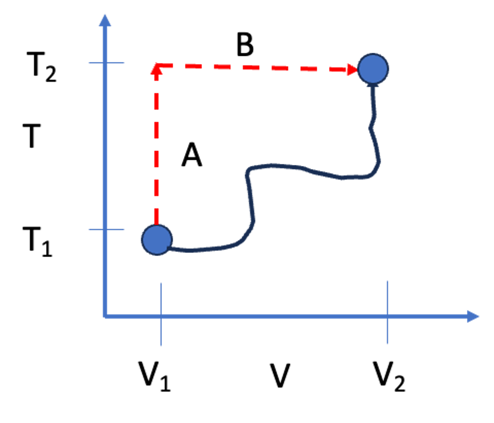

# Last Class

- Defined **Enthalpy** ($H \equiv U + PV$)
- Defined **Heat Capacities** ($C_V$ and $C_P$)
- Relationship between $C_P$ and $C_V$ for Ideal Gases ($C_P = C_V + R$)

## What you should be able to do after this lecture

By the end of class you should be able to:

1.  Calculate changes in internal energy ($\Delta U$) and enthalpy ($\Delta H$) for any fluid given the appropriate partial derivatives.
2.  Explain the physical meaning of the **internal pressure** term.
3.  Describe the **Lennard-Jones potential** and identify the physical significance of $\sigma$ and $\epsilon$.
4.  Explain macroscopic phase behavior (boiling/condensation) in terms of microscopic intermolecular potential energy.

---

# Calculating Changes in State Variables

One of the most powerful concepts in thermodynamics is that **State Variables** (like $U$, $H$, $S$, $V$) are path-independent.

If we want to calculate the change in internal energy $\Delta U$ as a fluid goes from State 1 ($T_1, V_1$) to State 2 ($T_2, V_2$), the actual physical path the process takes does not matter.

> **Key Strategy:** We can construct a hypothetical path that is mathematically easy to integrate.

Consider calculating the change in internal energy for the process shown in @fig-TV-path

{#fig-TV-path width=30%}

Since $U$ is a state variable, we can compute the change in internal energy along idealized paths A and B. The mathematics for this are shown next. 

## The Mathematical Derivation for $\Delta U$

Let us assume that internal energy is a function of temperature and volume: $U = U(T, V)$. (I am dropping the notation for intensive variables for simplicity. Technically, the *extensive* internal energy $U$ also depends on mass).

The **total differential** of $U$ is:

$$
dU = \left( \frac{\partial U}{\partial T} \right)_V dT + \left( \frac{\partial U}{\partial V} \right)_T dV
$$

We already know the definition of the first partial derivative from the last lecture:
$$
\left( \frac{\partial U}{\partial T} \right)_V \equiv C_V
$$

The second term, $\left( \frac{\partial U}{\partial V} \right)_T$, is called the **Internal Pressure**. It represents how the energy of the molecules changes as they are pulled apart (volume increases) or compressed (volume decreases) at constant temperature.

So, the general equation for a change in internal energy is:

$$
\Delta U = \int_{T_1}^{T_2} C_V dT + \int_{V_1}^{V_2} \left( \frac{\partial U}{\partial V} \right)_T dV
$$ {#eq-deltaU-general}

### The Joule Experiment and Ideal Gases
In the mid-1800s, James Joule performed an experiment where he allowed a gas to expand into a vacuum (changing volume) while measuring the temperature change. He found that for dilute gases, the temperature did not change upon expansion.

This implied that the energy of the gas did not depend on the distance between molecules. Mathematically:
$$
\left( \frac{\partial U}{\partial V} \right)_T \approx 0 \quad \text{(for Ideal Gases)}
$$

Therefore, for an **Ideal Gas**, the equation simplifies to:
$$
\Delta U^{IG} = \int_{T_1}^{T_2} C_V^{IG} dT
$$

::: {.callout-note}
For real fluids (liquids, high-pressure gases), $\left( \frac{\partial U}{\partial V} \right)_T$ is **not** zero. As you pull molecules apart, you must overcome attractive forces, which increases the potential energy of the system. Or, as you compress the system, molecules can repel one another. Ideal gases do not experience intermolecular interactions, and so the *internal pressure* of an ideal gas is zero.
:::

## The Mathematical Derivation for $\Delta H$

We can perform a similar derivation for enthalpy, usually choosing $T$ and $P$ as the independent variables: $H = H(T, P)$.

$$
dH = \left( \frac{\partial H}{\partial T} \right)_P dT + \left( \frac{\partial H}{\partial P} \right)_T dP
$$

Using the definition of $C_P$:
$$
\Delta H = \int_{T_1}^{T_2} C_P dT + \int_{P_1}^{P_2} \left( \frac{\partial H}{\partial P} \right)_T dP
$$ {#eq-deltaH-general}

For an ideal gas, enthalpy depends only on temperature, so the second term is zero:
$$
\Delta H^{IG} = \int_{T_1}^{T_2} C_P^{IG} dT
$$

---

# Intermolecular Forces: The "Why" of Thermodynamics

Why do real fluids have an "internal pressure"? Why do substances boil at different temperatures? The answer lies in **Intermolecular Forces**.

# Types of Intermolecular Interactions
Types of Intermolecular InteractionsBefore we simplify the world into the Lennard-Jones potential, it is important to understand the hierarchy of forces that exist between molecules. These forces range from very strong (ions) to very weak (induced dipoles).

## Coulombic (Ionic) Interactions

The strongest forces are between charged particles (ions). These are governed by **Coulomb's Law**. 
For two charges $q_i$ and $q_j$ separated by a distance $r_{ij}$:

$$\Gamma_{ij}^{Coulomb} = \frac{q_i q_j}{4\pi \epsilon_0 r_{ij}}$$

The force is the gradient of the potential ($F = -\nabla \Gamma$):

$$F_{ij} = \frac{q_i q_j}{4\pi \epsilon_0 r_{ij}^2}$$

* If $q_i$ and $q_j$ have the same sign ($++$ or $--$), $F > 0$ (Repulsive).
* If they have opposite signs ($+-$), $F < 0$ (Attractive).
* **Range:** These are very long-range forces ($\propto 1/r$).

## Dipole-Dipole Interactions

Many neutral molecules have a permanent **dipole moment** ($\mu$), defined by a separation of charge within the molecule ($\mu = q \cdot d$). Examples include water, acetone, and HCl.

When two rotating dipoles interact in a fluid, they tend to align such that they attract. The orientation-averaged potential energy decays much faster than Coulombic forces:

$$\Gamma_{ij}^{Dipole-Dipole} \propto -\frac{\mu_i^2 \mu_j^2}{r_{ij}^6}$$

## Higher Order Multipoles (Quadrupoles)

Molecules can also have a **quadrupole moment** ($Q$), which arises from a more complex distribution of charge (e.g., $CO_2$, which is linear and has no dipole, but has a quadrupole).

* **Quadrupole-Quadrupole:** Interaction decays as $\propto 1/r_{ij}^{10}$.
* **Dipole-Quadrupole:** Interaction decays as $\propto 1/r_{ij}^{8}$.
  
## Induction Forces (Dipole-Induced Dipole)
A polar molecule (like water) can distort the electron cloud of a nearby non-polar molecule (like methane), creating a temporary "induced" dipole. This results in a weak attraction.

$$\Gamma_{ij}^{Induction} \propto -\frac{\mu_i^2 \alpha_j}{r_{ij}^6}$$

where $\alpha_j$ is the **polarizability** of the non-polar molecule.

## The "Bottom Line" for Thermodynamics

If we neglect ions (Coulombic forces), notice a pattern in the attractive forces for rotating molecules in a fluid:

* Dipole-Dipole $\propto 1/r^6$
* Dipole-Induced Dipole $\propto 1/r^6$
* Induced-Induced (Dispersion/London) $\propto 1/r^6$

Because all these attractive terms typically scale with $1/r^6$, we can mathematically group them into a single attractive term in our models. This justifies the shape of the Lennard-Jones potential.

## The Lennard-Jones Potential
The interaction energy between two non-polar molecules is often approximated by the **Lennard-Jones (LJ) Potential**:

$$
\mathcal{U}(r) = 4\epsilon \left[ \left( \frac{\sigma}{r} \right)^{12} - \left( \frac{\sigma}{r} \right)^{6} \right]
$$

{#fig-lj width=60%}

This equation has two distinct terms:

1.  **Repulsion:** $\left( \frac{\sigma}{r} \right)^{12}$. This dominates at short distances. Molecules resist overlapping (Pauli exclusion principle). The functional form ($1/r^{12}$) is empirical and just a convenient highly repulsive term that, for historical reasons, was used because it was fast to compute from the attractive term...
2.  **Attraction:** $-\left( \frac{\sigma}{r} \right)^{6}$. This dominates at long distances. These are dispersion (van der Waals) forces.

### Physical Significance of Parameters
* **$\sigma$ (Sigma):** The distance where the potential is zero. It represents the approximate "collision diameter" of the molecule.
* **$\epsilon$ (Epsilon):** The depth of the potential energy well. It represents the **strength of attraction**.

## Phase Changes and Potential Energy Wells

We can use this microscopic picture to understand macroscopic phase changes.

### Condensation (Trapped in the Well)
Imagine molecules flying around as a gas. If they come close to each other, they feel the attractive potential well.

* If the temperature is high (high kinetic energy), they fly past each other; the energy well depth is too shallow to "capture" two molecules.
* If the temperature is low, the kinetic energy is insufficient to escape the attractive energy well ($\epsilon$). The molecules get "stuck" together. Eventually, other molecules stick to this growing cluster of molecules. This is **condensation**.
* As the molecules "fall into" the energy wells, they lower their molecular potential (internal) energy. As a result, heat leaves the system and we experience a "release" of heat in the surroundings.
* Without attractive forces, gases could never form liquids. The ideal gas cannot condense. 

### Boiling or Vaporization (Escape Velocity)
Consider a liquid, where molecules are tightly packed, each sitting in the potential well.

* To turn them into a vapor, energy must be added via heat.
* The added heat increases the internal (kinetic) energy of the molecules. Given enough kinetic energy, molecules can overcome the attractive potential energy well $\epsilon$.
* As the molecules "exit" the energy wells, they increase their molecular potential (internal) energy. 
* Once $KE > \epsilon$, the molecules reach "escape velocity" and fly apart. The volume increases and we call this process  **vaporization**.

### Connection to Boiling Point
It follows that substances with a deeper well (larger $\epsilon$) require more energy to boil. We expect a strong correlation between $\epsilon$ and the boiling point $T_b$.

| Compound | $\epsilon / k_B$ (K) | $\sigma$ (nm) | $T_{boiling}$ (K) |
| :--- | :---: | :---: | :---: |
| Argon (Ar) | 120 | 0.34 | 87.3 |
| Oxygen (O$_2$) | 101 | 0.35 | 90.2 |
| Xenon (Xe) | 229 | 0.41 | 165.1 |
| Hydrogen (H$_2$) | 35.7 | 0.29 | 20.3 |

::: {.callout-tip}
## Observation
Look at xenon vs. hydrogen. Xenon has a much larger $\epsilon$ (stronger attraction due to more electrons/polarizability), and consequently, its boiling point is much higher.
:::

---

# Interactive Example: The Lennard-Jones Potential

I have prepared a notebook where you can adjust $\sigma$ and $\epsilon$ and see how the potential energy curve changes.

::: {.content-visible when-format="html"}
[**View Interactive Notebook**](lecture06_LJ.ipynb)

:::

::: {.content-visible when-format="pdf"}
*Note: This example is available as an interactive Jupyter Notebook on the course website.*
:::

---

# Summary

1.  Because $U$ and $H$ are state functions, we can calculate their changes using any convenient path (usually integrating along $T$ and then along $V$ or $P$).
2.  $\Delta U = \int C_V dT + \int (\frac{\partial U}{\partial V})_T dV$.
3.  For Ideal Gases, the internal pressure term is zero. For real fluids, it is non-zero because of intermolecular forces.
4.  The **Lennard-Jones potential** describes these forces:
    * $\sigma$ determines the size of the molecule.
    * $\epsilon$ determines the "stickiness" or energy required to boil the substance.