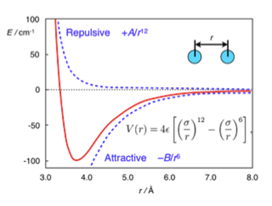

# Last Class

- Defined **Enthalpy** ($H \equiv U + PV$)
- Defined **Heat Capacities** ($C_V$ and $C_P$)
- Relationship between $C_P$ and $C_V$ for Ideal Gases ($C_P = C_V + R$)

## What you should be able to do after this lecture

By the end of class you should be able to:

1.  Calculate changes in internal energy ($\Delta U$) and enthalpy ($\Delta H$) for any fluid given the appropriate partial derivatives.
2.  Explain the physical meaning of the **internal pressure** term.
3.  Describe the **Lennard-Jones potential** and identify the physical significance of $\sigma$ and $\epsilon$.
4.  Explain macroscopic phase behavior (boiling/condensation) in terms of microscopic intermolecular potential energy.

---

# Calculating Changes in State Variables

One of the most powerful concepts in thermodynamics is that **State Variables** (like $U$, $H$, $S$, $V$) are path-independent.

If we want to calculate the change in internal energy $\Delta U$ as a fluid goes from State 1 ($T_1, V_1$) to State 2 ($T_2, V_2$), the actual physical path the process takes does not matter.

> **Key Strategy:** We can construct a hypothetical path that is mathematically easy to integrate.

## The Mathematical Derivation for $\Delta U$

Let us assume that Internal Energy is a function of Temperature and Volume: $U = U(T, V)$.
The **total differential** of $U$ is:

$$
dU = \left( \frac{\partial U}{\partial T} \right)_V dT + \left( \frac{\partial U}{\partial V} \right)_T dV
$$

We already know the definition of the first partial derivative from the last lecture:
$$
\left( \frac{\partial U}{\partial T} \right)_V \equiv C_V
$$

The second term, $\left( \frac{\partial U}{\partial V} \right)_T$, is called the **Internal Pressure**. It represents how the energy of the molecules changes as they are pulled apart (volume increases) at constant temperature.

So, the general equation for a change in internal energy is:

$$
\Delta U = \int_{T_1}^{T_2} C_V dT + \int_{V_1}^{V_2} \left( \frac{\partial U}{\partial V} \right)_T dV
$$ {#eq-deltaU-general}

### The Joule Experiment and Ideal Gases
In the mid-1800s, James Joule performed an experiment where he allowed a gas to expand into a vacuum (changing volume) while measuring the temperature change. He found that for dilute gases, the temperature did not change upon expansion.

This implied that the energy of the gas did not depend on the distance between molecules. Mathematically:
$$
\left( \frac{\partial U}{\partial V} \right)_T \approx 0 \quad \text{(for Ideal Gases)}
$$

Therefore, for an **Ideal Gas**, the equation simplifies to:
$$
\Delta U^{IG} = \int_{T_1}^{T_2} C_V^{IG} dT
$$

::: {.callout-note}
For real fluids (liquids, high-pressure gases), $\left( \frac{\partial U}{\partial V} \right)_T$ is **not** zero. As you pull molecules apart, you must overcome attractive forces, which increases the potential energy of the system.
:::

## The Mathematical Derivation for $\Delta H$

We can perform a similar derivation for Enthalpy, usually choosing $T$ and $P$ as the independent variables: $H = H(T, P)$.

$$
dH = \left( \frac{\partial H}{\partial T} \right)_P dT + \left( \frac{\partial H}{\partial P} \right)_T dP
$$

Using the definition of $C_P$:
$$
\Delta H = \int_{T_1}^{T_2} C_P dT + \int_{P_1}^{P_2} \left( \frac{\partial H}{\partial P} \right)_T dP
$$ {#eq-deltaH-general}

For an Ideal Gas, enthalpy depends only on temperature, so the second term is zero:
$$
\Delta H^{IG} = \int_{T_1}^{T_2} C_P^{IG} dT
$$

---

# Intermolecular Forces: The "Why" of Thermodynamics

Why do real fluids have an "Internal Pressure"? Why do substances boil at different temperatures? The answer lies in **Intermolecular Forces**.

## The Lennard-Jones Potential
The interaction energy between two non-polar molecules is often approximated by the **Lennard-Jones (LJ) Potential**:

$$
\mathcal{U}(r) = 4\epsilon \left[ \left( \frac{\sigma}{r} \right)^{12} - \left( \frac{\sigma}{r} \right)^{6} \right]
$$

{#fig-lj width=60%}

This equation has two distinct terms:
1.  **Repulsion:** $\left( \frac{\sigma}{r} \right)^{12}$. This dominates at short distances. Molecules resist overlapping (Pauli exclusion principle).
2.  **Attraction:** $-\left( \frac{\sigma}{r} \right)^{6}$. This dominates at long distances. These are dispersion (van der Waals) forces.

### Physical Significance of Parameters
* **$\sigma$ (Sigma):** The distance where the potential is zero. It represents the approximate "collision diameter" of the molecule.
* **$\epsilon$ (Epsilon):** The depth of the potential energy well. It represents the **strength of attraction**.

## Phase Changes and Potential Energy Wells

We can use this microscopic picture to understand macroscopic phase changes.

### 1. Condensation (Trapped in the Well)
Imagine molecules flying around as a gas. If they come close to each other, they feel the attractive potential well.
* If the temperature is high (high Kinetic Energy), they fly right past the well.
* If the temperature is low, the Kinetic Energy is insufficient to escape the well ($\epsilon$). The molecules get "stuck" together. This is **condensation**.

### 2. Boiling (Escape Velocity)
Consider a liquid, where molecules are sitting in the potential well.
* To turn them into a gas, we must add energy (Heat).
* We add enough Kinetic Energy to overcome the potential energy barrier $\epsilon$.
* Once $KE > \epsilon$, the molecules reach "escape velocity" and fly apart. This is **vaporization**.

### Connection to Boiling Point
It follows that substances with a deeper well (larger $\epsilon$) require more energy to boil. We expect a strong correlation between $\epsilon$ and the boiling point $T_b$.

| Compound | $\epsilon / k_B$ (K) | $\sigma$ (nm) | $T_{boiling}$ (K) |
| :--- | :---: | :---: | :---: |
| Argon (Ar) | 120 | 0.34 | 87.3 |
| Oxygen (O$_2$) | 101 | 0.35 | 90.2 |
| Xenon (Xe) | 229 | 0.41 | 165.1 |
| Hydrogen (H$_2$) | 35.7 | 0.29 | 20.3 |

::: {.callout-tip}
## Observation
Look at Xenon vs. Hydrogen. Xenon has a much larger $\epsilon$ (stronger attraction due to more electrons/polarizability), and consequently, its boiling point is much higher.
:::

---

# Interactive Example: The Lennard-Jones Potential

I have prepared a notebook where you can adjust $\sigma$ and $\epsilon$ and see how the potential energy curve changes.

::: {.content-visible when-format="html"}
[**View Interactive Notebook**](lecture06_LJ.ipynb)

:::

::: {.content-visible when-format="pdf"}
*Note: This example is available as an interactive Jupyter Notebook on the course website.*
:::

---

# Summary

1.  Because $U$ and $H$ are state functions, we can calculate their changes using any convenient path (usually integrating along $T$ and then along $V$ or $P$).
2.  $\Delta U = \int C_V dT + \int (\frac{\partial U}{\partial V})_T dV$.
3.  For Ideal Gases, the internal pressure term is zero. For real fluids, it is non-zero because of intermolecular forces.
4.  The **Lennard-Jones potential** describes these forces:
    * $\sigma$ determines the size of the molecule.
    * $\epsilon$ determines the "stickiness" or energy required to boil the substance.