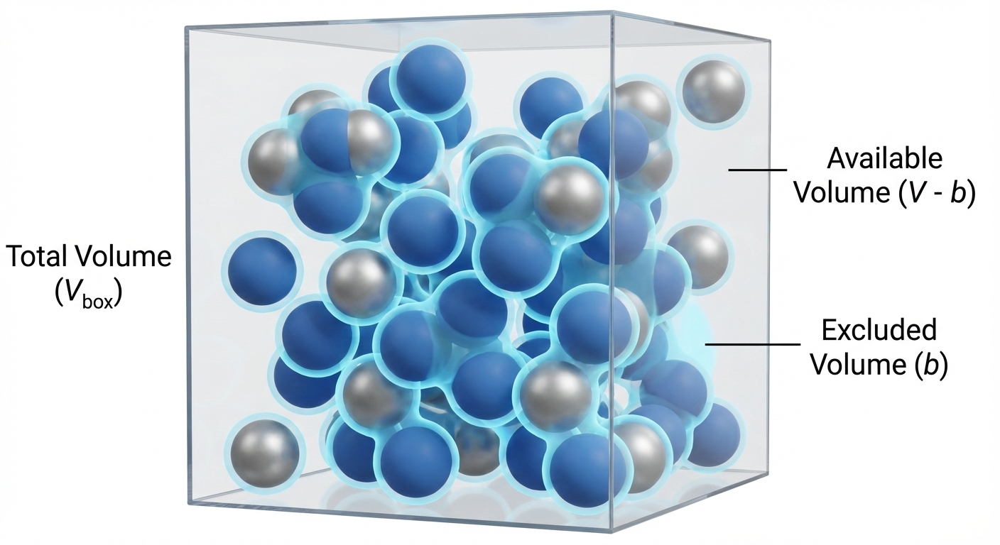
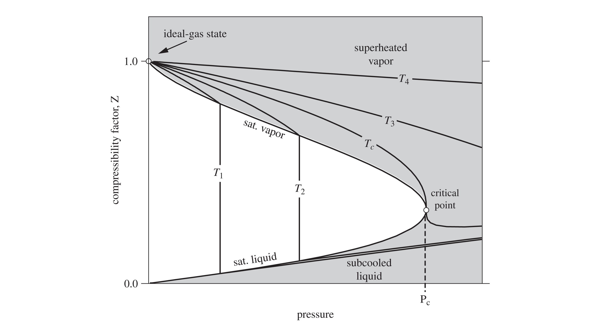
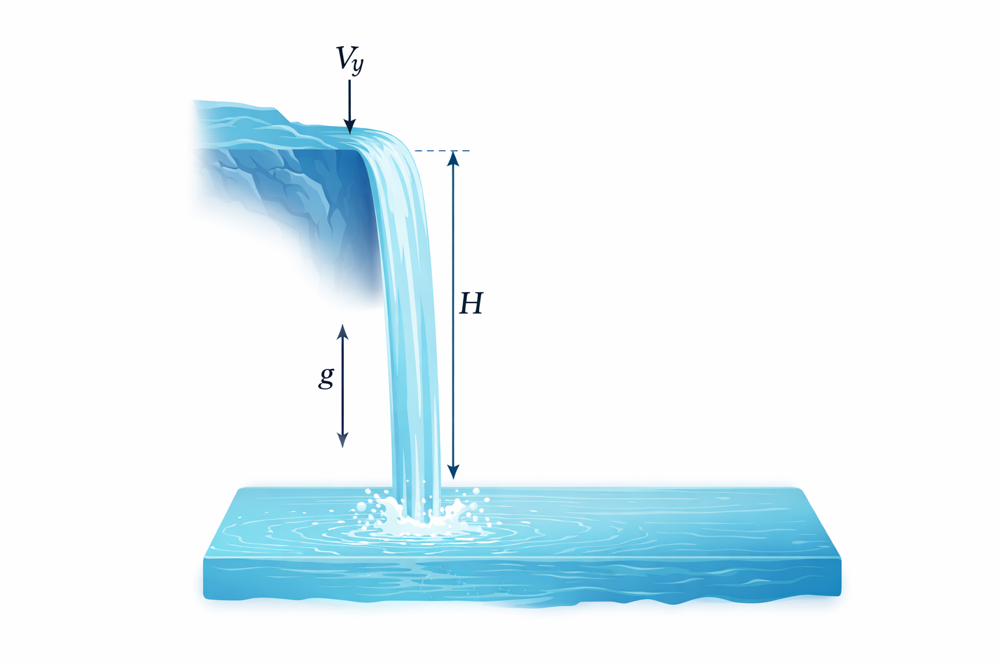

# Recap and Motivation

In the last lecture, we looked at intermolecular interactions and discovered that molecules are not non-interacting point particles as the ideal gas law assumes. Instead they have:

**Finite size** (Repulsion at short distances).

**Stickiness** (Attraction at long distances).

Today, we will use that microscopic insight to start improving the ideal gas "law". Then, we will broaden our scope to analyze systems where mass flows in and out (open systems).

---

# The van der Waals Equation of State

> "If, in some cataclysm, all of scientific knowledge were to be destroyed, and only one sentence passed on to the next generations of creatures, what statement would contain the most information in the fewest words? I believe it is the **atomic hypothesis**... that all things are made of atoms—little particles that move around in perpetual motion, attracting each other when they are a little distance apart, but repelling upon being squeezed into one another."
>
> — *Richard Feynman*

The Ideal Gas Law is simple, but only an approximation:
$$P = \frac{RT}{\underline{V}}$$

It assumes molecules are point masses that do not interact. It therefore only applies in the limit of an infinitely low density (low pressure) gas and/or at very high temperature where the kinetic energy of the gas molecules overwhelms any intermolecular interactions. Let's "perturb" this equation to account for reality.

## Correction 1: Repulsion (Finite Size)
Molecules take up space. If you pack a lot of molecules into a box, the volume *available* for them to move around is not the total volume $\underline{V}$, but the total volume *minus* the volume of the molecules themselves and the inaccessible volume in the interstices between molecules (see @fig-excluded-volume).

{#fig-excluded-volume width=60%}

We define a parameter **$b$** as the "excluded volume" due to molecular size. It accounts for the size of the molecules and any space "excluded" from other molecules. 
$$\underline{V}_{available} = \underline{V} - b$$ 

This leads to a "perturbation" to the ideal gas law that accounts for molecular volume:
$$P = \frac{RT}{\underline{V} - b}$$ {#eq-IG1}
*Result:* For a fixed $T$ and $\underline{V}$, @eq-IG1 predicts that the pressure is **higher** than what the ideal gas law predicts, because molecules are hitting the walls more often (they have less room to wander). 

## Correction 2: Attraction
In addition to repelling each other at short distances, we learned that molecules tend to *attract* each other at longer distances, due to things like dipole moments and dispersion forces. The potential energy of attraction $\Gamma$ scales more or less like $\Gamma \propto 1/r^6$, where $r$ is the distance between the molecules. These so-called van der Waals forces cause a reduction in the pressure, since the attractive forces "pull back" molecules and **reduce** the momentum with which they hit the wall of a container. The pressure reduction scales like $1/\underline{V}^2$, which can be rationalized in two (equivalent) ways:

* The reduction in force of a molecule hitting a container wall is proportional to the density of the molecules pulling it back ($\rho \propto 1/\underline{V}$).
* The number of molecules hitting the wall is also proportional to density ($\rho \propto 1/\underline{V}$).
* Therefore, the reduction in pressure is proportional to $1/\underline{V}^2$.

OR:

* Since the attractive energy scales as $\Gamma \propto 1/r^6$, dimensional analysis suggests that the reduction in pressure scales in the same way, which is $\propto 1/\underline{V}^2$.

In either case, we define a parameter **$a$** to represent the strength of attraction.
$$P_{reduction} = \frac{a}{\underline{V}^2}$$ {#eq-IG2}

## The Result: van der Waals Equation of State (EOS) (1873)
Combining these two corrections @eq-IG1 and @eq-IG2 results in the famous **van der Waals Equation of State**:

$$P = \frac{RT}{\underline{V} - b} - \frac{a}{\underline{V}^2}$$ {#eq-vdw}

This was the first cubic equation of state (called this because it is cubic function in volume, which you can see if you expand it to a polynomial. The interactive demo below explores this). @eq-vdw was derived by Johannes Diderik van der Waals as part of his PhD thesis "Over de continuiteit van den gas - en vloeistoftoestand" (On the continuity of the gas and liquid state). He won the Nobel Prize in 1910 for this work, which helped provide a molecular explanation for why fluids can exist in the liquid and vapor state.  It is not a very accurate EOS and so is not used for engineering calculations. However, due to its simplicity and the fact that it captures many of the basic properties of real fluids, it is an important equation to understand. 

::: {.callout-note}
## Critical Point Parameters
The parameters $a$ and $b$ are not arbitrary fitting parameters; they are typically linked to the **critical point** of the fluid.

At the critical point ($T_c, P_c$), the critical isotherm exhibits a horizontal inflection point. Physically, this means the distinction between liquid and vapor disappears. Mathematically, it implies that both the slope and the curvature of the $P-\underline{V}$ curve are zero:

$$
\left( \frac{\partial P}{\partial \underline{V}} \right)_{T_c} = 0 \quad \text{and} \quad \left( \frac{\partial^2 P}{\partial \underline{V}^2} \right)_{T_c} = 0
$$

By applying these two constraints to the van der Waals equation (@eq-vdw) and solving the resulting system of algebraic equations, we obtain the standard definitions for the parameters:

$$
a = \frac{27}{64} \frac{(RT_c)^2}{P_c}, \quad b = \frac{RT_c}{8P_c}
$$

Each material has a different critical point, so each material has their own unique values of $a$ and $b$. You find them by looking up the critical temperature and pressure of the substance of interest (see, for example, Appendix C of your textbook) and calculating $a$ and $b$ with the formulae above. We will see that this is important when we later talk about the principle of *corresponding states*.
:::

---

### Connection to the Lennard-Jones potential
* **$b$ (Exclusion):** Correlates with the collision diameter $\sigma$.
* **$a$ (Attraction):** Correlates with the potential well depth $\epsilon$.

# Interactive Example: The van der Waals equation of state

I have prepared a notebook that plots the VDW EOS for CO$_2$ at a temperature you choose with a slider. It plots the equation on a P-V diagram. Note the cubic nature of the EOS below the critical point. If you choose a pressure, you can solve the equation graphically by drawing a horizontal line at a given pressure and finding the roots where the line intersects the VDW equation curve. The low and high volume roots are the model prediction of the liquid and vapor volume, respectively. The middle root is disregarded. (More on this later)!

::: {.content-visible when-format="html"}
[**View Interactive Notebook**](VDW-loop.ipynb)

:::

::: {.content-visible when-format="pdf"}
*Note: An interactive simulation of the van der Waals equation showing the solution for a given T is available in the online version of these notes.*
:::

I have prepared a second notebook that actually solves the roots of the VDW EOS and plots these for CO$_2$. Here, you can choose a pressure and temperature and the notebook will solve for the volume roots. We will have more to say about solving cubic equations of state later in the class, but for now you can play with the notebook to get a feel for how this EOS works. 

::: {.content-visible when-format="html"}
[**View Interactive Notebook**](vdw-TP.ipynb)

:::

::: {.content-visible when-format="pdf"}
*Note: An interactive simulation of the van der Waals equation showing the solution for a given T and P is available in the online version of these notes.*
:::

# Compressibility Factor ($Z$)

How do we quickly know if a gas is behaving ideally or if we need a more realistic EOS like van der Waals? We define the **Compressibility Factor**, $Z$:

$$Z \equiv \frac{P\underline{V}}{RT}$$

* **If $Z = 1$:** The gas is ideal.
* **If $Z > 1$:** Repulsion dominates. The gas is "harder" to compress than an ideal gas (usually at high P).
* **If $Z < 1$:** Attraction dominates. The gas is "easier" to compress than an ideal gas (molecules want to stick together).

As pressure approaches 0, all real gases approach ideal behavior ($Z \to 1$). @fig-compressibility-factor shows what Z looks like for moderate pressures. 

{#fig-compressibility-factor width=60%}

---

# Open System Energy Balance

Up to this point, we have mostly discussed **closed systems** (mass is constant). In chemical engineering, we deal with pumps, turbines, reactors, and heat exchangers where mass flows in and out. It is crucial when applying open system balance equations for mass and energy that you first define your system, boundaries, and environment. We sometimes call the system and boundaries a "control volume". The balance equations then apply to the system.  

## Mass Balance
The open system mass balance is

$$\frac{dM}{dt} = \sum_{j=1}^J \dot{m}_{j,in} - \sum_{k=1}^K \dot{m}_{k,ouot}$$ {#eq-mass-balance}

where the total mass of the system is $M$, there are $J$ and $K$ streams flowing into and out of the system, respectively, and $\dot{m}$ is the mass flow rate (e.g. kg/s).

## The Energy Balance (General Form)
We start with the First Law for a closed system: $\frac{dE}{dt} = \dot{Q} + \dot{W}$.
However, when mass enters or leaves, it carries energy (internal + kinetic + potential). Thus the general open system energy balance (Dahm & Visco notation) is:

$$
\begin{aligned}
\frac{d}{dt} \left [ \left (\hat{U} + \frac{v^2}{2} + gh \right )  \right ] &= 
\sum_{j=1}^J \left [\dot{m}_{j,in} \left ( \hat{U}_j +P_j\hat{V}_j + \frac{v_j^2}{2} + gh_j\right )   \right] \\
&- \sum_{k=1}^K \left [\dot{m}_{k,out} \left ( \hat{U}_k +P_k\hat{V}_k + \frac{v_k^2}{2} + gh_k\right )   \right] \\
&+ \dot{W}_s + \dot{W}_{EC} + \dot{Q}
\end{aligned}
$$ {#eq-open-ebalance1}

where:

* $\dot{W}_s$: Shaft work (turbines, pumps).
* $\dot{W}_{ec}$: Expansion/Contraction of the system itself (usually 0 for rigid equipment).
 

Recall that as a fluid enters or leaves a system, there is **Flow Work**. We showed that to push a unit of mass *into* a system, the surroundings must do work $P_{in}\underline{V}_{in}$. To push mass *out*, the system must do work $P_{out}\underline{V}_{out}$. That is where the $P_j\hat{V}_j$ and $P_k\hat{V}_k$ terms come from. 

Recall the definition of Enthalpy: $\hat{H} = \hat{U} + P\hat{V}$. By combining the internal energy of the stream with the flow work required to move it, we replace $\hat{U}$ and $P\hat{V}$ with $\hat{H}$ for all *flowing streams*.

$$
\begin{aligned}
\frac{d}{dt} \left [ \left (\hat{U} + \frac{v^2}{2} + gh \right )  \right ] &= 
\sum_{j=1}^J \left [\dot{m}_{j,in} \left ( \hat{H}_j + \frac{v_j^2}{2} + gh_j\right )   \right] \\
&- \sum_{k=1}^K \left [\dot{m}_{k,out} \left ( \hat{H}_k + \frac{v_k^2}{2} + gh_k\right )   \right] \\
&+ \dot{W}_s + \dot{W}_{EC} + \dot{Q}
\end{aligned}
$$ {#eq-open-ebalance2}

@eq-open-ebalance2 is the general time-dependent open system energy balance we will use throughout this class. The integrated time-independent form is given by

$$
\begin{aligned}
\Delta \left [ \left (\hat{U} + \frac{v^2}{2} + gh \right )  \right ] &= 
\sum_{j=1}^J \left [{m}_{j,in} \left ( \hat{H}_j + \frac{v_j^2}{2} + gh_j\right )   \right] \\
&- \sum_{k=1}^K \left [{m}_{k,out} \left ( \hat{H}_k + \frac{v_k^2}{2} + gh_k\right )   \right] \\
&+ {W}_s + {W}_{EC} + {Q}
\end{aligned}
$$ {#eq-open-ebalance3}

It is important to understand the distinction between @eq-open-ebalance2 and @eq-open-ebalance3; @eq-open-ebalance2 applies to a process as it occurs in time, while @eq-open-ebalance3 is applied to the before and after state of a thermodynamic process. The dots above the terms in @eq-open-ebalance2 mean energy/time or *power*.

### Steady-State Assumption
For many continuous processes (after startup), the energy of the system does not change with time. We say the system is at *steady-state*. That means
$$\frac{d}{dt} \left [ \left (\hat{U} + \frac{v^2}{2} + gh \right )  \right ]=0$$ {#eq-steady-state}

and
$$\Delta \left [ \left (\hat{U} + \frac{v^2}{2} + gh \right )  \right ] =0$$ {#eq-steady-state-delta}

### Steady state, one inlet and one outlet
If a system is at steady state and there is only one inlet and outlet, the mass can't accumulate in the system. In this case, in addition to @eq-steady-state (or @eq-steady-state-delta) being valid, $\dot{m}_{in} = \dot{m}_{out} = \dot{m}$. For this case, we can simplify the energy balances even more. @eq-open-ebalance2 becomes

$$0=\dot{m} \left [  \left ( \hat{H}_{in} + \frac{v_{in}^2}{2} + gh_{in}\right )  -  \left ( \hat{H}_{out} + \frac{v_{out}^2}{2} + gh_{out} \right ) \right] + \dot{W}_s + \dot{W}_{EC} + \dot{Q}$$ {#eq-ss-ebalance1}

while @eq-open-ebalance3 becomes

$$0={m} \left [  \left ( \hat{H}_{in} + \frac{v_{in}^2}{2} + gh_{in}\right )  -  \left ( \hat{H}_{out} + \frac{v_{out}^2}{2} + gh_{out} \right ) \right] + W_s + {W}_{EC} + {Q}$$ {#eq-ss-ebalance2}

@eq-ss-ebalance1 and @eq-ss-ebalance2 are often used, but make sure the assumptions behind them are valid!

---

# Example 1: Multnomah Falls

{#fig-falls width=30%}

**Problem:** Water at 25°C flows in a creek at 2 m/s. It reaches a cliff and drops 200 m into a pool below. Assume steady state and adiabatic operation. Ignore evaporation and wind resistance.

1.  What is the velocity of the water right before it hits the pool?

2.  What is the temperature rise in the pool?

**Solution:**

Draw a schematic of the problem
{#fig-water-fall-diagram width=30%}

**Part A: Velocity at the bottom**
Apply Energy Balance from Top (1) to Bottom (2) (just before impact).

* $Q=0, W_s=0, \Delta H \approx 0$ (assuming T hasn't changed yet).

* Balance: $\Delta (\frac{v^2}{2}) + g\Delta z = 0$

* $\frac{v_2^2 - v_1^2}{2} + g(z_2 - z_1) = 0$

$$v_2 = \sqrt{v_1^2 + 2g(h)} = \sqrt{2^2 + 2(9.81)(200)} \approx \mathbf{62.6 \text{ m/s}}$$

This is obviously way too high (roughly 140 mph). Neglecting wind resistance is a bad assumption. But let's see what we can learn.

**Part B: Temperature in the Pool**

Now consider the pool (State 3). The water comes to rest: $v_3 \approx 0$.

Apply Energy Balance from Top (1) to Pool (3).

* $\Delta (\frac{v^2}{2}) \approx 0$ (starts slow (neglect 2 m/s), ends stopped).

* $\Delta z = -200$ m.

* Balance: $\Delta \hat{H} + g\Delta z = 0 \implies \hat{H}_3 - \hat{H}_1 = -g(z_3 - z_1)$

* For a liquid, $\Delta \hat{H} \approx C_p \Delta T$.

$$C_p \Delta T = g h$$

$$\Delta T = \frac{9.81 \text{ m/s}^2 \times 200 \text{ m}}{4184 \text{ J/kg}^\circ\text{C}}$$

$$\Delta T = \frac{1962 \text{ J/kg}}{4184 \text{ J/kg}^\circ\text{C}} \approx \mathbf{0.47^\circ\text{C}}$$

**Insight:** A 200m waterfall with no wind resistance (super fast flowing water) only heats the water by half a degree! Mechanical energy is "dilute" compared to thermal energy.

We made a lot of pretty bold assumptions in this problem, and still the water temperature hardly changed. In reality, some of the water will evaporate on the way down, cooling the water. The wind resistance will also slow the water as it falls, reducing the temperature rise. The temperature will rise as a result of mixing and viscous dissipation of the water as it hits the pool below (kinetic energy is transferred to the pool via heat), but we should expect little to no observable temperature change in reality.

---

# Example 2: The Throttling Valve

**Problem:** A real gas flows through a partially opened valve (a throttle). The pipe is insulated ($Q=0$), there are no moving parts ($W_s=0$), and potential/kinetic energy changes are negligible.

**Analysis:**
Using the steady-state balance:
$$0 = \dot{m} (\hat{H}_{out} - \hat{H}_{in}) + 0 + 0$$
$$\hat{H}_{out} = \hat{H}_{in}$$

This process is **Isenthalpic** (constant enthalpy).

**Discussion:**

* **Ideal Gas:** Since $H^{IG}$ depends *only* on $T$, if $H$ is constant, $T$ must be constant. An ideal gas does not change temperature when pressure drops in a valve!

* **Real Gas:** Since molecules interact (van der Waals forces), expanding a gas requires work against attractive forces. This energy must come from the internal kinetic energy (temperature). Therefore, most real gases **cool down** when throttled (Joule-Thomson effect). This is the principle behind how refrigerators and freezers work (more on this later). However, just as the compressibility factor $Z$ is sometimes greater than unity, gases under the right conditions can actually increase in temperature when throttled. (Think about the repulsive part of the Lennard-Jones potential; in this region, the potential energy of molecules goes *down* as they are separated, so the kinetic energy goes up).

This connects our two topics: You need a real gas EOS (like van der Waals) to predict the temperature drop in a throttle.

