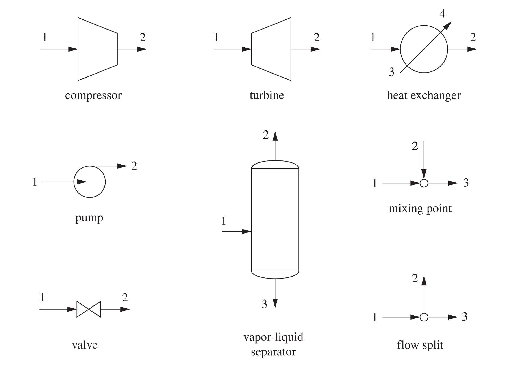
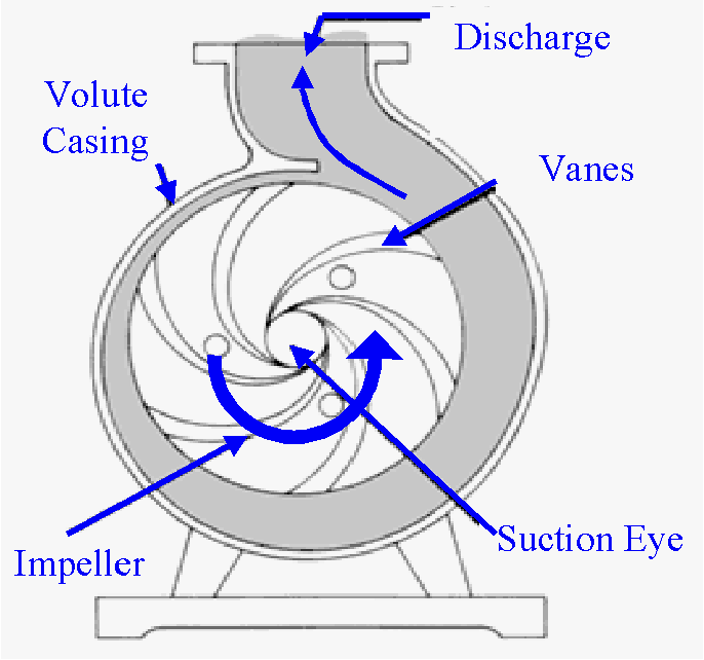
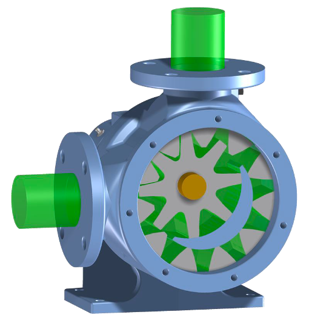
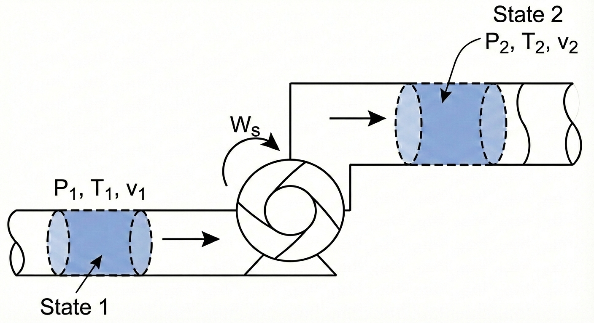
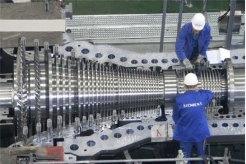
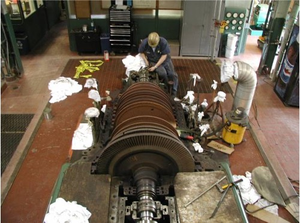
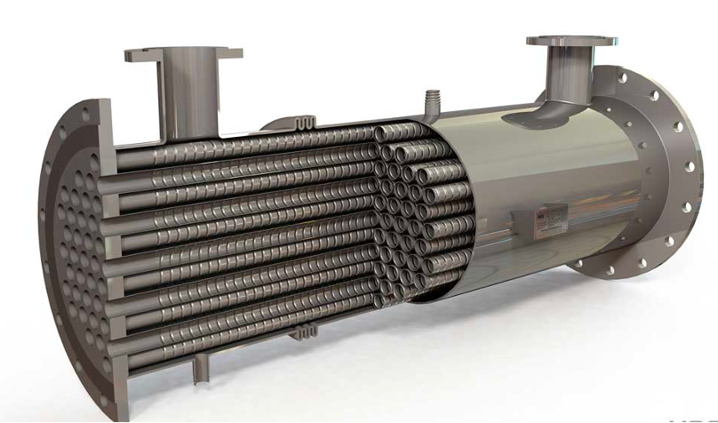
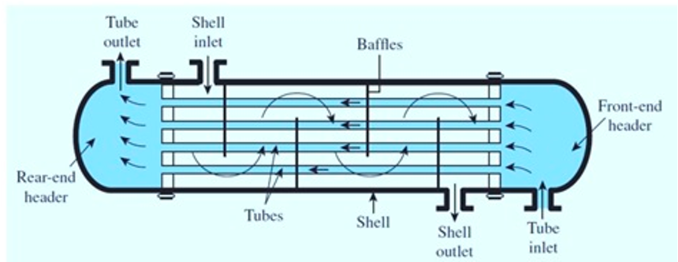
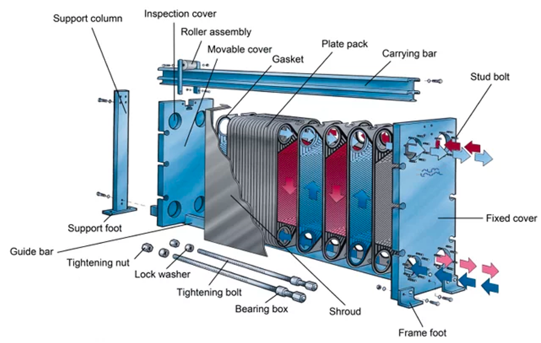

# Introduction

In the previous lecture, we derived the general **Open System Energy Balance**. Today, we will apply this equation to the most common unit operations found in chemical plants. 

Our goal is to simplify the general equation for specific pieces of equipment to answer engineering questions like: "How much power does this pump require?" or "How much heat must be removed from this reactor?"

## The General Balance Equation
Recall the general form (neglecting potential and kinetic energy for a moment):

$$
\frac{d (M \hat{U})}{dt} = \sum_{in} \dot{m}_{in} \hat{H}_{in} - \sum_{out} \dot{m}_{out} \hat{H}_{out} + \dot{Q} + \dot{W}_s + \dot{W}_{ec}
$$

For steady-state processes ($\frac{d}{dt}=0$) with one inlet and one outlet and assuming constant volume ($\dot{W}_{ec} = 0$), this simplifies to:

$$
0 = \dot{m}(\hat{H}_{in} - \hat{H}_{out}) + \dot{Q} + \dot{W}_s
$$ {#eq-general-balance}

This general expression is often useful for open system energy balances on equipment, but beware of the underlying assumptions!

---

# Process Flow Diagram Notation

Chemical plants are often represented using **Process Flow Diagrams (PFDs)**. These diagrams use standardized symbols to represent different types of equipment. Here are some common symbols:

{#fig-flowsheet width=60%}

# Fluid Movers: Pumps and Compressors

These devices are designed to increase the pressure of a fluid.

## Pumps

Pumps are used to move **liquids**.
There are two main categories:

1.  **Centrifugal Pumps:** Use rotating blades (impellers) to increase fluid velocity, which is converted to pressure.

{#fig-centrifugal width=60%}

2.  **Positive Displacement Pumps:** Fluid fills a cavity and is physically pushed out (e.g., a piston or gear).

{#fig-PD-pump width=60%}

### Energy Balance for a Pump
Let's derive the working equation for a pump.

**Assumptions:**

1.  **Steady State**

2.  **Adiabatic** ($Q \approx 0$): The fluid moves too fast to lose significant heat.

3.  **Negligible Kinetic/Potential Energy changes**: The rise in pressure is the dominant term.

**The Balance:**

@eq-general-balance becomes:
$$
0 = \dot{m}(\hat{H}_{in} - \hat{H}_{out}) + \dot{W}_s
$$
$$
\dot{W}_s = \dot{m}(\hat{H}_{out} - \hat{H}_{in}) = \dot{m} \Delta \hat{H}
$$ {#eq-pump-open}

### The Mechanical Definition of Pump Work ($\int VdP$)
While @eq-pump-open is correct, it requires us to know the enthalpy at the outlet pressure. Often, we don't know $T_{out}$, so we can't look up $\hat{H}_{out}$. Even if we did know $T_{out}$, there aren't tabulated "steam tables" for all fluids. We need an equation purely in terms of $P$ and $V$.

**Alternative Derivation: The Fluid Element Approach**

Instead of defining the pump as the system, let's imagine that the system as a small, differential "slug" of fluid as it travels from the pump inlet (State 1) to the outlet (State 2).

{#fig-pump-packet width=60%}

**System:** A packet of fluid of mass $m$.

**System Type:** Closed System (no mass crosses the packet's boundary as it moves).

The governing equation for a closed system is:
$$\Delta [m(\hat{U} + \frac{v^2}{2} + gh)] = W + Q$$

We make the standard assumptions for a pump:

**Adiabatic:** $Q = 0$.

**Negligible Kinetic/Potential Energy changes:** $\Delta KE \approx 0, \Delta PE \approx 0$.

This simplifies the balance to:
$$m(\hat{U}_2 - \hat{U}_1) = W_{ec}$$ {#eq-closed-packet-balance}

Notice the difference between @eq-pump-open and @eq-closed-packet-balance. They are both correct, but @eq-pump-open applies to the pump as a whole system, while @eq-closed-packet-balance applies to a small fluid element within the pump. In @eq-closed-packet-balance, $W_{ec}$ is the expansion/contraction work done on the fluid packet as it changes volume while moving through the pressure gradient. Note: the system (the fluid element) has no shaft work involved (there is no power source connected to it), so $W_s = 0$. This is sometimes confusing to students, but remember that the pump does shaft work on the fluid as a whole system, while the fluid element only experiences expansion/contraction work. In this derivation, the pump is not the system!   

By definition:

$$W_{ec} = - \int_{V_1}^{V_2} P dV$$

So @eq-closed-packet-balance becomes:

$$\hat{U}_2 - \hat{U}_1 = - \int_{\hat{V}_1}^{\hat{V}_2} P d\hat{V}$$ {#eq-internal-energy-pump}

**Integration by Parts**

We usually want the integral @eq-internal-energy-pump in terms of $dP$ (pressure change), not $d\hat{V}$. We can use integration by parts:

$$\int P d\hat{V} = P\hat{V} - \int \hat{V} dP$$

Substituting this into our equation:
$$\hat{U}_2 - \hat{U}_1 = - \left[ (P\hat{V}) \Big|_1^2 - \int_{P_1}^{P_2} \hat{V} dP \right]$$$$\hat{U}_2 - \hat{U}_1 = - (P_2\hat{V}_2 - P_1\hat{V}_1) + \int_{P_1}^{P_2} \hat{V} dP$$

Rearranging to group the $P\hat{V}$ terms with $\hat{U}$:
$$(\hat{U}_2 + P_2\hat{V}_2) - (\hat{U}_1 + P_1\hat{V}_1) = \int_{P_1}^{P_2} \hat{V} dP$$

Recall the definition of Enthalpy ($\hat{H} \equiv \hat{U} + P\hat{V}$). The left side is simply $\Delta \hat{H}$:

$$\hat{H}_2 - \hat{H}_1 = \int_{P_1}^{P_2} \hat{V} dP$$ {#eq-enthalpy-pump}

**Link to Pump Work**

Now, recall the open system balance we wrote for the pump itself (see @eq-pump-open):

$$\hat{W}_s = \Delta \hat{H}$$

By combining @eq-enthalpy-pump and @eq-pump-open, we arrive at the mechanical definition of pump work:

$$\hat{W}_s = \int_{P_1}^{P_2} \hat{V} dP$$ {#eq-pumpwork-mechanical}

@eq-pumpwork-mechanical is the general expression we can use to compute the work required by a pump to change a fluid pressure from $P_1$ to $P_2$. It is an important result; the work required by a pump is determined by the specific volume of the fluid and the pressure rise.

::: {.callout-note}
## Why Pumps are "Cheap" to Run
For a liquid, the specific volume $\hat{V}$ is essentially constant (incompressible). We can pull it out of the integral:
$$
\hat{W}_{pump} \approx \hat{V} (P_{out} - P_{in})
$$
Because liquid volumes are very small ($\hat{V}_{liq} \approx 0.001$ m$^3$/kg for water), the work required to pressurize a liquid is **small**. We will see that @eq-pumpwork-mechanical also applies to compressors, which pressurize gases. Because gas volumes are so much larger than liquids, compressors take a lot more work to compress a gas to the same pressure as a pump requires to compress a liquid. 
:::

## Compressors
Compressors are used to pressurize **gases**.

{#fig-compressor width=60%}

The energy balance is formally the same as for a pump:
$$\hat{W}_s = \int_{P_{in}}^{P_{out}} \hat{V} dP$$

**However**, for a gas, $\hat{V}$ is **not** constant. As pressure rises, volume shrinks drastically.

* Because $\hat{V}_{gas}$ is roughly $1000 \times \hat{V}_{liq}$, the work required to compress a gas is **huge** compared to pumping a liquid to the same pressure.
  
* To solve the integral $\int \hat{V} dP$, we need an Equation of State (like Ideal Gas or van der Waals) to relate $V$ to $P$.

* If we have something like the steam tables, we can look up $\hat{H}$ at the inlet and outlet conditions and use @eq-pump-open directly. Since $P_2 > P_1$, $\Delta \hat{H}$ is positive, resulting in positive work (work done *on* the system).

---

# Turbines (Expanders)

Turbines are essentially compressors running in reverse. We pass a high-pressure fluid (like steam or gas) through blades to extract shaft work ($\dot{W}_s < 0$).

{#fig-turbine width=60%}

**Energy Balance** 
Assume Steady state, adiabatic $Q \approx 0$, and negligible kinetic/potential energy changes.

Note: Kinetic energy changes can sometimes be significant, but we often neglect them for a first pass.

**The Balance:**
$$
\dot{W}_s = \dot{m}(\hat{H}_{out} - \hat{H}_{in}) = \dot{m} \Delta \hat{H}
$$

Since $P_{out} < P_{in}$, $\Delta \hat{H}$ is negative, resulting in negative work (work done *by* the system).

---

# Heat Exchangers

Heat exchangers transfer thermal energy between two fluids without mixing them.
Common types:

**Shell and Tube:** One fluid in tubes, another in the surrounding shell. Heat gets transferred through the tube walls between the hot and cold fluids.

{#fig-shell-tube width=60%}

{#fig-shell-tube-inside width=60%}

**Plate and Frame:** High surface area plates separating fluids.

{#fig-plate-frame width=60%}

**Energy Balance** Heat exchangers typically have two fluid streams: a hot stream being cooled and a cold stream being heated.

**System:** We can define the system as just *one* of the fluid streams (e.g., the cold stream being heated).

**Assumptions:**
Steady state and passive ($W_s = 0$).

**The Balance:**
$$
0 = \dot{m}(\hat{H}_{in} - \hat{H}_{out}) + \dot{Q}
$$
$$
\dot{Q} = \dot{m}(\hat{H}_{out} - \hat{H}_{in}) = \dot{m} C_p \Delta T
$$

---

# Example Problem: Steam Turbine

Steam enters a turbine at a mass flow rate of $\dot{m} = 10 \text{ kg/s}$.

* **Inlet (State 1):** $P_1 = 100$ bar, $T_1 = 500^\circ$C.

* **Outlet (State 2):** $P_2 = 1$ bar, Saturated Vapor.

Calculate the power output ($\dot{W}_s$) of the turbine.

**Strategy:**

1.  Define System: The Turbine.

2.  Apply Energy Balance: $\dot{W}_s = \dot{m}(\hat{H}_2 - \hat{H}_1)$.

3.  Find State Properties (using Steam Tables).

**Solution:**

**Step 1: Inlet State**
At 100 bar and $500^\circ$C (Superheated Steam):
(Looking up in Steam Tables)
$\hat{H}_1 = 3373.7 \text{ kJ/kg}$

**Step 2: Outlet State**
At 1 bar, Saturated Vapor ($x=1$):
(Looking up in Steam Tables)
$\hat{H}_2 = 2675.5 \text{ kJ/kg}$

**Step 3: Calculate Work**
$$
\dot{W}_s = 10 \frac{\text{kg}}{\text{s}} \times (2675.5 - 3373.7) \frac{\text{kJ}}{\text{kg}}
$$
$$
\dot{W}_s = 10 \times (-698.2) \text{ kJ/s}
$$
$$
\dot{W}_s = -6982 \text{ kW} \approx \mathbf{-7.0 \text{ MW}}
$$

**Result:** The turbine produces 7 MW of power.

---

# Comparative Examples: Pumping vs. Compressing

To truly appreciate the difference between liquids and gases, let's calculate the work required to pressurize water versus steam by the same amount.

## Example 1: Pumping Water

**Problem:**
Calculate the specific shaft work ($\hat{W}_s$) required to pump saturated liquid water from $P_1 = 0.5$ bar to $P_2 = 5$ bar.

**State 1 (Inlet):**

* $P_1 = 0.5$ bar, Saturated Liquid

* From Steam Tables:
    * $T_1 = 81.32^\circ$C
    * $\hat{V}_1 = 0.001030 \text{ m}^3/\text{kg}$
    * $\hat{H}_1 = 340.5 \text{ kJ/kg}$

::: {.callout-warning}
## Pitfall: Using Enthalpy Tables for Liquids
You might be tempted to use the open system balance $\hat{W}_s = \Delta \hat{H}$ and look up $\hat{H}_2$ in the subcooled liquid tables.
At $P_2 = 5$ bar, the temperature will only rise slightly (approx $81.32^\circ$C).
If we look at a subcooled water table for 5 bar and $80^\circ$C, we find $\hat{H} \approx 335.4$ kJ/kg.

If we calculate work:
$$\hat{W}_s = 335.4 - 340.5 = -5.1 \text{ kJ/kg}$$
**This is impossible!** It implies the pump *generates* power. Enthalpy is insensitive to pressure for liquids, so reading small differences from tables leads to huge errors.
:::

**Correct Approach: The Mechanical Definition**
For a liquid, we assume it is incompressible ($\hat{V} \approx \text{constant}$).
$$\hat{W}_s = \int_{P_1}^{P_2} \hat{V} dP \approx \hat{V}_1 (P_2 - P_1)$$

$$\hat{W}_s = 0.001030 \frac{\text{m}^3}{\text{kg}} \times (5 - 0.5) \text{ bar}$$
*Note: We must convert bar to Pascals ($N/m^2$) to get Joules.*
$$\hat{W}_s = 0.001030 \times (4.5 \times 10^5 \text{ Pa})$$
$$\hat{W}_s = 463.5 \text{ J/kg}$$
**Result:** The work required is **463.5 J/kg** (or 0.46 kJ/kg).

---

## Example 2: Compressing Steam

**Problem:**
Now, calculate the work required to compress steam (vapor) from the same starting pressure ($0.5$ bar) to the same final pressure ($5$ bar).
Assume the inlet is superheated at $300^\circ$C.

**State 1 (Inlet):**

* $P_1 = 0.5$ bar, $T_1 = 300^\circ$C

* $\hat{H}_1 = 3075.2 \text{ kJ/kg}$ 

**State 2 (Outlet):**

* $P_2 = 5$ bar.

* Determining the exact outlet temperature requires concepts involving *entropy* (which we will cover later). For now, we utilize the condition for minimum theoretical work (isentropic). That is, I have set this problem up so that the calculation gives the *minimum* amount of work required to compress the steam.

* Under these conditions, the outlet enthalpy is found to be $\hat{H}_2 = 3927 \text{ kJ/kg}$.

**Calculation:**
Since we are dealing with a gas, we *can* use the enthalpy difference directly (changes in H are large for gases).
$$\hat{W}_s = \hat{H}_2 - \hat{H}_1$$
$$\hat{W}_s = 3927 - 3075.2 = 851.8 \text{ kJ/kg}$$
$$\hat{W}_s = 851,800 \text{ J/kg}$$

## Comparisons and Conclusion

Compare the work required for the two fluids:

1.  **Pump (Liquid):** ~464 J/kg

2.  **Compressor (Gas):** ~851,800 J/kg

$$\frac{\text{Work}_{gas}}{\text{Work}_{liq}} \approx 1836$$

**Why such a huge difference?**
Look back at the mechanical work equation: $\hat{W}_s = \int \hat{V} dP$.
The work is directly proportional to the specific volume $\hat{V}$.
* $\hat{V}_{liquid} \approx 0.001 \text{ m}^3/\text{kg}$
* $\hat{V}_{gas} \approx 1.0 \text{ m}^3/\text{kg}$

Because the gas volume is roughly $1000 \times$ larger than the liquid volume, it costs roughly $1000 \times$ more energy to pressurize it. This is why pumps are cheap to run, but gas compressors are massive energy consumers in a chemical plant. This is an important concept to understand as we design processes! It will become important when we discuss power generation and refrigeration cycles later in the course.

