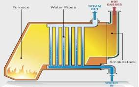

# Review of Work Equations

In the last lecture, we looked at steady-state equipment. Let's briefly recap the key equations for calculating work.

## Pump Work (Liquids)
For a pump moving an incompressible liquid, the specific shaft work is:
$$
\hat{W}_s = \int_{P_1}^{P_2} \hat{V} dP \approx \hat{V}(P_2 - P_1)
$$
This assumes the process is reversible (frictionless) and adiabatic.

## Compressor/Turbine Work (Gases)
The same integral applies ($\hat{W}_s = \int \hat{V} dP$), but since gases are compressible ($\hat{V}$ changes with $P$), we cannot simply pull $\hat{V}$ out of the integral. We can use an Equation of State (like the ideal gas law or van der Waals) to express $\hat{V}$ as a function of $P$ and integrate accordingly.
However, we typically use the **Enthalpy Balance**:
$$
\hat{W}_s = \hat{H}_{out} - \hat{H}_{in}
$$
To solve this, we need property tables (like Steam Tables) or an Equation of State written in terms of enthalpy. More on this later in the course.

---

# Nozzles and Diffusers

A **Nozzle** is a device designed to increase fluid velocity at the expense of pressure.

A **Diffuser** does the opposite: it slows a fluid down to increase its pressure.

## Energy Balance on a Nozzle

**Assumptions:**

1.  Steady State

2.  Adiabatic ($Q=0$)

3.  Passive ($W_s=0$)

4.  Negligible Potential Energy ($\Delta z \approx 0$)

The balance reduces to a conversion between Enthalpy and Kinetic Energy:
$$
0 = \dot{m} \left[ (\hat{H}_{in} + \frac{v_{in}^2}{2}) - (\hat{H}_{out} + \frac{v_{out}^2}{2}) \right]
$$
$$
\frac{v_{out}^2 - v_{in}^2}{2} = \hat{H}_{in} - \hat{H}_{out}
$$

::: {.callout-note}
## Magnitude Check
Enthalpy changes ($\Delta H$) are often in kJ/kg ($10^3$ J/kg), while velocity squared ($v^2$) is in m$^2$/s$^2$ (J/kg).
Small drops in enthalpy result in **massive** increases in velocity. Nozzles are used in rockets and jet engines to achieve very high exit velocities from relatively small enthalpy changes.
:::

## Example Problem: Steam Nozzle
Steam enters a nozzle at $P_1 = 40$ bar and $T_1 = 400^\circ$C with a velocity of $10$ m/s. It exits at $P_2 = 10$ bar and $T_2 = 300^\circ$C. Calculate the exit velocity.

**Solution:**

1.  **Inlet State (40 bar, 400$^\circ$C):** $\hat{H}_1 = 3213.6$ kJ/kg

2.  **Outlet State (10 bar, 300$^\circ$C):** $\hat{H}_2 = 3051.2$ kJ/kg

3.  **Balance:**
    $$\frac{v_2^2}{2} = \frac{v_1^2}{2} + (\hat{H}_1 - \hat{H}_2)$$
    $$\Delta \hat{H} = 3213.6 - 3051.2 = 162.4 \text{ kJ/kg} = 162,400 \text{ J/kg}$$
    $$\frac{v_2^2}{2} = \frac{10^2}{2} + 162,400$$
    $$v_2 = \sqrt{2(50 + 162,400)} \approx \mathbf{570 \text{ m/s}}$$

Achieving such high velocities requires careful nozzle design to ensure smooth flow and minimize losses. That is the subject of fluid mechanics, but at least thermodynamically, we can see how the energy conversion works.

---

# Steady-State Boiler

Boilers (or steam generators) are designed to add heat to a liquid to turn it into a vapor.

{#fig-water-boiler width=60%}

## Problem Setup
Water enters a boiler at steady state.

* **Assumption:** $\dot{W}_s = 0$ (no moving parts), $\Delta KE \approx 0$, $\Delta PE \approx 0$.

* **Balance:**
$$
\dot{Q} = \dot{m}(\hat{H}_{out} - \hat{H}_{in})
$$

This is straightforward: the heat added equals the change in enthalpy of the stream. This is one reason we defined enthalpy! It tracks heat flow at constant pressure.

---

# Unsteady State: Filling an Evacuated Tank

This is a classic problem that demonstrates the concept of **Flow Work**.

## Problem Statement
An evacuated, rigid tank is connected to a steam line carrying steam at $P_{line} = 10$ bar and $T_{line} = 300^\circ$C. The valve is opened, and steam flows in until the pressure in the tank equals the line pressure.
**Calculate the final temperature of the steam in the tank ($T_{tank}$).**

## Analysis
**System:** The Tank (Open System, Unsteady State).

**Mass Balance:**
$$
\frac{dm_{tank}}{dt} = \dot{m}_{in} \quad \Rightarrow \quad m_{final} - m_{initial} = m_{in}
$$
Since the tank was evacuated, $m_{initial} = 0$, so $m_{final} = m_{in}$.

**Energy Balance:** There is no flow out, no work, and no heat transfer (rigid and adiabatic):
$$
\frac{d(m\hat{U})_{tank}}{dt} = \dot{m}_{in}\hat{H}_{in}
$$
Integrate from state 1 (empty) to state 2 (full):
$$
m_{final}\hat{U}_{final} - m_{initial}\hat{U}_{initial} = m_{in}\hat{H}_{in}
$$
Since $m_{initial}=0$ and $m_{final}=m_{in}$, the mass terms cancel:
$$
\mathbf{\hat{U}_{final} = \hat{H}_{line}}
$$

This is a curious but important result: **the final internal energy of the fluid in the tank equals the enthalpy of the fluid entering the tank.** This occurs because the fluid must do flow work ($PV$) to enter the tank. 

## Calculation
* **Line Condition:** 10 bar, 300$^\circ$C.

    * From tables: $\hat{H}_{line} = 3051.2$ kJ/kg.

* **Final Tank Condition:**

    * $P_{final} = 10$ bar.

    * $\hat{U}_{final} = 3051.2$ kJ/kg.

We need to find the temperature where $P=10$ bar and $\hat{U} = 3051.2$.
From Steam Tables at 10 bar:

* At $T=400^\circ$C, $\hat{U} = 2957.3$ kJ/kg.

* At $T=500^\circ$C, $\hat{U} = 3124.4$ kJ/kg.

* Interpolating:
$$
T_{final} \approx 456^\circ\text{C}
$$

::: {.callout-important}
## Conceptual Question
**Why did the temperature rise from $300^\circ$C to $456^\circ$C?**
The steam in the line had to do **Flow Work** ($PV$) to push its way into the tank. Since the tank is rigid and adiabatic, that work didn't leave the system—it was converted into internal energy (increased temperature).
The fluid brings its enthalpy ($\hat{H}$) into the tank. The internal energy ($\hat{U}$) in the tank increases to match that enthalpy, resulting in a higher temperature.
:::

---

# Example: Two Connected Tanks (Non-Adiabatic)

## Problem Statement
We have two rigid tanks connected by a valve. The tanks contain carbon monoxide (CO), which we will model as an ideal gas.

* **Tank 1:** $m_1 = 2 \text{ kg}$, $P_1 = 0.7 \text{ bar}$, $T_1 = 77^\circ\text{C}$ ($350 \text{ K}$).

* **Tank 2:** $m_2 = 8 \text{ kg}$, $P_2 = 1.2 \text{ bar}$, $T_2 = 27^\circ\text{C}$ ($300 \text{ K}$).

The valve is opened, the gases mix, and the system comes to equilibrium at a measured final temperature of **$T_f = 42^\circ\text{C}$ ($315 \text{ K}$)**.

**Calculate:**

1.  The final pressure $P_f$.

2.  The heat transferred $Q$ during the process.

## Part A: Final Pressure ($P_f$)

**Analysis:**
We know the total mass ($m_{tot} = 10 \text{ kg}$) and the final temperature ($T_f = 315 \text{ K}$). To find pressure, we need the total volume $V_{total}$. Since the tanks are rigid, $V_{total} = V_1 + V_2$.

Using the Ideal Gas Law ($PV = mRT_{specific}$):
$$V_1 = \frac{m_1 R T_1}{P_1} \quad \text{and} \quad V_2 = \frac{m_2 R T_2}{P_2}$$

The final pressure is:
$$P_f = \frac{m_{total} R T_f}{V_{total}} = \frac{(m_1 + m_2) R T_f}{V_1 + V_2}$$

Substitute the expressions for $V_1$ and $V_2$ (note that the specific gas constant $R$ cancels out!):
$$P_f = \frac{(m_1 + m_2) T_f}{\frac{m_1 T_1}{P_1} + \frac{m_2 T_2}{P_2}}$$

**Calculation:**
* $T_1 = 350 \text{ K}$
* $T_2 = 300 \text{ K}$
* $T_f = 315 \text{ K}$

$$P_f = \frac{(10 \text{ kg}) (315 \text{ K})}{\left(\frac{2 \cdot 350}{0.7}\right) + \left(\frac{8 \cdot 300}{1.2}\right)}$$

$$P_f = \frac{3150}{\left(\frac{700}{0.7}\right) + \left(\frac{2400}{1.2}\right)} = \frac{3150}{1000 + 2000}$$

$$P_f = \frac{3150}{3000} = \mathbf{1.05 \text{ bar}}$$

---

## Part B: Heat Transfer ($Q$)

**Analysis:**
System: The gas in both tanks (Closed System).

* Rigid tanks $\rightarrow W = 0$.

* Negligible Kinetic/Potential energy.

**Energy Balance:**
$$\Delta U = Q + W$$
$$Q = U_{final} - U_{initial}$$
$$Q = (m_1+m_2)\hat{U}_f - (m_1\hat{U}_1 + m_2\hat{U}_2)$$

Group the terms by mass:
$$Q = m_1(\hat{U}_f - \hat{U}_1) + m_2(\hat{U}_f - \hat{U}_2)$$

For an Ideal Gas, $\Delta \hat{U} = C_v \Delta T$:
$$Q = m_1 C_v (T_f - T_1) + m_2 C_v (T_f - T_2)$$

**Calculation:**
For CO, assume constant heat capacity: $C_v \approx 0.745 \text{ kJ/kg}\cdot\text{K}$.

$$Q = 2 \text{ kg} \cdot 0.745 \frac{\text{kJ}}{\text{kg K}} (315 - 350) \text{ K} + 8 \text{ kg} \cdot 0.745 \frac{\text{kJ}}{\text{kg K}} (315 - 300) \text{ K}$$

$$Q = 1.49(-35) + 5.96(15)$$
$$Q = -52.15 \text{ kJ} + 89.4 \text{ kJ}$$
$$Q = \mathbf{+37.25 \text{ kJ}}$$

**Result:**
The system absorbs **37.25 kJ** of heat from the surroundings.