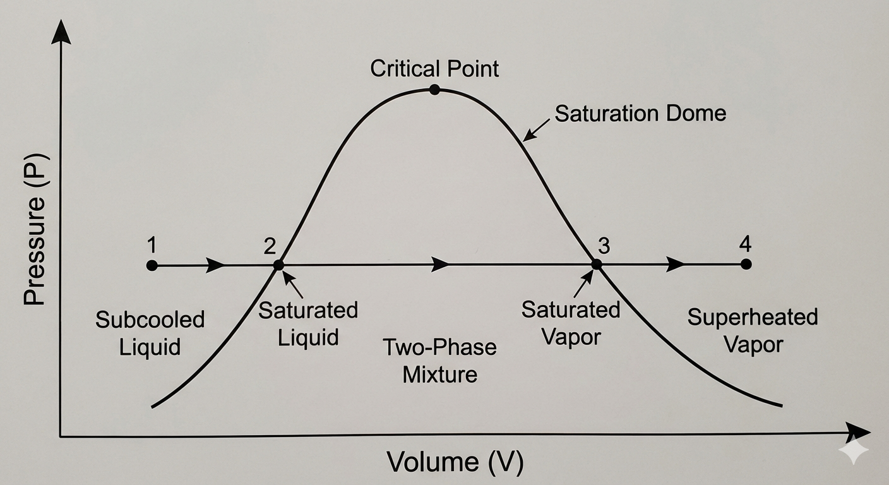
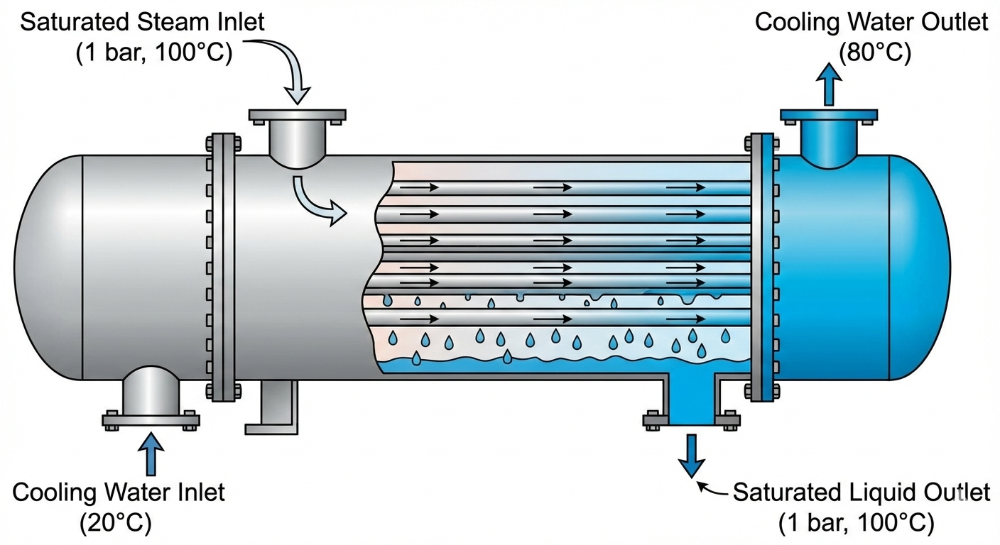
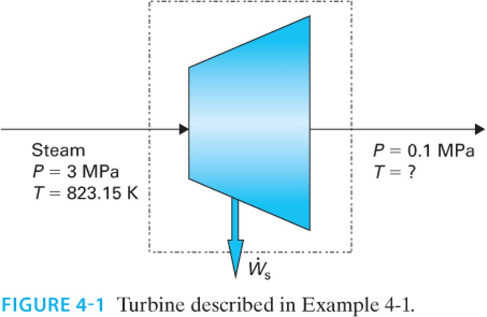
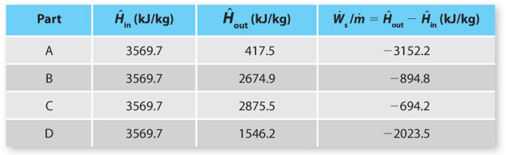
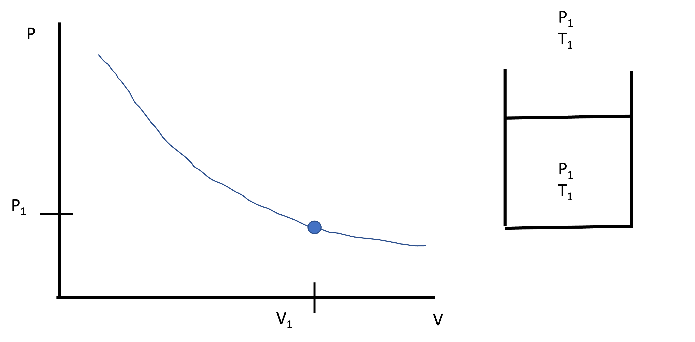
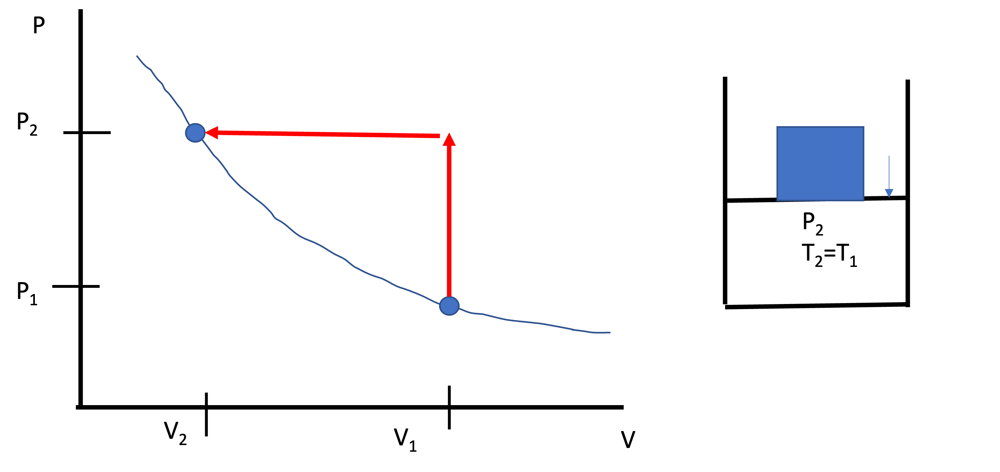
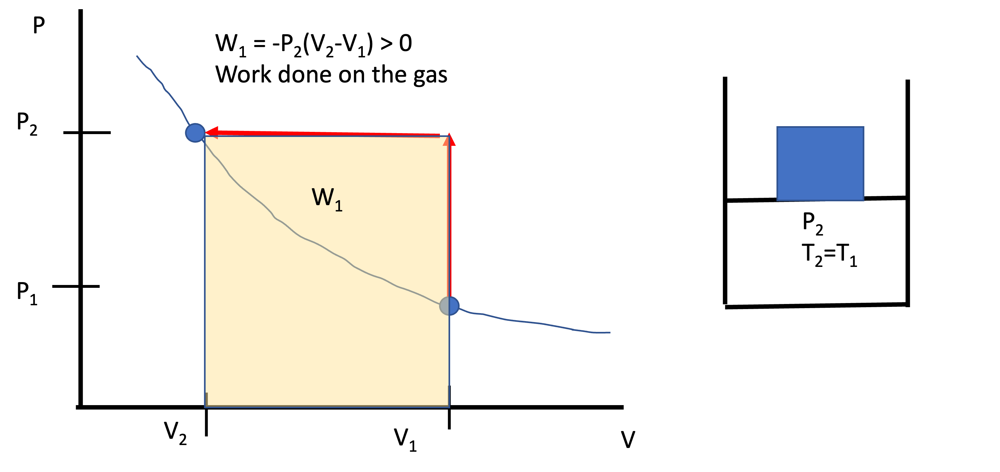
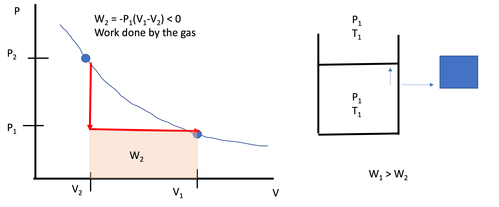
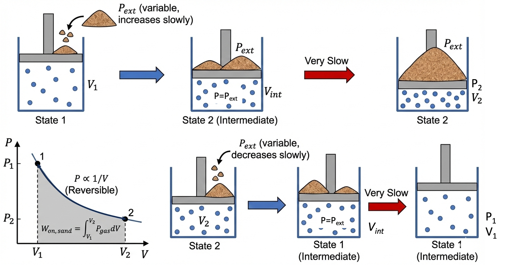

# Introduction

We have reached a pivotal point in the course. 
Up until now, we have focused entirely on the **First Law of Thermodynamics** (conservation of energy). We have learned how to track energy as it moves through pumps, turbines, boilers, and other types of process equipment. We have examined piston-cylinder devices, heat exchangers, and systems such as waterfalls and hydropower plants.

Today, we wrap up our study of energy balances by looking at **phase changes** (latent heat). 
Then, we will break the First Law. Or rather, we will find its limits. We will see that "conserving energy" is not enough to predict what happens in the real world.

---

# Sensible Heat vs. Latent Heat

When we add heat ($Q$) to a substance, two things can happen:

1.  **Sensible Heat:** The temperature rises. The molecules move faster (kinetic energy increases).

2.  **Latent Heat:** The phase changes but the temperature **stays constant**. Molecules move further apart (e.g., liquid to vapor), overcoming intermolecular attractive forces and thereby increasing potential energy. Or they get closer (e.g. liquid to solid, increasing attractive forces and lowering their potential energy.

## Calculating Enthalpy Changes involving Phase Transitions

Consider heating water at constant pressure ($P=1$ bar) from subcooled liquid at $20^\circ$C (State 1) to superheated steam at $200^\circ$C (State 4). See @fig-PV-latent.

{#fig-PV-latent width=60%}

The energy balance is:
$$\Delta \hat{H} = \hat{H}_4 - \hat{H}_1 = Q$$

A common mistake is to write: 
$$\Delta \hat{H} = \int_{T_1}^{T_4} C_p dT \quad \text{(INCORRECT!)}$$

We cannot integrate continuously because $C_p$ changes discontinuously at the phase boundaries, and there is a massive jump in energy required to boil the liquid. We must break the path into three steps:

1.  **Heat Liquid (Sensible):** $T_1 \to T_2^{sat}$
2.  **Boil Liquid (Latent):** Liquid $\to$ Vapor at $T_2^{sat}=T_3^{sat}$
3.  **Heat Vapor (Sensible):** $T_3^{sat} \to T_4$

$$\Delta \hat{H} = \int_{T_1}^{T_2^{sat}} C_p^L dT + \Delta \hat{H}_{vap} + \int_{T_3^{sat}}^{T_4} C_p^V dT$$

where $\Delta \hat{H}_{vap}$ is the **enthalpy of vaporization** (or the *latent heat*).

## Example: The Condenser (Heat Exchanger)

Let's demonstrate the magnitude of latent heat with a practical example.

**Problem Statement:**
A steady-state heat exchanger is used to condense steam.

* **Hot Side:** Saturated steam at 1 bar ($100^\circ$C) enters and condenses completely to saturated liquid at 1 bar.

* **Cold Side:** Cooling water enters at $20^\circ$C and leaves at $80^\circ$C.

Calculate the ratio of mass flow rates $\frac{\dot{m}_{cooling}}{\dot{m}_{steam}}$.

**Data (at 1 bar):**

* $\Delta \hat{H}_{vap, steam} \approx 2257 \text{ kJ/kg}$

* $C_{p, water} \approx 4.18 \text{ kJ/kg}^\circ\text{C}$

{#fig-heat-ex-example width=50%}

**Solution:**
Energy balance on the heat exchanger (adiabatic to surroundings):
$$\text{Energy Lost by Steam} = \text{Energy Gained by Cooling Water}$$
$$\dot{m}_{steam} (\Delta \hat{H}_{steam}) + \dot{m}_{cool} (\Delta \hat{H}_{cool}) = 0$$

For the steam (phase change only):
$$\Delta \hat{H}_{steam} = \hat{H}_{liq} - \hat{H}_{vap} = -\Delta \hat{H}_{vap} = -2257 \text{ kJ/kg}$$

For the cooling water (sensible heat only):
$$\Delta \hat{H}_{cool} = C_p (T_{out} - T_{in}) = 4.18 (80 - 20) = 250.8 \text{ kJ/kg}$$

**Ratio:**
$$\dot{m}_{steam} (2257) = \dot{m}_{cool} (250.8)$$
$$\frac{\dot{m}_{cool}}{\dot{m}_{steam}} = \frac{2257}{250.8} \approx \mathbf{9.0}$$

**Takeaway:** 

It takes **9 kg** of cooling water (heating up by a massive $60^\circ$C) just to condense **1 kg** of steam without changing the steam's temperature a single degree! This shows the immense energy density associated with latent heat. It is why steam is such a popular working fluid in power plants and it is an important concept for chemical engineers to understand.

---

# The Limits of the First Law

We have finished Part 1 of the course. We are masters of the energy balance. But is the energy balance enough to design a machine?

## The Turbine Example

Consider the example from the slides. We have a steam turbine:

* **Inlet:** $P = 3$ MPa, $T = 823.15$ K ($550^\circ$C).

* **Outlet:** $P = 0.1$ MPa (atmospheric pressure).

{#fig-turbine-ex width=50%}

We want to calculate the work output: $\hat{W}_s = \hat{H}_{out} - \hat{H}_{in}$.
$\hat{H}_{in}$ is fixed by the inlet conditions. But what is $\hat{H}_{out}$?

Let's propose four different scenarios for the outlet state:

1.  **Case A:** Exit is saturated liquid at 0.1 MPa.

2.  **Case B:** Exit is saturated vapor at 0.1 MPa.

3.  **Case C:** Exit is superheated steam ($200^\circ$C) at 0.1 MPa.

4.  **Case D:** Exit is a 50/50 mix of liquid and vapor.

{#fig-turbine-data width=50%}

**Does the First Law forbid any of these?**

No!

* Look up $\hat{H}_{in} = 3569.7 \text{kJ/kg}$.
* If we pick Case A, $\hat{H}_{out}= 417.5 \text{kJ/kg}$  and we calculate $\hat{W}_s = 417.5 - 3569.7 = -3152.2 \text{kJ/kg}$ (work output).

* If we pick Case B, $\hat{H}_{out}= 2674.9 \text{kJ/kg}$  and $\hat{W}_s = 2674.9 - 3569.7 = -894.8 \text{kJ/kg}$ (work output). This is a lot less work than Case A. 

* If we pick Case C, $\hat{H}_{out}= 2875.5 \text{kJ/kg}$ and $\hat{W}_s = 2875.5 - 3569.7 = -694.2 \text{kJ/kg}$ (work output). This is even less work than Case B.

* If we pick Case D, $\hat{H}_{out}= 1546.2 \text{kJ/kg}$ and $\hat{W}_s = 1546.2 - 3569.7 = -2023.5 \text{kJ/kg}$ (work output). This is more work than Case B or C, but less than Case A.

Which one do you "like" best? Which one is the "best possible" case? Which one is the "worst possible" case? Case A provides the most work out, so this is the one you would pick. The "worst case" is C, since it provides the least amount of work. All four cases satisfy the First Law. However, as we will see soon, only Case C is possible. Cases A, B, and D are impossible. They violate the Second Law of Thermodynamics, which we will discover in the next lecture.

This example shows that the First Law is not enough to determine what happens in the real world. We need another principle to determine which of these cases is "real" and which are "impossible." That principle is the **Second Law of Thermodynamics**. Before we can discover the Second Law, we need to understand the concept of **Reversibility** and the **Direction of Time**. We will cover those topics in the second half of this lecture.

---

# Reversibility and Path Dependence

To understand which case is "real," we need to look at **Reversibility**.

Consider a piston-cylinder compressing a gas. We start with a gas at $P_1$, $T_1$, and volume $V_1$. The external pressure is also $P_1$ and the external temperature is $T_1$. See @fig-piston1.

{#fig-piston1 width=50%}

## Process 1: The "Brick" Method (Irreversible)

We suddenly drop a heavy brick on the piston. The gas compresses rapidly and violently, but since the walls of the piston are diathermal, the temperature of the gas is maintained at $T_1$ (the same as the external temperature). The pressure of the gas shoots up to $P_2$ (much higher than $P_1$) and the volume drops to $V_2$. See @fig-piston2.

{#fig-piston2 width=50%}

The work done on the gas is:
$$W_1 = W_{on, brick} = -\int P_{2} dV = P_{2} (V_1 - V_2)$$

where $P_{2}$ is the pressure exerted by the brick + the atmosphere.

The work is simply the area under the curve in the $P-V$ diagram in @fig-piston3. The work is large because we had to push much harder than we needed to (if there were no inertia or friction, we would only need to push a little harder than the pressure inside the cylinder to get the gas to compress). 

{#fig-piston3 width=50%}

Now imagine what would happen if we slid the brick off the piston. The gas would expand rapidly and violently, shooting the piston up into the air. The gas would cool down as it expands, but since the walls are diathermal, it would quickly reheat back to $T_1$. The pressure would drop to $P_1$ and the volume would return to $V_1$. The piston would expand against the external pressure of the atmosphere $P_1$. The path would look like that in @fig-piston4. 

{#fig-piston4 width=50%}

The work done by the gas would be the area under the curve in the $P-V$ diagram in @fig-piston4:

$$W_2 = W_{off, brick} = -\int P_{1} dV = P_{1} (V_2 - V_1)$$

The work done by the gas is much smaller than the work done on the gas by the brick. That is $|W_2| < |W_1|$, or the work we "got out" is less than the work we put in. The gas can't push as hard as the brick pushed on it. The gas can't get back all of the energy that we put in with the brick. This process is **Irreversible**. We can remove the brick, but we can't totally reverse the process and get back to where we started without somehow interacting with the environment. The extra energy we put in with the brick is lost to friction, turbulence, and other dissipative effects. That energy doesn't disappear; it turns into heat that leaves the system. We can't turn that heat back into work to lift the brick back up.

## Process 2: The "Sand" Method (Reversible)
Instead of a brick, we smash the brick up into $10^{23}$ grains of sand. We add one grain of sand to the piston at a time, each time waiting a very long time for the pressure to stabilize. Each time a grain of sand is added, the volume of the gas decreases differentially by $dV$ and the external pressure increases infinitesimally ($dP$).
At every moment, $P_{gas} \approx P_{ext}$. The system is in **Quasi-Equilibrium**.

Because we only push as hard as we absolutely have to, the work required is **minimized**. After a **very** long time, we have added all the grains of sand and we have compressed the gas to the same final state as in Process 1. The work done on the gas is:
$$W_{on, sand} = -\int P_{gas} dV$$

Note: at all times, $P_{gas}=P_{ext}$. Now we can remove the grains of sand one at a time, waiting for the system to stabilize after each grain is removed. The gas will expand against the external pressure, doing work on the surroundings. At all times, $P_{gas}=P_{ext}$. The work done by the gas is:
$$W_{off, sand} = -\int P_{gas} dV$$

The work done by the gas in going from state 2 to state 1 will be exactly equal to the work done on the gas by the sand in going from state 1 to state 2. This process is **Reversible**. We can add and remove the sand and get back to where we started without any *net* interaction with the environment.

{#fig-piston5 width=70%}

## The Difference
Both processes started at State 1 and ended at State 2.

* $\Delta U$ is the same in both cases ($U$ is a state function).

* $W$ is **different** for the two processes (work is a path function).

* But the closed system energy balance is: $\Delta U = Q + W$. Thus:

* $Q$ must be different between the two processes. $Q$ is also a path function.

In the "Brick" case, we put in extra work. That extra energy doesn't disappear; it was converted to heat via dissipative processes (friction, turbulence, etc.) that leaves the gas. This process is **Irreversible**. We can't turn that heat back into work to lift the brick back up. In the "Sand" case, we only put in the minimum amount of work required to compress the gas. We can get all of that work back by removing the sand one grain at a time. This process is **Reversible**.

We could have broken the brick in half and placed one half on the piston and then the other half. This would have been less irreversible than dropping the whole brick at once, but it still wouldn't have been reversible. We would have still lost some energy to friction and turbulence. The more slowly we add the sand, the closer we get to a reversible process. This is a key point: **Reversibility is an idealization. It is a limit that we can approach but never reach in the real world.** Reversible processes take an infinite amount of time. Real processes are irreversible and take a finite amount of time.

A **reversible process** is one that can be reversed without any net change in the universe. An **irreversible process** is one that cannot be reversed without leaving a trace on the surroundings. When doing work on a system, the reversible case is the **minimum** amount of work that must be done. When getting work out of a system, the reversible case is the **maximum** amount of work that can be obtained. These are idealizations we can approach but never reach in the real world. As engineers, they are useful for setting limits on what is possible and for benchmarking the performance of real machines.

---

# The Direction of Nature

The First Law tells us "You can't win" (Energy is conserved).
But it doesn't say "You can't break even." And it doesn't say which way time flows.

Consider these scenarios. Do they violate the First Law?

1.  **The Jumping Ball:**
    * *Real Life:* Drop a ball. It bounces, stops, and warms up slightly. ($PE \to KE \to U$).
    * *Reverse:* A ball sitting on the floor suddenly cools down (decreases $U$) and jumps into the air (increases $PE$).
    * *First Law:* $\Delta E = 0$. **Allowed.**

2.  **The Magic Refrigerator:**
    * *Real Life:* A hot block and a cold block touch. They reach equilibrium.
    * *Reverse:* Two tepid blocks touch. One spontaneously gets hot, the other gets cold.
    * *First Law:* Energy conserved. **Allowed.**

3.  **Spontaneous Mixing:**
    * *Real Life:* You open a perfume bottle. The gas spreads into the room.
    * *Reverse:* The perfume molecules spontaneously rush back into the bottle.
    * *First Law:* Energy conserved. **Allowed.**

## The Cliffhanger
If the First Law says the ball *could* jump back up, why doesn't it?
If the First Law says the perfume *could* go back in the bottle, why do we never see it?

There is something missing.
We need a property that accounts for the **quality** of energy, not just the quantity.
We need a property that defines the **direction of time**.

That property is **Entropy**. And next class, we will discover the Second Law of Thermodynamics.
