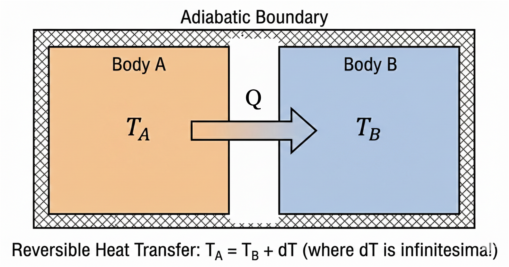
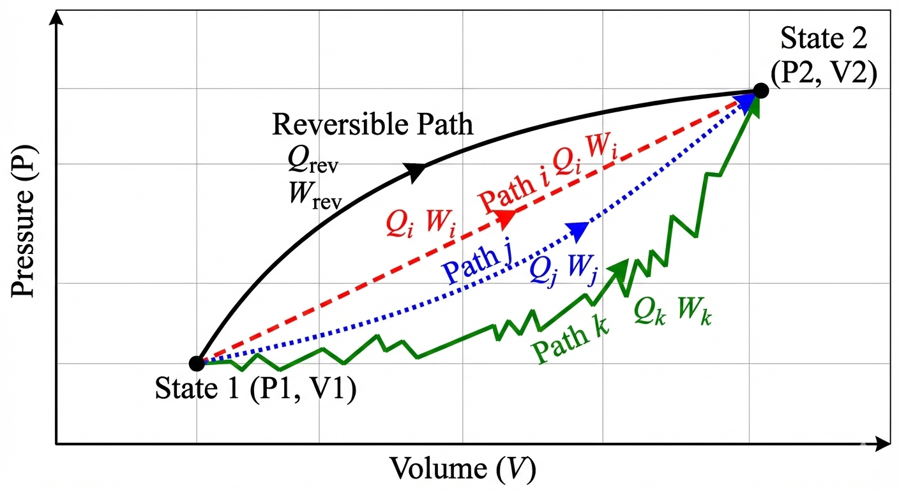

In this class, we will learn how to calculate entropy changes for closed systems undergoing various processes. We will also revisit the Second Law and clarify some common misconceptions about entropy. Finally, we will show how to calculate entropy changes for ideal gases and when there is a phase change. **Note:** This lecture focuses on closed systems. We will cover entropy changes for open systems in a future lecture.

# Review: Entropy and the Second Law

The Second Law is based on observations of natural processes and can be stated in several equivalent ways. One common statement is:

> "In an isolated system, the total entropy can never decrease. It either increases (for real processes) or remains constant in ideal (reversible) cases."

So what is this thing called entropy? We **defined it** in terms of heat transfer and temperature. The fundamental definition of the entropy change for a closed system is:

$$dS = \frac{dQ_{rev}}{T}$$ {#eq-entropy_def}

For a general process (reversible or irreversible), we write the entropy balance as:

$$dS = \frac{dQ}{T} + dS_{gen}$$ {#eq-entropy_balance}

where:

* $T$: The absolute temperature at the boundary where heat transfer occurs.
* $S_{gen} \ge 0$: Entropy generation. It is zero for reversible processes and positive for irreversible ones.

# Heat Transfer Example: Reversible vs. Irreversible

Let's revisit the heat transfer example to clarify the role of $S_{gen}$.
Consider two bodies, A (Hot) and B (Cold), exchanging heat $Q$.

## Case 1: Reversible Heat Transfer
Imagine we transfer a small amount of heat $Q$ from A to B reversibly. Since it is done reversibly, the temperature difference between A and B is infinitesimal ($T_A \approx T_B$). That's because reversible processes have infinitesimal driving forces and occur infinitely slowly, allowing the system to remain in near-equilibrium states.

Consider the composite adiabatic system shown in @fig-AtoB-heat-rev, which includes both A and B. An amount of heat $Q$ is transferred reversibly from A to B.

{#fig-AtoB-heat-rev width=50%}

* $\Delta S_A = -Q/T$ (since A is losing heat at temperature $T$)
* $\Delta S_B = +Q/T$ (since B is gaining heat at the same temperature $T$)
* $\Delta S_{total} = \Delta S_A + \Delta S_B = 0$ (entropy is extensive, so we can add them together)
* **Result:** $S_{gen} = 0$.

Since this was a reversible process, the total entropy change of the isolated system is zero, and there is no entropy generation. This is consistent with the Second Law, which states that reversible processes do not generate entropy.

## Case 2: Irreversible Heat Transfer
Now, let $T_A > T_B$ (finite difference). This is the "practical" situation in which we have real heat transfer. Heat $Q$ flows spontaneously from A to B. This process is irreversible because it occurs across a finite temperature difference.

* System A loses $Q$ at $T_A$: $\Delta S_A = -Q/T_A$
* System B gains $Q$ at $T_B$: $\Delta S_B = +Q/T_B$
* Total entropy change:
    $$\Delta S_{total} = \frac{Q}{T_B} - \frac{Q}{T_A} = Q \left( \frac{T_A - T_B}{T_A T_B} \right)$$

Since $T_A > T_B$, the term in parentheses is positive.
Therefore, $\Delta S_{total} > 0$, which implies $S_{gen} > 0$. This is consistent with the Second Law, which states that irreversible processes generate entropy and they are "allowed" to occur.

## Case 3: Heat Transfer from Cold to Hot   
If $Q$ flows spontaneously from A to B, but $T_B > T_A$, then the total entropy change would be negative:
$$\Delta S_{total} = \frac{Q}{T_B} - \frac{Q}{T_A} = Q \left( \frac{T_A - T_B}{T_A T_B} \right) < 0$$
This would imply $S_{gen} < 0$, which violates the Second Law. Therefore, this process cannot occur spontaneously. (*But*, we will soon see that we can make this happen by doing work on the system, such as in a refrigerator or heat pump. In that case, the entropy decrease in the cold block is more than compensated by the entropy increase in the surroundings due to the work input, ensuring that the total entropy of the universe still increases. But let's not worry about that for now. We will cover it in more detail when we discuss open systems and cycles.)

The three cases described here demonstrate that the definition of entropy given in @eq-entropy_def is consistent with the observed direction of heat transfer and the Second Law. The First Law (energy conservation) alone does not dictate the direction of heat transfer; it is the Second Law (entropy generation) that determines the spontaneous direction of processes.

::: {.callout-tip}

## Crucial Concept: Local Entropy Can Decrease!
A common misconception is that "entropy always increases." This is only true for the **universe** (or an isolated system).

In our heat transfer example (Case 2):

* **The Hot Block:** Loses heat, so its entropy **decreases** ($\Delta S_{hot} < 0$). But it is *not* an isolated system!

* **The Cold Block:** Gains heat, so its entropy **increases** ($\Delta S_{cold} > 0$).

Because the cold block is at a lower temperature, the term $|Q/T_{cold}|$ is larger than $|Q/T_{hot}|$. Therefore, the gain in the cold block is **larger** than the loss in the hot block.

**Result:** The negative entropy change for Block A is allowed because the *sum* is positive:
$$\Delta S_{total} = \underbrace{\Delta S_{hot}}_{(-)} + \underbrace{\Delta S_{cold}}_{(++)} > 0$$

Engineers make use of the fact that local entropy can decrease to design processes for our benefit. For example, refrigerators and heat pumps transfer heat from cold to hot regions, which locally decreases entropy in the cold region, but the overall process still generates entropy in the surroundings, ensuring compliance with the Second Law. We will talk a lot more about this in future lectures when we discuss open systems and cycles.
:::

The simple example of heat transfer between two blocks has given us a lot of insight into the concept of entropy and the Second Law. We have seen that entropy is a state function, and that the Second Law dictates the direction of spontaneous processes. We can use the Second Law to determine the direction of any process (not just heat transfer). The motivational examples we discussed earlier (gas expanding from a tank, the mixing of gases) are examples of processes that occur spontaneously because they generate entropy. We also saw that the First Law alone cannot predict the direction of these processes, but the Second Law can. We can't violate either the First or Second Law for real processes. It would be nice to have a single mathematical relationship that combines the First and Second Laws and to relate entropy to other state variables. This is what we will do next.

# The Fundamental Property Relations

We now derive one of the most useful equations in thermodynamics, relating entropy to other state variables ($U$, $V$, $H$, $P$).

Start with the First Law for a closed system undergoing a differential change:
$$dU = dQ + dW$$

The integral form of the First Law is:
$$\Delta U = Q + W$$

Since $U$ is a state function, $\Delta U$ only depends on the values of $U$ at the initial and final states, not on the path taken. However, $Q$ and $W$ **are** path dependent. There are essentially an infinite number of combinations of $Q+W$ that can be taken to get between the initial and final states, as shown in @fig-paths. 

{#fig-paths width=50%}

Therefore, we can choose any convenient $Q$ and $W$ path to go between the initial and final states.   

We thus choose the **reversible path**.

1.  Replace work with reversible work: $dW_{rev} = -P dV$

2.  Replace heat with reversible heat (from definition of $S$): $dQ_{rev} = T dS$

   
This results in the **Fundamental Relation of Thermodynamics** for a closed system:

$$dU = dQ + dW = dQ_{rev} + dW_{rev} = TdS - PdV$$

::: {.callout-important}
## The Fundamental Relation
$$dU = TdS - PdV$$

Rearranging to solve for $dS$:
$$dS = \frac{dU}{T} + \frac{P}{T} dV$$

We just combined the First and Second Laws into a single mathematical relationship! This is an important result. It relates the change in entropy to changes in internal energy and volume, which are state variables. This equation is valid for any process (reversible or irreversible) that connects equilibrium states, even though we assumed reversibility to derive it.

:::

## Relation to Enthalpy ($H$)
We can derive a similar expression for enthalpy ($H = U + PV$).
Differentiating $H$:
$$dH = dU + PdV + VdP$$
Substitute $dU = TdS - PdV$:
$$dH = (TdS - PdV) + PdV + VdP$$
$$dH = TdS + VdP$$ {#eq-dH}

Rearranging for $dS$:
$$dS = \frac{dH}{T} - \frac{V}{T} dP$$

@eq-dH is another fundamental relation that relates changes in enthalpy to changes in entropy and pressure. It also combines the First and Second Laws, but in terms of $H$ instead of $U$.

**Key Insight:** 
Since $S$, $U$, $H$, $P$, $V$, and $T$ are all **state functions**, these equations 
$$dU = TdS - PdV$$
and 
$$dH = TdS + VdP$$
are valid for **ANY** process (reversible or irreversible) that connects equilibrium states, even though we assumed reversibility to derive them.

# Calculating Entropy Changes

Because $S$ is a state function, we can calculate $\Delta S$ using any convenient path, regardless of the actual process.

## Constant Pressure Process (Liquids & Solids)
From $dH = TdS + VdP$, at constant pressure ($dP=0$):
$$dH = TdS \implies dS = \frac{dH}{T}$$
Since $dH = C_p dT$ (for ideal gases or general substances at constant P without a phase change):
$$dS = \frac{C_p}{T} dT$$
Integrating from state 1 to 2:
$$\Delta S = \int_{T_1}^{T_2} \frac{C_p}{T} dT$$

If $C_p$ is constant:
$$\Delta S = C_p \ln\left(\frac{T_2}{T_1}\right)$$

## Constant Volume Process
From $dU = TdS - PdV$, at constant volume ($dV=0$):
$$dU = TdS \implies dS = \frac{dU}{T}$$
Since $dU = C_v dT$ (for ideal gases or general substances at constant V without a phase change):
$$dS = \frac{C_v}{T} dT$$
Integrating from state 1 to 2:
$$\Delta S = \int_{T_1}^{T_2} \frac{C_v}{T} dT$$

If $C_v$ is constant:
$$\Delta S = C_v \ln\left(\frac{T_2}{T_1}\right)$$

## Ideal Gases (Change in T, P, and $\underline{V}$)
For an ideal gas, $P = RT/\underline{V}$ and $\underline{V} = RT/P$. We can substitute these into the fundamental relations to get general expressions for $\Delta \underline{S}$. Note that we are using molar volume $\underline{V}$ here, which is convenient to use for ideal gases.

### In terms of T and $\underline{V}$:
Start with $d\underline{S} = \frac{d\underline{U}}{T} + \frac{P}{T} d\underline{V} = \frac{C_v}{T} dT + \frac{P}{T} d\underline{V}$.
Substitute $P/T = R/\underline{V}$:
$$d\underline{S} = \frac{C_v}{T} dT + \frac{R}{\underline{V}} d\underline{V}$$
Integrate (assuming constant $C_v$):
$$\Delta \underline{S} = C_v \ln\left(\frac{T_2}{T_1}\right) + R \ln\left(\frac{\underline{V}_2}{\underline{V}_1}\right)$$ {#eq-S_ideal_TV}

### In terms of T and P:
Start with $d\underline{S} = \frac{C_p}{T} dT - \frac{\underline{V}}{T} dP$.
Substitute $\underline{V}/T = R/P$:
$$d\underline{S} = \frac{C_p}{T} dT - \frac{R}{P} dP$$
Integrate (assuming constant $C_p$):
$$\Delta \underline{S} = C_p \ln\left(\frac{T_2}{T_1}\right) - R \ln\left(\frac{P_2}{P_1}\right)$$ {#eq-S_ideal_TP}

**Caution** @eq-S_ideal_TV and @eq-S_ideal_TP are only valid for ideal gases (and when heat capacity is constant). For real gases, the expressions are more complex and depend on the specific equation of state. We will cover this in more detail later. 

## 4. Phase Changes (Constant T and P)
Phase changes (melting, boiling) occur at constant temperature and pressure.
Since $P$ is constant, $dQ_{rev} = dH$.
Since $T$ is constant, we can pull it out of the integral:
$$\Delta S_{phase} = \int \frac{dQ_{rev}}{T} = \frac{1}{T} \int dQ_{rev} = \frac{\Delta H_{phase}}{T}$$

For example, the entropy change of vaporization is:
$$\Delta S_{vap} = \frac{\Delta H_{vap}}{T_{sat}}$$

# Example: Entropy of Condensing Ethanol

**Problem:** Calculate the entropy change of the universe when 1 mole of ethanol vapor at $78^\circ$C and 1 atm condenses to liquid at the same conditions.
Given: $\Delta H_{vap} = 38.56$ kJ/mol at $78^\circ$C ($351.15$ K).

**System:** Ethanol

**Surroundings:** The environment that absorbs the heat released by the condensing ethanol.

**1. Entropy Change of System (Ethanol):**
Condensation is the reverse of vaporization, so $\Delta H_{cond} = -\Delta H_{vap}$.
$$\Delta S_{sys} = \frac{\Delta H_{cond}}{T_{sat}} = \frac{-38,560 \text{ J/mol}}{351.15 \text{ K}} = -109.8 \text{ J/mol}\cdot\text{K}$$
The entropy decreases because heat left the ethanol during condensation. That is allowed, because the surroundings will absorb the heat from the ethanol and increase its entropy. Let's calculate how much the surroundings' entropy increases.

**2. Entropy Change of Surroundings:**
The heat released by the ethanol ($Q_{out} = 38.56$ kJ) is absorbed by the surroundings. 

We would need to know the temperature of the surroundings to calculate $\Delta S_{surr}$.

***Reversible Case:***
Assuming the surroundings are a large reservoir at exactly the same temperature as the condensing ethanol ($78^\circ$C), then the process is reversible and we can use the same temperature for the surroundings. Note that we use *absolute temperature* in the calculations:
$$\Delta S_{surr} = \frac{Q_{surr}}{T_{surr}} = \frac{+38,560 \text{ J/mol}}{351.15 \text{ K}} = +109.8 \text{ J/mol}\cdot\text{K}$$

The total entropy change is the sum of the system and surroundings:
$$\Delta S_{total} = \Delta S_{sys} + \Delta S_{surr} = -109.8 + 109.8 = 0$$

As expected for a reversible process, the total entropy change of the universe is zero. However, to make a real process, the ethanol needs to be in contact with a colder medium (e.g. cooling water) to condense. In that case, the surroundings would be at a lower temperature than the ethanol, and the entropy change of the surroundings would be larger than $+109.8$ J/mol·K, resulting in $\Delta S_{total} > 0$ for the real process.

For example, let's assume the surroundings are at room temperature ($25^\circ$C or $298.15$ K). The surroundings are so large that the temperature does not change when heat from the ethanol is absorbed. Then:
$$\Delta S_{surr} = \frac{+38,560 \text{ J/mol}}{298.15 \text{ K}} = +129.3 \text{ J/mol}\cdot\text{K}$$

In this case, $\Delta S_{total} = \Delta S_{sys} + \Delta S_{surr} = -109.8 + 129.3 = +19.5$ J/mol·K. The entropy of the universe increases, because the finite temperature difference between the ethanol and the surroundings creates an irreversible process. 

::: {.callout-note}

You should note that the larger the difference in temperature between the ethanol and the surroundings, the larger the entropy generation and the more irreversible the process. In the limit as the surroundings' temperature approaches that of the ethanol, the process becomes reversible and $\Delta S_{total} \to 0$ but the process takes forever to occur. As the surroundings' temperature becomes much lower than that of the ethanol, the process becomes more and more irreversible and $\Delta S_{total}$ becomes larger and larger, but heat will transfer faster. We will see that the more entropy that is generated (the more irreversible the process is), the less "energy efficient" the process becomes. This is a common tradeoff in engineering design: we can make processes more reversible (and thus more efficient) by reducing the driving forces (e.g. temperature differences), but this also reduces the rate at which the process occurs. Speed costs money in engineering, so we often have to find a balance between efficiency and speed. We will talk more about this in future lectures when we discuss open systems and cycles.

:::

