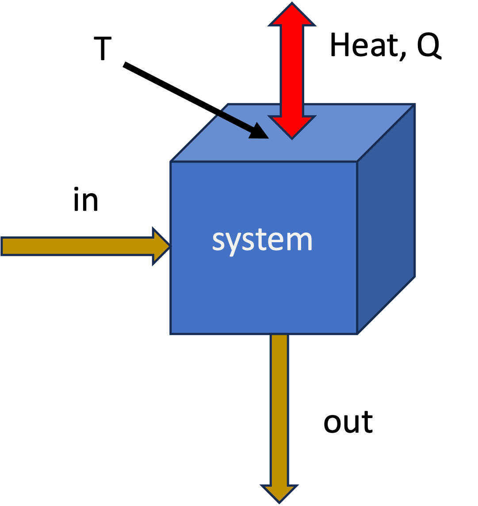

# Another example, closed system entropy balance - Quenching a Workpiece

Before discussing open systems, let's apply the entropy balance to a closed system example. A hot steel part is quenched in an oil bath. The system is the steel part and the oil together (a composite system). We will calculate the total entropy change for this process.

A $5 \text{ kg}$ steel part at $600^\circ\text{C}$ is thrown into a $100 \text{ kg}$ oil bath at $20^\circ\text{C}$. The tank is insulated. Calculate the total entropy change.

* $C_{steel} \approx 0.5 \text{ kJ/kg K}$
* $C_{oil} \approx 2.5 \text{ kJ/kg K}$

## Step 1: Find Final Temperature
Energy balance on the **composite system** (closed, adiabatic, no work):
$$\Delta U_{steel} + \Delta U_{oil} = 0$$
$$m_s C_s (T_f - T_{s,i}) + m_o C_o (T_f - T_{o,i}) = 0$$

$$5(0.5)(T_f - 600) + 100(2.5)(T_f - 20) = 0$$
*(Note: We can use Celsius for $\Delta T$ in energy balances, but NOT for entropy changes when we use logs. When in doubt, however, you can never go wrong using absolute temperatures in Kelvin)*

Solving for $T_f$:
$$2.5(T_f - 600) + 250(T_f - 20) = 0$$
$$252.5 T_f = 1500 + 5000$$
$$T_f \approx 25.7^\circ\text{C}$$

## Step 2: Entropy Change
We must treat the steel and oil as separate sub-systems changing state.

* $T_{s,i} = 873 \text{ K}$

* $T_{o,i} = 293 \text{ K}$

* $T_f = 298.8 \text{ K}$

**Steel (Cooling):**
Use the constant pressure formula for solids (and since $C_s$ is given per kg, we can treat it as constant):
$$\Delta S_{steel} = m_s C_s \ln\left(\frac{T_f}{T_{s,i}}\right) = 5(0.5) \ln\left(\frac{298.8}{873}\right) = -2.68 \text{ kJ/K}$$

**Oil (Heating):**
Similarly, for the oil (constant $C_o$ and volume/pressure):
$$\Delta S_{oil} = m_o C_o \ln\left(\frac{T_f}{T_{o,i}}\right) = 100(2.5) \ln\left(\frac{298.8}{293}\right) = +4.90 \text{ kJ/K}$$

**Total Entropy Generation:**
$$S_{gen} = \Delta S_{total} = -2.68 + 4.90 = +2.22 \text{ kJ/K}$$

The process is highly irreversible. The large temperature difference drives the heat transfer, generating significant entropy.

::: {.callout-tip icon=false}
## Interactive Example
I have prepared an interactive Jupyter Notebook that solves the problem above, and also shows how the entropy of the workpiece, oil, and universe changes as a function of oil mass. 

::: {.content-visible when-format="html"}

[**View Interactive Notebook (.ipynb)**](Quenching_entropy.ipynb)

:::

::: {.content-visible when-format="pdf"}
*Note: This example is available as an interactive Jupyter Notebook on the course website.*
:::
:::

# Introduction to Open System Entropy Balance
So far, we have developed the entropy balance for **closed systems** (fixed mass). Now we extend this to **Open Systems**, where mass flows across the system boundaries.

This allows us to analyze continuous engineering devices like turbines, compressors, heat exchangers, and throttle valves.

# The General Entropy Balance

Just like the First Law, the Second Law for an open system accounts for:

1.  Rate of change of entropy within the system.

2.  Entropy carried in/out by mass flow.

3.  Entropy transfer via heat (recall: Work does not directly transfer entropy).

4.  Entropy **Generation** (the irreversible part).

{#fig-system width=40%}

The general rate form, applied to the system shown in @fig-system is:

$$
\frac{d (M \hat{S})}{dt} = \sum_{in} \dot{m}_{in} \hat{S}_{in} - \sum_{out} \dot{m}_{out} \hat{S}_{out} + \sum_j \frac{\dot{Q}_j}{T_{j}} + \dot{S}_{gen} 
$$ {#eq-entropy-balance-open}

where

* $\dot{m}\hat{S}$: The convective transport of entropy (entropy moving with fluid).
* $\dot{Q}/T$: Entropy transfer accompanying heat transfer at boundary temperature $T$. There could be multiple heat transfer paths, hence the sum over $j$.
* $\dot{S}_{gen}$: Rate of entropy generation due to irreversibilities. $\dot{S}_{gen} \geq 0$.

With the exception of the generation term, this is similar to the First Law statement of **energy conservation**. Entropy has a generation term, however, that accounts for the fact that real processes are irreversible and generate entropy. We do not have entropy conservation in the same way that we have energy conservation.

The integrated form of @eq-entropy-balance-open for a finite time interval is:
$$\Delta S =  \sum_{in} m \hat{S}  - \sum_{out} m \hat{S} + \sum_{heat} \frac{Q}{T} + S_{gen}$$ {#eq-entropy-balance-open-integrated}

where $m$ represents the mass that flowed in or out during the process. Indices have been dropped for simplicity.

## Special Case: Steady-State
For steady-state processes (most continuous operations), no properties change with time inside the system so we have 

$\frac{d (M \hat{S})}{dt} = 0$
or 
$\Delta S = 0$.

Time-dependent form
$$
0 = \sum_{in} \dot{m}_{in} \hat{S}_{in} - \sum_{out} \dot{m}_{out} \hat{S}_{out} + \sum_j \frac{\dot{Q}_j}{T_{j}} + \dot{S}_{gen}
$$

Integrated form
$$
0 = \sum_{in} m_{in} \hat{S}_{in} - \sum_{out} m_{out} \hat{S}_{out} + \sum_j \frac{Q_j}{T_{j}} + S_{gen}
$$

Rearranging to solve for generation:

$$
\dot{S}_{gen} = \sum_{out} \dot{m}_{out} \hat{S}_{out} - \sum_{in} \dot{m}_{in} \hat{S}_{in} - \sum_j \frac{\dot{Q}_j}{T_{j}} \geq 0
$$

or 

$$
{S}_{gen} = \sum_{out} m_{out} \hat{S}_{out} - \sum_{in} m_{in} \hat{S}_{in} - \sum_j \frac{Q_j}{T_{j}} \geq 0
$$

::: {.callout-tip}
## Single-Inlet, Single-Outlet (SISO)
For a device with one inlet and one outlet (like a pump or compressor) at steady state:
$$\dot{S}_{gen} = \dot{m}(\hat{S}_{out} - \hat{S}_{in}) - \frac{\dot{Q}}{T}$$
:::

# Example 1: Non-Reversible Compressor

Consider a steady-state air compressor.

* **Fluid:** Air (ideal gas, diatomic, $C_P \approx \frac{7}{2}R$).

* **System:** The compressor itself (the control volume includes the blades, casing, etc.).
  
* **Inlet (1):** $1 \text{ bar}, 290 \text{ K}$.

* **Outlet (2):** $10 \text{ bar}, 600 \text{ K}$.

* **Heat Transfer:** The compressor is adiabatic ($\dot{Q} = 0$).

* **Mass Flow:** $\dot{m} = 1 \text{ mol/s}$ (molar basis).

**Goal:** Calculate the work required and the entropy generation.

## Step 1: First Law (Energy Balance)
Open system energy balance, steady-state, adiabatic, KE and PE negligible:

$$ 0 = \dot{m} (\hat{H}_{in} - \hat{H}_{out}) + \dot{W}_s$$
or
$$\Delta \dot{H} = \dot{W}_s$$

$$\dot{W}_s = \dot{m} (\hat{H}_{out} - \hat{H}_{in}) = \dot{m} C_P (T_2 - T_1)$$

$$\dot{W}_s = (1 \frac{\text{mol}}{\text{s}}) (29.1 \frac{\text{J}}{\text{mol K}}) (600 - 290 \text{ K})$$
$$\dot{W}_s = +9,021 \text{ Watts}$$

## Step 2: Second Law (Entropy Generation)
$$\dot{S}_{gen} = \dot{m}(\hat{S}_{2} - \hat{S}_{1}) - \frac{\dot{Q}}{T}$$
Since $\dot{Q}=0$:
$$\dot{S}_{gen} = \dot{m} \Delta \hat{S}$$

For an ideal gas:
$$\Delta \hat{S} = C_P \ln\left(\frac{T_2}{T_1}\right) - R \ln\left(\frac{P_2}{P_1}\right)$$ {#eq-S_ideal_TP}

Plugging in values ($R = 8.314$ J/mol K):

1.  **Temperature Term:** $29.1 \ln(600/290) = 29.1 (0.727) = 21.16 \text{ J/mol K}$. **Note the use of absolute temperature (K) in the log term!**

2.  **Pressure Term:** $8.314 \ln(10/1) = 8.314 (2.302) = 19.14 \text{ J/mol K}$

$$\dot{S}_{gen} = 1 \cdot (21.16 - 19.14) = +2.02 \frac{\text{J}}{\text{K}\cdot\text{s}}$$

Since $\dot{S}_{gen} > 0$, this process is **Irreversible** and possible.

## Isentropic Efficiency
We can compare the *actual* work to the *ideal* (reversible) work. We call this the isentropic efficiency of the compressor:
$$\eta_{comp} = \frac{\dot{W}_{ideal}}{\dot{W}_{actual}}$$
This will be less than 1 for a real compressor due to irreversibilities. It is often given as a percentage and is somewhere between 70-90% for typical compressors.

If the process were reversible ($\Delta S = 0$), the outlet temperature $T_{2}^\prime$ would be (from @eq-S_ideal_TP with $\Delta S = 0$):
$$T_{2}^\prime = T_1 \left(\frac{P_2}{P_1}\right)^{R/C_P} = 290 (10)^{2/7} \approx 560 \text{ K}$$

The actual compressor heats the gas to $600 \text{ K}$, requiring more work than the ideal case ($560 \text{ K}$). The irreversibility shows up as a higher outlet temperature and more work input.

