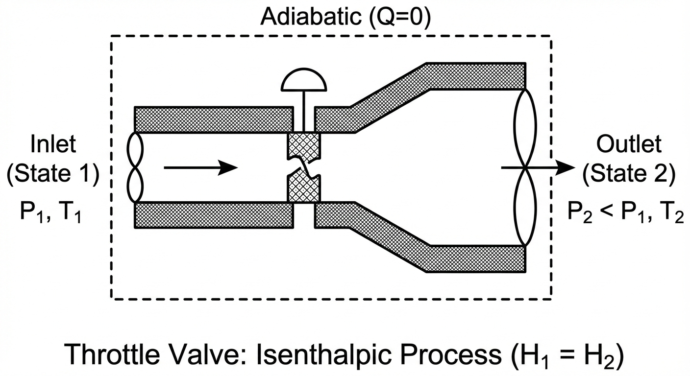

Last class, we applied the open system entropy balance to a compressor with given inlet and exit conditions. We found that the actual exit temperature was higher than the ideal (isentropic) case, and we calculated the power requirement for the compressor along with the entropy generation. Now, we show how to compute the outlet conditions for a compressor with a given isentropic efficiency. We also apply the  entropy balance to a few other examples, including quenching a hot workpiece (a closed composite system) and the Joule-Thomson expansion of steam through a valve.

# Example: Adiabatic Compressor with Isentropic Efficiency

**Problem Statement:**
Air enters an adiabatic compressor at $T_1 = 20^\circ\text{C}$ and $P_1 = 1 \text{ bar}$. It is compressed to a final pressure of $P_2 = 5 \text{ bar}$. The compressor has an isentropic efficiency of $\eta_{comp} = 80\%$. The volumetric flow rate at the inlet is $\dot{V}_1 = 1 \text{ m}^3/\text{s}$.
Assume air is an ideal gas with $C_P = \frac{7}{2}R$.

**Goal:** Determine the actual outlet temperature $T_2$ and the required power $\dot{W}_s$.

## Step 1: Determine the Isentropic Outlet Temperature ($T_{2}^\prime$)
First, we analyze the "ideal" (reversible, adiabatic) case. For an ideal gas undergoing an isentropic process ($\Delta S = 0$), the temperature and pressure are related by:

$$\frac{T_{2}^\prime}{T_1} = \left( \frac{P_2}{P_1} \right)^{R/C_P}$$

Given:

* $T_1 = 20^\circ\text{C} = 293.15 \text{ K}$

* $P_1 = 1 \text{ bar}, P_2 = 5 \text{ bar}$

* $C_P = 3.5 R \implies \frac{R}{C_P} = \frac{1}{3.5} \approx 0.2857$

$$T_{2}^\prime = 293.15 \text{ K} \left( \frac{5}{1} \right)^{0.2857}$$
$$T_{2}^\prime = 293.15 (1.5838) = 464.3 \text{ K}$$

## Step 2: Apply Isentropic Efficiency to find Actual $T_2$
The isentropic efficiency for a compressor compares the ideal work to the actual work. Since the compressor is adiabatic ($Q=0$), work is simply the change in enthalpy. For an ideal gas ($dH = C_P dT$):

$$\eta_{comp} = \frac{\dot{W}_{ideal}}{\dot{W}_{actual}} = \frac{H_{2}^\prime - H_1}{H_2 - H_1} = \frac{C_P(T_{2}^\prime - T_1)}{C_P(T_2 - T_1)}$$

$$\eta_{comp} = \frac{T_{2}^\prime - T_1}{T_2 - T_1}$$

Rearranging to solve for the actual outlet temperature $T_2$:

$$T_2 - T_1 = \frac{T_{2}^\prime - T_1}{\eta_{comp}}$$
$$T_2 = T_1 + \frac{T_{2}^\prime - T_1}{0.80}$$

Substituting values:
$$T_2 = 293.15 + \frac{464.3 - 293.15}{0.80}$$
$$T_2 = 293.15 + \frac{171.15}{0.80}$$
$$T_2 = 293.15 + 213.9 = \mathbf{507.1 \text{ K}} \quad (233.9^\circ\text{C})$$

::: {.callout-note}
## Reality Check
Notice that $T_{actual} (507.1 \text{ K}) > T_{isentropic} (464.3 \text{ K})$. This is always true for a compressor. Irreversibilities (friction, turbulence) generate entropy, which manifests as additional heating of the gas, requiring more work input to achieve the same pressure ratio.
:::

## Step 3: Calculate Power Requirement 
To find the power, we first need the molar flow rate from the Ideal Gas Law at the inlet:

$$\dot{n} = \frac{P_1 \dot{V}_1}{R T_1} = \frac{(10^5 \text{ Pa})(1 \text{ m}^3/\text{s})}{(8.314 \text{ J/mol K})(293.15 \text{ K})} = 41.03 \text{ mol/s}$$

Now, calculate the actual work (power):
$$\dot{W}_{actual} = \dot{n} C_P (T_2 - T_1)$$
$$C_P = 3.5(8.314) = 29.1 \text{ J/mol K}$$

$$\dot{W}_{actual} = (41.03 \text{ mol/s})(29.1 \text{ J/mol K})(507.1 - 293.15 \text{ K})$$
$$\dot{W}_{actual} = 41.03 \cdot 29.1 \cdot 213.95 \approx 255,400 \text{ W}$$

**Required Power:** $\mathbf{255.4 \text{ kW}}$

# Example: The Joule-Thomson Expansion

{#fig-JT-valve width=40%}

Consider a fluid flowing through a throttling valve. The pipe is insulated.

* $\dot{Q} = 0$

* $\dot{W}_s = 0$

* $\Delta KE \approx 0, \Delta PE \approx 0$

## Energy Balance
$$\dot{m} (\hat{H}_{in} ) = \dot{m} (\hat{H}_{out})$$
$$\hat{H}_{in} = \hat{H}_{out}$$

The process is **Isenthalpic** (constant enthalpy).

## Does Temperature Change?

### Case A: Ideal Gas
For an ideal gas, enthalpy depends only on temperature ($H = H(T)$).
Therefore, if $\hat{H}_{in} = \hat{H}_{out}$, then:
$$T_{in} = T_{out}$$
An ideal gas throttling process results in **no temperature change**.

**Entropy Analysis of Throttling - Ideal Gas**
Finally, we can do an entropy analysis of throttling. Since the process is adiabatic and has no work, the only way to satisfy the Second Law is if entropy increases due to irreversibility.
$$\Delta S = S_{out} - S_{in}$$
Even if $T$ is constant (ideal gas):
$$\Delta S = -R \ln\left(\frac{P_{out}}{P_{in}}\right)$$
Since flow is always from High $P$ to Low $P$ ($P_{out} < P_{in}$), the term $\ln(P_{out}/P_{in})$ is negative.
Therefore, $\Delta S > 0$.

The process is irreversible, and entropy is generated due to the sudden expansion and associated turbulence and friction in the valve.

### Case B: Real Gas
For real substances, $\hat{H}$ depends on both $T$ and $P$.
We define the **Joule-Thomson Coefficient**:
$$\mu_{JT} = \left( \frac{\partial T}{\partial P} \right)_H$$

* If $\mu_{JT} > 0$: As pressure drops ($dP < 0$), temperature drops ($dT < 0$). 

* If $\mu_{JT} < 0$: As Pressure drops, temperature rises. 

* When $\mu_{JT} = 0$: No temperature change (we call this the inversion point).
  
Depending on conditions, real fluids can either cool or heat upon expansion through a valve. For many gases at room temperature, $\mu_{JT} > 0$ and they cool upon expansion (e.g., nitrogen, oxygen). A good refrigerant will show a large temperature change upon throttling (i.e., large $\mu_{JT}$). For some gases (e.g., helium, hydrogen), $\mu_{JT} < 0$ at room temperature, so they heat up when throttled. This is related to whether the substance is dominated by attractive or repulsive intermolecular forces at the given conditions.

We would need an equation of state or property tables to determine the actual temperature change for a real gas undergoing throttling. Here is how you would do it for steam, which is a common working fluid in power plants and often undergoes throttling in turbines and valves.

### Case C: Steam

**Problem Statement:**
Steam flows through an insulated throttle valve.

* **Inlet (State 1):** $P_1 = 400 \text{ bar}$, $T_1 = 500^\circ\text{C}$.

* **Outlet (State 2):** $P_2 = 1 \text{ bar}$.

* **Flow Rate:** $\dot{m} = 1 \text{ kg/s}$.

**Goal:** Determine the final temperature $T_2$.

**Step 1: Energy Balance**
We know for a throttling process:
$$\Delta \hat{H} = 0 \implies \hat{H}_1 = \hat{H}_2$$

**Step 2: Determine Inlet Enthalpy ($\hat{H}_1$)**
From the steam tables (superheated steam) at $P_1 = 400 \text{ bar}$ and $T_1 = 500^\circ\text{C}$:

$$\hat{H}_1 = 2906.5 \text{ kJ/kg}$$

*(Note: Values may vary slightly depending on the specific steam table used).*

**Step 3: Determine Outlet Temperature ($T_2$)**
We know two properties at the outlet:

1.  **Pressure:** $P_2 = 1 \text{ bar}$.

2.  **Enthalpy:** $\hat{H}_2 = \hat{H}_1 = 2906.5 \text{ kJ/kg}$.

Go to the steam tables for $P = 1 \text{ bar}$ ($T_{sat} \approx 99.6^\circ\text{C}$).
Comparing $\hat{H}_2$ to saturation values:

* $\hat{H}_{liq} \approx 417 \text{ kJ/kg}$

* $\hat{H}_{vap} \approx 2675 \text{ kJ/kg}$

Since $\hat{H}_2 > \hat{H}_{vap}$, the outlet state is **superheated vapor**.

Looking at the superheated steam table for $1 \text{ bar}$:

* At $T = 200^\circ\text{C}: \hat{H} = 2875.5 \text{ kJ/kg}$

* At $T = 250^\circ\text{C}: \hat{H} = 2974.5 \text{ kJ/kg}$

Our target enthalpy ($2906.5$) lies between these two temperatures. We linearly interpolate:

$$T_2 = T_{low} + (T_{high} - T_{low}) \frac{\hat{H}_2 - \hat{H}_{low}}{\hat{H}_{high} - \hat{H}_{low}}$$

$$T_2 = 200 + (250 - 200) \frac{2906.5 - 2875.5}{2974.5 - 2875.5}$$

$$T_2 = 200 + 50 \left( \frac{31.0}{99.0} \right)$$
$$T_2 = 200 + 50 (0.3131)$$
$$T_2 = 200 + 15.66$$
$$T_2 = \mathbf{215.7^\circ\text{C}}$$

There is a significant drop in temperature from $500^\circ\text{C}$ to $215.7^\circ\text{C}$ just by expanding through the valve, even though no heat was removed. This is the **Joule-Thomson effect** for a real gas where attractive intermolecular forces dominate (positive $\mu_{JT}$). Work was done *internally* to separate the molecules against these attractive forces, consuming internal energy and lowering the temperature.

We can compute the entropy generation as well. 

From the steam tables:

*   $S_1 = 5.4794 \text{ kJ/kg·K}$ (at $P_1 = 400 \text{ bar}$, $T_1 = 500^\circ\text{C}$)

*   $S_2 = 7.8979 \text{ kJ/kg·K}$ (at $P_2 = 1 \text{ bar}$, $T_2 = 215.7^\circ\text{C}$)

The entropy generation is:
$$\Delta S_{gen} = S_2 - S_1 = 7.8979 - 5.4794 = \mathbf{2.4185 \text{ kJ/kg·K}}$$

This positive entropy generation confirms that the throttling process is irreversible.