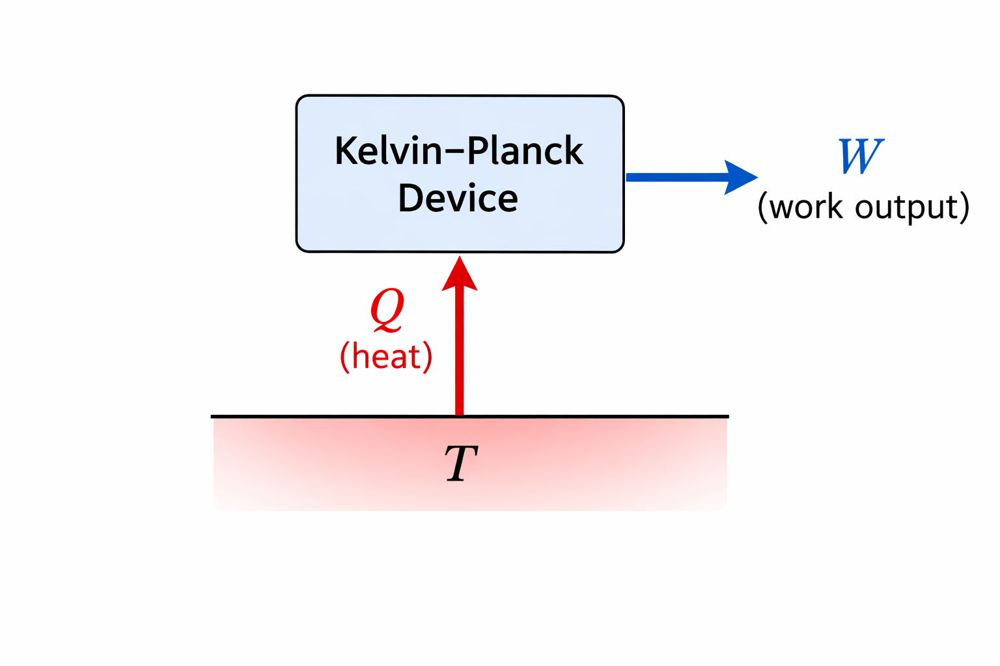
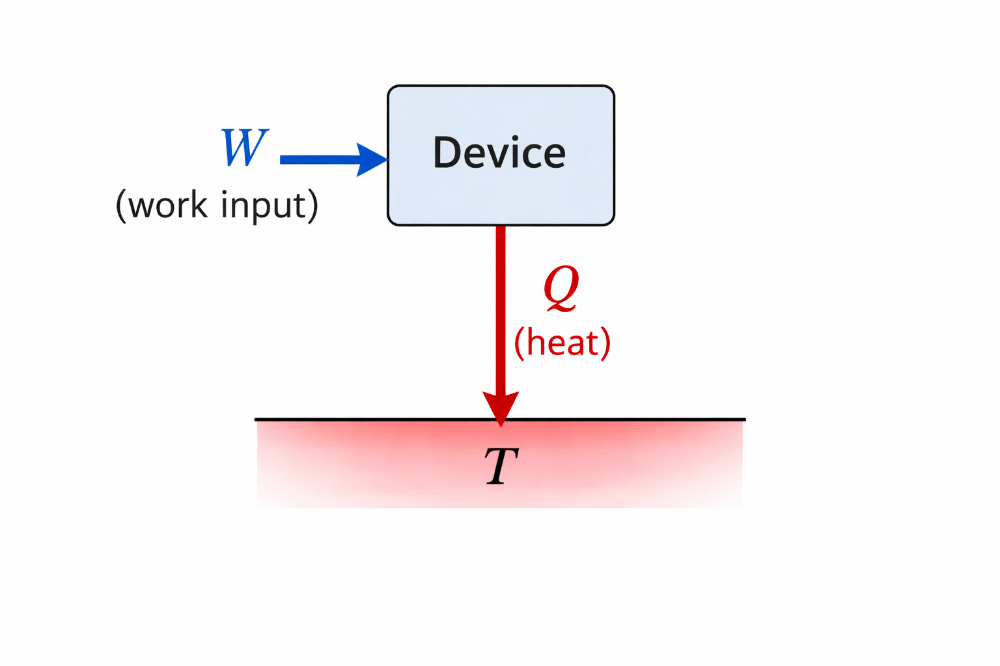
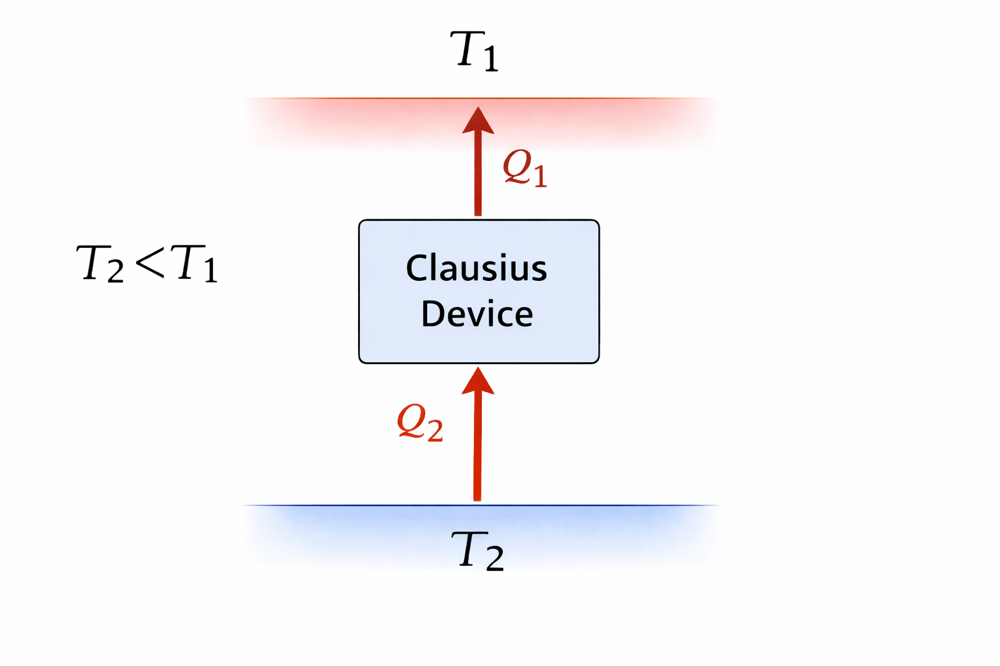
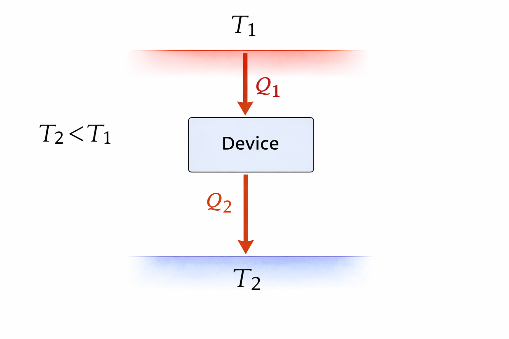
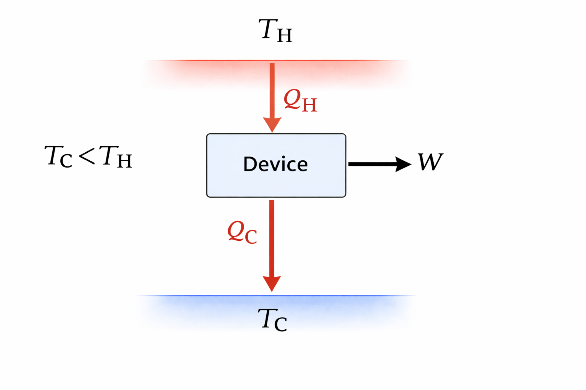

# Introduction: Heat vs. Work

So far, we have covered energy and entropy balances for various pieces of process equipment (pumps, compressors, turbines, etc.). Now we want to "put it all together" to produce **Work**.

Why focus on work?
While heat is useful (warming our homes), **work** is especially valuable because it is an organized form of energy transfer. We use it to move things (cars, planes), generate electricity, and drive chemical processes.

There is a fundamental asymmetry between heat and work:

1.  **Work $\to$ Heat:** Easy. We do this all the time via friction (rubbing hands together), electrical resistance, or Joule's paddlewheel experiment. It is 100% efficient.
2.  **Heat $\to$ Work:** Hard. We cannot simply convert 100% of heat into work.

To understand why, we will analyze abstract "devices" that attempt these conversions.

::: {.callout-note}
## IUPAC Sign Convention Reminder
Remember, in this class we use the IUPAC sign convention:

* $Q > 0$: Heat is transferred **into** the system.

* $W > 0$: Work is done **on** the system.

* Therefore, a device that *produces* work will have $W < 0$, and a device that *rejects* heat will have $Q < 0$.
:::

# The Kelvin-Planck Device

Let's imagine a steady-state device that takes in heat ($Q$) from a single thermal reservoir at temperature $T$ and converts it entirely into work ($W$). We call this a **Kelvin-Planck Device**.

{#fig-KP-device width=40%}

## Analysis
Consider this device operating in a cycle (i.e. steady state). Let's apply our balances:

**First Law:**
$$\Delta U = 0 = Q + W \implies W = -Q$$
If the device takes in heat ($Q > 0$), then $W < 0$. This means work is produced by the system. According to the First Law, this device is **possible**. Energy is conserved.

**Second Law:**
$$\Delta S = 0 = \frac{Q}{T} + S_{gen}$$
$$S_{gen} = -\frac{Q}{T}$$

Since $Q > 0$ (heat added) and absolute temperature $T > 0$, this implies:
$$S_{gen} < 0$$
**This violates the Second Law!** Entropy generation ($S_{gen}$) must be $\ge 0$.

::: {.callout-important}
## Kelvin-Planck Statement of the Second Law
It is impossible to construct a device that operates in a cycle and produces no other effect than the production of work and transfer of heat from a single body.
*(i.e., You cannot turn heat 100% into work).*
:::

## The Reverse Kelvin-Planck Device

What if we reverse the arrows? A device that takes work in and turns it entirely into heat rejected to a reservoir?

{#fig-KP-rev width=40%}

* **1st Law:** $\Delta U = 0 = Q + W \implies Q = -W$. If work is put in ($W > 0$), heat is rejected ($Q < 0$). This is **Possible** from an energy balance perspective.

* **2nd Law:** $\Delta S = 0 = \frac{Q}{T} + S_{gen} \implies S_{gen} = -\frac{Q}{T}$. Since $Q < 0$, $S_{gen} > 0$.

Since $Q < 0$, the term $-\frac{Q}{T}$ is positive, meaning $S_{gen} > 0$.
This is **Possible**. This suggests that work *can* be converted 100% to heat. An electrical resistor is a perfect example of this.

# The Clausius Device

Now consider a device that transfers heat from a cold reservoir ($T_C$) to a hot reservoir ($T_H$) without any work input.

{#fig-clausius width=40%}

In @fig-clausius, 2 is the cold (C) reservoir and 1 is the hot (H) reservoir. Heat flows from 2 to 1, which is the opposite of the natural direction of heat flow.

**First Law:** $$0 = Q_H + Q_C + W$$
Since there is no work ($W = 0$), $Q_H = -Q_C$. 
Heat is absorbed from the cold reservoir ($Q_C > 0$) and rejected to the hot reservoir ($Q_H < 0$). This is **Possible** from an energy balance perspective.

**Second Law:**
$$0 = \frac{Q_H}{T_H} + \frac{Q_C}{T_C} + S_{gen}$$
Substitute $Q_H = -Q_C$:
$$0 = -\frac{Q_C}{T_H} + \frac{Q_C}{T_C} + S_{gen}$$
$$S_{gen} = -Q_C \left( \frac{1}{T_C} - \frac{1}{T_H} \right)$$

Since $T_H > T_C$, the term $(\frac{1}{T_C} - \frac{1}{T_H})$ is **positive**. Because $Q_C > 0$, the entire right side is negative.
Therefore, $S_{gen} < 0$.
**Impossible.** Heat cannot spontaneously flow from cold to hot.

::: {.callout-important}
## Clausius Statement of the Second Law
It is impossible to construct a device that operates in a cycle and produces no other effect than the transfer of heat from a lower-temperature body to a higher-temperature body.
:::

*(Note: We can show that a Clausius device is conceptually identical to a combined Kelvin-Planck and reverse Kelvin-Planck device!) Since the KP device is not allowed, neither is a Clausius device*

## The Reverse Clausius Device
A "Reverse Clausius" device is one that allows heat to flow naturally from hot ($T_H$) to cold ($T_C$). This is a common process in nature.

{#fig-Clausius-inv width=40%}

Let's do a thermodynamic analysis anyway.
$Q_H > 0$ (heat in) and $Q_C < 0$ (heat out).
$$S_{gen} = -Q_H \left( \frac{1}{T_H} - \frac{1}{T_C} \right)$$
Since $(1/T_H - 1/T_C)$ is negative, and $Q_H > 0$, $S_{gen} > 0$.
**Possible.** Heat naturally flows from hot to cold.

# The Cyclic Heat Engine

We have established three facts:

1.  We can convert work 100% to heat (reverse KP device is possible).

2.  We cannot convert heat 100% to work ($S_{gen} < 0$).

3.  Heat naturally flows from $T_H$ to $T_C$ ($S_{gen} > 0$).

**The Engineering Idea:**
What if we take the natural flow of heat from $T_H$ to $T_C$ (which generates positive entropy) and "bleed off" some of that energy as work? 

{#fig-QH-QC-W width=40%}

Let's analyze this **Heat Engine**:

* Heat $Q_H$ enters from hot reservoir $T_H$ ($Q_H > 0$).

* Heat $Q_C$ leaves to cold reservoir $T_C$ ($Q_C < 0$).

* Work $W$ is produced ($W < 0$).

## First Law Analysis
$$0 = Q_H + Q_C + W$$
Solving for $Q_C$:
$$Q_C = -W - Q_H$$

## Second Law Analysis
$$0 = \frac{Q_H}{T_H} + \frac{Q_C}{T_C} + S_{gen}$$

Substitute the First Law expression for $Q_C$ into the Second Law:
$$0 = \frac{Q_H}{T_H} + \frac{-W - Q_H}{T_C} + S_{gen}$$

Multiply the entire equation by $T_C$:
$$0 = Q_H \frac{T_C}{T_H} - W - Q_H + T_C S_{gen}$$

## Solving for Work
Now, solve the equation for $W$:

$$W = Q_H \left( \frac{T_C}{T_H} - 1 \right) + T_C S_{gen}$$ {#eq-work-heat-engine}

Let's look closely at this **amazing result**.
Because $T_H > T_C$, the term $(\frac{T_C}{T_H} - 1)$ is negative. Since $Q_H > 0$, the first part of the right side is negative (meaning work is produced).
However, $T_C S_{gen}$ is always positive. This positive term makes $W$ *less negative*. 

1.  **The Potential:** The term $Q_H (\frac{T_C}{T_H} - 1)$ represents the *maximum possible work* produced by the laws of thermodynamics (when $S_{gen}=0$).
2.  **The Reality:** The term $T_C S_{gen}$ represents the *penalty* for irreversibility. It reduces the actual work produced compared to the ideal maximum.

# Thermal Efficiency

We define the thermal efficiency $\eta$ as:
$$\eta = \frac{\text{Benefit}}{\text{Cost}}$$

The benefit is the work produced (magnitude $-W$), and the cost is the heat put in ($Q_H$):
$$\eta = \frac{-W}{Q_H}$$

Using our derived expression for work:
$$\eta = \frac{- \left[ Q_H \left( \frac{T_C}{T_H} - 1 \right) + T_C S_{gen} \right]}{Q_H}$$
$$\eta = \left( 1 - \frac{T_C}{T_H} \right) - \frac{T_C S_{gen}}{Q_H}$$

## Maximum (Reversible) Efficiency
If the process is perfectly reversible ($S_{gen} = 0$), we get the theoretical maximum efficiency, known as the **Carnot Efficiency**:

$$\eta_{max} = 1 - \frac{T_C}{T_H}$$

To maximize efficiency, we want:

* $T_H \to \infty$ (The heat source should be as hot as possible).

* $T_C \to 0$ (Discharge heat to as cold a sink as possible).

This explains why power plants use superheated steam (high $T_H$) and cooling towers or cold lakes (low $T_C$). 

# Lost Work

Real engines always have irreversibilities (friction, heat loss, turbulence), so $S_{gen} > 0$.
The difference between the maximum (or ideal) work produced and the actual work produced is called **Lost Work**.

$$W_{lost} = (-W_{max}) - (-W_{actual})$$
$$W_{lost} = \left[ Q_H \left( 1 - \frac{T_C}{T_H} \right) \right] - \left[ Q_H \left( 1 - \frac{T_C}{T_H} \right) - T_C S_{gen} \right]$$

$$W_{lost} = T_C S_{gen}$$

This simple equation links the abstract concept of entropy generation directly to lost engineering potential. Every unit of entropy generated destroys our ability to do useful work by an amount proportional to the sink temperature $T_C$.
