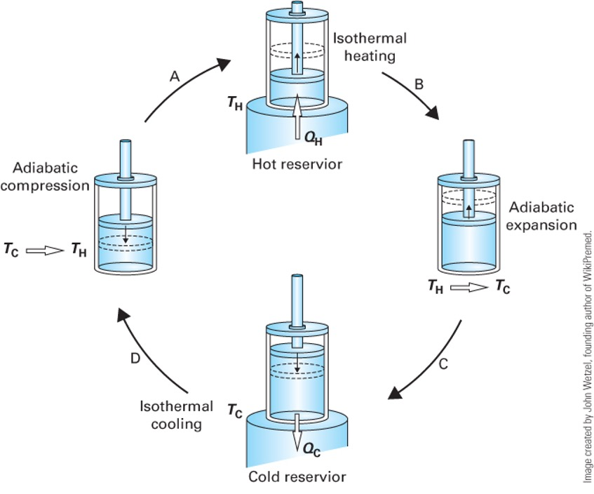
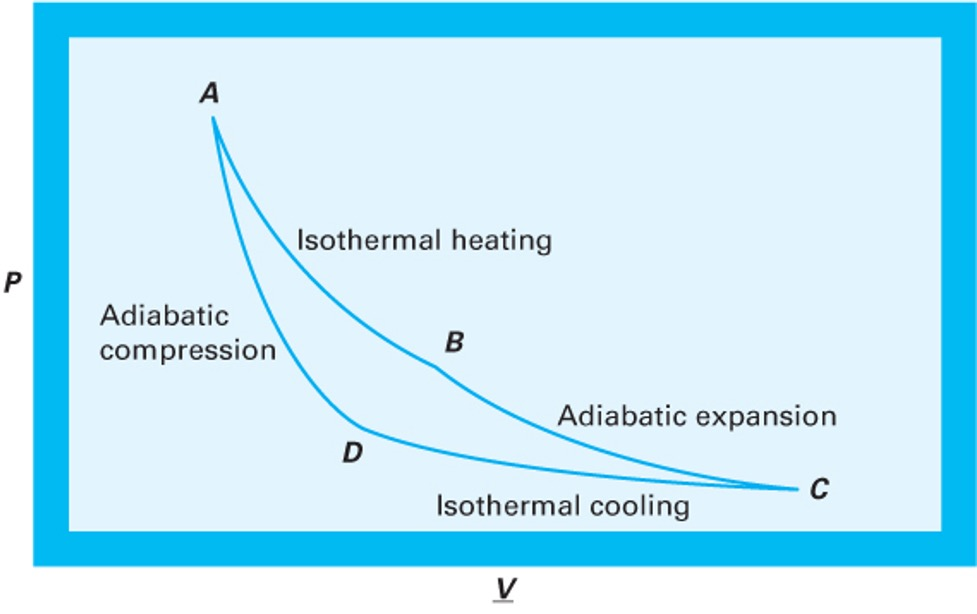
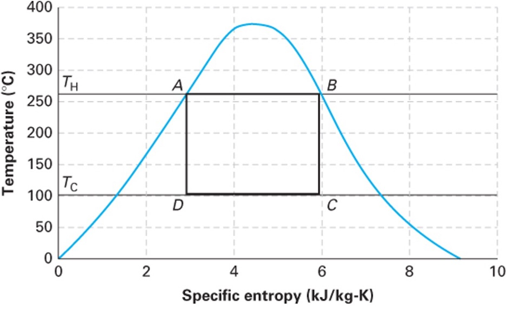

# Introduction: The Limits of Heat Engines

> "The production of heat alone is not sufficient to give birth to impelling power: it is necessary that there should also be cold; without it, the heat would be useless" 
> 
> — Sadi Carnot

In our last lecture, we used the First and Second Laws of Thermodynamics to determine that the work output of any cyclic heat engine is given by:

$$W = Q_H \left( \frac{T_C}{T_H} - 1 \right) + T_C S_{gen}$$

We defined the thermal efficiency ($\eta = \frac{-W}{Q_H}$) and found that if a process is perfectly reversible ($S_{gen} = 0$), we achieve the maximum possible efficiency:

$$\eta^{rev} = 1 - \frac{T_C}{T_H}$$

This tells us the *best* that thermodynamics will allow. But is it actually possible to build a device that achieves this? 

# The Carnot Cycle

In 1824, a French military engineer named Sadi Carnot published "Reflections on the Motive Power of Heat." He proposed a hypothetical, idealized thermodynamic cycle that achieves exactly this maximum reversible efficiency. 

The **Carnot Cycle** accomplishes this in four distinct, fully reversible steps. Let's trace these steps for a closed system containing an ideal gas. (An ideal gas is not necessary, but it makes the analysis simpler and more intuitive). See @fig-carnot.

1.  **Reversible Isothermal Expansion:** The system is placed in contact with a hot reservoir at $T_H$. As the gas expands, it absorbs heat $Q_H$ ($Q_H > 0$). The system does work on the surroundings ($W_1 < 0$).
2.  **Reversible Adiabatic Expansion:** The system is insulated ($Q = 0$). The gas continues to expand, doing more work ($W_2 < 0$), causing its temperature to drop from $T_H$ down to $T_C$.
3.  **Reversible Isothermal Compression:** The system is placed in contact with a cold reservoir at $T_C$. The surroundings do work to compress the gas ($W_3 > 0$), and heat $Q_C$ is rejected to the cold bath ($Q_C < 0$).
4.  **Reversible Adiabatic Compression:** The system is insulated again ($Q = 0$). The surroundings do more work to compress the gas ($W_4 > 0$), raising its temperature from $T_C$ back to $T_H$ to complete the cycle.

{#fig-carnot width=40%}

## P-V Representation of the Carnot Cycle

We can plot these four steps on a Pressure-Volume ($P-V$) diagram. 

{#fig-carnot-Pv width=40%}

In @fig-carnot-Pv, the net work produced ($-W_{net}$) is the area enclosed by the cycle curve ($\int P dV$).

## Mathematical Analysis of the Carnot Cycle (Ideal Gas)

To prove that this cycle achieves the maximum theoretical efficiency, let's step through the First Law energy balances for each of the four steps, assuming a closed system containing 1 mole of an ideal gas. 

Recall for an ideal gas:

* Internal energy only depends on temperature: $dU = C_v dT$

* Isothermal processes have $\Delta U = 0$

* Reversible work is $W = -\int P dV$

Let's label the four corners of the cycle (@fig-carnot-Pv) on the $P-V$ diagram as States A, B, C, and D. Note we use molar quantities here, so $V$ is the molar volume (no underline for simplicity). The ideal gas law applies at each state: $P V = R T$.

### Step 1: State A $\to$ B (Reversible Isothermal Expansion at $T_H$)
The gas expands isothermally at the hot temperature $T_H$. 

* **Internal Energy:** Since $\Delta T = 0$, $\Delta U_{AB} = 0$.

* **Work:** $$W_{AB} = -\int_{V_A}^{V_B} P dV = -\int_{V_A}^{V_B} \frac{R T_H}{V} dV = -R T_H \ln \left( \frac{V_B}{V_A} \right)$$
  Using Boyle's Law ($P_A V_A = P_B V_B$), we can substitute pressures for volumes: $\frac{V_B}{V_A} = \frac{P_A}{P_B}$.
  $$W_{AB} = -R T_H \ln \left( \frac{P_A}{P_B} \right) = R T_H \ln \left( \frac{P_B}{P_A} \right)$$

  *(Since $P_B < P_A$ during expansion, $W_{AB}$ is negative, meaning the system does work).*

* **Heat:** From the First Law ($\Delta U = Q + W = 0$), we get $Q_H = -W_{AB}$:
  $$Q_H = R T_H \ln \left( \frac{P_A}{P_B} \right)$$

  *(This value is positive, confirming heat enters the system).*

### Step 2: State B $\to$ C (Reversible Adiabatic Expansion)
The gas continues to expand, but now it is insulated, and the temperature drops from $T_H$ to $T_C$.

* **Heat:** $Q_{BC} = 0$ (Adiabatic).

* **Work & Internal Energy:** $$\Delta U_{BC} = W_{BC} = \int_{T_H}^{T_C} C_v dT = C_v(T_C - T_H)$$

  *(Since $T_C < T_H$, $W_{BC}$ is negative), confirming the system continues to do work on the surroundings.*

### Step 3: State C $\to$ D (Reversible Isothermal Compression at $T_C$)
The gas is compressed isothermally at the cold temperature $T_C$, rejecting heat.

* **Internal Energy:** Since $\Delta T = 0$, $\Delta U_{CD} = 0$.

* **Work:** Similar to Step 1:
  $$W_{CD} = -R T_C \ln \left( \frac{V_D}{V_C} \right) = R T_C \ln \left( \frac{P_D}{P_C} \right)$$

  *(Since $P_D > P_C$ during compression, $W_{CD}$ is positive, meaning work is done on the system).*

* **Heat:** $Q_C = -W_{CD}$:
  $$Q_C = R T_C \ln \left( \frac{P_C}{P_D} \right)$$

  *(This value is negative, confirming heat leaves the system).*

### Step 4: State D $\to$ A (Reversible Adiabatic Compression)
The gas is compressed further while insulated, returning its temperature from $T_C$ back to $T_H$.

* **Heat:** $Q_{DA} = 0$ (Adiabatic).

* **Work & Internal Energy:** $$\Delta U_{DA} = W_{DA} = \int_{T_C}^{T_H} C_v dT = C_v(T_H - T_C)$$

  *(Since $T_H > T_C$, $W_{DA}$ is positive).*

### Net Work and Cycle Efficiency
Let's look at the net work of the entire cycle:
$$W_{net} = W_{AB} + W_{BC} + W_{CD} + W_{DA}$$

Notice that the adiabatic work terms perfectly cancel each other out: 
$W_{BC} + W_{DA} = C_v(T_C - T_H) + C_v(T_H - T_C) = 0$.

Thus, the net work depends only on the isothermal steps:
$$W_{net} = R T_H \ln \left( \frac{P_B}{P_A} \right) + R T_C \ln \left( \frac{P_D}{P_C} \right)$$

We can relate this to the ideal efficiency in several ways. One way is to recognize that the constant temperature work terms are
$Q_H = -W_{AB}$ and $Q_C = -W_{CD}$, so 

$$W_{net} = Q_H + Q_C$$ {#eq-work-net}

Then, the thermal efficiency is:
$$\eta = \frac{-W_{net}}{Q_H} = \frac{Q_H + Q_C}{Q_H} = 1 + \frac{Q_C}{Q_H}$$

The steady-state entropy balance for the cycle is:
$$0 = \frac{Q_H}{T_H} + \frac{Q_C}{T_C}$$
Rearranging gives:
$$\frac{Q_C}{Q_H} = -\frac{T_C}{T_H}$$
Substituting this into the efficiency equation:
$$\eta = 1 + \frac{Q_C}{Q_H} = 1 + \left( -\frac{T_C}{T_H} \right) = 1 - \frac{T_C}{T_H}$$

This is the maximum theoretical efficiency, confirming that the Carnot cycle achieves the ideal limit set by the Second Law of Thermodynamics.

## T-S Representation of the Carnot Cycle

We can also plot the Carnot cycle on a Temperature-Entropy ($T-S$) diagram.

{#fig-carnot-Ts width=40%}

The $T-S$ diagram for a Carnot cycle is beautifully simple: a perfect rectangle. 

* Steps 1 and 3 are horizontal lines (constant $T$). 

* Steps 2 and 4 are vertical lines (reversible + adiabatic = isentropic, $\Delta S = 0$).

* The area inside the rectangle represents the net heat added ($Q_H + Q_C$), which by the First Law equals the net work produced (magnitude $-W_{net}$).

## Why don't we use the Carnot Cycle?

If the Carnot cycle gives the maximum efficiency, why don't our real power plants use it?
It is entirely impractical for large-scale power generation:

1.  **Isothermal heat transfer is incredibly slow.** To transfer heat without a temperature gradient requires essentially infinite time or infinitely large heat exchangers.

2.  **Hardware limitations.** Achieving the Carnot cycle with a boiling/condensing fluid (like steam) would require compressing a two-phase liquid-vapor mixture, which severely damages compressors. 

The Carnot cycle is an *idealization*—a theoretical ceiling, not a practical blueprint.

# Designing a Practical Heat Engine

Let's design a practical heat engine from scratch, applying engineering logic. 

## Attempt 1: The Open-Loop Steam Turbine
We know turbines are great at extracting work from expanding high-pressure gas. So, let's heat water in a boiler to make high-pressure steam, run it through a turbine to generate work, and vent the exhaust to the atmosphere.

**The Problem:** We are constantly losing our working fluid! Boilers require highly purified, treated water so they don't scale. Purifying millions of gallons of water a day just to vent it as steam is prohibitively expensive. It is also a huge waste of water. We *must* recover the fluid.

## Attempt 2: Closing the Loop with a Compressor
To close the loop, we need to take the low-pressure steam exiting the turbine and push it back into the high-pressure boiler. Can we just use a gas compressor?

Recall from our open-system mechanical energy balance for reversible flow:
$$W \approx \int \hat{V} dP$$

The work required to change the pressure of a fluid scales directly with its specific volume ($\hat{V}$). Low-pressure steam is a vapor with a *huge* specific volume. The work required by the compressor ($W_{comp} > 0$) would be massive—so large that it would consume almost all the work produced by the turbine ($W_{turb} < 0$). 
We would generate basically zero net power!

## Attempt 3: The Rankine Cycle (Condensing)
How do we shrink the specific volume ($\hat{V}$) of the fluid before we pump it back to the boiler? **We condense it** by removing heat from it.

Liquid water is roughly **1000 times denser** than steam. If we add a condenser after the turbine to cool the steam into a liquid, the specific volume $\hat{V}$ drops by three orders of magnitude. 

Consequently, the work required to pump liquid water to high pressure is tiny compared to the work required to compress steam. 
($W_{pump} \ll W_{compressor}$).

This brilliant engineering workaround—spending a little cooling water to drastically reduce the mechanical work of pressurization while recycling the working fluid—gives us the **Rankine Cycle**.

# The Rankine Cycle

The Rankine cycle is the basic operating cycle for the vast majority of power plants in the world (coal, nuclear, natural gas, and concentrated solar).

It consists of four steady-state open-system components:

1.  **Pump:** Liquid water is compressed to high pressure. (Adiabatic, $W_{pump} > 0, Q = 0$).
2.  **Boiler:** High-pressure liquid enters and is heated at constant pressure to become superheated steam. ($W = 0, Q_{boiler} > 0$).
3.  **Turbine:** High-pressure steam expands to low pressure, driving a shaft to produce work. (Adiabatic, $W_{turb} < 0, Q = 0$).
4.  **Condenser:** Low-pressure exhaust steam is cooled at constant pressure to become a saturated liquid. ($W = 0, Q_{cond} < 0$).

## Cycle Thermodynamics

Let's perform an energy balance on the entire closed loop at steady state:
$$\Delta U_{cycle} = 0 = Q_{boiler} + Q_{cond} + W_{turb} + W_{pump}$$

The net work of the cycle is:
$$W_{net} = W_{turb} + W_{pump}$$
*(Note: Since $W_{turb}$ is a large negative number and $W_{pump}$ is a small positive number, $W_{net}$ will be negative, indicating net work is produced).*

The thermal efficiency of the Rankine cycle is the benefit (net work out) divided by the cost (heat purchased for the boiler):

$$\eta = \frac{-W_{net}}{Q_{boiler}} = \frac{-(W_{turb} + W_{pump})}{Q_{boiler}}$$

Notice that there is heat discharged ($Q_{cond}$) during condensation, which means this is not a Kelvin-Planck device. In the next lecture, we will use the steam tables to calculate the exact enthalpies at each step of this cycle and determine the efficiency of a real power plant!
