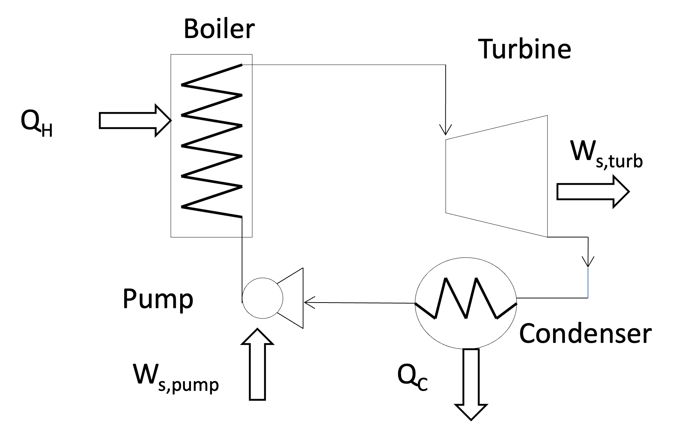

# Review: The Heat Engine and the Rankine Cycle

> "Discrepancy between theory and practice, which in sound physical and mechanical science is a delusion, has a real existence in the minds of men." 
>
> - -William Rankine

By applying the First and Second Laws of Thermodynamics, we proved that the efficiency ($\eta$) of a generic cyclic heat engine is:

$$\eta = \frac{-W_{net}}{Q_H} = 1 - \frac{T_C}{T_H} - \frac{T_C S_{gen}}{Q_H}$$ {#eq-efficiency}

We showed that a **Carnot Cycle** operating between the same temperatures ($T_H$ and $T_C$) has zero entropy generation ($S_{gen} = 0$) and therefore represents the maximum theoretical efficiency. However, the Carnot cycle is not a practical cycle for real power plants because it requires reversible isothermal heat transfer, which is impossible to achieve in practice. To realize the production of work from heat practically, we introduced the **Rankine Cycle**. 

{#fig-rankine width=50%}

The simple Rankine cycle increases the enthalpy of a working fluid (usually water) by transferring heat at high temperature in a boiler until the working fluid is superheated. The boiler can use fossil fuels like coal or natural gas, or it can be driven by a nuclear reaction or heat from a concentrated solar array. The high temperature, high pressure steam is fed to a turbine, where work is extracted. The low pressure, low enthalpy exhaust from the turbine is condensed in a heat exchanger (called a *condenser*), and then the liquid is pumped back to the high pressure boiler where the cycle is repeated. This means that in addition to a high temperature heat source, we need a low temperature sink to dump the heat from the turbine exhaust. In practice, this is often a river, lake, or ocean, or water cooled by a cooling tower. This is why power plants need plenty of cold water nearby. @eq-efficiency shows that the temperatures of the source and sink ($T_H$ and $T_C$) have a huge impact on the cycle efficiency, in addition to the design of the cycle and the equipment used, which determine lost work via $S_{gen}$. 

# Example Problem: Evaluating a Real Rankine Cycle

Let's evaluate the performance of a real steam power plant using the simple Rankine cycle.  We will account for the fact that real turbines and pumps are not perfectly reversible.

**Problem Statement:**
A steam power plant operates on the simple Rankine cycle shown in @fig-rankine.

* **State 2 (Turbine Inlet):** Steam leaves the boiler at $60 \text{ bar}$ and $500^\circ\text{C}$.

* **State 3 (Turbine Exhaust):** The turbine exhausts to the condenser at $1 \text{ bar}$.

* **State 4 (Pump Inlet):** Liquid exiting the condenser is saturated liquid at $1 \text{ bar}$.

* **State 1 (Boiler Inlet):** The water is pumped back up to $60 \text{ bar}$.

* **Efficiencies:** The turbine has an isentropic efficiency of $\eta_T = 0.75$. The pump has an isentropic efficiency of $\eta_P = 0.75$.

**Goal:** Find the thermal efficiency of this cycle and identify the major sources of irreversibility.

## Cycle State Table (Initial)

Let's set up a table to track the properties of our fluid at each state. You should create a table like this when you solve such problems, and fill it in as you go.

| State | Location | $P$ (bar) | $T$ ($^\circ\text{C}$) | $\hat{H}$ (kJ/kg) | $\hat{S}$ (kJ/kg-K) | Phase |
| :--- | :--- | :--- | :--- | :--- | :--- | :--- |
| **1** | Boiler Inlet | 60 | | | | |
| **2** | Turbine Inlet| 60 | 500 | | | |
| **3** | Condenser In | 1 | | | | |
| **4** | Pump Inlet | 1 | | | | Sat. Liquid |

---

## The Turbine (State 2 $\to$ State 3)

### State 2 Properties
From the superheated steam tables at $60 \text{ bar}$ ($6.0 \text{ MPa}$) and $500^\circ\text{C}$:

* $\hat{H}_2 = 3423.1 \text{ kJ/kg}$
* $\hat{S}_2 = 6.8826 \text{ kJ/kg}\cdot\text{K}$

### Reversible Turbine Analysis
To use the turbine efficiency, we first calculate the ideal, reversible (isentropic) work. 
If the turbine were reversible, $\hat{S}_3' = \hat{S}_2 = 6.8826 \text{ kJ/kg}\cdot\text{K}$.

At $1 \text{ bar}$ ($0.1 \text{ MPa}$), the saturation properties are:

* $\hat{S}_{liq} = 1.3028 \text{ kJ/kg}\cdot\text{K}$

* $\hat{S}_{vap} = 7.3589 \text{ kJ/kg}\cdot\text{K}$

* $\hat{H}_{liq} = 417.5 \text{ kJ/kg}$

* $\hat{H}_{vap} = 2674.95 \text{ kJ/kg}$ ($\Delta \hat{H}_{vap} = 2258 \text{ kJ/kg}$)

Since $\hat{S}_{liq} < \hat{S}_3' < \hat{S}_{vap}$, the ideal exit state is a liquid-vapor mixture.
Find the ideal quality ($x'$):
$$x' = \frac{\hat{S}_3' - \hat{S}_{liq}}{\hat{S}_{vap} - \hat{S}_{liq}} = \frac{6.8826 - 1.3028}{7.3589 - 1.3028} = \frac{5.5798}{6.0561} = 0.9213$$

Find the ideal exit enthalpy ($\hat{H}_3'$):
$$\hat{H}_3' = x' \hat{H}_{vap} + (1-x')\hat{H}_{liq} = 0.9213(2674.95) + 0.0787(417.5) = 2497.5 \text{ kJ/kg}$$

Ideal Turbine Work ($W_{T,rev}$):
$$W_{T,rev} = \hat{H}_3' - \hat{H}_2 = 2497.5 - 3423.1 = -925.6 \text{ kJ/kg}$$

### Actual Turbine Analysis
Using the isentropic efficiency ($\eta_T = 0.75$):
$$W_T = \eta_T \times W_{T,rev} = 0.75 \times (-925.6) = -694.2 \text{ kJ/kg}$$

Now, calculate the actual exit enthalpy ($\hat{H}_3$):
$$\hat{H}_3 = \hat{H}_2 + W_T = 3423.1 - 694.2 = 2728.9 \text{ kJ/kg}$$

*Note: Since $\hat{H}_3 (2728.9) > \hat{H}_{vap} (2674.95)$ at $1 \text{ bar}$, the actual turbine exhaust is a **superheated vapor** as opposed to a 2-phase vapor-liquid mixture! The irreversibilities of the turbine heated the steam up enough to completely dry it out. From the superheated tables at $1 \text{ bar}$ and $\hat{H} = 2728.9$, we find $\hat{S}_3 = 7.4884 \text{ kJ/kg}\cdot\text{K}$.*

Given $P_3$ and $\hat{H}_3$, we can find $T_3$ and $\hat{S}_3$ from the superheated steam tables at $1 \text{ bar}$.
Using interpolation we find:
$\hat{S}_3 = 7.4884 \text{ kJ/kg}\cdot\text{K}$ and $T_3 = 125.1^\circ\text{C}$. Note that indeed $\hat{S}_3 > \hat{S}_{2}$, confirming that the turbine is irreversible.

---

## Condenser Analysis (State 3 $\to$ State 4)
The condenser is a heat exchanger that removes heat from the turbine exhaust to condense it back into a liquid. We will assume the condenser is at constant pressure and the exit is saturated liquid (there is no advantage to cool the liquid further), so we find the exit conditions from the saturated steam tables. At $1 \text{ bar}$, the saturation temperature is $T_{4} = 99.6^\circ\text{C}$, the saturated enthalpy is $\hat{H}_{4} = 417.5 \text{ kJ/kg}$ and the saturation entropy of the liquid is $\hat{S}_{4} = 1.3026 \text{ kJ/kg}\cdot\text{K}$. Add these values to the state table.

## The Pump (State 4 $\to$ State 1)

### State 4 Properties
Saturated liquid at $1 \text{ bar}$.

* $T_4 = 99.6^\circ\text{C}$

* $\hat{H}_4 = 417.5 \text{ kJ/kg}$

* $\hat{S}_4 = 1.3028 \text{ kJ/kg}\cdot\text{K}$

* $\hat{V}_4 \approx 0.001043 \text{ m}^3/\text{kg}$ We estimate this from the saturated liquid specific volume at $1 \text{ bar}$.

### Reversible Pump Analysis
For an incompressible liquid, the reversible pump work is equal to $\int \hat{V} dP$:
$$W_{P,rev} = \hat{V}_4 (P_1 - P_4) = 0.001043 \frac{\text{m}^3}{\text{kg}} \times (60 - 1) \text{ bar} \times \frac{100 \text{ kPa}}{1 \text{ bar}}$$
$$W_{P,rev} = +6.15 \text{ kJ/kg}$$
*(Notice how small this is compared to the turbine work! This is the brilliance of the Rankine cycle).*

### Actual Pump Analysis
Using the pump efficiency ($\eta_P = 0.75$):
$$W_P = \frac{W_{P,rev}}{\eta_P} = \frac{6.15}{0.75} = +8.2 \text{ kJ/kg}$$

Calculate the actual boiler inlet enthalpy ($\hat{H}_1$):
$$\hat{H}_1 = \hat{H}_4 + W_P = 417.46 + 8.2 = 425.7 \text{ kJ/kg}$$
*(At $60 \text{ bar}$ and this enthalpy, we can find $\hat{S}_1 \approx 1.324 \text{ kJ/kg}\cdot\text{K}$)*.

---

## Completed Cycle State Table

| State | Location | $P$ (bar) | $T$ ($^\circ\text{C}$) | $\hat{H}$ (kJ/kg) | $\hat{S}$ (kJ/kg-K) | Phase |
| :--- | :--- | :--- | :--- | :--- | :--- | :--- |
| **1** | Boiler Inlet | 60 | ~100 | 425.7 | 1.3240 | Subcooled Liq. |
| **2** | Turbine Inlet| 60 | 500 | 3423.10 | 6.8826 | Superheated |
| **3** | Condenser In | 1 | 125.1 | 2728.90 | 7.4884 | Superheated |
| **4** | Pump Inlet | 1 | 99.6 | 417.5 | 1.3026 | Sat. Liquid |

---

# Cycle Performance

Let's calculate the overall heat transfers and efficiency.

**Heat Added in Boiler ($Q_H$):**
$$Q_H = \hat{H}_2 - \hat{H}_1 = 3423.10 - 425.7 = +2997.4 \text{ kJ/kg}$$

**Heat Rejected in Condenser ($Q_C$):**
$$Q_C = \hat{H}_4 - \hat{H}_3 = 417.5 - 2728.9 = -2311.4 \text{ kJ/kg}$$

**Net Work ($W_{net}$):**
$$W_{net} = W_T + W_P = -693.5 + 8.2 = -685.3 \text{ kJ/kg}$$

**Thermal Efficiency ($\eta$):**
$$\eta = \frac{-W_{net}}{Q_H} = \frac{685.3}{2997.4} = 0.2287 \implies \mathbf{22.87\%}$$

### Comparison to Carnot Limit
What is the absolute maximum efficiency we could hope for operating between these temperatures?

* $T_H = 500^\circ\text{C} = 773.15 \text{ K}$

* $T_C = 99.6^\circ\text{C} = 372.75 \text{ K}$ (Condensing temperature)

$$\eta_{max} = 1 - \frac{T_C}{T_H} = 1 - \frac{372.75}{773.15} = 0.518 \implies \mathbf{51.8\%}$$

Our cycle is getting less than half of the allowable maximum. Why do you think this is? Is it because of the mechanical inefficiencies of the turbine and pump? Or is it because of the large temperature difference in the boiler? Is it because of the heat rejected in the condenser?

To find out, we must look at where entropy is being generated. This is the key tool engineers can use to identify where the biggest sources of irreversibility are in a cycle, and therefore where the biggest opportunities for improvement are.

---

# Entropy Generation and Lost Work Analysis

To identify opportunities for improvement, we conduct an entropy analysis on each unit operation to see where $\hat{S}_{gen}$ is highest.
Recall the open-system entropy balance at steady state:
$$\hat{S}_{gen} = \hat{S}_{out} - \hat{S}_{in} - \frac{Q}{T_{boundary}}$$

Let's assume our environment (ambient) is at $T_0 = 298 \text{ K}$ ($25^\circ\text{C}$). The lost work is calculated as $W_{lost} = T_0 \hat{S}_{gen}$. (N.B. the choice of $T_0$ is somewhat arbitrary, but it is a common convention to use the ambient temperature as the reference for lost work calculations).

**1. The Boiler:**
The heat $Q_H$ is transferred from the hot furnace gas at $T_H = 773.15 \text{ K}$.
$$\hat{S}_{gen, boiler} = \hat{S}_2 - \hat{S}_1 - \frac{Q_H}{T_H} = 6.8826 - 1.3240 - \frac{2997.4}{773.15} = \mathbf{1.682 \text{ kJ/kg}\cdot\text{K}}$$ 

The lost work in the boiler is $W_{lost, boiler} = T_0 \hat{S}_{gen, boiler} = 298 \times 1.682 = 501.2 \text{ kJ/kg}$, which is about **17\%** of the heat added in the boiler!
*(Note: This represents massive lost potential!)*

**2. The Turbine:**
Adiabatic, so $Q = 0$.
$$\hat{S}_{gen, turbine} = \hat{S}_3 - \hat{S}_2 = 7.4884 - 6.8826 = \mathbf{0.6058 \text{ kJ/kg}\cdot\text{K}}$$ 

The lost work in the turbine is $W_{lost, turbine} = T_0 \hat{S}_{gen, turbine} = 298 \times 0.6058 = 180.9 \text{ kJ/kg}$, which is about **26\%** of the turbine work output!

**3. The Condenser:**
The heat $Q_C$ is rejected to the cold sink at $T_C = 372.75 \text{ K}$.
$$\hat{S}_{gen, cond} = \hat{S}_4 - \hat{S}_3 - \frac{Q_C}{T_C} = 1.3026 - 7.4884 - \frac{-2311.4}{372.75} = -6.1858 + 6.2005 = \mathbf{0.0147 \text{ kJ/kg}\cdot\text{K}}$$ 

The lost work in the condenser is $W_{lost, cond} = T_0 \hat{S}_{gen, cond} = 298 \times 0.0147 = 4.38 \text{ kJ/kg}$, which is about **0.2\%** of the heat rejected in the condenser. This is a very small source of irreversibility, so we should not worry too much about improving the condenser.

**4. The Pump:**
Adiabatic, so $Q = 0$.
$$\hat{S}_{gen, pump} = \hat{S}_1 - \hat{S}_4 = 1.3240 - 1.3026 = \mathbf{0.0214 \text{ kJ/kg}\cdot\text{K}}$$ 

The lost work in the pump is $W_{lost, pump} = T_0 \hat{S}_{gen, pump} = 298 \times 0.0214 = 6.38 \text{ kJ/kg}$, which is about **78\%** of the pump work input. This is a significant source of irreversibility, but since the pump work is so small compared to the turbine work, it doesn't have a huge impact on the overall cycle efficiency.

## Conclusions from Entropy Analysis

Where is the most work being lost? 
By far, the largest source of irreversibility is the **Boiler**. Why? Because we are taking heat from a very hot $500^\circ\text{C}$ source and dumping it into subcooled liquid water entering at $\sim 100^\circ\text{C}$. Heat transfer across a massive temperature gradient ($\Delta T$) is highly irreversible. 

The turbine is the second-largest source of lost work due to internal friction and turbulence (reflected in its $75\%$ efficiency) and also because we have a very large pressure drop across the turbine, which leads to a large expansion and therefore a large increase in specific volume. The pump and condenser are relatively efficient, with very little entropy generation.

## Teaser for Next Class: Improving Efficiency
If dumping heat into "cold" boiler feed water is our biggest source of entropy generation, how can we fix it? 

What if we extracted a fraction of the steam halfway through the turbine and used it to pre-heat the boiler feed water before it enters the boiler? This would reduce the $\Delta T$ in the boiler, reducing $\hat{S}_{gen}$, and thereby increasing the cycle efficiency. This concept is called the **Regenerative Rankine Cycle** with Feedwater Heating, which we will calculate next time!

