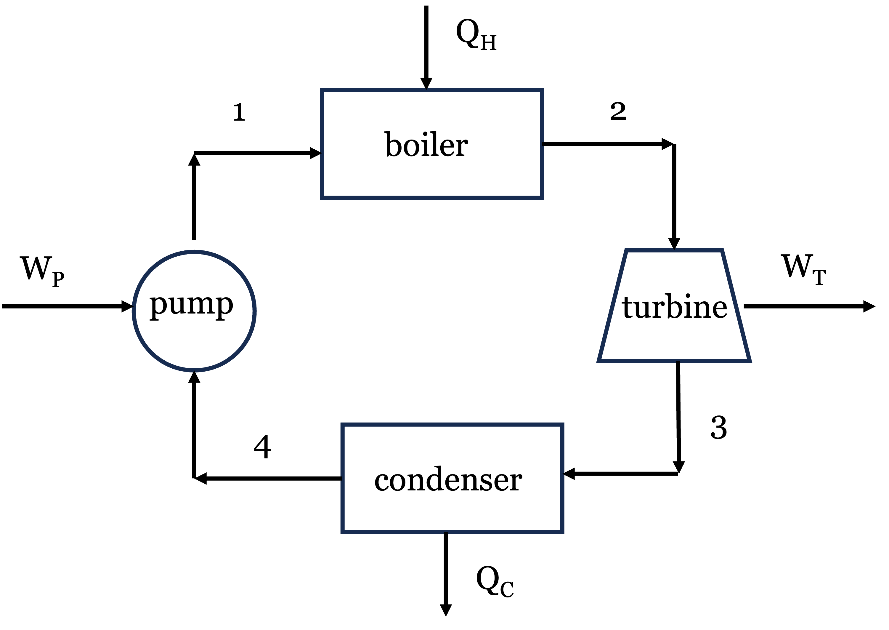
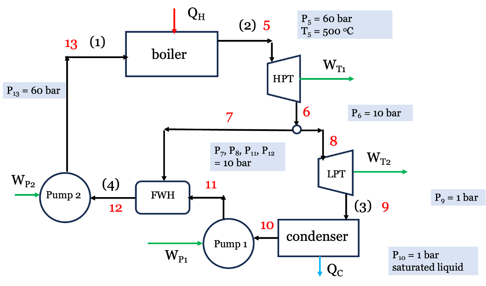
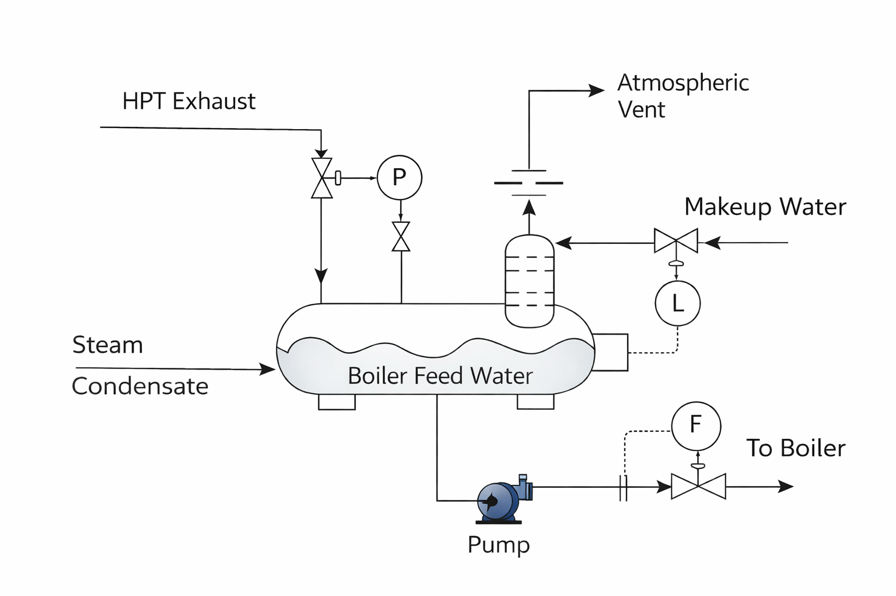

# Introduction: Addressing Cycle Irreversibilities

In Lecture 18, we calculated the thermal efficiency of a simple Rankine cycle operating between 60 bar and 1 bar, as shown in @fig-rankine. We found the thermal efficiency to be roughly **23%**, while the Carnot efficiency limit for the same temperature range is about **52%**.

{#fig-rankine width=50%}

When we performed an entropy generation analysis, we discovered the primary culprit for lost work: the **boiler**.
Adding heat from a $500^\circ\text{C}$ source into subcooled liquid water entering at $\sim 100^\circ\text{C}$ creates a massive temperature gradient, which is highly irreversible. There was also significant lost work associated with the turbine. As you might imagine, extensive engineering design and optimization goes into improving the efficiency of real power plants by reducing these irreversibilities. Here, we will explore one strategy for improving cycle efficiency: **regeneration**. Your Senior Design course will show you more systematic methods for doing process optimization, but we will get a taste of it here by modifying the simple Rankine cycle to include a feedwater heater.

---

# The Regenerative Rankine Cycle (Feedwater Pre-Heating)

Instead of relying solely on the boiler to heat the cold liquid from the condenser, what if we added a second turbine, a second pump, and a feedwater heater (FWH) to the process? The high pressure steam is partially expanded through the first high pressure turbine (HPT). A portion of the low pressure steam exiting the HPT is split off and used to pre-heat the boiler feed water in a heat exchanger, while the remaining steam continues through a second low pressure turbine (LPT) where more work is extracted. The exhaust from the LPT is sent to the condenser, where heat is rejected. The condensed liquid is pumped to a higher pressure and mixed with the steam exhaust from the HPT in the heat exchanger. The liquid exiting the heat exchanger is then pumped up to the boiler pressure. A schematic diagram of this process is shown in @fig-regenerative. New stream numbers are shown, with the old stream numbers from the simple cycle in parentheses for reference.

{#fig-regenerative width=70%}

This process is called **regeneration**. The device where the mixing occurs is an **Open Feedwater Heater (FWH)** (a direct-contact heat exchanger), shown schematically in @fig-fwh. The FWH allows the feedwater to be pre-heated before it enters the boiler, which reduces the temperature gradient in the boiler and therefore reduces the irreversibility associated with heat transfer in the boiler. This is a common strategy for improving cycle efficiency in real power plants, and it can be implemented with a single feedwater heater or multiple feedwater heaters (with multiple extraction points from the turbine or turbines). The FWH also allows the water to be deaerated, which removes dissolved oxygen that can cause corrosion in the boiler. The image in @fig-fwh shows the basic operation. The FWH is esentially a big mixing chamber where the hot steam and cold water are mixed together to produce hot liquid water at the desired temperature and pressure. Control valves are used to adjust the mass flow rates of the steam and water to achieve the desired outlet conditions. Makeup water is added to the system to "make up" for any losses in the system.

{#fig-fwh width=50%}

Let's re-do the thermodynamic analysis of the Rankine cycle with regeneration. We will use the same boiler and condenser conditions as before, but we will add a FWH that takes some of the steam from the HPT at 10 bar to pre-heat the boiler feedwater, while the rest is fed to the LPT. We will assume the water leaving the FWH is a saturated liquid at 10 bar.  Because we are splitting the fluid stream, we must track the mass fraction of steam flowing through each component. Let $y$ be the fraction of steam exiting the HPT that is sent to the FWH, and therefore $1-y$ is the fraction of steam that continues through to the LPT and to the condenser. We will perform our analysis on a per kg basis. Refer to @fig-regenerative for stream labels and flow paths. The key steps are:

* 1 kg of steam exits the boiler at 60 bar, $500^\circ\text{C}$ and enters the high-pressure turbine (stream 5). It then exits the HPT (stream 6) at 10 bar.

* $y$ kg is sent to the FWH (stream 7).

* (1 - $y$) kg continues through to the low-pressure turbine (stream 8) and the LPT exhaust is fed to the condenser (stream 9).

* The fluid exits the condenser as saturated liquid at 1 bar (stream 10) and is pumped to 10 bar where it enters the FWH (stream 11).
  
* Stream 7 and 11 are mixed at constant pressure 10 bar in the FWH to produce saturated liquid at 10 bar (stream 12), which is then pumped up to the boiler pressure 60 bar (stream 13).

## Example Calculation: Open Feedwater Heater

We will use the same basic operating conditions at the Rankine cycle from Lecture 18 to see the impact of these changes on the thermal efficiency.

### Step 1: The High-Pressure Turbine (Stream 5 $\to$ 6)

* **Stream 5 (Boiler Out):** 60 bar, $500^\circ\text{C}$.
    * $\hat{H}_5 = 3422.2 \text{ kJ/kg}$
    * $\hat{S}_5 = 6.8826 \text{ kJ/kg}\cdot\text{K}$

* **Stream 6 (HP Turbine Out/Extraction):** 10 bar.
    * Ideal $\hat{S}_6' = 6.8826 \text{ kJ/kg}\cdot\text{K} \implies \hat{H}_6' \approx 2921.4 \text{ kJ/kg}$ (superheated)
  
    * Actual HPT Work: $W_{HP} = 0.75 \times (2921.4 - 3422.2) = \mathbf{-375.6 \text{ kJ/kg}}$
  
    * Actual $\hat{H}_6 = 3422.2 - 375.6 = 3046.6 \text{ kJ/kg}$ (At 10 bar, this is approx $300^\circ\text{C}$ with $\hat{S}_6 \approx 7.124 \text{ kJ/kg}\cdot\text{K}$).
 
    * **Note** Streams 7 and 8 have the same properties as stream 6, since they are just split from the same stream. The mass flow rates will differ, however.

### Step 2: The Low-Pressure Turbine (Stream 8 $\to$ 9)

*(Note: Only $1-y$ mass fraction flows through here).*

* **Stream 9 (LP Turbine Out):** 1 bar.
    * Ideal $\hat{S}_9' = \hat{S}_8 = 7.124 \text{ kJ/kg}\cdot\text{K} \implies x \approx 0.961 \implies \hat{H}_9' = 2587.4 \text{ kJ/kg}$
    * Actual LP Work: $W_{LP} = 0.75 \times (2587.4 - 3046.6) = \mathbf{-344.4 \text{ kJ/kg}}$
    * Actual $\hat{H}_9 = 3046.6 - 344.4 = 2702.2 \text{ kJ/kg}$

### Step 3: Condenser and Pump 1 (Stream 9 $\to$ 10 $\to$ 11)

*(Note: Only $1-y$ mass fraction flows through here).*

* **Stream 10 (Condenser Out):** 1 bar, sat liquid. $\hat{H}_{10} = 417.46 \text{ kJ/kg}$, $\hat{V}_{10} = 0.001043 \text{ m}^3/\text{kg}$

* **Pump 1 (to FWH pressure):** 1 to 10 bar.
    * Reversible Work = $0.001043 \times (10 - 1) \times 100 = 0.94 \text{ kJ/kg}$
    * Actual $W_{P1} = 0.94 / 0.75 = \mathbf{+1.25 \text{ kJ/kg}}$
    * $\hat{H}_{11} = 417.46 + 1.25 = 418.71 \text{ kJ/kg}$

### Step 4: The Open Feedwater Heater (Stream 7 + Stream 11 $\to$ Stream 12)
The FWH mixes hot steam from Stream 7 with cold water from Stream 11 to produce saturated liquid at 10 bar (Stream 12).

* **Stream 12 (FWH Out):** 10 bar, sat liquid. $\hat{H}_{12} = 762.6 \text{ kJ/kg}$

**Energy Balance on FWH (to find $y$):**

Since we specified that the FWH produces saturated liquid at 10 bar (stream 12), we have to solve for the fraction of steam redirected from HPT to the FWH via an energy balance. We know the enthalpies of streams 7, 11, and 12 so $y$ is the only unknown in the following equation:
$$y \hat{H}_7 + (1-y) \hat{H}_{11} = \hat{H}_{12}$$
$$y (3046.6) + (1-y) (418.71) = 762.6$$
$$y (2627.89) = 343.89 \implies \mathbf{y = 0.1309}$$
*(We bleed about 13.1% of the steam from the HPT to the heater, with the rest going to the LPT).*

### Step 5: Boiler Feed Pump (Stream 12 $\to$ 13)
*(Note: The full mass flow goes through here).*

* **Stream 12 Volume:** $\hat{V}_{12} = 0.001127 \text{ m}^3/\text{kg}$

* **Pump 2 (to Boiler pressure):** 10 to 60 bar.
    * Reversible Work = $0.001127 \times (60 - 10) \times 100 = 5.64 \text{ kJ/kg}$
    * Actual $W_{P2} = 5.64 / 0.75 = \mathbf{+7.51 \text{ kJ/kg}}$
    * $\hat{H}_{13} = 762.6 + 7.51 = 770.11 \text{ kJ/kg}$ *(Notice how much hotter (higher in enthalpy) the water entering the boiler is now!)*

---

## Cycle Performance: The Payoff

Let's calculate the overall heat and work **per kg of steam leaving the boiler**:

**Turbine Work:**
$$W_{turb} = W_{HP} + (1-y)W_{LP} = -375.6 + (1 - 0.1309)(-344.4) = \mathbf{-674.9 \text{ kJ/kg}}$$
*(We produce slightly less total work than the simple cycle's -693.5 kJ/kg because we robbed the LP turbine of some steam).*

**Pump Work:**
$$W_{pump} = (1-y)W_{P1} + W_{P2} = (0.8691)(1.25) + 7.51 = \mathbf{+8.60 \text{ kJ/kg}}$$

**Net Work:**
$$W_{net} = -674.9 + 8.60 = \mathbf{-666.3 \text{ kJ/kg}}$$

**Heat Added (Boiler):**
Because we pre-heated the water, we need to buy significantly less heat!
$$Q_H = \hat{H}_5 - \hat{H}_{13} = 3422.2 - 770.11 = \mathbf{+2652.1 \text{ kJ/kg}}$$
*(Compared to +2996.5 kJ/kg in the simple cycle).*

**New Thermal Efficiency:**
$$\eta = \frac{-W_{net}}{Q_H} = \frac{666.3}{2652.1} = \mathbf{0.2512 \implies 25.1\%}$$

### Conclusion
This relatively simple process modification raised the cycle efficiency from **22.87% to 25.1%** without changing the operating conditions. That is a relative improvement of nearly 10%! For a multi-megawatt power plant, this translates to millions of dollars in fuel savings and a massive reduction in greenhouse gas emissions. The price we had to pay was a slightly more complex system with an additional turbine, pump, and heat exchanger, but the efficiency gain is likely well worth it. Real power plants often use multiple feedwater heaters and multiple extraction points to further optimize the cycle performance. A full engineering analysis would have to balance the cost of additional equipment and maintenance with the fuel savings to determine the optimal design. Actual power plants can achieve thermal efficiencies of 40-45%, which suggests there are many more opportunities for improvement beyond the single feedwater heater we analyzed here.

---

::: {.callout-tip icon=false}
## Jupyter Notebook Example
I have prepared an interactive Jupyter Notebook that solves the regenerative Rankine cycle problem, and also allows you to adjust the cycle conditions and see how the cycle efficiency changes as a function of the mass fraction $y$ sent to the feedwater heater as well as the boiler and condenser conditions. Note that the notebook uses CoolProp to calculate the properties of water and steam, so you can easily modify the cycle conditions and see how the results change. You can also see how the entropy of each stream changes as a function of $y$ to get a better understanding of where the irreversibilities are occurring in the cycle. The actual numbers will differ slightly from the hand calculations above because of the use of CoolProp, which is more accurate than the steam tables we used for the hand calculations, but the overall trends and conclusions will be the same.

::: {.content-visible when-format="html"}

[**View Interactive Notebook (.ipynb)**](rankine-regen.ipynb)

:::

::: {.content-visible when-format="pdf"}
*Note: This example is available as an interactive Jupyter Notebook on the course website.*
:::
:::

# Other Enhancements: Reheating

Another common strategy to improve efficiency (and protect turbine blades from water droplet erosion) is to use **Multiple Turbines with Reheating**.

Instead of letting the steam expand all the way from boiler pressure down to condenser pressure in one step, we:

1.  Expand the steam partially in a High-Pressure Turbine.

2.  Send the steam *back* to the boiler to be reheated at constant pressure (e.g., back up to $500^\circ\text{C}$).

3.  Expand it the rest of the way in a Low-Pressure Turbine.

This increases the average temperature of heat addition, raising the thermal efficiency. It also ensures the exhaust steam stays dry and superheated, preventing wear and tear on the turbine blades. Real power plants often combine both Reheating and Regeneration simultaneously!
