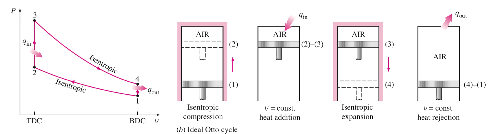
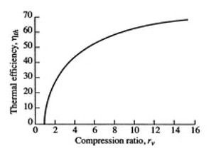
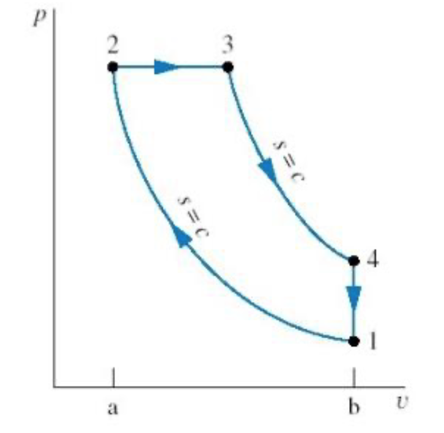
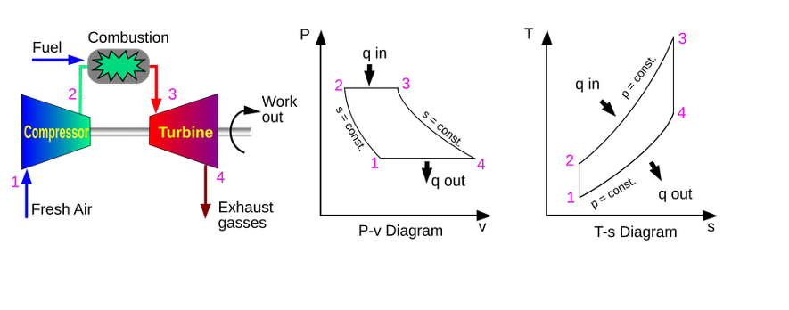

# Introduction: Beyond Traditional Steam

Over the last few lectures, we thoroughly analyzed the steam Rankine cycle. We saw how engineering modifications like regeneration and reheating can push a power plant's efficiency higher. 

However, the traditional steam Rankine cycle has significant limitations:

1. **Requires High-Grade Heat:** Water boils at $100^\circ\text{C}$ at atmospheric pressure. To get good efficiency, we need highly pressurized, extremely hot steam ($>400^\circ\text{C}$). This requires burning fossil fuels, using nuclear fission, or having highly concentrated solar energy. We cannot easily run a standard steam power plant off low-temperature "waste" heat.

2. **Stationary & Heavy:** Boilers are massive heat exchangers. The system requires large amounts of fluid and substantial infrastructure. You cannot put a coal-fired Rankine cycle in a passenger car and expect good performance (despite early 20th-century attempts at steam cars!).

Today, we will look at how to overcome these limitations using alternative working fluids and entirely different thermodynamic cycles.

---

# The Organic Rankine Cycle (ORC)

What if we have a source of "low-grade" heat? For example:

* Geothermal vents ($80^\circ\text{C} - 150^\circ\text{C}$)

* Warm surface seawater (Ocean Thermal Energy Conversion)

* **Waste heat from a massive data center** ($\sim 45^\circ\text{C}$)

Water will not boil effectively at these temperatures unless we pull a massive vacuum. The solution is the **Organic Rankine Cycle (ORC)**. 

An ORC operates exactly like a standard Rankine cycle (boiler $\to$ turbine $\to$ condenser $\to$ pump), but instead of water, we use an "organic" fluid—typically a refrigerant or hydrocarbon—that has a much lower boiling point than water.

## Worked Example: Data Center Waste Heat Recovery

Let's evaluate an ORC designed to recover waste heat from a server farm. The hot exhaust air from the servers is used to boil a refrigerant, **R-134a**.

**Operating Conditions:**

* **Boiler (evaporator):** Operates at $10 \text{ bar}$. At this pressure, R-134a boils at approximately $39.4^\circ\text{C}$, which is perfect for absorbing heat from $45^\circ\text{C}$ data center exhaust. Saturated vapor exits the boiler.

* **Condenser:** Operates at $5 \text{ bar}$. At this pressure, R-134a condenses at approximately $15.7^\circ\text{C}$, allowing heat rejection to cooling water or a local body of water. Saturated liquid exits the condenser.

* **Ideal Components:** For simplicity, assume the turbine and pump are perfectly reversible ($\eta = 1.0$).

### Cycle Analysis

Let's use the R-134a thermodynamic tables to find the states (values are approximate) or you can write a Python script using CoolProp to get more accurate values:

* **State 2 (Boiler Out / Turbine In):** Sat. Vapor at $10 \text{ bar}$.
  * $\hat{H}_2 \approx 271.0 \text{ kJ/kg}$
  * $\hat{S}_2 \approx 0.910 \text{ kJ/kg}\cdot\text{K}$

* **State 3 (Turbine Out / Condenser In):** Isentropic expansion to $5 \text{ bar}$.
  * $\hat{S}_3 = \hat{S}_2 = 0.910 \text{ kJ/kg}\cdot\text{K}$
  * *(From tables at 5 bar, this entropy is slightly inside the vapor dome, $x \approx 0.98$)*
  * $\hat{H}_3 \approx 260.0 \text{ kJ/kg}$
  * **Turbine Work:** $W_{turb} = \hat{H}_3 - \hat{H}_2 = 260.0 - 271.0 = \mathbf{-11.0 \text{ kJ/kg}}$

* **State 4 (Condenser Out / Pump In):** Sat. Liquid at $5 \text{ bar}$.
  * $\hat{H}_4 \approx 71.0 \text{ kJ/kg}$
  * $\hat{V}_4 \approx 0.0008 \text{ m}^3/\text{kg}$

* **State 1 (Pump Out / Boiler In):** Pumped to $10 \text{ bar}$.
  * $W_{pump} = \hat{V}_4(P_{boiler} - P_{cond}) = (0.0008)(10 - 5)\times 100 \approx \mathbf{+0.4 \text{ kJ/kg}}$
  * $\hat{H}_1 = \hat{H}_4 + W_{pump} = 71.0 + 0.4 = \mathbf{71.4 \text{ kJ/kg}}$

### Efficiency Calculation

* **Net Work:** $W_{net} = W_{turb} + W_{pump} = -11.0 + 0.4 = \mathbf{-10.6 \text{ kJ/kg}}$
* **Heat Added:** $Q_H = \hat{H}_2 - \hat{H}_1 = 271.0 - 71.4 = \mathbf{+199.6 \text{ kJ/kg}}$
* **Thermal Efficiency:** $\eta = \frac{10.6}{199.6} = \mathbf{0.053} \implies \mathbf{5.3\%}$

**Is 5.3% terrible?** Not necessarily! The Carnot efficiency for these temperatures ($T_H = 39.4^\circ\text{C} = 312.5 \text{ K}$, $T_C = 15.7^\circ\text{C} = 288.8 \text{ K}$) is only $\eta_{max} = 1 - (288.8/312.5) = 7.6\%$. We are getting free power out of heat that would otherwise just be vented into the atmosphere!

---

# Motive Power and Air-Standard Cycles

If we want to power a car or an airplane, we care about the **power-to-weight ratio**. We cannot afford to carry a boiler, a condenser, and tons of cooling water. 

The solution is the **Internal Combustion Engine (ICE)**. Instead of heating a fluid through a wall (external combustion), we ignite fuel directly *inside* the working fluid (air). The hot combustion gases expand, do work, and are immediately exhausted. The atmosphere acts as an giant condenser and source of fresh working fluid.

## The Air-Standard Assumptions

Real combustion is chemically complex (open system, changing mass, changing composition). To properly model this system requires sophisticated computational methods. To model an ICE using simple thermodynamics, we use the **Air-Standard Assumptions**:

1. The working fluid is pure air, treated as an ideal gas.

2. The engine operates in a *closed loop* (the exhaust air is assumed to be cooled and fed back into the intake).

3. The combustion process is replaced by an external heat addition step ($Q_H$).

4. The exhaust process is replaced by an external heat rejection step ($Q_C$).

5. All processes are internally reversible.

While these are pretty drastic assumptions, they allow us to analyze the thermodynamics of an ICE using the same tools we've developed for Rankine cycles. We will see that the idealized cycles we get from these assumptions (Otto, Diesel, Brayton) capture the essential physics and efficiency trends of real engines.

---

# The Otto Cycle (Spark-Ignition)

The Otto cycle models your standard gasoline car engine. It is a four-stroke piston-cylinder device. 

{#fig-otto-air width=100%}

**The 4 Ideal Steps:**
1. **State 1 $\to$ 2: Isentropic Compression.** The piston compresses the air/fuel mixture. ($W > 0, Q=0$).

2. **State 2 $\to$ 3: Isochoric Heat Addition.** The spark plug fires. Combustion happens so fast that the piston hasn't moved yet. Volume is constant ($v=C$). Heat is added ($Q_H > 0$).

3. **State 3 $\to$ 4: Isentropic Expansion (Power Stroke).** The high-pressure gas pushes the piston down, doing useful work. ($W < 0, Q=0$).

4. **State 4 $\to$ 1: Isochoric Heat Rejection.** The exhaust valve opens, pressure drops instantly at constant volume. Heat is rejected ($Q_C < 0$).

**Efficiency of the Otto Cycle:**
By applying the ideal gas relations to these steps, the efficiency depends entirely on the **compression ratio ($r = V_1 / V_2$)**:

$$\eta_{Otto} = 1 - \frac{1}{r^{\gamma - 1}}$$
*(where $\gamma = C_p / C_v$)*

To get more efficiency, car manufacturers want to increase $r$. However, if you compress a gas too much, it gets hot. If it gets too hot, the gasoline auto-ignites before the spark plug fires. This is called **engine knock** and it destroys engines. This physical limit leads us to the Diesel cycle.

::: {.callout-note collapse="false" title="Derivation: Otto Cycle Efficiency"}

The thermal efficiency of any heat engine is defined as the net work divided by the heat added:
$$\eta = \frac{-W_{net}}{Q_H} = \frac{Q_H + Q_C}{Q_H} = 1 + \frac{Q_C}{Q_H}$$

**Step A: Define Heat Added and Rejected**
In the Otto cycle, heat is added and rejected at **constant volume** (isochoric processes). Using the First Law for a closed system ($Q = \Delta U$ when $W=0$), and assuming an ideal gas ($\Delta U = C_v \Delta T$):

* **Heat Added (State 2 $\to$ 3):** $Q_H = C_v(T_3 - T_2)$

* **Heat Rejected (State 4 $\to$ 1):** $Q_C = C_v(T_1 - T_4)$

Substitute these into the efficiency equation:
$$\eta_{Otto} = 1 + \frac{C_v(T_1 - T_4)}{C_v(T_3 - T_2)} = 1 + \frac{T_1 - T_4}{T_3 - T_2}$$

**Step B: Use Isentropic Relations**
To simplify this, we relate the temperatures using the isentropic compression and expansion steps. For an ideal gas undergoing an isentropic process, you can show that $T \cdot V^{\gamma-1} = \text{constant}$ where $\gamma = C_p / C_v$.

We define the **compression ratio, $r$**: 
$$r = \frac{V_1}{V_2} = \frac{V_4}{V_3}$$ 

*(Since $V_1=V_4$ and $V_2=V_3$)*

* **Compression (1 $\to$ 2):** $\frac{T_2}{T_1} = \left(\frac{V_1}{V_2}\right)^{\gamma-1} = r^{\gamma-1}$
* **Expansion (3 $\to$ 4):** $\frac{T_3}{T_4} = \left(\frac{V_4}{V_3}\right)^{\gamma-1} = r^{\gamma-1}$

Since both temperature ratios equal $r^{\gamma-1}$, we know that:
$$\frac{T_2}{T_1} = \frac{T_3}{T_4} \implies \frac{T_4}{T_1} = \frac{T_3}{T_2}$$

**Step C: Simplify the Efficiency Equation**
Let's factor out $T_1$ from the numerator and $T_2$ from the denominator of our efficiency equation:
$$\eta_{Otto} = 1 - \frac{T_1 \left( \frac{T_4}{T_1} - 1 \right)}{T_2 \left( \frac{T_3}{T_2} - 1 \right)}$$

Because we proved $\frac{T_4}{T_1} = \frac{T_3}{T_2}$, the terms in the parentheses are identical and perfectly cancel out!
$$\eta_{Otto} = 1 - \frac{T_1}{T_2}$$

Substitute our isentropic relationship ($\frac{T_1}{T_2} = \frac{1}{r^{\gamma-1}}$) to get the final result:
$$\eta_{Otto} = 1 - \frac{1}{r^{\gamma-1}}$$

:::

We observe that the efficiency of the Otto cycle depends solely on the compression ratio $r$ and the specific heat ratio $\gamma$. To increase efficiency, we want to increase $r$, but this is limited by engine knock (pre-combustion of the gasoline). This is why typical gasoline engines have compression ratios around 8-12.

{#fig-otto-eff width=40%}

---

# The Diesel Cycle (Compression-Ignition)

To achieve higher efficiencies without engine knock, the Diesel cycle changes the fuel delivery method.

Instead of compressing a mixture of air and fuel and igniting it with a spark, a diesel engine compresses *only pure air*. It compresses it so much ($r = 15 \text{ to } 20$) that the air becomes incredibly hot. At the top of the stroke, fuel is injected. Because the air is so hot, the fuel auto-ignites immediately upon entering. 

**The Key Difference:**
Because fuel is injected steadily as the piston starts to expand, the combustion (heat addition) occurs at **Constant Pressure (Isobaric)** rather than constant volume.

{#fig-diesel-air width=50%}

1. **1 $\to$ 2:** Isentropic Compression (only air). 
2. **2 $\to$ 3:** **Isobaric Heat Addition** (fuel injected and burns).
3. **3 $\to$ 4:** Isentropic Expansion (power stroke).
4. **4 $\to$ 1:** Isochoric Heat Rejection (exhaust).

It can be shown that the efficiency of a Diesel cycle is given by:

$$\eta_{Diesel} = 1 - \frac{1}{\gamma} \left [ \frac{
\left (\frac{1}{r_e} \right )^\gamma - \left (\frac{1}{r_c} \right )^\gamma}
{1/r_e - 1/r_c} \right ]$$

where 
$r_e = V_4/V_3$ is the expansion ratio and $r_c = V_1/V_2$ is the compression ratio. Diesel engines are generally more efficient than Otto engines primarily because their design allows them to operate at much higher compression ratios. 

---

# Gas Turbines and the Brayton Cycle

Piston engines are great for cars, but for massive power output (like the Indeck plant in Niles, MI) or jet propulsion, we use **Gas Turbines**. These operate on the **Brayton Cycle**.

Unlike piston engines, gas turbines are steady-flow, open-system devices.

1. **Compressor (1 $\to$ 2):** Air is drawn in and compressed isentropically.

2. **Combustor (2 $\to$ 3):** Fuel is added and burned at constant pressure ($Q_H$).

3. **Turbine (3 $\to$ 4):** Hot gases expand isentropically through a turbine, generating work. A large portion of this work is used simply to drive the compressor on the same shaft!

4. **Exhaust (4 $\to$ 1):** Hot gases are vented (isobaric heat rejection).

{#fig-brayton width=80%}

In modern power plants (like Indeck Niles), they use a **Combined Cycle**. The exhaust gas from the Brayton cycle (gas turbine) is still very hot (often $>500^\circ\text{C}$). Instead of venting it, they run it through a heat exchanger to boil water, which then drives a standard steam Rankine cycle! This combination can push overall plant efficiencies well past 60%.
