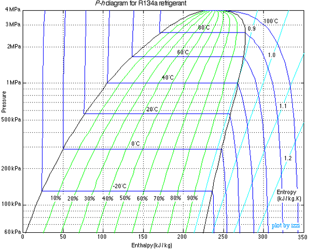
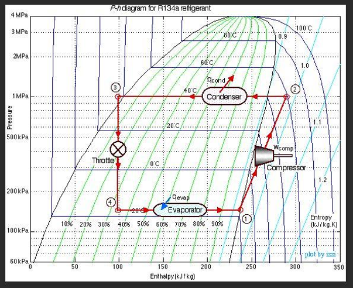

# Introduction: How Do You Make Things Cold?

Up until now, we have focused on generating power from a heat source. But what if our goal is the opposite? What if we want to take a space and make it colder than its surroundings? 

Historically, humanity relied on **ice harvesting**. In the 19th century, ice was cut from frozen lakes in the winter, insulated with sawdust, and shipped globally. While effective, it was highly dependent on geography and season, and could only provide cooling of small spaces (e.g., "iceboxes").

The simplest active cooling technology relies on **Evaporative Cooling**. 
When a liquid evaporates, it must absorb the enthalpy of vaporization ($\Delta H_{vap}$). If water evaporates off your skin, it absorbs that heat from your body, cooling you down. This is why sweating is an effective cooling mechanism. We can also use this principle to provide cooling.

* **Misters and Swamp Coolers:** Misters spray fine water droplets into the air. As the water evaporates, it cools the surrounding air. "Swamp coolers" pull hot, dry air through a wet pad. The air is cooled by evaporation before it enters the building.

* **The Limitation:** Evaporative cooling only works well in *dry* climates. The lowest temperature you can achieve this way is the **Wet Bulb Temperature**. In a humid environment (like a midwestern summer), the air is already saturated with water vapor, evaporation is minimal, and swamp coolers are completely ineffective. 

To achieve reliable cooling anywhere, we need a closed thermodynamic cycle.

---

# The Heat Engine in Reverse

Recall the Clausius statement of the Second Law of Thermodynamics: *It is impossible for heat to flow spontaneously from a colder body to a hotter body.*

However, heat *can* be made to flow from cold to hot if we input **work**. A refrigerator is simply a heat engine running in reverse.

Instead of taking in heat to produce work, a refrigeration cycle:

1. Absorbs heat ($Q_c > 0$) from a cold space (e.g., the inside of a fridge at $3^\circ\text{C}$).

2. Receives a work input ($W > 0$) in the form of electricity.

3. Rejects heat ($Q_h < 0$) to a hot space (e.g., the kitchen at $25^\circ\text{C}$).

The First Law energy balance for the closed cycle ($\Delta U = 0$) is:
$$Q_c + Q_h + W = 0 \implies W = -(Q_c + Q_h)$$

## The Coefficient of Performance (COP)

For heat engines, we measured success using thermal efficiency ($\eta = -W/Q_{in}$). Because refrigerators *consume* work to move heat, efficiency is framed differently. We use the **Coefficient of Performance (COP)**.

$$COP = \frac{\text{Desired Output}}{\text{Required Input}} = \frac{Q_c}{W}$$ {#eq-COP}

Unlike thermal efficiency, **COP can be (and usually is) greater than 1!** You are not creating energy; you are simply *moving* more thermal energy than the mechanical energy you put in.

::: {.callout-note title="Derivation: The COP and Entropy Generation"}
Let's derive the COP using the First and Second Laws, retaining the entropy generation term ($S_{gen}$) to see exactly how irreversibilities affect performance.

The Second Law for the cycle is:
$$\Delta S_{cycle} = \frac{Q_c}{T_c} + \frac{Q_h}{T_h} + S_{gen} = 0$$

Solve this for the heat rejected to the hot reservoir, $Q_h$:
$$Q_h = -T_h \left( \frac{Q_c}{T_c} + S_{gen} \right)$$

Substitute this $Q_h$ into the First Law expression for Work:
$$W = -Q_c - \left[ -T_h \left( \frac{Q_c}{T_c} + S_{gen} \right) \right]$$
$$W = -Q_c + Q_c \frac{T_h}{T_c} + T_h S_{gen} = Q_c \left( \frac{T_h}{T_c} - 1 \right) + T_h S_{gen}$$

Now substitute this $W$ back into the COP definition (@eq-COP):
$$COP = \frac{Q_c}{Q_c \left( \frac{T_h}{T_c} - 1 \right) + T_h S_{gen}}$$

Divide the numerator and denominator by $Q_c$:
$$COP = \frac{T_c}{\left( T_h - T_c \right) + \frac{T_h T_c S_{gen}}{Q_c}}$$ {#eq-COP_Sgen}

**Key Takeaways:**

* Because entropy generation is always positive ($S_{gen} \ge 0$), real-world irreversibilities will increase the denominator, causing the actual $COP$ to drop.
* AS $T_C$ goes down, the term $T_h -T_c$ gets larger, increasing the denominator and reducing $COP$. This is why it's harder to achieve very low temperatures.
* AS $T_H$ goes up, the term $T_h-T_c$ also gets larger, increasing the denominator and reducing $COP$. This is why refrigerators work better in cooler environments (e.g., a basement) than in hot environments (e.g., a garage in the summer).
:::

* For a completely reversible cycle (**The Carnot Refrigerator**), we set $S_{gen} = 0$ in @eq-COP_Sgen, giving the theoretical maximum performance:
$$COP_{rev} = \frac{T_c}{T_h - T_c}$$ {#eq-COP_rev}

*(Note: Temperatures MUST be in Kelvin!)*

**Quick Example:** A refrigerator maintains a freezer at $-10^\circ\text{C}$ ($263 \text{ K}$) in a $30^\circ\text{C}$ ($303 \text{ K}$) room. What is the maximum possible COP?
$$COP_{R,rev} = \frac{263}{303 - 263} = \frac{263}{40} = \mathbf{6.575}$$
This means for every $1 \text{ kJ}$ of electricity the compressor uses, you could ideally remove $6.575 \text{ kJ}$ of heat from the freezer! Real refrigerators typically have a COP around $2$ to $4$ due to the $S_{gen}$ irreversibilities we just derived.

---

# Joule-Thomson Expansion: Making Fluids Cold

To build a refrigerator, we need a way to make the working fluid colder than the inside of the fridge so heat will transfer into it. We do this using a **throttling valve**.

When a fluid flows through a restriction (a cracked valve, a porous plug, or a capillary tube) without any heat transfer or work being extracted, the process is **isenthalpic** ($\Delta H = 0$).

Will the temperature of the fluid drop when its pressure drops? That depends on a property called the **Joule-Thomson Coefficient ($\mu_{JT}$)**:
$$\mu_{JT} = \left( \frac{\partial T}{\partial P} \right)_H$$ {#eq-mu_JT}

* If $\mu_{JT} > 0$, the fluid cools as it expands.
* If $\mu_{JT} < 0$, the fluid actually heats up as it expands! (This happens to Hydrogen and Helium at room temperature).

For refrigeration, we choose fluids and operating conditions where $\mu_{JT}$ is strongly positive. By forcing a high-pressure liquid refrigerant through a throttling valve valve, the pressure drops drastically, causing a portion of the liquid to flash into vapor. The energy required to vaporize that liquid comes from the fluid itself, lowering its temperature.

## The Pressure-Enthalpy (P-H) Diagram

Because throttling is isenthalpic ($\Delta H = 0$), analyzing refrigeration cycles on a Temperature-Entropy ($T-s$) diagram is clumsy. Instead, the industry standard is the **Pressure-Enthalpy (P-H) Diagram**, such as the one shown in @fig-PH-diagram for the refrigerant R-134a.

{#fig-PH-diagram width=60%}

On a P-H diagram:

* Constant pressure processes (boiling/condensing) are **horizontal lines**.

* Isenthalpic processes (throttling) are **vertical lines**.

---

# The Vapor-Compression Refrigeration Cycle

Putting it all together gives us the standard cycle used in almost every household refrigerator, air conditioner, and industrial chiller.

{#fig-VC-cycle width=60%}

The ideal cycle consists of four steps:

1. **Compressor (1 $\to$ 2):** Cold, low-pressure saturated vapor is compressed to a high pressure and temperature; this is where work is done on the refrigerant. For this analysis, the process is assumed to be isentropic ($S_1 = S_2$). $W = H_2 - H_1$, though you can see on @fig-VC-cycle that an increase in entropy for this process could be drawn, which would increase the exit entropy and the work required.
 
2. **Condenser (2 $\to$ 3):** The hot, high-pressure vapor enters a heat exchanger (the coils on the back of your fridge). It cools and condenses into a saturated liquid at constant pressure, rejecting heat to the room. The air in the room is the cold "sink".  In this example, the refrigerant enters the condenser at 40 $^\circ$C, which is hotter than the room. *( $Q_H = H_3 - H_2$. Because $H_3 < H_2$, this yields a negative value for $Q_H$, consistent with heat leaving the system).*

3. **Expansion Valve (3 $\to$ 4):** The high-pressure liquid is throttled through a valve (Joule-Thomson expansion). It expands isenthalpically ($H_3 = H_4$). The pressure drops, and it flashes into a very cold liquid-vapor mixture. In @fig-VC-cycle, the cold refrigerant is at -20$^\circ$C, which is colder than the inside of the fridge, allowing it to absorb heat in the next step. 

4. **Evaporator (4 $\to$ 1):** The cold mixture passes through coils inside the fridge. Because it is colder than the fridge, it absorbs heat, boiling completely into a saturated vapor at constant pressure. $Q_C = H_1 - H_4$. Since $H_1 > H_4$, this yields a positive value, consistent with heat entering the system.

Note that the pressures of the evaporator and condenser are determined by the saturation conditions of the refrigerant at the desired temperatures. The temperatures are set the design of the system (for example, the freezer at $-10^\circ\text{C}$, the room at $30^\circ\text{C}$), and the pressures are set by the choice of refrigerant and the desired mass flow rate.

---

# Refrigerant Molecules and Environmental Impact

To make this cycle work, we cannot use water. We need a fluid with a boiling point below $0^\circ\text{C}$ at atmospheric pressure, and a critical temperature well above room temperature. 

**A Brief History of Refrigerants:**

* **Early 1900s:** Ammonia ($\text{NH}_3$), sulfur dioxide ($\text{SO}_2$), and propane. These worked, but were highly toxic or explosive. Leaks were occasionally fatal.

* **1930s (CFCs):** Chemists invented chlorofluorocarbons (like Freon-12 / R-12). They were non-toxic, non-flammable, and had perfect thermodynamic properties. They revolutionized air conditioning.

* **1980s (The Ozone Hole):** We discovered that the chlorine in CFCs was destroying the Earth's ozone layer. The Montreal Protocol banned them because they had a significant **Ozone Depletion Potential (ODP)**.

* **1990s (HCFCs & HFCs):** We transitioned to hydrofluorocarbons like R-134a. Because they contain no chlorine, their **ODP is exactly 0**. 

* **Today (The GWP Problem):** While R-134a does not deplete the ozone layer, it is a potent greenhouse gas. Its **Global Warming Potential (GWP)** is 1,430 times larger than $CO_2$. Unfortunately, refrigerant leaks are common, and the cumulative effect of these gases is significant. The Kigali Amendment to the Montreal Protocol is phasing down HFCs globally.

Modern engineering is currently shifting again, this time toward hydrofluoroolefins (HFOs) or returning to natural refrigerants like $CO_2$ and isobutane to minimize both ODP and GWP. There are always tradeoffs, however, including toxicity, flammability, and reduced thermodynamic performance.