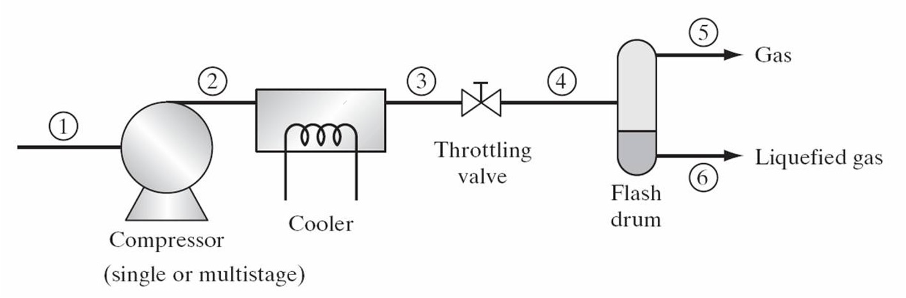
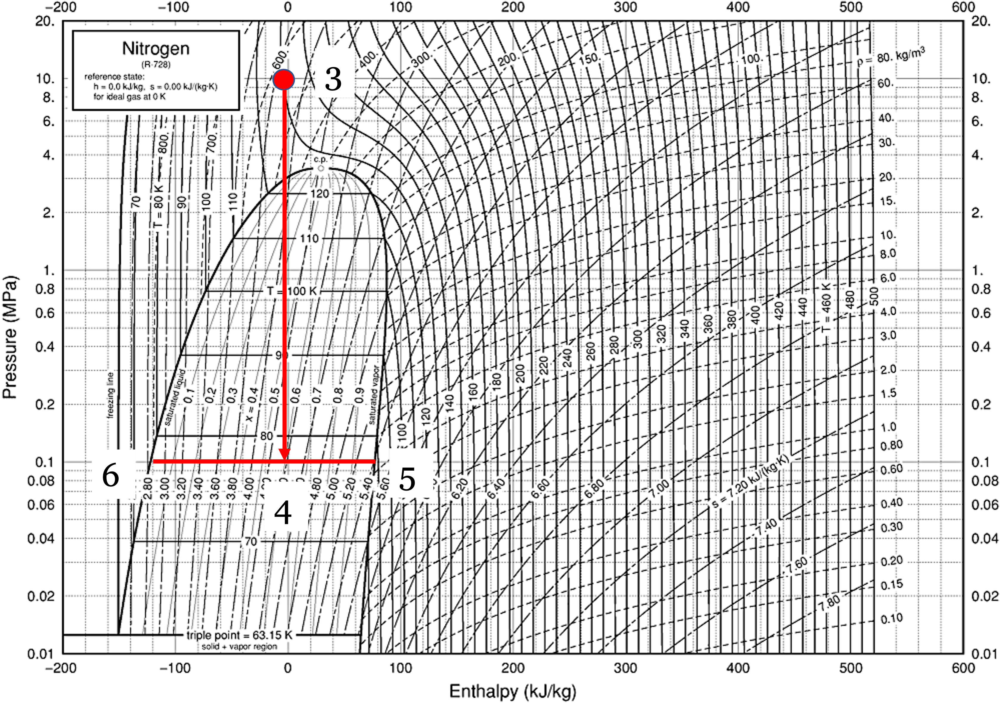
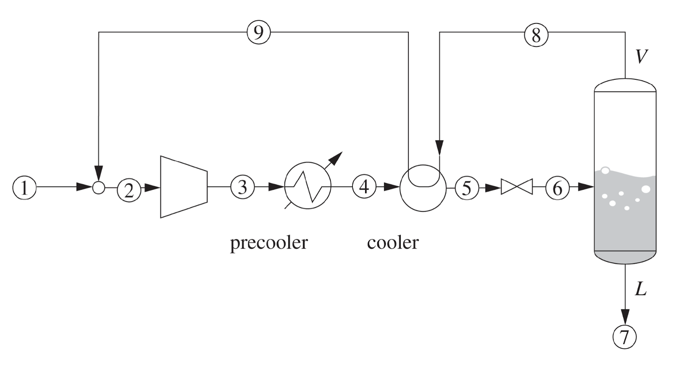
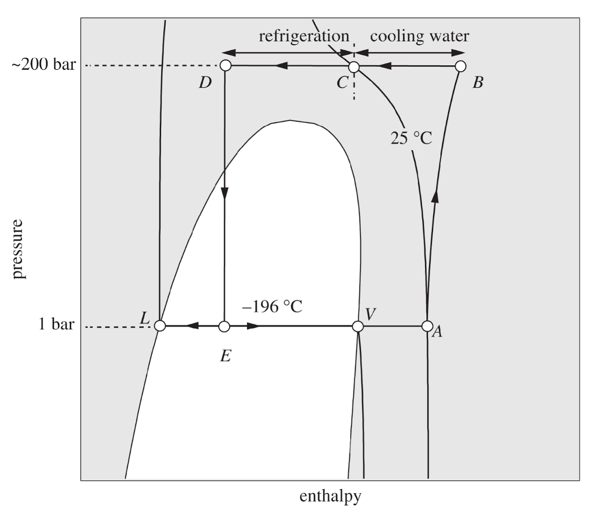
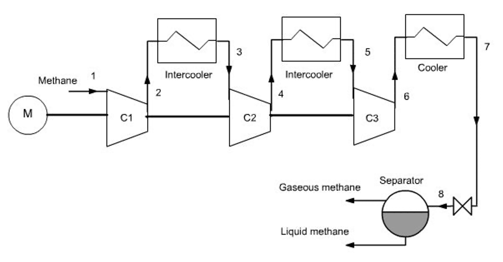
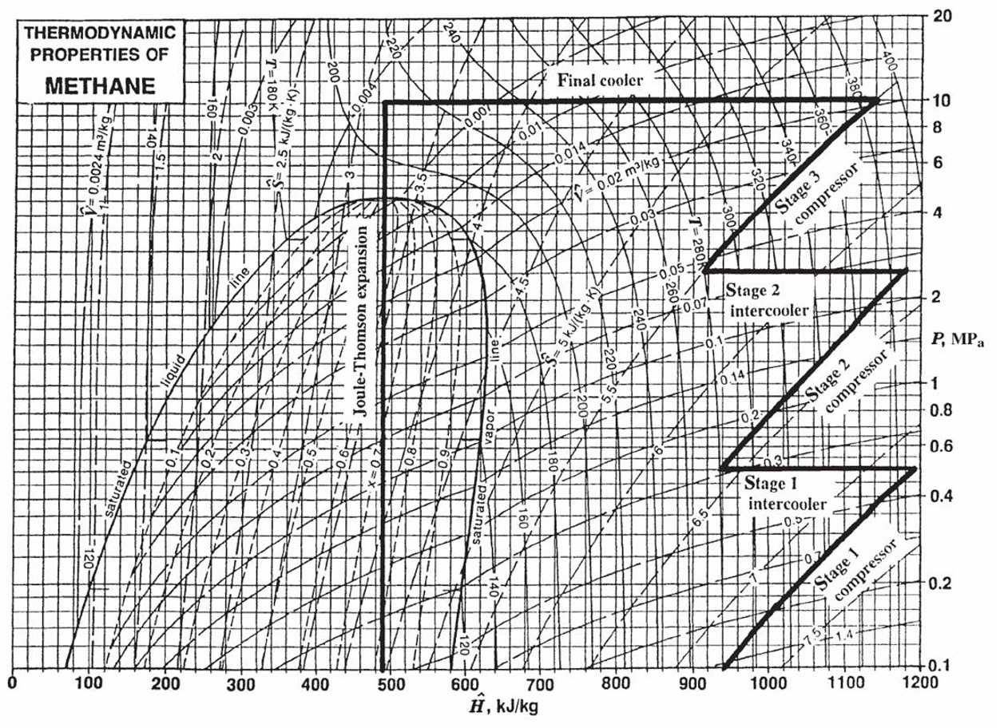
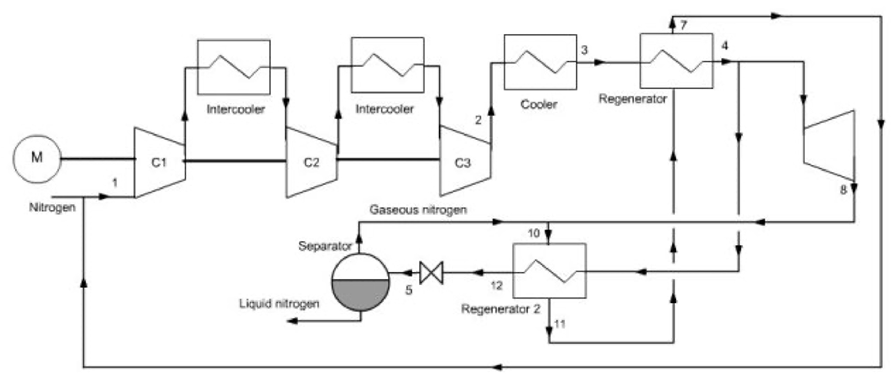
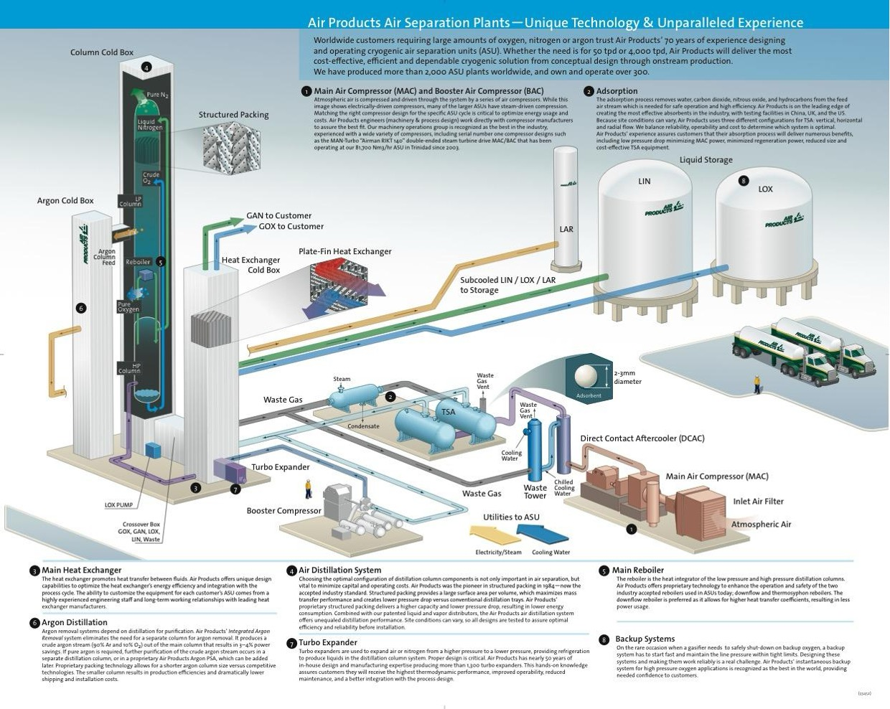

# Solving simple vapor compression cycles
In the last lecture, we introduced the basic components of a vapor compression cycle and discussed the thermodynamic processes that occur in each component. The efficiency, or coefficient of performance (COP), of the cycle depends on the operating conditions and the properties of the working fluid. Different refrigerants have different thermodynamic properties, which can significantly affect the performance of the cycle. The Jupyter notebook example here allows you to experiment with different operating conditions and refrigerants to see how they affect the states, work, heats, and COP of the cycle. You should perform a "hand calculation" using graphical methods (e.g., using a P-H  diagram) to solve a simple vapor compression cycle before using the notebook to verify your results and explore how changes in conditions affect the cycle performance.

::: {.callout-tip icon=false}
## Jupyter Notebook Example
I have prepared an interactive Jupyter Notebook that solves a simple vapor compression cycle.
It calculates the states, work, heats, and COP of the cycle based on user inputs for the pressure of the 
evaporator and condenser (or the temperatures, depending on the mode selected). 
The efficiency of the compressor is specified by the user.  The notebook uses CoolProp to 
obtain fluid properties and ipywidgets to create an interactive interface for exploring how 
different operating conditions and refrigerants affect cycle performance.

::: {.content-visible when-format="html"}

[**View Interactive Notebook (.ipynb)**](vapor-compression-cycle.ipynb)

:::

::: {.content-visible when-format="pdf"}
*Note: This example is available as an interactive Jupyter Notebook on the course website.*
:::
:::

---

# Introduction: How Do You Liquify Gases?

Up until the mid-1800s, the coldest temperature that was feasible to obtain for practical or scientific use was roughly the freezing point of water, $0^\circ\text{C}$ ($273\text{ K}$), using harvested ice. 

If you wanted to liquefy a gas during that era, your only tool was **pressure**. However, thermodynamics places a strict limit on this: **you cannot liquefy a gas by pressure alone if it is above its critical temperature ($T_c$).**

Let's look at a few historical examples:

* The first **liquefaction of a gas ($SO_2$**) by compression and cooling was achieved by Louis Clouet and Gaspard Monge around 1780. They sent the compressed gas through a coil which was inserted in a mixture of ice and salt and obtained liquid $SO_2$. (The normal boiling point of $SO_2$ is about $-10^\circ\text{C}$). Monge is regarded as the father
of differential geometry, he was a learned friend of Napoleon and a teacher of Sadi Carnot, who, in 1824,
published his famous paper ‘‘Reflexions sur la puissance motrice du feu et sur les machines propres a developper cette puissance’’, describing the Carnot cycle.

* **Ammonia ($NH_3$):** Martinus van Marum and Adriaan Paets van Troostwijk were successful in liquefying ammonia in 1787. Its normal boiling point is $240\text{ K}$ ($-33^\circ\text{C}$), and its critical temperature is $405\text{ K}$ ($132^\circ\text{C}$). It can be liquefied at room temperature by applying sufficient pressure (roughly $10\text{ bar}$).

* **Chlorine ($Cl_2$):** In 1823, Michael Faraday successfully liquefied chlorine. Its normal boiling point is $239\text{ K}$ ($-34^\circ\text{C}$), but its critical temperature is very high. At $25^\circ\text{C}$, Faraday simply had to compress it to about $8\text{ bar}$ to force it into a liquid state.

* In 1845, Faraday published his second paper regarding gas liquefaction. At that time he had much better equipment at his disposal: compressors that could achieve pressures up to 40 bar and a refrigeration bath consisting of ether and solid carbon dioxide that could achieve temperatures as low as $-110^\circ\text{C}$. By these means he was able to liquefy numerous gases, including ethylene. But he was unable to liquefy $CH_4$, $O_2$, $CO$, $N_2$, $N_2O$, and $H_2$. Helium had not yet been discovered.
  

## The "Permanent" Gases
It was thought that these gases that Faraday could not liquefy were "permanent" because no matter how hard they compressed them at $0^\circ\text{C}$, they refused to turn into liquids.  We now know why: their critical temperatures are much lower than $273\text{ K}$. For example, nitrogen ($N_2$) has a critical temperature of **$126.2\text{ K}$**. If you are at room temperature, nitrogen is a supercritical fluid. No amount of pressure will ever form a meniscus. 

In 1877, Louis Paul Cailletet (France) was trying to liquify **ethylene ($C_2H_4$)**. It has a normal boiling point of $169\text{ K}$ and a critical temperature of $282\text{ K}$ ($9^\circ\text{C}$). You cannot liquefy it at room temperature, but if you drop the temperature below $282\text{ K}$, you can liquefy it by compressing it to roughly $40-50\text{ bar}$. That is what Cailletet was trying to do, but before reaching this pressure, his apparatus ruptured and he observed a mist of tiny liquid droplets forming in the gas. He realized that the sudden expansion of the gas caused a rapid drop in temperature, which allowed the gas to condense into liquid droplets. This may have been the first observation of the Joule-Thomson effect, and it paved the way for future developments in gas liquefaction.

---

# Liquefying Oxygen and Nitrogen

You have all seen liquid nitrogen, so you know it is not really a "permanent gas". Its normal boiling temperature is $77\text{ K}$. To make it, we need a process that can dramatically drop the temperature of the gas *before* it condenses. To do this, we rely on the same phenomenon observed by Cailletet: the **Joule-Thomson expansion**.

Recall that when a high-pressure fluid is throttled through a valve (an isenthalpic process, $\Delta H = 0$), its temperature can drop, provided its Joule-Thomson coefficient $\left ( \mu_{JT}=\left ( \frac{\partial T}{\partial P} \right )_H \right )$ is positive. 

However, a single expansion from a compressor at room temperature isn't nearly enough to drop nitrogen all the way down to $77\text{ K}$. We need a way to compound that cooling effect.

## The Linde Process

In 1895, Carl von Linde patented a brilliant method to liquefy air by combining a compressor, a Joule-Thomson valve, and a **counter-current heat exchanger**. 

{#fig-simple-linde width=60%}

@fig-simple-linde shows the basic concept. What if we took air (or nitrogen) (state 1) and compressed it to state 2. We then cool the gas down in a heat exchanger to reach state 3. From there, expand it through a throttling valve to reach state 4, which is in the vapor-liquid dome. You can then take the cold vapor off the top of a "flash drum" (state 5) and draw off liquid as state 6! The basic idea is shown in the PH diagram for $N_2$ (@fig-N2-PH).  You can see that the point 3 before the throttle must be very cold and at a high pressure (the red dot). In this example, it is at T=130 K and P=10 MPa. When it is throttled to 0.1 MPa, the temperature drops to 77 K, and we are in the vapor-liquid dome. But how do you get to that cold state 3 in the first place? The answer is the heat exchanger.

{#fig-N2-PH width=60%}

The liquid fraction can be drawn off as the final product, and the cold vapor can be recycled back through the heat exchanger to pre-cool the incoming high-pressure gas. By doing this, we can "ratchet" the temperature down with each pass until we finally get liquid nitrogen.

**How the Linde Cycle Works:**

A practical Linde cycle consists of the following steps (@fig-linde-real)

1. **Compression:** Makeup gas (1) and recycled gas (9) are mixed (2) and compressed to a very high pressure (state 3). The heat of compression is rejected to cooling water to bring the gas back to roughly ambient temperature (4).

2. **Pre-cooling (The heat exchanger):** The high-pressure gas passes through a heat exchanger (5) where it is cooled by cold, un-liquefied gas (8) returning from the flash drum.

3. **Joule-Thomson Expansion:** The deeply chilled, high-pressure gas is throttled through a valve (6). The pressure drops, the temperature plummets, and the state enters the vapor-liquid dome.

4. **Separation:** The mixture enters a flash drum. The liquid is drawn off the bottom as the final product (7). 

5. **Recycle:** The extremely cold saturated vapor from the top of the drum is routed *back* through the heat exchanger (8) to pre-cool the incoming high-pressure gas, before returning to the compressor.

{#fig-linde-real width=60%}

### The Linde Process on a P-H Diagram
Because the core mechanism relies on isenthalpic throttling, this cycle is best visualized on a Pressure-Enthalpy diagram. (Note that the labels differ between @fig-linde-real and @fig-Linde-PH, but the states are the same). 

{#fig-Linde-PH width=60%}

Note that on the first "pass", the vapor (stream 8) will not be very cold. The gas will not liquify, but each cycle the gas will get colder and colder, until finally at steady state, liquid nitrogen can be produced. By constantly recycling the cold vapor, the heat exchanger "ratchets" the temperature of the incoming gas lower and lower until the throttling valve finally pushes the fluid across the saturated liquid line.

---

# Improvements to the Linde Process

The basic Linde process works, but it requires massive amounts of compressor work because it relies entirely on a single compression stage. Modern industrial plants use several modifications to improve efficiency:

1. **Multi-Stage Compression with Intercooling:** Instead of compressing the gas in one massive step, it is compressed in stages. Between each stage, the gas is cooled with water. This significantly reduces the total work required by the compressor and keeps operating temperatures safe.

{#fig-Linde-intercooler width=60%}

{#fig-methane-PH-intercooler width=60%}

2. **Auxiliary Pre-cooling:** Before the high-pressure gas enters the main counter-current heat exchanger, it can be passed through a standard vapor-compression refrigeration cycle (e.g., using ammonia, propane, or a cascade system). Dropping the temperature of the gas *before* it enters the Linde loop vastly increases the yield of liquid per pass. This is standard practice in **LNG (Liquefied Natural Gas)** facilities. Natural gas is mostly methane, which has a normal boiling point of $111\text{ K}$. 

---

# The Claude Process

Even with pre-cooling, throttling a gas across a valve wastes the potential to do work. Georges Claude realized that replacing the throttling valve with an **expansion turbine** could dramatically improve the process.

In the **Claude Process**:

* The high-pressure gas is split. A portion of it is routed through an expander (a turbine).

* As the gas expands *isentropically* through the turbine, it does work. Removing energy as work drops the temperature of the gas far more efficiently than an isenthalpic throttle!

* The work generated by this turbine is mechanically linked back to the main compressor, helping drive it and saving electricity.

* The ultra-cold exhaust from the turbine is mixed with the returning recycle stream to cool the main heat exchanger. 

* A small throttling valve is still used at the very end to create the final liquid fraction (because turbines do not handle forming liquid droplets very well without damaging their blades).

Because it recovers work and utilizes isentropic expansion, the Claude cycle can operate at much lower compression ratios than the standard Linde process. You can imagine that there are **many** opportunities to improve the efficiency of processes like this, which is what chemical engineers do for a living!

{#fig-Claude width=60%}

---

# Industrial Gas Companies

The principles of the Linde and Claude processes are the foundation of the massive **Air Separation Units (ASUs)** that drive the modern industrial gas sector. 

Companies like **Linde** (which merged with Praxair), **Air Liquide**, and **Air Products** build chemical plants whose only feedstock is the atmosphere itself. They compress, liquefy, and cryogenically distill air to provide:

* Liquid oxygen for steel manufacturing and hospitals.

* Liquid nitrogen for food freezing, semiconductor manufacturing, and inerting.

* Argon for welding and specialty electronics.

When you see enormous, windowless white towers at a chemical facility, you are likely looking at a cryogenic distillation column operating at $-196^\circ\text{C}$, entirely made possible by the thermodynamic cycles we've covered today. You will learn more about this in your next course on phase equilibrium and separation processes.

{#fig-AP-plant width=80%}