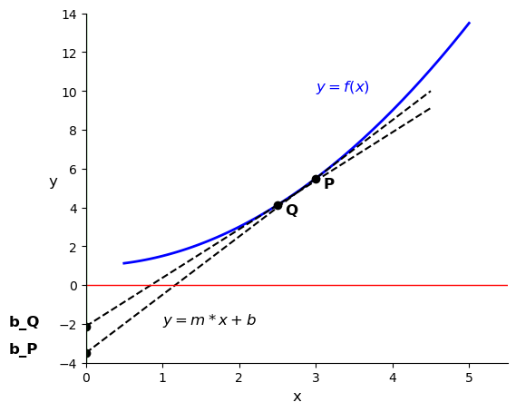
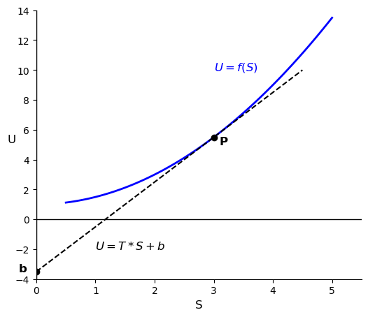

# Introduction: Moving from Concepts to Mathematics

So far in this course, we have used the 1st and 2nd Laws to analyze equipment (turbines, pumps, heat exchangers) and thermodynamic cycles (Rankine, Brayton, vapor compression). To do this, we relied heavily on **tables and charts** to find properties like internal energy ($U$), enthalpy ($H$), and entropy ($S$).

But where do those tables come from? If you invent a new refrigerant tomorrow, how do you populate its thermodynamic table? You cannot stick a meter into a tank to measure its internal energy or entropy. You can only measure **temperature ($T$), pressure ($P$), and volume ($V$)**. You also can't measure every possible state of the system to fill out a table. Instead, you need a mathematical framework to **rewrite thermodynamics in terms of measurable variables**. 

Starting today, we will learn the underlying mathematics that allow us to calculate unmeasurable properties ($U, H, S$) entirely from measurable ones ($P, V, T$ and heat capacity, $C_p$).

---

# The Fundamental Equation of Thermodynamics

Let's combine the First and Second Laws for a closed, single-component system.
From the First Law (energy balance):
$$dU = \delta Q + \delta W$$ {#eq-1stlaw}

If we assume a **reversible process** where only expansion/compression work is done
$$dU = \delta Q_{rev} + \delta W_{rev}$$ {#eq-1stlaw-rev}

* From the 2nd Law: $\delta Q_{rev} = T dS$
* Mechanical Work: $\delta W_{rev} = -P dV$

Substituting these in yields the **Fundamental Equation of Thermodynamics**:
$$dU = T dS - P dV$${#eq-fundamental}

>**Crucial Note:** Even though we derived this assuming a reversible process, $U$, $S$, and $V$ are all **state functions**. Therefore, this equation holds true for *any* process between two equilibrium states, reversible or irreversible! 

This equation shows us that the "natural" independent variables for internal energy are entropy and volume: $U = U(S, V)$.

---

# Math Review: Exact Differentials

Because $U$, $S$, and $V$ are state functions, their differentials are **exact**. 
From multivariable calculus, if we have a function $F(x,y)$, its total differential is:
$$dF = \left( \frac{\partial F}{\partial x} \right)_y dx + \left( \frac{\partial F}{\partial y} \right)_x dy$$ {#eq-exact-diff}

Let's define the partial derivatives as coefficients:
$$M(x,y) \equiv \left( \frac{\partial F}{\partial x} \right)_y \quad \text{and} \quad N(x,y) \equiv \left( \frac{\partial F}{\partial y} \right)_x$$
So, $dF = M dx + N dy$.

A fundamental property of exact differentials is that the mixed second partial derivatives must be equal. This means the order of differentiation does not matter:
$$\left( \frac{\partial M}{\partial y} \right)_x = \left( \frac{\partial N}{\partial x} \right)_y$$
*(Keep this in your back pocket. We will use this exact property in an upcoming lecture to derive the Maxwell Relations!)*

Applying this total differential framework to the fundamental equation @eq-fundamental, we immediately see that:
$$ dU = \left( \frac{\partial U}{\partial S} \right)_V dS + \left( \frac{\partial U}{\partial V} \right)_S dV$$
or that
$$T = \left( \frac{\partial U}{\partial S} \right)_V$$ {#eq-T} 

$$-P = \left( \frac{\partial U}{\partial V} \right)_S$$ {#eq-P}

Temperature and pressure are simply the partial derivatives (or slopes) of the internal energy surface!

---

# Legendre Transforms: Creating New Potentials

The function $U(S,V)$ contains all the fundamental thermodynamic information about a system. However, $S$ and $V$ are highly inconvenient variables for chemical engineers. It is very hard to hold entropy constant in a lab. We prefer to work with **temperature** and **pressure**.

We need a way to swap our independent variables ($S \to T$ and $V \to P$) *without losing any information*. 

## The Mathematical Problem
Suppose we have a generic function $y = f(x)$. We know the value of $y$ at each $x$ as well as the slope $m = \frac{df}{dx}$. We want to replace the independent variable $x$ with the slope of the curve, $m = \frac{df}{dx}$. 

>Why would we want to do that? Because in thermodynamics, the slope of the internal energy curve with respect to entropy is temperature (see @eq-T), and the slope with respect to volume is minus the pressure (see @eq-P). If we can rewrite our equations in terms of these slopes, we can work directly with measurable variables $T$ and $P$ instead of $S$ and $V$.

Coming back to the simple equation $y = f(x)$, our first instinct might be to just write $y$ as a function of $m$, so $y = g(m)$. **But this fails.** If I only tell you the slope of a curve at various points, you don't know exactly where the curve sits on the y-axis. An infinite family of parallel curves all share the exact same slope $m$ at a given $x$. By simply swapping $x$ for $m$, we lose the integration constant. We have lost physical data.

## The Legendre Solution
How do we uniquely identify a curve using only its slopes? We define the curve not as a series of points, but as an **envelope of tangent lines**. 

{#fig-xyplot1 width=60%}

The equation of a tangent line is $y = mx + b$. If we rearrange this to solve for the y-intercept $b$, we get:
$$b = y - mx$$ {#eq-yint}

This intercept $b$ is a new function that depends entirely on the slope $m$. In @fig-xyplot1, the tangent at point $P$ has a slope $m$ and intercept $b$. Different slopes $m$ give different intercepts $b$. We can see this in the figure by drawing a second tangent line at point $Q$ with a different slope and intercept.

{#fig-xyplot2 width=60%}

Because every point on the original curve (see the blue curves in @fig-xyplot1 and @fig-xyplot2) has a unique tangent line intercept, **the function $b(m)$ contains the exact same information as $y(x)$!**

This is the **Legendre Transform**. To transform a function into a new potential that depends on the slope rather than the original variable, we subtract the product of the old variable and its conjugate slope. By analogy to @eq-yint, the Legendre Transform of a function $F_{old}(x)$ is:
$$F_{new} = F_{old} - x \left( \frac{\partial F_{old}}{\partial x} \right)$$

The new function $F_{new}$ is a function of the slope $\left( \frac{\partial F_{old}}{\partial x} \right)$, and it contains the same information as $F_{old}$.

Let's apply this mathematical trick to the internal energy equation, $dU = T dS - P dV$, to create a new thermodynamic potential.

## 1. A fundamental thermodynamic potential in terms of $S$ and $P$: $F(S,P)$

{#fig-USplot width=60%}

Let's swap volume ($V$) for pressure ($P$) in @eq-fundamental to get a new thermodynamic potential that is a function of $S$ and $P$. From @eq-P, the conjugate slope to $V$ is $-P$.
$$F_{new} \equiv U - V(-P) = U + PV$$
Taking the differential:
$$dF_{new} = dU + P dV + V dP$$
Substitute $dU = T dS - P dV$:
$$dF_{new} = (T dS - P dV) + P dV + V dP \implies \mathbf{dF_{new} = T dS + V dP}$$
*Natural variables for the new function $F(S,P)$:* $F_{new} = F_{new}(S, P)$.

We have  met this new function before. It is called the **enthalpy ($H$)**:
$$H \equiv U + PV$$ {#eq-enthalpy}
$$dH = T dS + V dP$$ {#eq-enthalpy-diff}

*Natural variables for enthalpy:* $H = H(S, P)$. Early in the course, we defined enthalpy as $H = U + PV$ and used it as a convenient way to analyze flow processes. Now we see that it has a deeper mathematical meaning: it is the Legendre Transform of internal energy that allows us to swap volume for pressure. It is a new thermodynamic potential that contains the same information as $U$, but is expressed in terms of more convenient variables.

## 2. A fundamental thermodynamic potential in terms of $T$ and $V$: $F(T,V)$
Instead of a function in terms of $S$ and $V$ or $S$ and $P$, let's create a new function in terms of $T$ and $V$. Starting from the internal energy equation, let's swap entropy ($S$) for temperature ($T$). The conjugate slope to $S$ is $T$ (@eq-T):
$$F_{new} \equiv U - S(T) = U - TS$$
Taking the differential:
$$dF_{new} = dU - T dS - S dT$$
Substitute $dU = T dS - P dV$:
$$dF_{new} = (T dS - P dV) - T dS - S dT \implies \mathbf{dF_{new} = -S dT - P dV}$$
*Natural variables for $F(T,V)$:* $F_{new} = F_{new}(T, V)$. 
This new function is called the **Helmholtz Free Energy and is given the symbol $A$**, which stands for the German word "Arbeit" or "work". 

$$A \equiv U - TS$$ {#eq-helmholtz}
$$dA = -S dT - P dV$$ {#eq-helmholtz-diff}
*Natural variables for Helmholtz Free Energy:* $A = A(T, V)$.

## 3. Gibbs Free Energy $G(T,P)$
Finally, we will derive the Gibbs Free Energy. I won't bother to hide the symbol; we want to find $G(T,P)$ that contains the same information as $U(S,V)$. We could apply a Legendre Transform to $A(T,V)$ and swap $V$ for $P$. Try it! Instead, let's swap *both* $V$ for $P$, and $S$ for $T$ starting with $U(S,V)$. We apply the transform twice:
$$G \equiv U - V(-P) - S(T) = U + PV - TS = H - TS$$ {#eq-gibbs}
Taking the differential:
$$dG = dH - T dS - S dT$$
Substitute $dH = T dS + V dP$:
$$dG = (T dS + V dP) - T dS - S dT \implies \mathbf{dG = -S dT + V dP}$$ {#eq-gibbs-diff}
*Natural variables for Gibbs:* $G = G(T, P)$. *(The Gibbs free energy is the most useful potential for chemical engineers since $T$ and $P$ are easily controlled or measured).*

---

# The Thermodynamic Square

We now have four fundamental equations of state, derived rigorously using exact differentials and Legendre Transforms:

1. $dU = T dS - P dV$

2. $dH = T dS + V dP$

3. $dA = -S dT - P dV$

4. $dG = -S dT + V dP$

Memorizing these and their signs can be tedious. Instead, you can use a mnemonic device called the **Thermodynamic Square**.

Draw a square and place the potentials ($U, A, G, H$) on the flat sides, and the variables ($S, V, T, P$) on the corners. The two variables on either side of a thermodynamic potential are the natural variables for that potential. Add two arrows pointing upwards diagonally. These connect the natural variables to their conjugate variables. If you move in the direction of the arrow, the sign is positive. If you move against the direction of the arrow, the sign is negative.

{#fig-thermo-square width=60%}

A common mnemonic to remember the order of the corners and sides is:
**V**ery **A**wesome **T**hermodynamics **U**nder **G**raduate **S**tudents **H**elp **P**rofessors!

As an example, look at $A$ in the square. The natural variables for $A$ are $T$ and $V$ and they are on either side of $A$. Thus we know $dA = ? dT \pm ? dV$. The conjugate variable to $T$ is $S$, and the conjugate variable to $V$ is $P$. So we know $dA = \pm S dT \pm P dV$. Moving from $T$ to $S$ you go against the arrow, so you know the sign on that term is negative. Moving from $V$ to $P$ you go against the arrow, so you know the sign on that term is also negative. This matches exactly what we derived for $dA$ above: $dA = -S dT - P dV$.