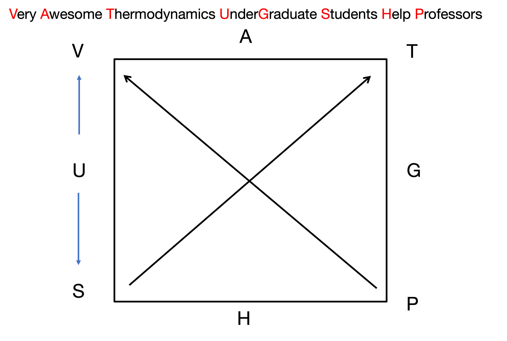

# Introduction: From Concepts to Math

## Moving from Concepts to Mathematics
* **So far:** We analyzed equipment (turbines, pumps) and cycles using the 1st and 2nd Laws.
* **The Method:** We relied heavily on tables and charts to find $U$, $H$, and $S$.
* **The Problem:** Where do those tables come from? 
  * You cannot directly measure Internal Energy ($U$) or Entropy ($S$) with a meter.
  * You can only measure Temperature ($T$), Pressure ($P$), Volume ($V$), and Heat Capacity ($C_p$).
* **The Goal:** Develop a mathematical framework to rewrite thermodynamics entirely in terms of measurable variables.

# The Fundamental Equation

## The Fundamental Equation of Thermodynamics
Let's combine the First and Second Laws for a closed, single-component system.

* **First Law (Energy Balance):** $$dU = \delta Q + \delta W$$
* **Reversible Process Assumptions:** * 2nd Law: $\delta Q_{rev} = T dS$  
  * Mechanical Work: $\delta W_{rev} = -P dV$
* **Substitute:** $$dU = T dS - P dV$$

## Properties of the Fundamental Equation
$$dU = T dS - P dV$$

* **Crucial Note:** Even though we assumed a reversible process, $U$, $S$, and $V$ are all **state functions**.
* This equation holds true for *any* process between two equilibrium states, reversible or irreversible!
* It shows the "natural" independent variables for Internal Energy:  
  $$U = U(S, V)$$

# Math Review: Exact Differentials

## Exact Differentials
Because $U$, $S$, and $V$ are state functions, their differentials are **exact**. 

* From multivariable calculus, for a function $F(x,y)$:
  $$dF = \left( \frac{\partial F}{\partial x} \right)_y dx + \left( \frac{\partial F}{\partial y} \right)_x dy$$
* Let's define the partial derivatives as coefficients:
  $$dF = M(x,y) dx + N(x,y) dy$$
* **Key Property:** The mixed second partial derivatives must be equal:
  $$\left( \frac{\partial M}{\partial y} \right)_x = \left( \frac{\partial N}{\partial x} \right)_y$$

## Applying Exact Differentials to U
Apply this framework to our fundamental equation:
$$dU = T dS - P dV$$

We immediately see that:
$$T = \left( \frac{\partial U}{\partial S} \right)_V \quad \text{and} \quad -P = \left( \frac{\partial U}{\partial V} \right)_S$$

Temperature and Pressure are simply the partial derivatives (or slopes) of the Internal Energy surface!

# Legendre Transforms

## The Variable Problem
* $U(S,V)$ contains all fundamental thermodynamic information.
* **However:** $S$ and $V$ are highly inconvenient variables for chemical engineers. It is very hard to hold entropy constant in a lab. 
* We prefer to work with **Temperature** and **Pressure**.
* We need to swap variables ($S \to T$ and $V \to P$) *without losing information*.

## Why Simple Swapping Fails
Suppose we have a generic function $y = f(x)$ and want to replace $x$ with the slope $m = \frac{df}{dx}$.

* If we just write $y = g(m)$, **it fails**.
* Parallel curves have the exact same slope $m$ at a given $x$.
* Swapping variables loses the integration constant—we lose physical data!

## The Legendre Solution
How do we uniquely identify a curve using only its slopes? Define it as an **envelope of tangent lines**.

* Tangent line: $y = mx + b$
* Solve for the y-intercept: **$b = y - mx$**
* Because every point has a unique tangent intercept, the function $b(m)$ contains the exact same info as $y(x)$!

**The Legendre Transform:**
$$F_{new} = F_{old} - x \left( \frac{\partial F_{old}}{\partial x} \right)$$

## 1. Enthalpy ($H$)
Let's swap Volume ($V$) for Pressure ($P$). The conjugate slope to $V$ is $-P$.

* **Definition:** $H \equiv U - V(-P) = U + PV$
* **Differential:** $dH = dU + P dV + V dP$
* **Substitute $dU$:** $dH = (T dS - P dV) + P dV + V dP$
* **Result:** $$\mathbf{dH = T dS + V dP}$$
* *Natural variables:* $H(S, P)$.

## 2. Helmholtz Free Energy ($A$)
Let's swap Entropy ($S$) for Temperature ($T$). The conjugate slope to $S$ is $T$.

* **Definition:** $A \equiv U - S(T) = U - TS$
* **Differential:** $dA = dU - T dS - S dT$
* **Substitute $dU$:** $dA = (T dS - P dV) - T dS - S dT$
* **Result:** $$\mathbf{dA = -S dT - P dV}$$
* *Natural variables:* $A(T, V)$.

## 3. Gibbs Free Energy ($G$)
Let's swap *both* $V \to P$, and $S \to T$. Apply the transform twice.

* **Definition:** $G \equiv U - V(-P) - S(T) = U + PV - TS = H - TS$
* **Differential:** $dG = dH - T dS - S dT$
* **Substitute $dH$:** $dG = (T dS + V dP) - T dS - S dT$
* **Result:** $$\mathbf{dG = -S dT + V dP}$$
* *Natural variables:* $G(T, P)$. (Most useful for Chemical Engineers!)

# The Thermodynamic Square

## The Four Fundamental Potentials
We now have four fundamental equations of state:

1. $dU = T dS - P dV$
2. $dH = T dS + V dP$
3. $dA = -S dT - P dV$
4. $dG = -S dT + V dP$

Memorizing these and their signs is tedious. Let's use a mnemonic device...

## The Thermodynamic Square
**V**ery **A**wesome **T**hermodynamics **U**nder **G**raduate **S**tudents **H**elp **P**rofessors!

{#fig-thermo-square width=50%}

*Arrows point from S to T, and from P to V.*

## How to Read the Square
Let's find the differential for Helmholtz Free Energy ($dA$):

1. **Natural Variables:** The two corners adjacent to $A$ are $T$ and $V$. 
   * $dA = (\dots)dT \pm (\dots)dV$
2. **Coefficients:** Look across the square.
   * Across from $T$ is $S$.
   * Across from $V$ is $P$.
3. **Sign Rule:** Move against arrow = negative. Move with arrow = positive.
   * $T \to S$ is *against* the arrow ($-S$)
   * $V \to P$ is *against* the arrow ($-P$)
4. **Result:** $dA = -S dT - P dV$
