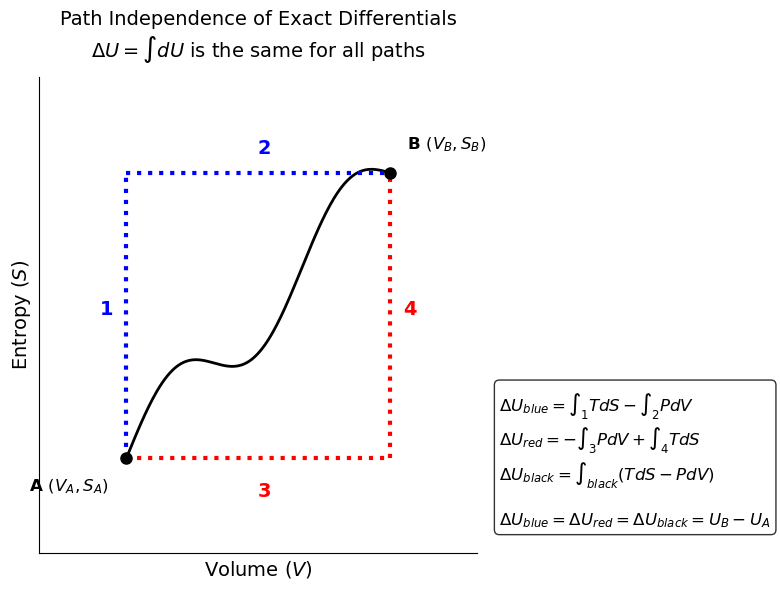

# Introduction: Using the Math of Thermodynamics

In the last lecture, we established that all thermodynamic state functions ($U, H, A, G$) have exact differentials. Using Legendre transforms, we showed that these expressions all contain the same information, just rearranged and written in terms of two different independent variables. We also introduced the Thermodynamic Square to help us remember these fundamental equations. 

Today, we will use the properties of exact differentials to derive the **Maxwell Relations**. These relations are the "magic key" of thermodynamics. They allow us to take unmeasurable quantities like entropy derivatives and swap them for easily measurable $P-V-T$ derivatives. By the end of this lecture, we will have rigorous equations to calculate $\Delta S$, $\Delta H$, and $\Delta U$ for *any* real fluid from $P-V-T$ data.

---

# The Maxwell Relations

Last class, we showed that a state function $F(x,y)$ has an exact differential of the form:
  $$dF = \left( \frac{\partial F}{\partial x} \right)_y dx + \left( \frac{\partial F}{\partial y} \right)_x dy$$ {#eq-exact-diff}

The partial derivatives in @eq-exact-diff are coefficients:
  $$dF = M(x,y) dx + N(x,y) dy$$

For example, our original fundamental equation for internal energy was:
$$dU = T dS - P dV$$    

The coefficients of the differentials are just the slopes of the surface in each direction:
$$T = \left( \frac{\partial U}{\partial S} \right)_V \quad \text{and} \quad -P = \left( \frac{\partial U}{\partial V} \right)_S$$

Because thermodynamic variables are state functions, you can follow any path to calculate changes between equilibrium states. As shown in @fig-SV-paths, you can follow constant $S$ and $V$ paths in any order to compute the change in $U$; you don't have to follow the "real" path. This is because $U$, $S$, and $V$ are all state functions. 

{#fig-SV-paths width=75%}

This has the following mathematical consequence. The order of differentiation does not matter for an exact differential.
$$\left[ \frac{\partial}{\partial y}  \left( \frac{\partial F}{\partial x} \right)_y \right ]_x = \left[ \frac{\partial}{\partial x}  \left( \frac{\partial F}{\partial y} \right)_x \right ]_y$$

Referring to @eq-exact-diff, if $dF = M dx + N dy$, then the mixed second partial derivatives must be equal:

$$\left( \frac{\partial M}{\partial y} \right)_x = \left( \frac{\partial N}{\partial x} \right)_y$$ {#eq-maxwell-general}

Let's apply this rule systematically to the four fundamental equations.

## From Internal Energy ($U$)
$$dU = T dS - P dV$$
Here, $x = S, y = V, M = T, N = -P$. Applying the exactness criterion:
$$\left( \frac{\partial T}{\partial V} \right)_S = -\left( \frac{\partial P}{\partial S} \right)_V$$ {#eq-maxwell-U}

## From Enthalpy ($H$)
$$dH = T dS + V dP$$
Applying the exactness criterion:
$$\left( \frac{\partial T}{\partial P} \right)_S = \left( \frac{\partial V}{\partial S} \right)_P$$ {#eq-maxwell-H}

## From Helmholtz Free Energy ($A$)
$$dA = -S dT - P dV$$
Applying the exactness criterion:
$$\left( \frac{\partial S}{\partial V} \right)_T = \left( \frac{\partial P}{\partial T} \right)_V$$ {#eq-maxwell-A}

## From Gibbs Free Energy ($G$)
$$dG = -S dT + V dP$$
Applying the exactness criterion:
$$-\left( \frac{\partial S}{\partial P} \right)_T = \left( \frac{\partial V}{\partial T} \right)_P$$ {#eq-maxwell-G}

*Note: The last two Maxwell relations (from $A$ and $G$) are by far the most useful in chemical engineering, because they relate entropy at a constant temperature directly to volumetric ($P-V-T$) properties.*

---

# Calculating Entropy Changes

Let's see the power of these relations in action. Suppose we want to calculate the change in entropy of a real gas, and we choose to use $T$ and $P$ as our independent variables.
$$S = S(T, P)$$

Taking the total differential:
$$dS = \left( \frac{\partial S}{\partial T} \right)_P dT + \left( \frac{\partial S}{\partial P} \right)_T dP$$

We need to replace these two partial derivatives with measurable quantities.

1. **The Temperature Derivative:** Recall the definition of constant-pressure heat capacity: $C_p = \left( \frac{\partial H}{\partial T} \right)_P$. Since $dH = T dS + V dP$, at constant pressure ($dP = 0$), $dH = T dS$. Therefore:
   $$C_p = T \left( \frac{\partial S}{\partial T} \right)_P \implies \left( \frac{\partial S}{\partial T} \right)_P = \frac{C_p}{T}$$

2. **The Pressure Derivative:** We apply the Maxwell relation from the Gibbs Free Energy (@eq-maxwell-G):
   $$\left( \frac{\partial S}{\partial P} \right)_T = -\left( \frac{\partial V}{\partial T} \right)_P$$

Substitute these back into the total differential:
$$dS(T, P) = \frac{C_p}{T} dT - \left( \frac{\partial V}{\partial T} \right)_P dP$$ {#eq-dS-TP}

If we instead chose $T$ and $V$ as our variables, $S = S(T,V)$, we would use $C_v$ and the Maxwell relation from $A$ to get:
$$dS(T, V) = \frac{C_v}{T} dT + \left( \frac{\partial P}{\partial T} \right)_V dV$$ {#eq-dS-TV}

Remember we derived an expression for the change in entropy of an ideal gas in terms of $T$ and $P$:
$$\Delta S = C_p \ln \left( \frac{T_2}{T_1} \right) - R \ln \left( \frac{P_2}{P_1} \right)$$
This is just the integrated form of @eq-dS-TP for an ideal gas, where $\left( \frac{\partial V}{\partial T} \right)_P = \frac{R}{P}$. For a real gas, that term is not $\frac{R}{P}$, and the change in entropy is more complicated. However, @eq-dS-TP is still exact and can be used to calculate the change in entropy of any real fluid from $P-V-T$ data!

The same is true for the change in entropy of a real fluid as a function of $T$ and $V$ using @eq-dS-TV. For an ideal gas, $\left( \frac{\partial P}{\partial T} \right)_V = \frac{R}{V}$, and we recover the ideal gas expression for $\Delta S$ in terms of $T$ and $V$. For a real fluid, that term is not $\frac{R}{V}$, but @eq-dS-TV still holds and can be used to calculate the change in entropy from $P-V-T$ data.

---

# Calculating Enthalpy and Internal Energy

Now let's find the general equation for Enthalpy using $T$ and $P$:
$$dH = \left( \frac{\partial H}{\partial T} \right)_P dT + \left( \frac{\partial H}{\partial P} \right)_T dP$$

We already know the first term is $C_p$. For the second term, we use the fundamental equation $dH = T dS + V dP$. Dividing by $dP$ at constant $T$:
$$\left( \frac{\partial H}{\partial P} \right)_T = T \left( \frac{\partial S}{\partial P} \right)_T + V$$
Substitute the Maxwell relation @eq-maxwell-G $\left( \frac{\partial S}{\partial P} \right)_T = -\left( \frac{\partial V}{\partial T} \right)_P$:
$$\left( \frac{\partial H}{\partial P} \right)_T = V - T \left( \frac{\partial V}{\partial T} \right)_P$$

So the exact, general equation for enthalpy is:
$$dH = C_p dT + \left[ V - T \left( \frac{\partial V}{\partial T} \right)_P \right] dP$$ {#eq-dH-TP}

## Sanity Check: The Ideal Gas
Does this work for an ideal gas? Let's check. For an ideal gas, $V = \frac{RT}{P}$.
The derivative is: $\left( \frac{\partial V}{\partial T} \right)_P = \frac{R}{P}$.
Substitute this into the bracketed term in our $dH$ equation:
$$\left[ V - T \left( \frac{R}{P} \right) \right] = V - \frac{RT}{P} = V - V = 0!$$
The entire pressure dependence vanishes, leaving $dH = C_p dT$, exactly as we learned earlier in the semester! For a real gas, that bracketed term is *not* zero, because atomic interactions and excluded volume matter.

Similarly, we can derive the general equation for Internal Energy ($U$) as a function of $T$ and $V$:
$$dU = C_v dT + \left[ T \left( \frac{\partial P}{\partial T} \right)_V - P \right] dV$$ {#eq-dU-TV}
*(You should verify for yourself that the bracketed term goes to zero for an ideal gas!)*

---
---

# Mathematical Tools: The Cyclic Rule

To evaluate these partial derivatives for liquids and solids, we need a few more mathematical tools. A highly useful identity from multivariable calculus for any implicit function $F(x,y,z) = 0$ is the **Triple Product Rule** (or Cyclic Rule):
$$\left( \frac{\partial x}{\partial y} \right)_z \left( \frac{\partial y}{\partial z} \right)_x \left( \frac{\partial z}{\partial x} \right)_y = -1$$ {#eq-cyclic}

Let's apply this to our $P-V-T$ surface:
$$\left( \frac{\partial P}{\partial T} \right)_V \left( \frac{\partial T}{\partial V} \right)_P \left( \frac{\partial V}{\partial P} \right)_T = -1$$

Rearranging this gives us a powerful way to evaluate the change in pressure with temperature at constant volume, which is notoriously difficult to measure experimentally:
$$\left( \frac{\partial P}{\partial T} \right)_V = -\frac{\left( \frac{\partial V}{\partial T} \right)_P}{\left( \frac{\partial V}{\partial P} \right)_T}$$

---

# Volumetric Properties: $\beta$ and $\kappa$

For liquids and solids, engineers often tabulate volumetric behavior using two coefficients:

1. **Volume Expansivity ($\beta$):** How much a material expands when heated at constant pressure.
   $$\beta \equiv \frac{1}{V} \left( \frac{\partial V}{\partial T} \right)_P$$ {#eq-beta}

2. **Isothermal Compressibility ($\kappa$):** How much a material shrinks when squeezed at constant temperature. (The negative sign ensures $\kappa$ is a positive number).
   $$\kappa \equiv -\frac{1}{V} \left( \frac{\partial V}{\partial P} \right)_T$$ {#eq-kappa}

If we substitute these definitions into the cyclic rule relation we just derived, we get:
$$\left( \frac{\partial P}{\partial T} \right)_V = \frac{\beta V}{\kappa V} = \frac{\beta}{\kappa}$$

---

# The Rigorous $C_p - C_v$ Relationship

Earlier in the semester, we stated that for an ideal gas, $C_p - C_v = R$. But what is the relationship for a real fluid? 

Let's start by equating our two equations for entropy:
$$dS = \frac{C_p}{T} dT - \left( \frac{\partial V}{\partial T} \right)_P dP = \frac{C_v}{T} dT + \left( \frac{\partial P}{\partial T} \right)_V dV$$

Divide the entire equation by $dT$ while holding volume constant ($dV = 0$):
$$\frac{C_p}{T} - \left( \frac{\partial V}{\partial T} \right)_P \left( \frac{\partial P}{\partial T} \right)_V = \frac{C_v}{T} + 0$$

Rearrange to solve for $C_p - C_v$:
$$C_p - C_v = T \left( \frac{\partial V}{\partial T} \right)_P \left( \frac{\partial P}{\partial T} \right)_V$$

Substitute the cyclic rule substitution $\left( \frac{\partial P}{\partial T} \right)_V = -\frac{(\partial V/\partial T)_P}{(\partial V/\partial P)_T}$:
$$C_p - C_v = -T \frac{\left[ \left( \frac{\partial V}{\partial T} \right)_P \right]^2}{\left( \frac{\partial V}{\partial P} \right)_T}$$

Finally, substitute our definitions of $\beta$ and $\kappa$:
$$C_p - C_v = \frac{T V \beta^2}{\kappa}$$ {#eq-Cp-Cv}

**Why is this profound?** 

1. Because $T, V,$ and $\kappa$ are always positive, and $\beta^2$ must be positive, **$C_p$ is always greater than or equal to $C_v$**. 

2. As $T \to 0$ (absolute zero), $C_p \to C_v$.

3. For liquids and solids, water being a notable exception at $4^\circ\text{C}$, $\beta$ is very small, meaning $C_p \approx C_v$. This mathematically proves why we often just use a single "$C$" for liquids and solids!

You should verify that @eq-Cp-Cv reduces to $C_p - C_v = R$ for an ideal gas.