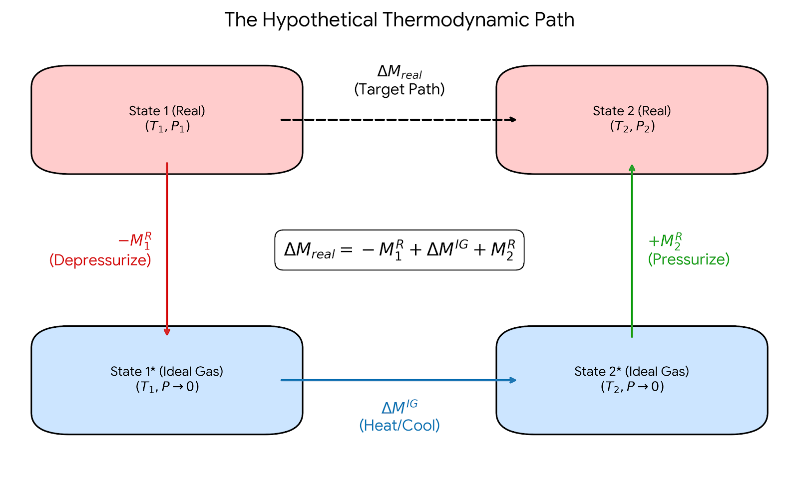
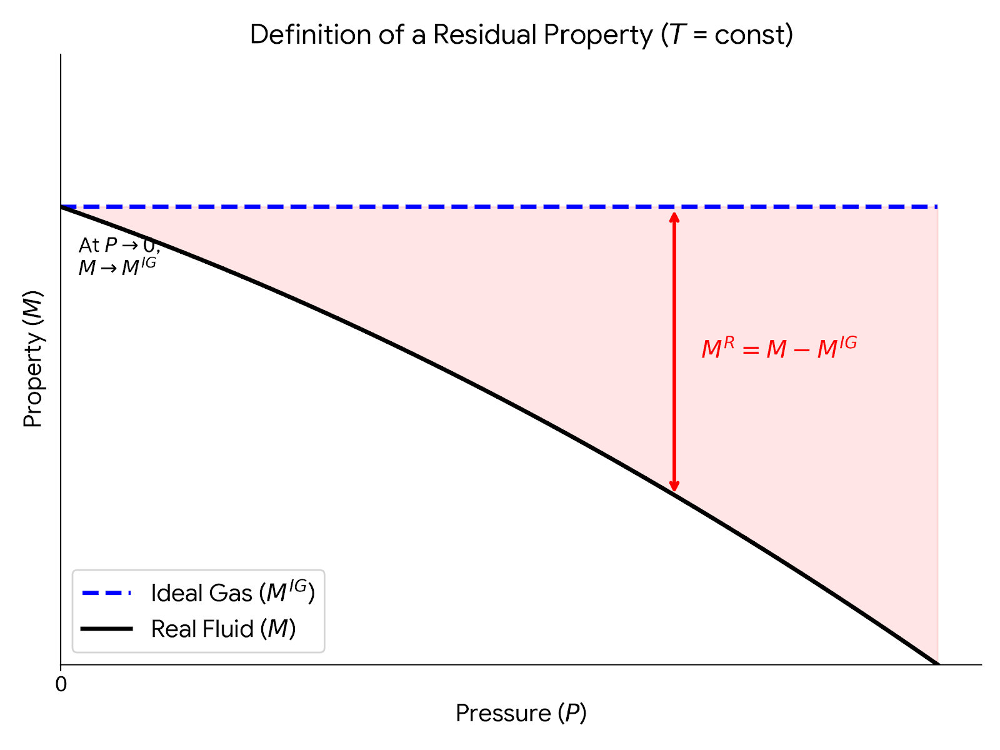

# Introduction: Breaking the Ideal Gas Mindset

In our last lecture, we used the Maxwell relations to derive exact, general equations for changes in internal energy ($dU$) and enthalpy ($dH$). 

Let's recall the general equation for internal energy:
$$dU = C_v dT + \left[ T \left( \frac{\partial P}{\partial T} \right)_V - P \right] dV$$ {#eq-du}

> Note: I am working with molar quantities, but not underlining variables for simplicity. This should be apparent in context, but don't let it confuse you. 

For an ideal gas ($P = RT/V$), the bracketed term in @eq-du goes to zero, proving mathematically that the internal energy of an ideal gas depends *only* on temperature. But what about a real gas? 

## Motivational Example: $\Delta U$ for a van der Waals Gas
Let's evaluate that bracketed term in @eq-du for a van der Waals gas:
$$P = \frac{RT}{V-b} - \frac{a}{V^2}$$

Taking the partial derivative with respect to temperature at constant volume:
$$\left( \frac{\partial P}{\partial T} \right)_V = \frac{R}{V-b}$$

Substitute this back into the bracketed term in @eq-du:
$$T \left( \frac{R}{V-b} \right) - \left( \frac{RT}{V-b} - \frac{a}{V^2} \right) = \frac{a}{V^2}$$

So, for a van der Waals gas, the exact differential is:
$$dU = C_v dT + \frac{a}{V^2} dV$$

> Note: We no longer have the ideal gas "formula" that $dU = C_v dT$!

If we compress a van der Waals gas isothermally ($dT = 0$) from $V_1$ to $V_2$, the change in internal energy is:
$$\Delta U_T = \int_{V_1}^{V_2} \frac{a}{V^2} dV = -a \left( \frac{1}{V_2} - \frac{1}{V_1} \right)$$

**Key Takeaway:** Internal energy for a real gas *does* depend on volume! As we compress the gas ($V_2 < V_1$), the molecules get closer together, and the attractive intermolecular forces (represented by the parameter $a$) lower the internal energy of the system.

---

# The Roadblock: A Steady-State Compressor

Now let's look at a very standard chemical engineering problem. Suppose we have a steady-state compressor taking a real gas from state 1 ($T_1, P_1$) to state 2 ($T_2, P_2$). 

From the open-system energy balance, the shaft work is:
$$W_s = \Delta H = H(T_2, P_2) - H(T_1, P_1)$$

To find $\Delta H$, we write the exact general equation for enthalpy:
$$dH = C_p(T,P) dT + \left[ V - T \left( \frac{\partial V}{\partial T} \right)_P \right] dP$$ {#eq-dH}

**Here is the roadblock:** To integrate this equation, we need an equation of state of the form $V=f(T,P)$ so we can evaluate the term in the bracket, and we need to know how the heat capacity $C_p$ changes with both temperature *and* pressure. However, if you look in the appendices of your textbook, you will only find polynomials for $C_p^{IG}(T)$—the **Ideal Gas** heat capacity, which is measured (or calculated) at very low pressures and only depends on temperature. 

How can we calculate $\Delta H$ for a high-pressure compressor when we only have ideal gas heat capacity data? 

---

# The Solution: Residual Properties

To solve this problem, we introduce the concept of **Residual Properties**. Residual properties provide a simple way to calculate changes in thermodynamic properties for real fluids that obey a non-trivial equation of state. 

A residual property ($M^R$) is defined as the difference between the actual property of a real fluid ($M$) and the property it *would have* if it behaved as an ideal gas ($M^{IG}$) at the **same temperature and pressure**.
$$M^R(T,P) \equiv M(T,P) - M^{IG}(T,P)$$ {#eq-resid-def}
$$M(T,P) = M^{IG}(T,P) + M^R(T,P)$$ {#eq-resid-use}

You can think of this as a **perturbation theory**. The ideal gas law gets us 80% of the way to the true answer (for example), and the residual property acts as a mathematical "correction factor" that accounts for the remaining 20% caused by intermolecular forces and excluded volume.

Residual properties have a reference state. At a given temperature, as pressure approaches zero ($P \to 0$), molecules spread infinitely far apart. At this limit, all real gases behave exactly like ideal gases.
Therefore, at $P=0$, $M = M^{IG}$, which means:
$$M^R(T, P=0) = 0$$

---

# The Hypothetical Thermodynamic Path

Going back to the compressor example, because enthalpy is a state function, $\Delta H$ does not depend on the path taken from State 1 to State 2. Instead of trying to calculate the real gas change directly (which we established we cannot do because we lack $C_p(T,P)$), we construct a 3-step **hypothetical path** that routes through the ideal gas state, as shown in @fig-hypothetical-path

{#fig-hypothetical-path width=80%}

1.  **Depressurize** the real gas at $T_1$ down to $P=0$ (where it becomes an ideal gas). 
    * $\Delta H_1 = -H^R_1(T_1, P_1)$
2.  **Heat/Cool** the ideal gas from $T_1$ to $T_2$ at $P=0$. Here we can finally use our tabulated ideal gas heat capacity data!
    * $\Delta H_2 = \Delta H^{IG} = \int_{T_1}^{T_2} C_p^{IG}(T) dT$
3.  **Pressurize** the ideal gas at $T_2$ back up to the real gas state at $P_2$.
    * $\Delta H_3 = +H^R_2(T_2, P_2)$

Summing these steps gives the master equation for property changes:
$$\Delta H = H^R_2 - H^R_1 + \Delta H^{IG}$$

This expression applies to any thermodynamic state function, such as entropy and internal energy:
$$\Delta S = S^R_2 - S^R_1 + \Delta S^{IG}$$
$$\Delta U = U^R_2 - U^R_1 + \Delta U^{IG}$$

These residual properties (in this example, $H^R$) are simply the difference between the true property at a given state point (i.e. $T$ and $P$) and *what it would be if it behaved as an ideal gas* at the same state point. You can think of determining this difference by slowly turning off all intermolecular interactions and calculating the change in the property. @fig-residual-def shows what residual properties look like graphically. At low pressure residual properties are small since at this condition, gases behave almost like ideal gases. As pressure increases, however, the difference gets larger.  

{#fig-residual-def width=70%}

---

# Deriving the Residual Equations - Pressure-Based

To use this method, we need equations to calculate $H^R$ and $S^R$ directly from an equation of state (PVT data). 

## 1. Volume Residual ($V^R$)
Using the compressibility factor ($Z = PV/RT$), the residual volume is:
$$V^R = V - V^{IG} = \frac{ZRT}{P} - \frac{RT}{P} = \frac{RT}{P}(Z - 1)$$ {#eq-resid-V}
Notice that if the gas is ideal, $Z=1$, and the residual volume is exactly zero.

## 2. Enthalpy Residual ($H^R$)
We start with the pressure-dependent part of the exact $dH$ equation, evaluated at constant $T$:
$$dH_T = \left[ V - T \left( \frac{\partial V}{\partial T} \right)_P \right] dP$$
If we write this same equation for an ideal gas and subtract it from the real gas equation, we get the differential for the residual enthalpy. Integrating from $P=0$ (where $H^R=0$) to our system pressure $P$ gives:
$$H^R = \int_0^P \left[ V - T \left( \frac{\partial V}{\partial T} \right)_P \right] dP$$ {#eq-resid-H}

## 3. Entropy Residual ($S^R$)
Using the Maxwell relation for the pressure dependence of entropy, $dS_T = -(\partial V/\partial T)_P dP$. Subtracting the ideal gas version $dS^{IG}_T = -(R/P)dP$ and integrating yields:
$$S^R = -\int_0^P \left[ \left( \frac{\partial V}{\partial T} \right)_P - \frac{R}{P} \right] dP$$ {#eq-resid-S}

## 4. Internal Energy Residual ($U^R$)

We don't actually need to do another complex integration to find the residual internal energy. Instead, we can rely on the fundamental definition of enthalpy:
$$H = U + PV \implies U = H - PV$$

If we write this equation for a real gas and subtract the same equation for an ideal gas at the same temperature and pressure, we get the residual form:
$$U^R = H^R - (PV - P V^{IG})$$
$$U^R = H^R - P(V - V^{IG})$$

Notice that the term in the parentheses is simply the volume residual, $V^R$.
$$U^R = H^R - P V^R$$

We can make this even more useful by substituting the expression derived earlier for the residual volume, $V^R = \frac{RT}{P}(Z - 1)$. Multiplying both sides by $P$ gives $P V^R = RT(Z - 1)$. 

Substituting this into our equation yields the final expression:
$$U^R = H^R - RT(Z - 1)$$ {#eq-resid-U}

**Key Takeaway:** Once you have evaluated the equation of state to find the compressibility factor ($Z$) and the residual enthalpy ($H^R$), calculating the residual internal energy requires no extra calculus—just a simple algebraic substitution!

# Volume-Based Residual Equations

The residual equations derived previously require integrating with respect to pressure ($dP$). This works well for a volume-explicit equation of state ($V = f(T,P)$). However, most realistic equations of state (like the van der Waals equation or many engineering equations of state that we will shortly introduce, like the  Peng-Robinson equation) are **pressure-explicit** ($P = f(T,V)$). For these equations, we cannot easily evaluate a $dP$ integral. To use these equations of state, we need residual equations that are volume-based. To do this, we must integrate with respect to volume ($dV$). As $P \to 0$, the volume of the gas approaches infinity ($V \to \infty$). Therefore, the reference state for integration becomes $V = \infty$ instead of $P=0$.

## 1. Internal Energy Residual ($U^R$)
Recall the general exact equation for internal energy at constant temperature:
$$dU_T = \left[ T \left( \frac{\partial P}{\partial T} \right)_V - P \right] dV$$

For an ideal gas, $P = RT/V$, so the bracketed term evaluates to exactly zero. This means $U^{IG}$ does not change with volume. The residual internal energy can be found by simply integrating the real gas equation from the ideal gas reference state ($V = \infty$) to the system volume ($V$):

$$U^R = \int_{\infty}^V \left[ T \left( \frac{\partial P}{\partial T} \right)_V - P \right] dV$$ {#eq-resid-UV}

## 2. Entropy Residual ($S^R$)
Deriving the volume-based entropy residual is a bit more involved. By definition, a residual property is the difference between the real and ideal gas properties at the same $T$ and $P$:
$$S^R(T,P) = S(T,P) - S^{IG}(T,P)$$

Let's write the isothermal entropy change from the zero-pressure reference state ($V = \infty$) to the system state for both the real gas and the ideal gas:

Real Gas: $$S(T,P) - S(T, P=0) = \int_{\infty}^V \left( \frac{\partial P}{\partial T} \right)_V dV$$ {#eq-SV-real}

Ideal Gas: $$S^{IG}(T,P) - S^{IG}(T, P=0) = \int_{\infty}^{V^{IG}} \frac{R}{V} dV$$ {#eq-SV-ideal}

Since real gases behave ideally at zero pressure, $S(T, P=0) = S^{IG}(T, P=0)$. Subtracting the ideal gas equation (@eq-SV-ideal) from the real gas equation (@eq-SV-real) gives:
$$S^R = \int_{\infty}^V \left( \frac{\partial P}{\partial T} \right)_V dV - \int_{\infty}^{V^{IG}} \frac{R}{V} dV$$

To combine these integrals, we can mathematically split the ideal gas integral into two parts—from $\infty$ to $V$, and from $V$ to $V^{IG}$:
$$\int_{\infty}^{V^{IG}} \frac{R}{V} dV = \int_{\infty}^V \frac{R}{V} dV + \int_{V}^{V^{IG}} \frac{R}{V} dV$$

Substitute this back into the $S^R$ equation so we can combine the integrals that share the same bounds ($\infty$ to $V$):
$$S^R = \int_{\infty}^V \left[ \left( \frac{\partial P}{\partial T} \right)_V - \frac{R}{V} \right] dV - \int_{V}^{V^{IG}} \frac{R}{V} dV$$

Finally, we evaluate the remaining integral. Since the ideal gas volume is $V^{IG} = RT/P$, the ratio $V/V^{IG} = PV/RT$, which is exactly the compressibility factor $Z$:
$$- \int_{V}^{V^{IG}} \frac{R}{V} dV = -R \ln \left( \frac{V^{IG}}{V} \right) = R \ln \left( \frac{V}{V^{IG}} \right) = R \ln Z$$

This yields the final volume-based entropy residual:
$$S^R = \int_{\infty}^V \left[ \left( \frac{\partial P}{\partial T} \right)_V - \frac{R}{V} \right] dV + R \ln Z$$ {#eq-resid-SV}

## 3. Enthalpy Residual ($H^R$)
Just as we saw with the pressure-based derivations, once we have $U^R$, we do not need to do any more calculus to find $H^R$. We rely on the fundamental definition $H = U + PV$:

$$H^R = U^R + PV - P^{IG}V^{IG}$$

Since $P^{IG}V^{IG} = RT$ for an ideal gas:
$$H^R = U^R + PV - RT$$

If we factor out $RT$, we can write this elegantly in terms of the compressibility factor ($Z = PV/RT$):
$$H^R = U^R + RT(Z - 1)$$ {#eq-resid-HV}

---

# Resolving the Roadblock: An Analytical Example

Let's see how this works in practice. Suppose we wish to determine the change in enthalpy and entropy for a gas being compressed from $T_1$ and $P_1$ to $T_2$ and $P_2$. Rather than assume an ideal gas or look up properties in steam tables, we model the gas in the compressor using a simplified equation of state:
$$V = \frac{RT}{P} - \frac{a}{T} + b$$

To compute $\Delta H$ and $\Delta S$, we need to apply @eq-resid-H and @eq-resid-S (because the EOS is a volume-explicit equation and we can differentiate volume). This means we need the partial derivative:
$$\left( \frac{\partial V}{\partial T} \right)_P = \frac{R}{P} + \frac{a}{T^2}$$

Now, plug this into the residual enthalpy equation (@eq-resid-H)
$$H^R = \int_0^P \left[ \left( \frac{RT}{P} - \frac{a}{T} + b \right) - T \left( \frac{R}{P} + \frac{a}{T^2} \right) \right] dP$$

Notice how beautifully the ideal gas terms ($RT/P$) cancel out!
$$H^R = \int_0^P \left( -\frac{a}{T} + b - \frac{a}{T} \right) dP = \int_0^P \left( b - \frac{2a}{T} \right) dP$$
$$H^R = P \left( b - \frac{2a}{T} \right)$$

Next, calculate the residual entropy from @eq-resid-S:
$$S^R = -\int_0^P \left[ \left( \frac{R}{P} + \frac{a}{T^2} \right) - \frac{R}{P} \right] dP$$
Again, the $R/P$ terms perfectly cancel!
$$S^R = -\int_0^P \frac{a}{T^2} dP = -\frac{aP}{T^2}$$

With $H^R$ and $S^R$ fully defined in terms of $T, P,$ and the constants $a$ and $b$, we can now easily solve a compressor problem by calculating $\Delta H = H^R_2 - H^R_1 + \Delta H^{IG}$ and $\Delta S = S^R_2 - S^R_1 + \Delta S^{IG}$ using only standard ideal gas heat capacity tables and the expressions we have derived earlier in class for ideal gas property changes!
