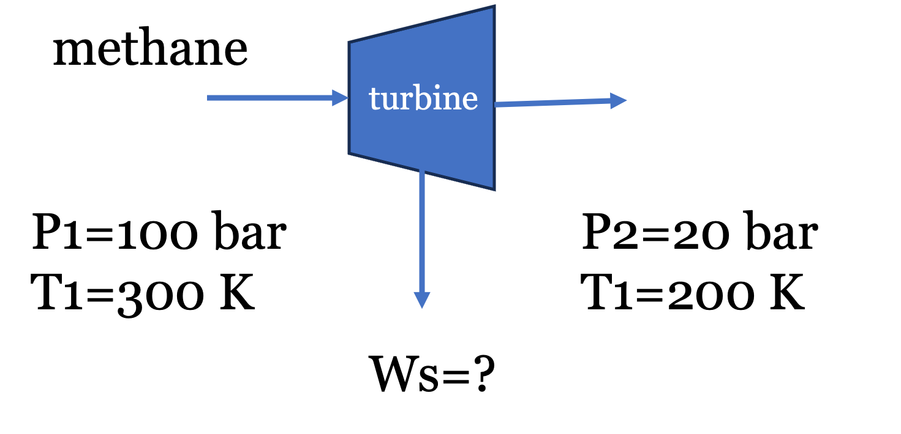
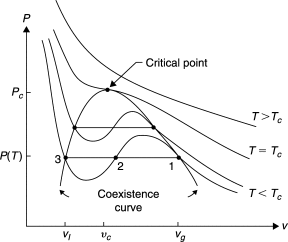
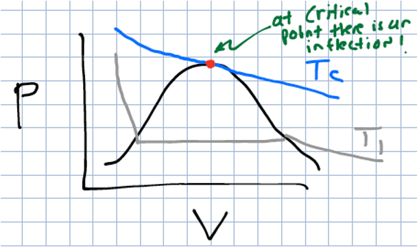

# Practical Application of Residuals: Turbine Expansion of Methane

Before discussing modern equations of state, the residual property framework derived in the previous lecture will be applied to a practical engineering unit operation.

**Problem Statement:**
"Natural gas" is mostly methane, with trace amounts of ethane and inert gases. To ship it overseas, it is liquefied using the processes we discussed earlier, and then shipped under cryogenic conditions ($P\approx 1$ bar and $T \approx -160^\circ C$). At liquefied natural gas (LNG) receiving terminals, the cold liquid methane is usually pumped to high pressures ($100$ bar), and then vaporized using seawater (do you see that this wastes a valuable "cold" resource?) before being fed to the local distribution pipelines. To recover energy before sending the gas into lower-pressure local distribution pipelines, the gas can be expanded through a turbine.

> Fun fact: Pure methane is completely odorless and colorless. To make leak detection possible, utility companies inject an odorant into the local distribution pipelines. The most common odorants are sulfur compounds that smell strongly of rotten eggs. The human nose is so sensitive to them that they only need to be added in trace amounts—typically around 1 to 5 parts per million (ppm). Even at these microscopic concentrations, it is enough to alert someone to a gas leak well before the gas reaches its lower explosive limit. 

Suppose methane gas at the vaporizer outlet ($P_1 = 100$ bar, $T_1 = 300$ K) is expanded through a steady-state, adiabatic turbine to a local pipeline pressure ($P_2 = 20$ bar, $T_2 = 200$ K). Determine the shaft work extracted per mole of methane, assuming it obeys the van der Waals equation of state.

{#fig-example-image width=40%}

**Data for Methane:**

* Critical temperature ($T_c$) = 190.6 K

* Critical pressure ($P_c$) = 45.99 bar

* Ideal gas heat capacity ($C_p^{IG}$) $\approx$ 35.3 J/(mol K)

* Universal gas constant ($R$) = 8.314 J/(mol K) = 0.08314 L bar/(mol K)

## Governing Equations
For a steady-state, adiabatic turbine, the energy balance simplifies to:
$$W_s = \Delta {\underline{H}} =  \Delta {\underline{H}^R} + \Delta {\underline{H}}^{IG} = \underline{H}^R_2 - \underline{H}^R_1 + \Delta \underline{H}^{IG}$$ {#eq-turbine-work}

We thus need to compute the residual enthalpy ($\underline{H}^R$) at the initial and final states using the van der Waals equation of state. Note: Back in Lecture 7, we learned how to solve the van der Waals equation of state for volume at a given $T$ and $P$, and a Jupyter notebook was provided to perform this calculation. We will need to do that again here to compute the residual enthalpy, which requires the volume at each state.

We will use the fact that $\underline{H}^R = \underline{U}^R + P \underline{V}^R = \underline{U}^R + P (\underline{V} - \underline{V}^{IG}) = \underline{U}^R + P\underline{V}-RT$ and first calculate the residual internal energy ($\underline{U}^R$). Since the equation of state is in the form $P = f(T,V)$, we will use the volume-based residual equations derived in the previous lecture:

$$U^R = \int_{\infty}^V \left[ T \left( \frac{\partial P}{\partial T} \right)_V - P \right] dV$$ {#eq-resid-UV}

Note: I am working with molar quantities but have dropped underlines for the remainder for convenience. The units should be apparent from context.

For the van der Waals equation ($P = \frac{RT}{V-b} - \frac{a}{V^2}$), the partial derivative is $(\partial P / \partial T)_V = R/(V-b)$. Substituting this into the integral yields:
$$U^R = \int_{\infty}^V \left [ T \left (\frac{R}{V-b} \right)-P\right] dV =  \int_{\infty}^V \frac{a}{V^2} dV = -\frac{a}{V}$$ 

Therefore, the residual enthalpy for a van der Waals gas is:
$$H^R =  U^R + PV^R = U^R + PV-RT=-\frac{a}{V} + PV - RT$$ {#eq-resid-HV}
where we made use of the fact that $V^R=V-\frac{RT}{P}$.

## van der Waals Parameters
The parameters $a$ and $b$ are calculated from critical properties:
$$a = \frac{27 R^2 T_c^2}{64 P_c} = \frac{27 (0.08314)^2 (190.6)^2}{64 (45.99)} = 2.30 \text{ L}^2 \text{ bar/mol}^2$$
$$b = \frac{R T_c}{8 P_c} = \frac{0.08314 (190.6)}{8 (45.99)} = 0.043 \text{ L/mol}$$

## Evaluating State 1 (Inlet)
At $P_1 = 100$ bar and $T_1 = 300$ K, the van der Waals equation yields $V_1 = 0.2032$ L/mol. 
Note: I have provided Jupyter notebooks below that solve the VDW equation for the volume roots and also for residual properties. The numbers here generally agree with the notebooks within rounding errors. You should verify these calculations yourself by hand and using the notebooks. 

Substituting this into the residual enthalpy expression @eq-resid-HV gives:

$$H^R_1 = -\frac{2.30}{0.2032} + 100(0.2032) - (0.08314)(300)$$
$$H^R_1 = -11.32 + 20.32 - 24.94 = -15.94 \text{ L bar/mol}$$
Converting to standard energy units (1 L bar = 100 J):
$$H^R_1 = -1594 \text{ J/mol}$$

## Evaluating State 2 (Outlet)
At $P_2 = 20$ bar and $T_2 = 200$ K, solving the van der Waals equation yields $V_2 = 0.725$ L/mol.
$$H^R_2 = -\frac{2.30}{0.725} + 20(0.725) - (0.08314)(200)$$
$$H^R_2 = -3.17 + 14.50 - 16.63 = -5.30 \text{ L bar/mol}$$
$$H^R_2 = -530 \text{ J/mol}$$

## Total Work Calculation
The ideal gas enthalpy change is:
$$\Delta H^{IG} = C_p^{IG} (T_2 - T_1) = 35.3 (200 - 300) = -3530 \text{ J/mol}$$

Summing the real and ideal components:
$$W_s = \Delta H = -530 - (-1594) - 3530 = -2466 \text{ J/mol}$$

The turbine delivers **2.47 kJ/mol** of work. Note how the high-pressure residuals significantly alter the final value; assuming ideal gas behavior would have overestimated the work output by about 40%!

---

::: {.callout-tip icon=false}
## Jupyter Notebook Example - VDW Solver
I have prepared an interactive Jupyter Notebook that solves the van der Waals equation of state for a number of common fluids. 
The user inputs the temperature and pressure and the notebook solves for the volume roots and plots the roots on a PV diagram
along with the critical isotherm. The notebook uses CoolProp to obtain critical fluid properties and ipywidgets to create an interactive interface.

::: {.content-visible when-format="html"}

[**View Interactive Notebook (.ipynb)**](VDW-solver.ipynb)

:::

::: {.content-visible when-format="pdf"}
*Note: This example is available as an interactive Jupyter Notebook on the course website.*
:::
:::

::: {.callout-tip icon=false}
## Jupyter Notebook Example - VDW Residual Calculator
I have prepared an interactive Jupyter Notebook that computes residual properties for the van der Waals equation of state for a number of common fluids. 
The user inputs the temperature and pressure and the notebook solves for the volume roots and residual properties and plots the roots on a PV diagram
along with the critical isotherm. The notebook uses CoolProp to obtain critical fluid properties and ipywidgets to create an interactive interface.

::: {.content-visible when-format="html"}

[**View Interactive Notebook (.ipynb)**](residual-VDW.ipynb)

:::

::: {.content-visible when-format="pdf"}
*Note: This example is available as an interactive Jupyter Notebook on the course website.*
:::
:::

# Worked Example: Isentropic Compression of a van der Waals Gas

The methane turbine example used the residual enthalpy. This example applies the residual entropy to a compressor, and shows what happens when the residuals are small.

**Problem Statement:**
Nitrogen gas ($N_2$) enters a steady-state compressor at $P_1 =$ 1 bar and $T_1 =$ 298 K. It is compressed isentropically ($\Delta S = 0$) to a final pressure of $P_2 =$ 5 bar. Determine the final temperature ($T_2$) assuming the gas follows the van der Waals equation of state.

**Data for Nitrogen:**

* Critical temperature ($T_c$) = 126.2 K

* Critical pressure ($P_c$) = 34.0 bar

* Ideal gas heat capacity ($C_p^{IG}$) = 29.12 J/(mol K) (assumed constant)

* Universal gas constant ($R$) = 8.314 J/(mol K) = 0.08314 L bar/(mol K)

## Governing Equations
For an isentropic process, the total change in real fluid entropy is zero. Using the hypothetical path and residual properties:
$$\Delta S = S^R_2 - S^R_1 + \Delta S^{IG} = 0$$ {#eq-isentropic-resid}

The ideal gas entropy change is:
$$\Delta S^{IG} = C_p^{IG} \ln \left( \frac{T_2}{T_1} \right) - R \ln \left( \frac{P_2}{P_1} \right)$$

To find the residual entropy ($S^R$), we evaluate the volume-based residual equation for the van der Waals equation of state ($P = \frac{RT}{V-b} - \frac{a}{V^2}$). As before, the required partial derivative is:
$$\left( \frac{\partial P}{\partial T} \right)_V = \frac{R}{V-b}$$

Substitute this into the general volume-based residual entropy equation:
$$S^R = \int_{\infty}^V \left[ \frac{R}{V-b} - \frac{R}{V} \right] dV + R \ln Z$$

Integrating yields:
$$S^R = \left[ R \ln(V-b) - R \ln V \right]_{\infty}^V + R \ln Z = R \ln \left( \frac{V-b}{V} \right) + R \ln Z$$

Substituting the definition of the compressibility factor ($Z = PV/RT$) into the argument of the logarithm gives the van der Waals residual entropy:
$$S^R = R \ln \left( \frac{P(V-b)}{RT} \right)$$ {#eq-resid-SV-vdw}

## van der Waals Parameters
The parameters $a$ and $b$ are determined from the critical properties of nitrogen:
$$a = \frac{27 R^2 T_c^2}{64 P_c} = \frac{27 (0.08314)^2 (126.2)^2}{64 (34.0)} = 1.37 \text{ L}^2 \text{ bar/mol}^2$$
$$b = \frac{R T_c}{8 P_c} = \frac{0.08314 (126.2)}{8 (34.0)} = 0.0386 \text{ L/mol}$$

## Evaluating State 1 (Inlet)
At $P_1 =$ 1 bar and $T_1 =$ 298 K, solve the van der Waals equation for $V_1$:
$$1 = \frac{0.08314 (298)}{V_1 - 0.0386} - \frac{1.37}{V_1^2}$$
Solving this cubic equation yields $V_1 = 24.76$ L/mol.

Using @eq-resid-SV-vdw:
$$S^R_1 = 8.314 \ln \left( \frac{1 (24.76 - 0.0386)}{0.08314 (298)} \right) = -0.018 \text{ J/(mol K)}$$

## Evaluating State 2 (Outlet)
Because $T_2$ and $V_2$ are both unknown, an iterative solution is required.

**Iteration 1: The Ideal Gas Assumption**
As a first guess, assume the gas behaves ideally ($S^R_1 = 0$ and $S^R_2 = 0$). The entropy balance reduces to $\Delta S^{IG} = 0$:
$$0 = 29.12 \ln \left( \frac{T_2}{298} \right) - 8.314 \ln \left( \frac{5}{1} \right)$$
$$13.38 = 29.12 \ln \left( \frac{T_2}{298} \right) \implies T_2 = 471.8 \text{ K}$$

**Iteration 2: The Real Gas Correction**
Using the estimated $T_2 =$ 471.8 K, calculate the state 2 properties at $P_2 =$ 5 bar. Solving the van der Waals equation for $V_2$:
$$5 = \frac{0.08314 (471.8)}{V_2 - 0.0386} - \frac{1.37}{V_2^2}$$
Solving this yields $V_2 = 7.849$ L/mol.

Calculate the residual entropy at state 2:
$$S^R_2 = 8.314 \ln \left( \frac{5 (7.849 - 0.0386)}{0.08314 (471.8)} \right) = -0.037 \text{ J/(mol K)}$$

Now, re-evaluate the full entropy balance (@eq-isentropic-resid) to find the corrected $T_2$:
$$0 = S^R_2 - S^R_1 + C_p^{IG} \ln \left( \frac{T_2}{T_1} \right) - R \ln \left( \frac{P_2}{P_1} \right)$$
$$0 = -0.037 - (-0.018) + 29.12 \ln \left( \frac{T_2}{298} \right) - 13.38$$
$$13.399 = 29.12 \ln \left( \frac{T_2}{298} \right) \implies T_2 = 472.1 \text{ K}$$

A further iteration does not change $T_2$ at this precision.

**Conclusion:** The final temperature is 472.1 K, only 0.3 K above the ideal gas estimate. The residual entropies for nitrogen at these conditions are extremely small ($< 0.04$ J/(mol K)) because $Z \approx 1$: the attractive and repulsive contributions nearly cancel at these low pressures. Contrast this with the methane turbine at 100 bar, where the residuals changed the answer by about 40%. The ideal gas assumption is accurate for nitrogen here, but you should check the residuals before assuming that for other conditions. You can check these numbers with the VDW residual calculator notebook above.

---

# Cubic Equations of State and P-V-T Behavior

The van der Waals equation successfully predicts that real gases deviate from ideal behavior, but how does it model phase transitions (like condensation)?

When the van der Waals equation is plotted on a P-V diagram below the critical temperature, it does not form a flat horizontal line during the phase transition like a real fluid does. Instead, it oscillates, creating a "van der Waals loop." You can see this by putting in different values of $T$ and $P$ into the VDW notebook linked above and plotting the results. 

Because the equation is cubic with respect to volume ($V^3$), it can have up to three real roots at a given pressure and temperature. See @fig-vdw-roots:

1.  **Largest root:** Corresponds to the molar volume of the **vapor** phase.
2.  **Middle root:** Represents an unstable, non-physical state that is discarded.
3.  **Smallest root:** Corresponds to the molar volume of the **liquid** phase.

{#fig-vdw-roots width=40%}

This cubic mathematical structure is what allows a single, continuous equation to model both the liquid and gas phases simultaneously. If you look into the code of the VDW notebook, you will see that the equation is written in terms of a cubic polynomial in $V$ and the roots are solved using the `numpy.roots` function.

The parameters $a$ and $b$ are specific to each fluid, and are obtained by forcing the equation to be well-behaved at the critical point. That is, the first and second derivatives of pressure with respect to volume at constant temperature must be zero at the critical point:
$$\left( \frac{\partial P}{\partial V} \right)_{T_c} = 0 \quad \text{and} \quad \left( \frac{\partial^2 P}{\partial V^2} \right)_{T_c} = 0$$

{#fig-dpdv width=40%}

Solving these two equations simultaneously gives the critical properties in terms of $a$ and $b$, which can be rearranged to solve for $a$ and $b$ in terms of the critical properties. This is how we derived the equations for $a$ and $b$ in the previous section.
$$a = \frac{27 R^2 T_c^2}{64 P_c} \quad \text{and} \quad b = \frac{R T_c}{8 P_c}$$

These equations for the coefficients are unique to the van der Waals equation. For other cubic equations of state, the coefficients will have different relationships to the critical properties, and may also depend on additional parameters (like the acentric factor, which we will discuss next class).

# Determining Phase Stability: Which Root to Choose?

When solving a cubic equation of state at a specified temperature and pressure, the math may yield either one real root or three real roots. Choosing the correct, physically meaningful volume root depends on the phase of the system.

If the solver returns **one real root** (and two complex conjugate roots), the system exists as a single, well-defined phase. The complex roots are mathematically discarded, and the single real root represents the physical molar volume of the fluid. This occurs when the gas is supercritical ($T > T_c$), or when the state is far removed from the two-phase region.

If the solver returns **three real roots**, the system is below its critical temperature ($T < T_c$) and is operating near the vapor-liquid equilibrium region. As established:
1. The **largest root** is the volume of the vapor phase.
2. The **middle root** is unstable and is always discarded.
3. The **smallest root** is the volume of the liquid phase.

To determine whether the liquid or the vapor is the stable phase at the given $T$ and $P$, the system pressure ($P$) is compared to the experimental saturation pressure (vapor pressure, $P^{sat}$) of the pure fluid at that same temperature.

* **If $P < P^{sat}(T)$:** The system pressure is lower than the vapor pressure, meaning the substance is entirely a gas (superheated vapor). The **largest root** must be selected.
* **If $P > P^{sat}(T)$:** The system pressure is higher than the vapor pressure, meaning the gas has fully condensed into a liquid (subcooled/compressed liquid). The **smallest root** must be selected.
* **If $P = P^{sat}(T)$:** The system is exactly at phase equilibrium (a boiling liquid or condensing gas). Both the largest and smallest roots are physically meaningful, representing the molar volumes of the saturated vapor and the saturated liquid, respectively. 

Later in the course, the concepts of chemical potential and fugacity will be introduced to mathematically prove this phase stability without needing to look up experimental vapor pressure data. For now, referencing $P^{sat}$ (either from a table or calculating it from the Antoine equation) provides a reliable heuristic for selecting the correct root.