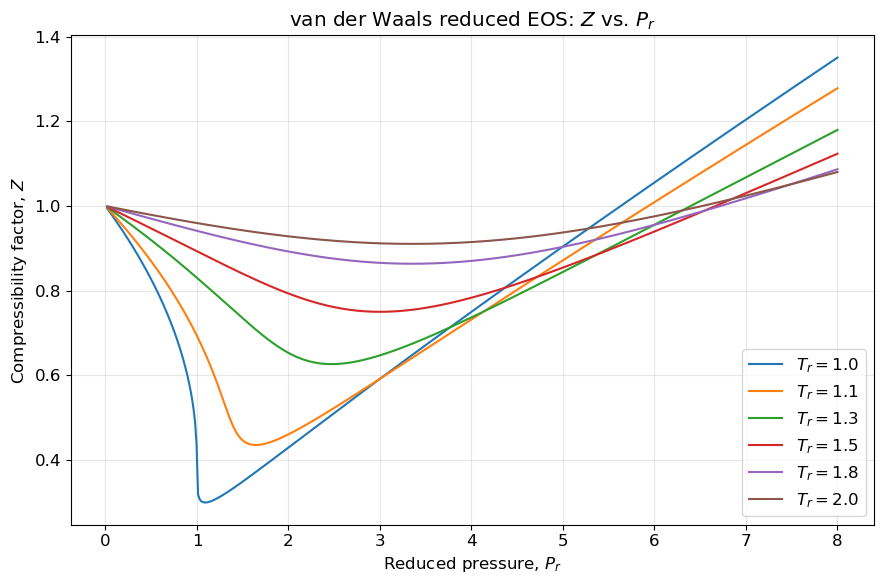
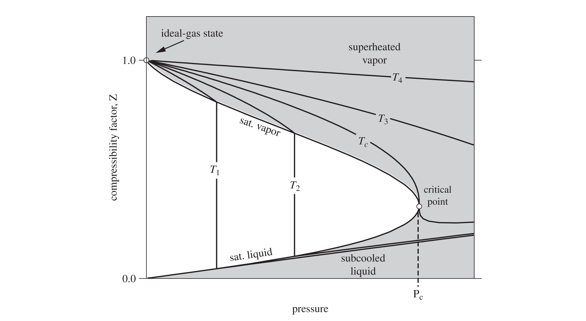
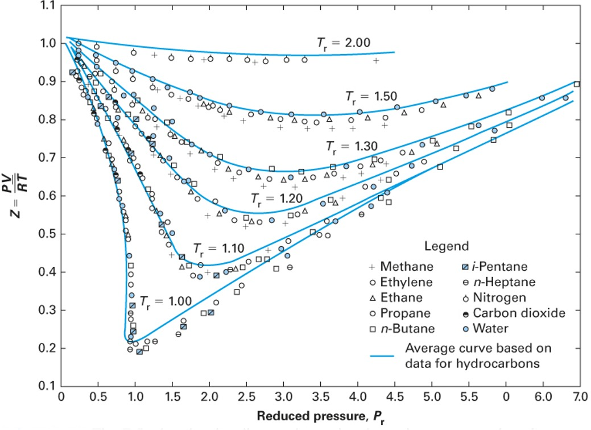
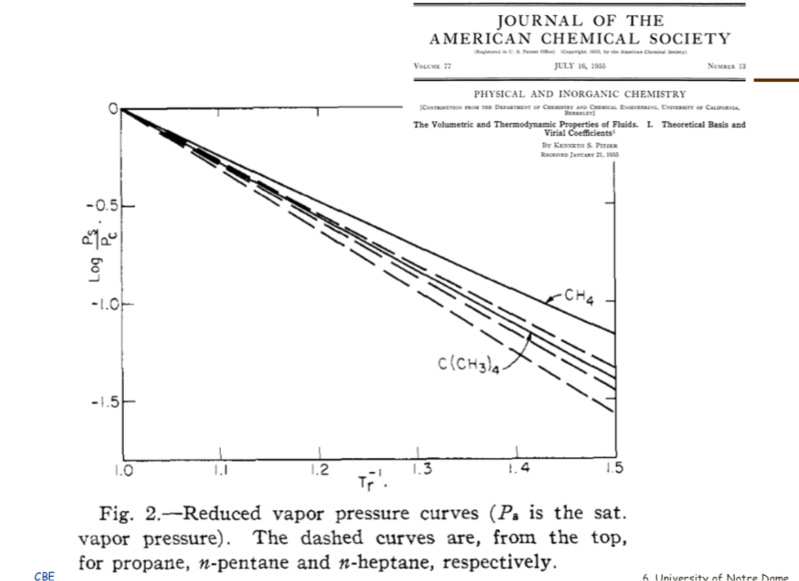

# Improving Equations of State: The Principle of Corresponding States and the Acentric Factor

Last class, we discussed the original "cubic" equation of state, the van der Waals equation. While it was a significant improvement over the ideal gas law, it is not sufficiently accurate for modern chemical engineering applications. In this lecture, we will explore how the principle of corresponding states and the introduction of the acentric factor led to the development of more accurate cubic equations of state, such as the Peng-Robinson equation and the Soave-Redlich-Kwong equation.

# The Principle of Corresponding States

In the late 19th century, a profound observation was made: if thermodynamic properties are scaled by their critical point values, many fluids behave similarly. This is formalized by defining **reduced properties**:
$$T_r = \frac{T}{T_c}, \quad P_r = \frac{P}{P_c}, \quad V_r = \frac{V}{V_c}$$

The **two-parameter theorem of corresponding states** postulates that all fluids at the same reduced temperature and reduced pressure will have the same compressibility factor ($Z$). 

If the van der Waals equation is rewritten using these reduced variables, the substance-specific parameters $a$ and $b$ completely disappear:
$$P_r = \frac{8 T_r}{3 V_r - 1} - \frac{3}{V_r^2}$$ {#eq-vdwreduced}

This is a universal equation. It implies that argon, methane, and water should all possess identical $Z$ values at identical $T_r$ and $P_r$. A plot of the predicted compressibility factor for this "universal" van der Waals equation of state as a function of reduced pressure for several reduced temperatures is shown in @fig-vdw-Zr

{#fig-vdw-Zr width=70%}

Recall how the compressibility factor $Z=P\underline{V}/RT$ quantifies the deviation of a real gas from ideal gas behavior. For an ideal gas, $Z=1$. For real gases, $Z$ can be greater than or less than 1 depending on the conditions, and that is observed in @fig-vdw-Zr. 

@fig-ZvsP illustrates the typical behavior of $Z$ as a function of actual pressure and temperature for temperatures both above ($T_3$ and $T_4$) and below ($T_1$ and $T_2$) the critical temperature. Similar to @fig-vdw-Zr, at low pressures (or high temperatures), $Z$ approaches 1, indicating ideal gas behavior. As pressure increases (or temperature decreases), $Z$ deviates from 1, reflecting the influence of intermolecular forces and finite molecular size. At the moderate conditions shown in @fig-ZvsP, the compressibility factor is less than 1 for gases where attractive forces dominate. For liquids (temperatures below the critical temperature), $Z$ is very much less than 1, consistent with the small molar volume of liquids. At very high pressures, $Z$ can exceed 1, indicating that repulsive forces dominate and the gas is less compressible than an ideal gas. Since this plot is given in terms of temperature and pressure, different fluids will have different plots, unlike the "universal" plot predicted by the van der Waals equation in @fig-vdw-Zr.

{#fig-ZvsP width=80%}

If @eq-vdwreduced were perfectly accurate, then all fluids would have the same $Z$ at the same $T_r$ and $P_r$. Is this true? Take a look at the experimental data for $Z$ as a function of $T_r$ and $P_r$ for several fluids in @fig-Zdata. Note all of these plots are for $T>T_c$ so they are all supercritical fluids and don't show a vapor-liquid transition. Do all fluids collapse onto a single curve?

{#fig-Zdata width=70%}

The data in @fig-Zdata clearly shows that many of the fluids do have the same trend in compressibility at the same reduced conditions. If you look closely, however, you will see that the blue curves in @fig-Zdata are not the same as the curves given by the universal van der Waals equation in @fig-vdw-Zr; they are fits to the data. Thus the two-parameter corresponding states theory seems to have some merit, but we should not expect @eq-vdwreduced to be perfectly accurate. Noble gases (like argon) and simple hydrocarbons (like methane) approximately follow the blue curves, but more complex fluids (like water and carbon dioxide) deviate more significantly. If we expanded the data to include even more fluids, we would see even more deviations. This is because the two-parameter corresponding states theory only accounts for the critical temperature and pressure, which are not sufficient to capture the complex intermolecular interactions present in real fluids. For example, water has strong hydrogen bonding, and carbon dioxide has a significant quadrupole moment, both of which lead to deviations from the idealized behavior predicted by the two-parameter corresponding states theory. So we don't have a "universal" theory of fluids with only two parameters, but we do have a "semi-universal" theory that works reasonably well for many fluids, especially those that are simple and non-polar. To improve the accuracy of the models for more complex fluids, we need to introduce an additional parameter that can capture these deviations from idealized behavior.

# The Acentric Factor

To correct for the failings of the two-parameter corresponding states theory, Kenneth Pitzer searched for a third parameter that could be easily measured and could help to better correlate the properties of real fluids. In 1955, he published a paper in the *Journal of the American Chemical Society* where he showed that the logarithm of the reduced vapor pressure curves, when plotted against inverse reduced temperature, were linear. But different molecules had different slopes, as shown in @fig-pitzer. 

{#fig-pitzer width=70%}

He observed that "ideal" fluids like argon had a certain slope, while more complex fluids like water had a much steeper slope. This led him to define a new parameter, the acentric factor ($\omega$), which quantifies in a crude sense the "non-sphericity" of a molecule based on its vapor pressure curve. The acentric factor is defined such that $\omega$ is (nearly) zero for a perfectly spherical and non-polar molecule (like argon) and increases as the molecule becomes more complex and non-spherical (like water or octane). To do this, he set the equation for $\omega$ such that it would be zero for argon at a reduced temperature of 0.7, which is a common reference point for vapor pressure data. This leads to the following definition of the acentric factor:

$$\omega = -1.0 - \log_{10}(P_r^{sat}) \quad \text{at } T_r = 0.7$$ {#eq-acentric}

The acentric factor thus serves as a measure of how much a real fluid deviates from idealized behavior. It is an empirical parameter that can be obtained easily from experimental vapor pressure data. It can be used to improve the accuracy of equations of state for non-ideal fluids. The table below shows the acentric factors for a few common fluids. Your book has an extensive tabulation, and you can also find acentric factors on the NIST website. Things like hydrogen bonding and quadrupole moments (which are not captured by simple cubic equations of state) lead to higher acentric factors even for fluids that are nearly "spherical". It is also possible to have negative acentric factors, as in the case of argon (it was not "perfect" at $T_r=0.7$ after all)! 

| Gas | Acentric Factor ($\omega$) | Notes |
| :--- | :--- | :--- |
| Methane | 0.011  | |
| Ethane | 0.099  | Less spherical than methane  |
| n-Hexane | 0.305  | Non-spherical / Chain |
| Methanol | 0.566  | H-bonding  |
| Carbon Dioxide (CO$_2$) | 0.278  | Quadrupole moment  |
| Water | 0.344  | strong H-bonding  |
| Argon | -0.004  | "Ideal" (Spherical)  |

# Modern Equations of State: Peng-Robinson

Because the van der Waals equation is insufficiently accurate for process engineering calculations (particularly regarding liquid properties), chemical engineers developed improved cubic equations of state. They incorporated the acentric factor into their models, and also added a temperature-dependent term. Remarkably, however, these equations still retain the basic form of the van der Waals equation. A prominent model is the **Peng-Robinson** equation of state (1976):

$$P = \frac{RT}{\underline{V} - b} - \frac{a(T,\omega)}{\underline{V}(\underline{V} + b) + b(\underline{V} - b)}$$ {#eq-pengrobinson}

While it maintains the same repulsive term ($\underline{V}-b$) as van der Waals, it introduces two major improvements:
1.  The denominator term involving $b$ is more complex, vastly improving liquid volume predictions.
2.  The parameter $a$ is no longer a constant; it is a function of temperature and is explicitly dependent on the **acentric factor** ($\omega$).

Your textbook (Section 7.2.7) provides the full functional form of $a(T,\omega)$, which is designed to fit experimental vapor pressure data across a wide range of fluids. By incorporating the acentric factor, the Peng-Robinson equation can more accurately model the behavior of non-ideal fluids, particularly those with significant intermolecular interactions.

# Soave-Redlich-Kwong (SRK) Equation of State
Another widely used cubic equation of state is the **Soave-Redlich-Kwong (SRK)** equation, which also incorporates the acentric factor and a temperature-dependent term. The SRK equation is given by: 

$$P = \frac{RT}{\underline{V} - b} - \frac{a(T,\omega)}{\underline{V}(\underline{V} + b)}$$ {#eq-srk}

Like the Peng-Robinson equation, the SRK equation modifies the original van der Waals form to improve accuracy, particularly for vapor-liquid equilibrium calculations. The main difference between the two is in the functional form of the attractive term and how it incorporates the acentric factor. Again, your textbook provides the full functional form of $a(T,\omega)$ for the SRK equation (Section 7.2.7).  

Both the PR and SRK equations are widely used in chemical engineering for process simulation and design, and they represent significant advancements over the original van der Waals equation by providing better predictions for a wide range of fluids, especially those with complex intermolecular interactions. These and similar cubic equations of state were introduced in the 1970s and 1980s and have since become the workhorses of chemical process simulation. They are used to model vapor-liquid equilibrium, calculate thermodynamic properties, and design separation processes like distillation. The combination of the principle of corresponding states (which provides a theoretical framework for understanding fluid behavior) with the empirical acentric factor (which captures deviations from ideality) allows these equations to provide accurate predictions for a wide range of fluids under various conditions.

# Other Equations of State
Finally, we briefly mention the fact that there are *many* other equations of state that have been developed, including more complex empirical multi-parameter equations of state and equations of state based on statistical mechanics (like the SAFT equation). However, the cubic equations of state remain popular due to their relative simplicity and reasonable accuracy for many engineering applications. 

Here is the functional form of the 8-parameter Benedict-Webb-Rubin (BWR) equation of state, which is a more complex multi-parameter model that can provide even better accuracy for certain fluids:
$$P = \frac{RT}{V} + \frac{B_0 RT - A_0 - C_0/T^2}{V^2} + \frac{b RT - a}{V^3} + \frac{\alpha a}{V^6} + \frac{c}{V^3 T^2} \left(1 + \frac{\gamma}{V^2}\right) e^{-\gamma/V^2}$$ {#eq-bwr}

