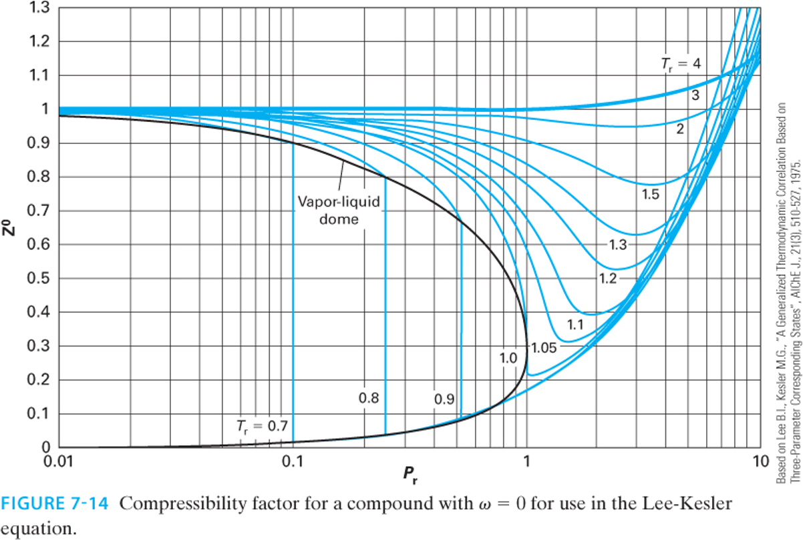
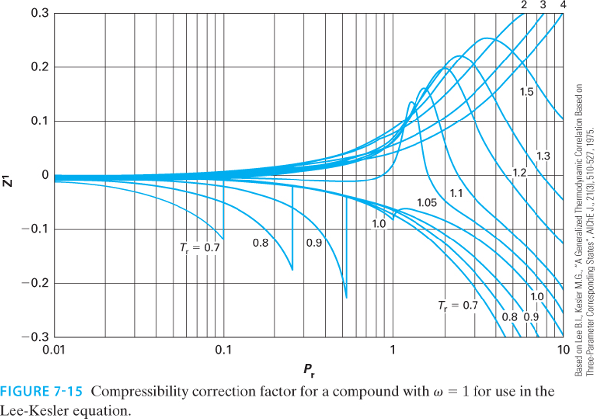
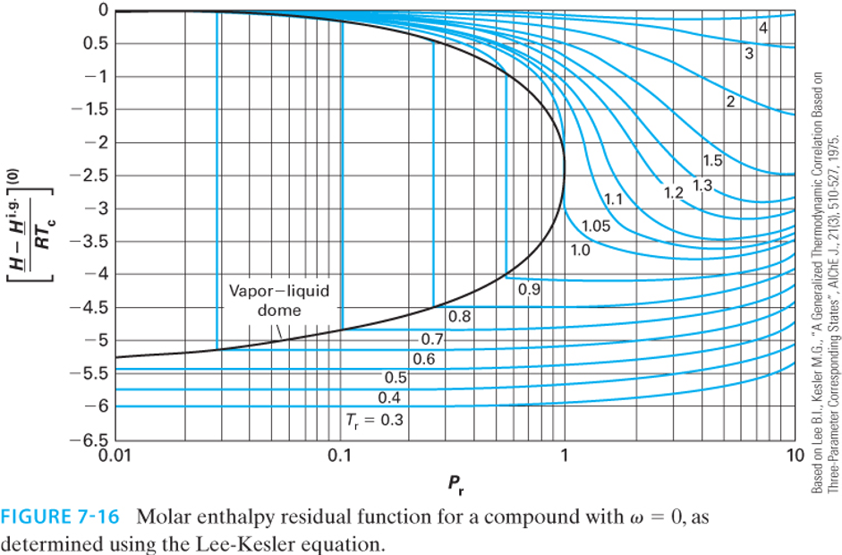
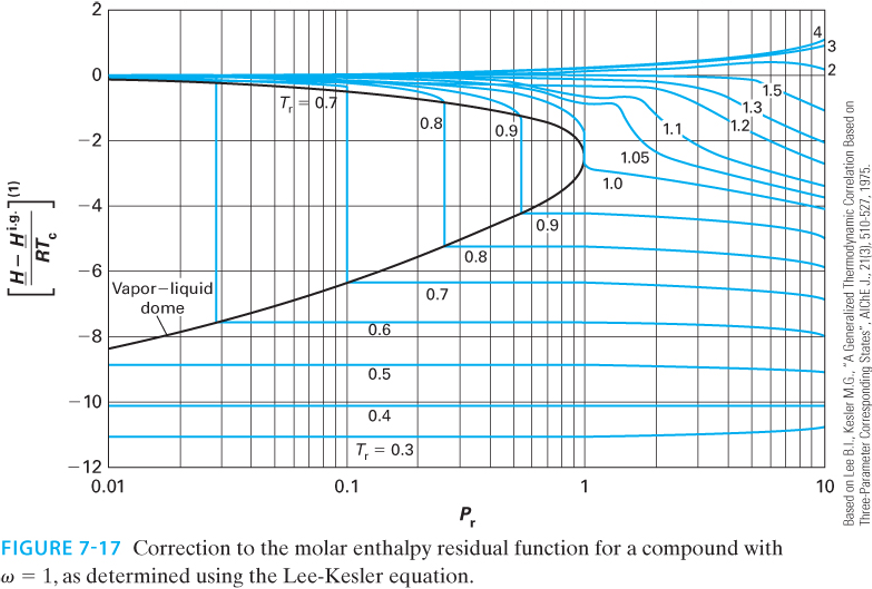
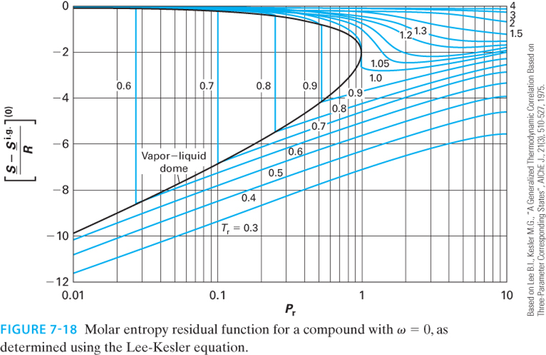
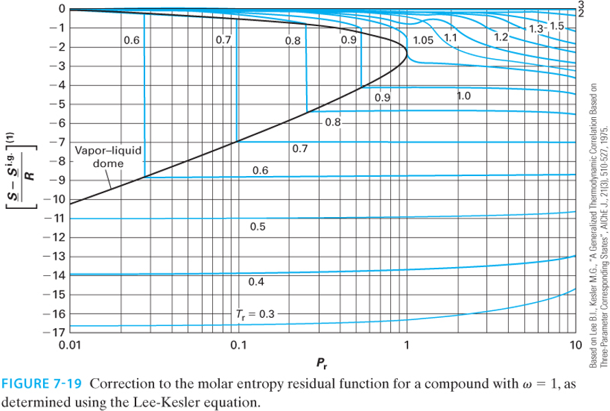

# Generalized Corresponding States Correlations

In the last lecture, we solved for residual properties using analytical cubic equations of state (Peng-Robinson and SRK). While Python scripts and process simulators (like Aspen) solve these equations instantly, it is useful to the able to estimate properties by hand or verify the output of a simulator. From a pedagogical standpoint, it is also useful to see how residual properties "work" so you have a feel for orders of magnitude. We can do this using **Generalized Corresponding States Charts**.

The most common set of charts used in chemical engineering are the **Lee-Kesler correlations**. The 3-parameter corresponding states theory developed by Pitzer suggests that the compressibility factor $Z$ for any fluid can be estimated if you know its reduced temperature ($T_r$), reduced pressure ($P_r$), and acentric factor ($\omega$):
$$Z = Z^{(0)}(T_r, P_r) + \omega Z^{(1)}(T_r, P_r)$$ {#eq-Z-LK}

Here, $Z^{(0)}$ represents the behavior of a "simple fluid" (spherical, non-polar molecules like argon or methane where $\omega \approx 0$), and $Z^{(1)}$ is a correction factor for the non-spherical nature of the molecule. Of course, if you know $Z(T_r,P_r)$, all thermodynamic properties can be estimated. 

At the time Pitzer published his theory, the $Z^{(0)}$ and $Z^{(1)}$ functions were only available as static tables. If an engineer wanted to use this approach, they had to manually interpolate values from these tables. As chemical engineering transitioned into the computer age in the 1970s, process simulators needed analytical equations, not paper tables, to calculate thermodynamic properties iteratively. 

In the 1970s, Byung Ik Lee and Michael G. Kesler were researchers working for the Mobil Research and Development Corporation. Their goal was to develop a robust, computer-friendly method for predicting hydrocarbon properties for the petroleum industry. They decided to take Pitzer's corresponding states theory and fit the $Z^{(0)}$ and $Z^{(1)}$ tables to a modified 12-parameter BWR equation similar to the one we learned about in the last lecture. This allowed them to generate smooth, continuous charts for $Z$, as well as the residual enthalpy and entropy.

The method was first published in 1975 in the *AIChE Journal*. A copy of their paper is in the Readings folder of our course on Canvas. The formal citation of the paper is:

> **Lee, B. I., & Kesler, M. G. (1975). A generalized thermodynamic correlation based on three-parameter corresponding states. *AIChE Journal*, 21(3), 510-527.**

Instead of fitting the BWR equation to every single chemical in existence (which would defeat the purpose of generalized corresponding states), they used a clever **"two-fluid" reference system**:

1. **The Simple Fluid ($\omega = 0$):** They fit the 12 BWR parameters to spherical molecules (like argon, krypton, and methane) to analytically generate $Z^{(0)}$, as well as the simple fluid enthalpy and entropy departures.

2. **The Heavy Reference Fluid:** They chose **n-octane** ($\omega = 0.3978$) as their heavy reference fluid and fit a *second* set of 12 BWR parameters exclusively to it. This allowed them to calculate $Z^{(ref)}$.

With the modified BWR equation solved for both the simple fluid and n-octane, the compressibility of *any* fluid could be found by linear interpolation based on its acentric factor:
$$Z = Z^{(0)} + \frac{\omega}{\omega^{(ref)}} \left( Z^{(ref)} - Z^{(0)} \right)$$ {#eq-Z-LK-interp}

Lee and Kesler proved mathematically that this interpolative approach was functionally identical to Pitzer's $Z^{(0)} + \omega Z^{(1)}$ formulation. By anchoring their correlations to a rigorous 12-parameter equation of state, Lee and Kesler ensured their generalized charts were far more thermodynamically consistent than earlier hand-drawn charts. Their equations guarantee that the relationships between $Z$, $H^R$, and $S^R$ perfectly satisfy the Maxwell relations and fundamental calculus of thermodynamics. Today, virtually all modern printed generalized compressibility and residual property charts found in textbooks (including your textbook Dahm & Visco) are generated directly from the Lee-Kesler equations.

@fig-Z0-r shows a plot of the reduced compressibility factor $Z_0$ as a function of reduced pressure and temperature, while @fig-Z1-r shows the correction factor $Z_1$. Note that $Z_0$ is close to 1 at low pressures and high temperatures, but it can deviate significantly from ideal gas behavior at high pressures and low temperatures. The correction factor $Z_1$ is generally smaller in magnitude than $Z_0$, but it can still have a significant impact on the overall compressibility factor for fluids with large acentric factors. To use, locate $T_r$ and $P_r$ on the charts, read off $Z_0$ and $Z_1$, and then apply the interpolation formula in @eq-Z-LK to find the compressibility factor for your fluid of interest.

{#fig-Z0-r width=70%}

{#fig-Z1-r width=70%}

This exact same linear framework applies to *all* residual properties! The Lee-Kesler charts provide graphical representations of these properties. 

**Enthalpy Departure (Residual Enthalpy):**
$$\frac{\underline{H}^R}{RT_c} = \left( \frac{\underline{H}^R}{RT_c} \right)^{(0)} + \omega \left( \frac{\underline{H}^R}{RT_c} \right)^{(1)}$$

{#fig-H0-r width=70%}

{#fig-H1-r width=70%}

**Entropy Departure (Residual Entropy):**
$$\frac{\underline{S}^R}{R} = \left( \frac{\underline{S}^R}{R} \right)^{(0)} + \omega \left( \frac{\underline{S}^R}{R} \right)^{(1)}$$

{#fig-S0-r width=70%}

{#fig-S1-r width=70%}

*Note: Depending on the textbook or chart, the y-axis may be plotted as the negative residual (e.g., $\frac{\underline{S}^{ig} - \underline{S}}{R}$) to keep the numbers on the axis positive. Always check the axis labels carefully!*

---

# Example: Compressor Analysis Revisited

Let's revisit the steady-flow compressor problem from Lecture 29, but this time we will solve it by reading the Lee-Kesler charts.

**Problem Statement:**
Methane ($\omega = 0.011, T_c = 190.6 \text{ K}, P_c = 46.0 \text{ bar}$) is compressed from State 1 ($T_1 = 300 \text{ K}, P_1 = 10 \text{ bar}$) to State 2 ($T_2 = 450 \text{ K}, P_2 = 50 \text{ bar}$). We found that $\Delta \underline{H}^{IG} = 5,295 \text{ J/mol}$ and $\Delta \underline{S}^{IG} = 0.93 \text{ J/(mol K)}$.

First, we must calculate the reduced temperature and pressure for both states:

**State 1:**

* $T_{r1} = \frac{300}{190.6} = 1.57$

* $P_{r1} = \frac{10}{46.0} = 0.22$

**State 2:**

* $T_{r2} = \frac{450}{190.6} = 2.36$

* $P_{r2} = \frac{50}{46.0} = 1.09$

## Finding the Residual Properties via Charts

Because methane is highly spherical, its acentric factor is nearly zero ($\omega = 0.011$). Therefore, the correction term $\omega M^{(1)}$ will be incredibly small, and we can approximate the residual properties by just reading the "simple fluid" $(0)$ charts.

**For State 1 ($T_r = 1.57, P_r = 0.22$):**
Reading the Lee-Kesler enthalpy $(0)$ and entropy $(0)$ charts:

* $\left( \frac{\underline{H}^R}{RT_c} \right)^{(0)} \approx -0.11$

* $\left( \frac{\underline{S}^R}{R} \right)^{(0)} \approx -0.05$

These are really hard to read off the charts, but we can estimate them by looking at the contour lines and interpolating between them. Now, we can calculate the residual properties at State 1:

$$\underline{H}^R_1 = (-0.11)(8.314)(190.6) = -174 \text{ J/mol}$$
$$\underline{S}^R_1 = (-0.05)(8.314) = -0.416 \text{ J/(mol K)}$$

**For State 2 ($T_r = 2.36, P_r = 1.09$):**
Reading the charts at these higher conditions:

* $\left( \frac{\underline{H}^R}{RT_c} \right)^{(0)} \approx -0.26$

* $\left( \frac{\underline{S}^R}{R} \right)^{(0)} \approx -0.09$

$$\underline{H}^R_2 = (-0.26)(8.314)(190.6) = -412 \text{ J/mol}$$
$$\underline{S}^R_2 = (-0.09)(8.314) = -0.748 \text{ J/(mol K)}$$

## Final Calculation and Comparison

Now, apply the fundamental property relations to find the true change in enthalpy and entropy:
$$\Delta \underline{H} = \underline{H}^R_2 - \underline{H}^R_1 + \Delta \underline{H}^{IG} = -412 - (-174) + 5295 = 5,057 \text{ J/mol}$$
$$\Delta \underline{S} = \underline{S}^R_2 - \underline{S}^R_1 + \Delta \underline{S}^{IG} = -0.748 - (-0.416) + 0.93 = 0.60 \text{ J/(mol K)}$$

**How did we do?** Let's compare our chart-read values to the rigorous Peng-Robinson calculations from Lecture 29:

* **Peng-Robinson:** $\Delta \underline{H} = 5,060 \text{ J/mol}$, $\Delta \underline{S} = 0.57 \text{ J/(mol K)}$

* **Lee-Kesler Charts:** $\Delta \underline{H} = 5,057 \text{ J/mol}$, $\Delta \underline{S} = 0.60 \text{ J/(mol K)}$

* **CoolProp Data:** $\Delta \underline{H} \approx 5,050 \text{ J/mol}$, $\Delta \underline{S} \approx 0.58 \text{ J/(mol K)}$
  
The chart reading method turns out to be exceptionally accurate, but the graphs are quite difficult to read! Small errors or differences can lead to large errors. That is why it is preferable to use computational methods. However, the graphs do give a good ballpark estimate with very little effort, and provide a way to check computational work. 

---

# Beyond Equations: The Critical Point

We have spent significant time calculating properties up to and beyond the critical point using $T_r$ and $P_r$. But what physically happens to a fluid at $T_c$ and $P_c$?

Imagine a sealed, rigid, high-pressure glass cell containing a two-phase mixture of liquid and vapor in equilibrium. As we heat the cell:

1. The temperature increases, causing the liquid's vapor pressure to rise. This forces more molecules into the gas phase, increasing the **density of the vapor**.

2. Simultaneously, thermal expansion causes the liquid phase to swell, decreasing the **density of the liquid**.

As we approach the critical temperature ($T_c$), the density of the heavy liquid and the density of the dense gas converge. Exactly at the critical point, the densities become identical. The meniscus (the physical boundary separating the liquid and gas phases) entirely vanishes. The fluid becomes a single, homogenous phase known as a **supercritical fluid**. 

*In class, we will watch a video demonstration of this phase transition occurring in a high-pressure viewing cell.*
