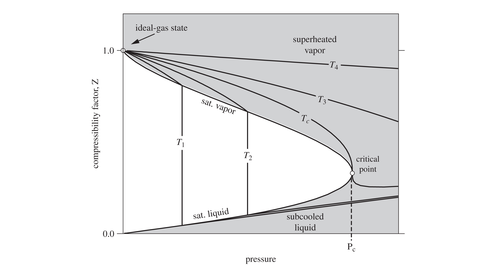
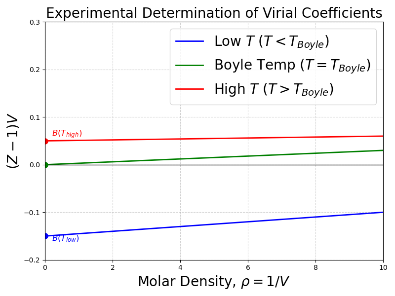
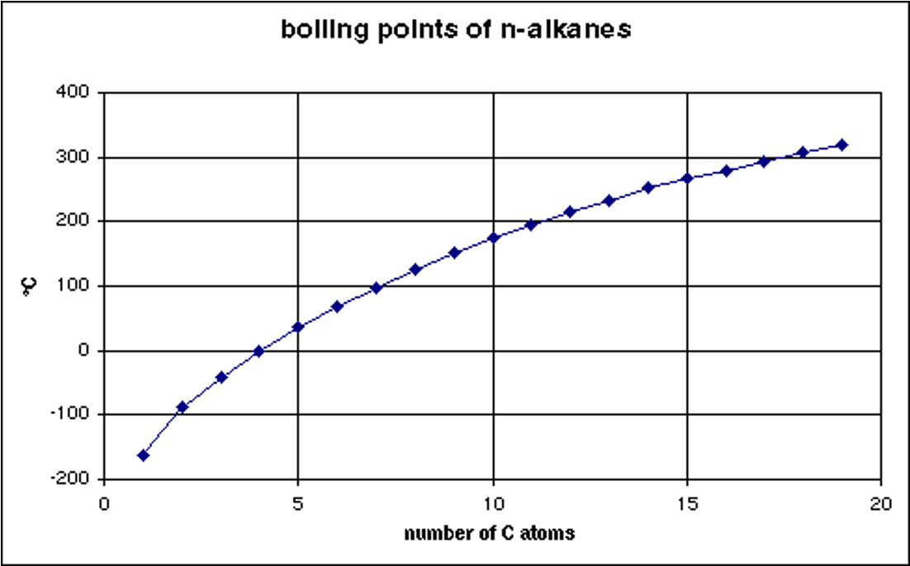

# The Virial Equation of State

In the previous lectures, we have utilized cubic equations of state and generalized correlations to model real fluid behavior. There is one more important way that one can model the behavior of real gases. If we look at the compressibility factor ($Z$) plotted against pressure (see @fig-Z-plot) or density ($\rho$), we notice that at low-to-moderate pressures, the curves are remarkably linear. 

{#fig-Z-plot width=70%}

This observation suggests we could represent $Z$ using a simple mathematical tool: a **Taylor Series expansion** about a density of zero (an ideal gas). 

Expanding $Z$ with respect to molar density ($\rho = 1/\underline{V}$):
$$Z = 1 + B(T)\rho + C(T)\rho^2 + D(T)\rho^3 + \dots$$ {#eq-virial_density}

@eq-virial_density is known as the **Virial Equation of State**. The coefficients $B, C, D$ are called the second, third, and fourth virial coefficients, respectively, and are given by
$$B = \left( \frac{\partial Z}{\partial \rho} \right)_{\rho=0}, \quad C = \frac{1}{2} \left( \frac{\partial^2 Z}{\partial \rho^2} \right)_{\rho=0}, \quad D = \frac{1}{6} \left( \frac{\partial^3 Z}{\partial \rho^3} \right)_{\rho=0}$$

They are strictly functions of temperature (and the molecule in question), and each derivative is taken at the ideal gas limit (i.e. $\rho \rightarrow 0$). 

Alternatively, expanding with respect to pressure results in a different form of the virial equation:
$$Z = 1 + B'(T)P + C'(T)P^2 + D'(T)P^3 + \dots$$ {#eq-virial_pressure}

By equating @eq-virial_density and @eq-virial_pressure (as shown below), you can show that 
$$B' = \frac{B}{RT}$$ {#eq-B-prime}
and 
$$C' = \frac{C-B^2}{(RT)^2}$$ {#eq-C-prime}

::: {.callout-note title="Mathematical Aside: Relating Density and Pressure Expansions"}
Let's show how to arrive at the relationships between the coefficients (@eq-B-prime and @eq-C-prime) by equating the two series.

Substituting $P = Z \rho R T$ into @eq-virial_pressure:
$$Z = 1 + B'(Z \rho R T) + C'(Z \rho R T)^2 + \dots$$

Now, substitute the density series ($Z = 1 + B\rho + \dots$) in place of $Z$ on the right side and distribute, keeping only terms up to $\rho^2$:
$$Z = 1 + B' R T \rho (1 + B\rho) + C' (R T)^2 \rho^2 (1 + B\rho)^2 + \dots$$
$$Z = 1 + (B' R T)\rho + (B' B R T + C' (R T)^2)\rho^2 + \dots$$

By equating the coefficients of this new polynomial to the original density series in @eq-virial_density, the relationships naturally fall out:

**For the $\rho$ term:**
$$B = B' R T \implies B' = \frac{B}{RT}$$

**For the $\rho^2$ term:**
$$C = B' B R T + C' (R T)^2$$
Substitute $B' = \frac{B}{RT}$ into the equation:
$$C = B^2 + C'(RT)^2 \implies C' = \frac{C - B^2}{(RT)^2}$$

These relationships allow us to convert between the two forms of the virial equation, depending on whether we have data in terms of density or pressure.
:::

## The Physical Meaning: More Than Just Math

While the virial equation looks like a standard mathematical polynomial fit, it is much more profound. It can be derived purely from fundamental statistical mechanics. 

The macroscopic pressure of a gas is the result of microscopic molecular collisions and forces. Statistical mechanics proves that the virial coefficients relate directly to exactly how molecules interact with one another:

* **Ideal Gas ($Z=1$):** Molecules do not interact at all.

* **The Second Virial Coefficient ($B$):** Represents deviations from ideality due to **two-body** interactions (pairs of molecules bumping into each other).

* **The Third Virial Coefficient ($C$):** Represents **three-body** interactions, and so on.

For example, $B(T)$ can be calculated exactly if you know the intermolecular potential energy function $u(r)$ between two molecules:
$$B(T) = -2\pi N_A \int_0^\infty \left[ \exp\left(-\frac{u(r)}{k_B T}\right) - 1 \right] r^2 dr$$

You do not need to memorize this integral, but you should understand its implication: **The virial equation is not an empirical guess. It bridges the microscopic forces between molecules to the macroscopic properties we need to design a chemical plant.**

# Extracting Virial Coefficients from Data

Because the virial equation is a power series, we can extract the coefficients directly from experimental $P-V-T$ data. 

Let's take the density series and rearrange it:
$$Z - 1 = B\rho + C\rho^2 + \dots$$
$$\frac{Z-1}{\rho} = (Z-1)\underline{V} = B + C\rho + \dots$$

If we plot $(Z-1)\underline{V}$ versus density ($\rho$) for a given substance, the resulting curve will have a y-intercept equal to the second virial coefficient ($B$) and a slope at $\rho=0$ equal to the third virial coefficient ($C$). 

{#fig-B-ZV width=70%}

Notice that $B$ depends strongly on temperature. At low temperatures, attractive forces dominate, making $B$ negative. At high temperatures, repulsive forces dominate, making $B$ positive. 
There is a specific temperature where $B=0$, meaning the 2-body interactions perfectly cancel out, and the gas behaves ideally up to surprisingly high pressures. This is called the **Boyle Temperature ($T_{Boyle}$)**. You can find tabulations of second virial coefficients in the literature; third virial coefficients are much more difficult to find.

# Estimating B from Corresponding States

If you don't have experimental data to extract $B$, you can estimate it using our trusty corresponding states theory. Kenneth Pitzer and Michael Abbott developed a generalized correlation for the second virial coefficient:
$$\frac{B P_c}{R T_c} = B^{(0)} + \omega B^{(1)}$$ {#eq-B-corresponding-states}

where $B^{(0)}$ and $B^{(1)}$ are functions only of the reduced temperature ($T_r$):
$$B^{(0)} = 0.083 - \frac{0.422}{T_r^{1.6}}$$ {#eq-B0-corresponding-states}
$$B^{(1)} = 0.139 - \frac{0.172}{T_r^{4.2}}$$ {#eq-B1-corresponding-states}

This is highly accurate for non-polar and slightly polar gases at low-to-moderate pressures (typically up to $P_r \approx 0.5$).

# Residual Properties for the Truncated Virial Equation

For many engineering applications, the gas density is low enough that 3-body interactions are incredibly rare. We can truncate the virial equation after the second term:
$$Z = 1 + \frac{BP}{RT}$$ {#eq-virial_truncated}

This simple equation allows us to derive beautiful, analytical expressions for the residual properties using the calculus of thermodynamics. 
First, the residual volume:
$$\underline{V} = \frac{RT}{P} + B \implies \underline{V}^R = \underline{V} - \underline{V}^{IG} = B$$ {#eq-VR-virial}

Using the fundamental property relations for enthalpy and entropy:
$$\underline{H}^R = \int_0^P \left[ \underline{V} - T\left(\frac{\partial \underline{V}}{\partial T}\right)_P \right] dP = P \left( B - T \frac{dB}{dT} \right)$$ {#eq-HR-virial}
$$\underline{S}^R = -\int_0^P \left[ \left(\frac{\partial \underline{V}}{\partial T}\right)_P - \frac{R}{P} \right] dP = -P \frac{dB}{dT}$$ {#eq-SR-virial}

These show exactly why we care about how $B$ changes with temperature ($dB/dT$)!

# Multiparameter Equations: Beattie-Bridgeman and BWR

The virial equation is theoretically pure, but to use it at liquid densities, you would need dozens of virial coefficients, which are mathematically impossible to derive. 

Engineers in the 20th century solved this by using the *form* of the virial equation, but replacing the coefficients with empirical, temperature-dependent functions. 
For example, the **Beattie-Bridgeman** equation takes the form:
$$Z = 1 + \frac{B(T)}{\underline{V}} + \frac{C(T)}{\underline{V}^2} + \frac{D(T)}{\underline{V}^3}$$
where $B, C,$ and $D$ are complex empirical functions of temperature fit to specific fluids. 

This methodology peaked with the **Benedict-Webb-Rubin (BWR)** equation, which utilizes 8 (and sometimes up to 32) parameters. As we saw in Lecture 30, the Lee-Kesler generalized charts are actually generated using a 12-parameter modified BWR equation!

# Group Contribution Methods

Up to now, every equation of state we've used requires us to know $T_c$, $P_c$, and $\omega$. But what if you are tasked with designing a process for a newly synthesized pharmaceutical or a complex biochemical, and those properties have never been measured?

One way to do this is via **Group Contribution Methods**. In a sense, group contribution methods are a primitive form of machine learning. The central philosophy here is that a molecule is simply the sum of its parts. For example, if you look at the boiling points of linear alkanes (ethane, propane, butane, etc.), the boiling point increases predictably with every $-CH_2-$ group added to the chain, as shown in @fig-alkane-Tb.

{#fig-alkane-Tb width=70%}

The **Joback (or Joback-Reid) Method** assigns a numerical contribution value to individual structural groups (like a methyl group $-CH_3$, an alcohol group $-OH$, or a benzene ring). By counting the groups in a molecule, you can sum their contributions to estimate not just critical properties, but also fundamental phase transition data like the normal boiling point ($T_b$) and the enthalpy of vaporization at that boiling point ($\Delta H_{vap}$):

**Boiling Point & Enthalpy of Vaporization:**
$$T_b \ [\text{K}] = 198.2 + \sum \Delta T_b$$ {#eq-Tb-Joback}
$$\Delta H_{vap} \ [\text{kJ/mol}] = 15.30 + \sum \Delta H_{vap}$$ {#eq-Delta-H-vap-Joback}

**Critical Properties:**
*(Note: Joback's $T_c$ estimate actually depends on the $T_b$ estimate!)*
$$T_c \ [\text{K}] = T_b \left[ 0.584 + 0.965 \sum \Delta T_c - \left(\sum \Delta T_c\right)^2 \right]^{-1}$$ {#eq-Tc-Joback}
$$P_c \ [\text{bar}] = \left[ 0.113 + 0.0032 n_a - \sum \Delta P_c \right]^{-2}$$ {#eq-Pc-Joback}

where $n_a$ is the total number of atoms in the molecule.

::: {.callout-tip title="Estimating the Acentric Factor ($\omega$)"}
You might be wondering: *Can we use the Joback method to find the acentric factor ($\omega$)?*

The Joback method does not have a set of group contributions to calculate $\omega$ directly. However, we can still estimate it! Because the acentric factor describes the shape of the vapor pressure curve, it can be mathematically approximated if you know the normal boiling point and the critical point.

Once you use the Joback method to estimate $T_b$, $T_c$, and $P_c$, you can plug those values directly into the **Edmister equation**:
$$\omega = \frac{3}{7} \left( \frac{T_{br}}{1 - T_{br}} \right) \log_{10}(P_c) - 1$$

where:

* $T_{br} = T_b / T_c$ (the reduced normal boiling point)
  
* $P_c$ is the critical pressure **in atm** *(Note: The Joback method calculates $P_c$ in bar, so you must convert it first!)*

For highly rigorous work, computational tools and process simulators will instead plug your Joback estimates into the **Lee-Kesler** vapor pressure equations to calculate $\omega$. This perfectly bridges our group contribution models back to the generalized corresponding states charts we used earlier!
:::

Your textbook (Dahm and Visco) has tables of these $\Delta$ parameters for @eq-Tb-Joback - @eq-Pc-Joback in the appendices. However, in modern practice, engineers rarely do this calculation by hand. We use computational chemoinformatics tools (like RDKit, various software packages such as JRgui (<https://github.com/curieshicy/JRgui>), or the property estimation modules built directly into Aspen Plus) to draw the molecule and let the software compute the group contributions instantly.

::: {.callout-note title="Class Example: Predicting Properties with the Joback Method"}
Let's see how well this works for three different molecules: **1-propanol**, its structural isomer **2-propanol**, and **DMSO** (dimethyl sulfoxide, a common polar solvent).

**1. Isomers: 1-Propanol vs. 2-Propanol**
Even though both have the chemical formula $C_3H_8O$, their connectivity is different:

* **1-propanol** ($CH_3-CH_2-CH_2-OH$) consists of: one $-CH_3$, two $-CH_2-$, and one $-OH$.
  
* **2-propanol** ($CH_3-CH(OH)-CH_3$) consists of: two $-CH_3$, one $>CH-$, and one $-OH$.

Because the Joback method has different parameters for a chain carbon ($-CH_2-$) versus a branched carbon ($>CH-$), it correctly predicts that they will have different properties!

**2. Comparing Predictions vs. Experiment**
Using the parameter tables, we sum the contributions and compare them to the true experimental values:

| Molecule | Property | Joback Prediction | Experimental Value | Absolute Error |
| :--- | :--- | :--- | :--- | :--- |
| **1-propanol** | $T_b$ (K) | 360.4 | 370.1 | 9.7 K |
| | $\Delta H_{vap}$ (kJ/mol) | 58.8 | 47.5 | 11.3 kJ/mol |
| **2-propanol** | $T_b$ (K) | 360.0 | 355.6 | 4.4 K |
| | $\Delta H_{vap}$ (kJ/mol) | 58.7 | 45.4 | 13.3 kJ/mol |
| **DMSO** | $T_b$ (K) | 466.8 | 462.1 | 4.7 K |
| | $\Delta H_{vap}$ (kJ/mol) | 53.0 | 52.9 | 0.1 kJ/mol |

**Discussion:**
The Joback method does a remarkable job capturing the boiling point of all three molecules (usually within 5 to 10 degrees). It also (barely)) captures the fact that 1-propanol boils at a higher temperature than 2-propanol. 

However, notice the error in the $\Delta H_{vap}$ for the alcohols! Group contribution methods assume that adding an $-OH$ group always increases the enthalpy by a fixed amount. But in reality, alcohols form complex hydrogen-bonding networks, meaning the intermolecular forces are not perfectly additive. Always remember: **Group contribution methods are fantastic for initial estimates, but they are linear approximations of complex, non-linear molecular physics.**
:::

---

# The Molecular Origins of Thermodynamics

*Note: This section provides a window into the connection between the macroscopic thermodynamic laws discussed in this course and their statistical microscopic origins. It is beyond the basic scope of this course, but I hope it provides you with a sense of some of the deep (and beautiful) principles that underly the topic. You will learn more about this in your Physical Chemistry class and if you choose to take a graduate elective course on thermodynamics your senior year.*

We have used the Ideal Gas Law ($P\underline{V}=RT$) heavily. But where does it actually come from? The answer lies in entropy. 

In statistical mechanics, entropy ($S$) is not a vague concept of "disorder." It is a strict mathematical measure of the number of microstates ($\Omega$) available to a system. A microstate is a specific arrangement of particles. Ludwig Boltzmann formulated this relation (and it is inscribed on his tombstone):
$$S = k_B \ln \Omega$$ {#eq-Boltzmann}
where $k_B$ is the Boltzmann constant. 

Imagine a single molecule bouncing around a box of volume $V$. The number of possible locations it can exist in is directly proportional to the volume. For $N$ non-interacting molecules, the total number of arrangements scales with the volume to the power of $N$:
$$\Omega \propto V^N \implies \Omega = c V^N$$

Substitute this into Boltzmann's equation (@eq-Boltzmann):
$$S = k_B \ln(c V^N) = N k_B \ln(V) + C$$ {#eq-entropy_volume}

Recall the fundamental property relation from classical thermodynamics:

$dU = T dS - P dV$ (at constant $N$). 

Rearranging gives an expression for pressure at constant internal energy:

$$P = T \left( \frac{\partial S}{\partial V} \right)_U$$ {#eq-pressure_entropy}

Take the derivative of @eq-entropy_volume with respect to volume keeping energy $U$ constant:
$$\left( \frac{\partial S}{\partial V} \right)_U = \frac{N k_B}{V}$$

Substitute this back into the thermodynamic definition of pressure (@eq-pressure_entropy):
$$P = T \left( \frac{N k_B}{V} \right) \implies P V = N k_B T$$

Since $N k_B$ (number of molecules times Boltzmann's constant) is exactly equal to $n R$ (number of moles times the universal gas constant), we arrive at:
$$P \underline{V} = R T$$

**The Ideal Gas Law is not an empirical observation; it is a direct mathematical consequence of molecules having more ways to arrange themselves in a larger volume.** When molecules *do* interact via forces, the number of available microstates changes, requiring us to use more sophisticated P-V-T expressions that account for the intermolecular interactions, such as the virial equation or cubic equations of state!