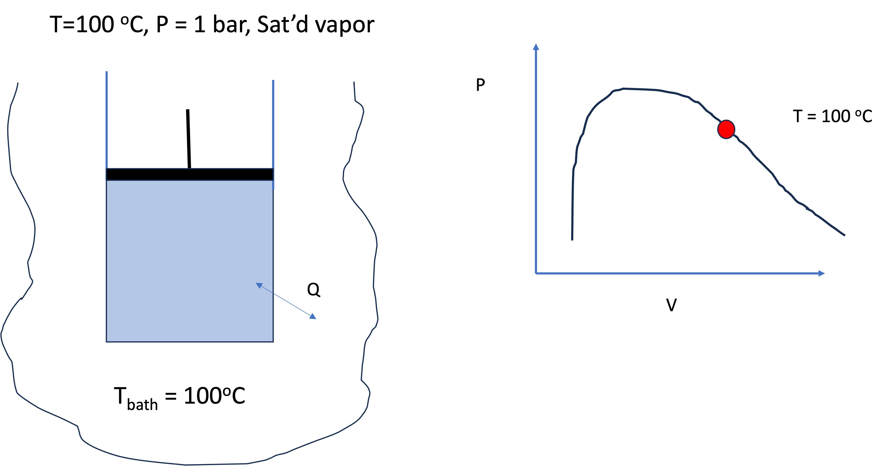
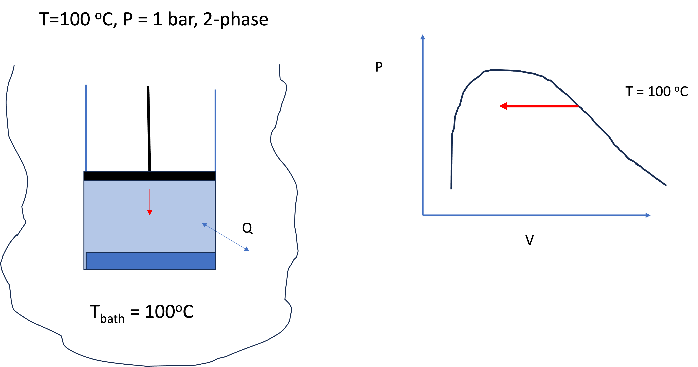
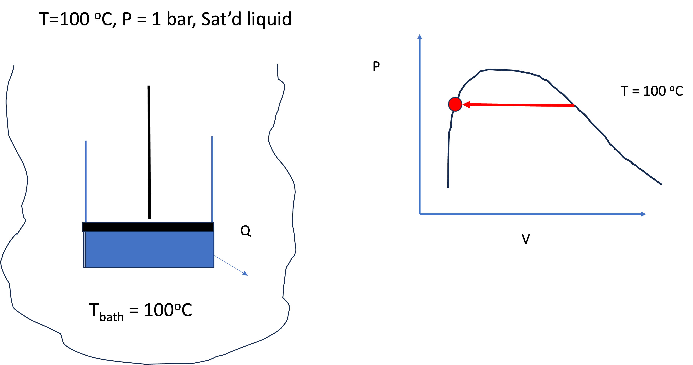
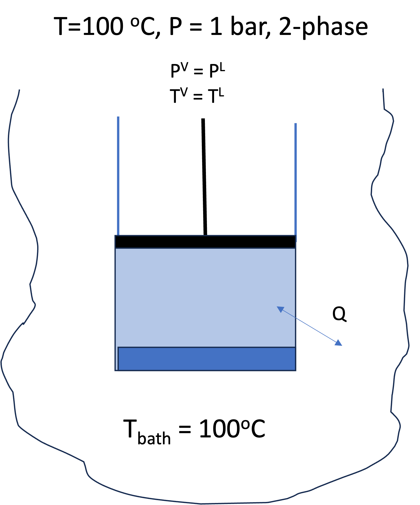
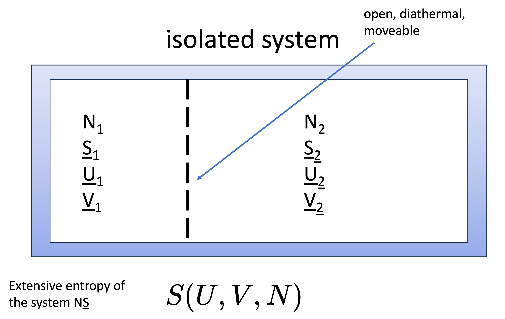

# Introduction: Why Phase Equilibrium Matters

Phase equilibrium is one of the central ideas in thermodynamics—and one that distinguishes chemical engineering from many other disciplines.

We are not just interested in a single phase (liquid, vapor, solid), but in **multiple phases coexisting**.

- Boiling, condensation, evaporation  
- Separation processes (distillation, extraction)  
- Multiphase reactors  

**Key idea:**  
> At equilibrium, phases coexist without any net change.

---

# What is Phase Equilibrium?

Consider liquid water and its vapor at 100°C and 1.013 bar.

From experience (and steam tables):

- $T^v = T^l$
- $P^v = P^l$

But:

- $\hat{V}^v \ne \hat{V}^l$
- $\hat{H}^v \ne \hat{H}^l$
- $\hat{U}^v \ne \hat{U}^l$
- $\hat{S}^v \ne \hat{S}^l$

(N.B. these are written as specific properties, but the same applies to molar properties.)

This raises an important question:

> What *must* be equal between phases at equilibrium?

---

# A Simple Demonstration (Steam Tables)

Look up saturated liquid and vapor properties at 100°C:

- $\hat{V}^l = 0.001043 \, \text{m}^3/\text{kg}$ and $\hat{V}^v = 1.6718 \, \text{m}^3/\text{kg}$
- $\hat{H}^l = 419.2 \, \text{kJ/kg}$ and $\hat{H}^v = 2675.6 \, \text{kJ/kg}$
- $\hat{S}^l = 1.3072 \, \text{kJ/kg·K}$ and $\hat{S}^v = 7.3541 \, \text{kJ/kg·K}$

They are all very different between the two phases.

Now evaluate:

$$
\hat{G} = \hat{H} - T \hat{S}
$$

Compute for both phases:

- $\hat{G}^v = \hat{H}^v - T \hat{S}^v = 2675.6 - 373.15 \times 7.3541 = -68.58     \, \text{kJ/kg}$
- $\hat{G}^l = \hat{H}^l - T \hat{S}^l = 419.2 - 373.15 \times 1.3072 = -68.58     \, \text{kJ/kg}$

**Observation:**

> Even though $\hat{H}$ and $\hat{S}$ differ between the two phases, $\hat{G}$ is the same. This suggests that the Gibbs energy may be the key variable governing phase equilibrium.

---

# Thought Experiment: Piston + Heat Bath

Consider a closed system:

- Initially: saturated vapor
- In contact with heat bath at constant $T$
- Apply pressure slowly (move piston)

What happens?

- Vapor condenses → liquid forms
- Volume decreases
- System remains at constant $T$, $P$

{#fig-VLE1 width=50%}

{#fig-VLE2 width=50%}

{#fig-VLE3 width=50%}

---

## What Changes?

From fundamental relations (using molar properties):

$$
d\underline{U} = T d\underline{S} - P d\underline{V}
$$

Both $d\underline{S}$ and $d\underline{V}$ are nonzero during the process, so:

$$
d\underline{U} \ne 0
$$

$$
d\underline{H} = T d\underline{S} + \underline{V} dP
$$

$d\underline{S}$ is nonzero during the process, so:

$$
d\underline{H}  \ne 0
$$
$$
d\underline{A} = -\underline{S} dT - P d\underline{V}
$$

$d\underline{V}$ is nonzero during the process, so:

$$
d\underline{A} \ne 0
$$

$$
d\underline{G} = -\underline{S} dT + \underline{V} dP
$$

$dT = 0$ and $dP = 0$, so $d\underline{G} = 0$!

**Key observation:**
During the different stages of phase equilibrium, $T$ and $P$ are constant, but $\underline{U}$, $\underline{H}$, and $\underline{A}$ change. However, $\underline{G}$ remains constant throughout the process:

- $d\underline{U} \ne 0$
- $d\underline{H} \ne 0$
- $d\underline{A} \ne 0$
- $d\underline{G} = 0$

For each of the two coexisting phases along the phase-change path at constant $T$ and $P$,
$$
d\underline{G}^l = d\underline{G}^v = 0
$$ {#eq-dG-l-v} 

---

## Key Result

> During phase change at constant $T$ and $P$, the Gibbs energy does not change.

This is our first major clue:

> **Equilibrium at constant $T$, $P$ corresponds to constant $\underline{G}$.**

---

# Deriving the Phase Equilibrium Condition

Now consider the total system (see @fig-piston):

- Liquid phase consists of $N^l$ moles
- Vapor phase consists of $N^v$ moles
- Total number of moles is constant: 
$$N = N^l + N^v$$ {#eq-N-constant}

{#fig-piston width=50%}

The total Gibbs energy is:

$$
G = N^l \underline{G}^l + N^v \underline{G}^v
$$

Remember that $\underline{G} = G/N$, where $G$ is extensive. 
Take the total differential:

$$
dG =(N^l d \underline{G}^l + N^v d \underline{G}^v) + (\underline{G}^l dN^l + \underline{G}^v dN^v) 
$$ {#eq-dG}

The first term in parenthesis is zero, since $d \underline{G}^l = d \underline{G}^v = 0$ at equilibrium. But from @eq-N-constant, we have:

$$
dN^l = -dN^v
$$
since $dN=0$ (the total number of moles is constant). 
So:

$$
dG = (\underline{G}^l - \underline{G}^v) dN^l 
$$

Thus, we see that at equilibrium:

$$
dG = 0
\Rightarrow \underline{G}^l = \underline{G}^v 
$$ {#eq-G-equal}

This is the key expression we were looking for. At phase equilibrium, not only does $\underline{G}$ not change, but the Gibbs energy per mole *must be the same in both phases* at equilibrium.

---

## Central Result

> **At phase equilibrium for any two phases $\alpha$ and $\beta$:**
>
> $$
> \underline{G}^\alpha = \underline{G}^\beta
> $$

All the other thermodynamic properties ($\underline{S}$, $\underline{H}$, $\underline{A}$, $\underline{V}$, $\underline{U}$, etc.) may differ between phases, but the Gibbs energy per mole must be equal at equilibrium. This is consistent with what we observed in the steam tables: $\underline{G}^l = \underline{G}^v$ at 100°C and 1.013 bar.

---

# Chemical Potential and Fundamental Relation with Variable $N$

We now define a new quantity called the chemical potential, denoted $\mu$, as the partial derivative of the total Gibbs energy with respect to the number of moles at constant $T$ and $P$:

$$
\mu = \left( \frac{\partial G}{\partial N} \right)_{T,P}
$$ {#eq-chemical-potential}

We will motivate the chemical potential definition mathematically shortly, but for now just treat @eq-chemical-potential as the definition of chemical potential. Note that in @eq-chemical-potential, $G$ is the total Gibbs energy of the system, which is an extensive property. The chemical potential is the partial molar Gibbs energy. For a pure fluid, it reduces to the molar Gibbs energy.

That is, For a pure fluid:

$$
\mu = \underline{G} 
$$ {#eq-mu-equal-G}
  
So using @eq-mu-equal-G, the phase equilibrium condition of a pure fluid can also be written in terms of chemical potential:

$$
\mu^\alpha = \mu^\beta
$$ {#eq-mu-equal}

where $\alpha$ and $\beta$ are the two phases at equilibrium. These could be liquid, vapor, or solid.

---

---

# Second Thought Experiment: Isolated System

Now consider:

- An isolated system (fixed $U$, $V$, $S$, and $N$ - note these are extensive properties of the overall system)
- Two subsystems 1 and 2, each with their own $U$, $V$, $S$, and $N$ (these are extensive properties of the subsystems, not the overall system)
- The subsystems are separated by a movable, diathermal, permeable wall so that the subsystems can exchange volume, energy, and matter with each other, but not with the outside world

{#fig-S-thought width=50%}

The Second Law says that for an isolated system, entropy is maximized at equilibrium. The system in @fig-S-thought will evolve until the total entropy is maximized. This means that at equilibrium:

$$
dS = 0
$$

Since the system is isolated, $U$, $N$, and $V$ are all constant. Thus, the only way for the system to evolve is for energy, volume, and matter to be exchanged between the two subsystems. The variations in energy, volume, and moles are arbitrary (i.e. they can be any value that satisfies the overall constraints of fixed total $U$, $V$, and $N$).

In the aside below, a detailed derivation is given showing that the condition $dS=0$ for an isolated system implies that $T$, $P$, and $\mu$ must be equal between the two subsystems at equilibrium. 
This is a more general and rigorous derivation of the phase equilibrium conditions than the Gibbs energy argument given above.

---

::: {.callout-note title="Aside: Detailed derivation showing that entropy maximization implies equality of $T$, $P$, and $\mu$"}

Consider an **isolated system** made of two subsystems separated by a boundary that is:

- diathermal,
- movable,
- permeable.

Thus, energy, volume, and matter may be exchanged internally, but for the **overall isolated system** the totals are fixed:

$$
U = U_1 + U_2 = \text{constant}
$$

$$
V = V_1 + V_2 = \text{constant}
$$

$$
N = N_1 + N_2 = \text{constant}
$$

The total entropy is

$$
S = S_1 + S_2
$$

and at equilibrium the entropy of the isolated system is maximized, so

$$
dS = dS_1 + dS_2 = 0
$$

with $S_i = S_i(U_i,V_i,N_i)$.

### Step 1: Expand \(dS\)

Write the total differential of each subsystem entropy:

$$
dS_1 =
\left(\frac{\partial S_1}{\partial U_1}\right)_{V_1,N_1} dU_1
+
\left(\frac{\partial S_1}{\partial V_1}\right)_{U_1,N_1} dV_1
+
\left(\frac{\partial S_1}{\partial N_1}\right)_{U_1,V_1} dN_1
$$

$$
dS_2 =
\left(\frac{\partial S_2}{\partial U_2}\right)_{V_2,N_2} dU_2
+
\left(\frac{\partial S_2}{\partial V_2}\right)_{U_2,N_2} dV_2
+
\left(\frac{\partial S_2}{\partial N_2}\right)_{U_2,V_2} dN_2
$$

Therefore,

$$
\begin{aligned}
dS =\;&
\left(\frac{\partial S_1}{\partial U_1}\right)_{V_1,N_1} dU_1
+
\left(\frac{\partial S_1}{\partial V_1}\right)_{U_1,N_1} dV_1
+
\left(\frac{\partial S_1}{\partial N_1}\right)_{U_1,V_1} dN_1 \\
&+
\left(\frac{\partial S_2}{\partial U_2}\right)_{V_2,N_2} dU_2
+
\left(\frac{\partial S_2}{\partial V_2}\right)_{U_2,N_2} dV_2
+
\left(\frac{\partial S_2}{\partial N_2}\right)_{U_2,V_2} dN_2
\end{aligned}
$$

### Step 2: Identify the partial derivatives

The fundamental relation we are familiar with is written in terms of molar properties:
$$
d\underline{U} = T\,d\underline{S} - P\,d\underline{V}
$$

To write it in terms of total properties, we need a third term that is in terms of $dN$

$$
dU = T\,dS - P\,dV + X \,dN
$$

where $X \equiv \left(\frac{\partial U}{\partial N}\right)_{S,V}$ is some unknown quantity.

As we will soon see, $X$ is the chemical potential $\mu$! Thus, the fundamental relation in terms of total properties is: 

$$
dU = T\,dS -P\,dV + \mu\,dN
$$ {#eq-fundamental-relation-total}   

> $\mu$ is the conjugate variable to $N$ in the fundamental relation, just as $T$ is the conjugate variable to $S$ and $-P$ is the conjugate variable to $V$. It is related to the exchange of matter between the two subsystems, just as $T$ is related to the exchange of energy and $P$ is related to the exchange of volume. Since we proved that at phase equilibrium $\mu$ must be equal between the two phases, it makes sense that $\mu$ is the conjugate variable to $N$ in the fundamental relation when there is no net matter exchange between phases. 

From this we obtain:

$$
\left(\frac{\partial S}{\partial U}\right)_{V,N} = \frac{1}{T}
$$

To obtain the volume derivative, hold \(U\) and \(N\) constant in the fundamental relation:

$$
0 = T\,dS - P\,dV
\quad\Rightarrow\quad
\left(\frac{\partial S}{\partial V}\right)_{U,N} = \frac{P}{T}
$$

To obtain the mole derivative, hold \(U\) and \(V\) constant:

$$
0 = T\,dS + \mu\,dN
\quad\Rightarrow\quad
\left(\frac{\partial S}{\partial N}\right)_{U,V} = -\frac{\mu}{T}
$$

Substitute these into the expression for \(dS\):

$$
dS =
\frac{1}{T_1}dU_1 + \frac{P_1}{T_1}dV_1 - \frac{\mu_1}{T_1}dN_1
+
\frac{1}{T_2}dU_2 + \frac{P_2}{T_2}dV_2 - \frac{\mu_2}{T_2}dN_2
$$

### Step 3: Apply the overall constraints

Because the total isolated system has fixed \(U\), \(V\), and \(N\),

$$
dU_1 + dU_2 = 0 \quad\Rightarrow\quad dU_1 = -dU_2
$$

$$
dV_1 + dV_2 = 0 \quad\Rightarrow\quad dV_1 = -dV_2
$$

$$
dN_1 + dN_2 = 0 \quad\Rightarrow\quad dN_1 = -dN_2
$$

Using these relations to eliminate the subsystem-1 differentials gives:

$$
dS =
\left(\frac{1}{T_2} - \frac{1}{T_1}\right)dU_2
+
\left(\frac{P_2}{T_2} - \frac{P_1}{T_1}\right)dV_2
-
\left(\frac{\mu_2}{T_2} - \frac{\mu_1}{T_1}\right)dN_2
$$

Equivalent forms with the signs reversed are, of course, identical. A common way to write it is

$$
dS =
\left(\frac{1}{T_1} - \frac{1}{T_2}\right)dU
+
\left(\frac{P_1}{T_1} - \frac{P_2}{T_2}\right)dV
-
\left(\frac{\mu_1}{T_1} - \frac{\mu_2}{T_2}\right)dN
$$

where \(dU\), \(dV\), and \(dN\) represent independent transfers between the two subsystems. 

### Step 4: Use the fact that the variations are arbitrary

For the entropy maximum condition to hold for **any allowed internal exchange** of energy, volume, and matter, each coefficient must be zero:

$$
\frac{1}{T_1} - \frac{1}{T_2} = 0
$$

$$
\frac{P_1}{T_1} - \frac{P_2}{T_2} = 0
$$

$$
\frac{\mu_1}{T_1} - \frac{\mu_2}{T_2} = 0
$$

From the first of these,

$$
T_1 = T_2
$$

Substituting that into the second and third gives

$$
P_1 = P_2
\qquad\text{and}\qquad
\mu_1 = \mu_2
$$

### Final result

Thus, maximizing entropy for an isolated system implies the equilibrium conditions

$$
T_1=T_2,\qquad P_1=P_2,\qquad \mu_1=\mu_2
$$

That is:

- equality of temperature $\rightarrow$ thermal equilibrium
- equality of pressure $\rightarrow$ mechanical equilibrium
- equality of chemical potential $\rightarrow$  chemical equilibrium

:::

## Expanding the Entropy Differential

The derivation above proves that at equilibrium when entropy is maximized ($dS=0$), $T$, $P$, and $\mu$ **must be equal between the two subsystems that are at equilibrium**. The key step was to write the total differential of the entropy of the isolated system and then use the fact that the variations in energy, volume, and moles are arbitrary to conclude that each coefficient must be zero.

$$
dS =
\left(\frac{1}{T_1} - \frac{1}{T_2}\right) dU
+
\left(\frac{P_1}{T_1} - \frac{P_2}{T_2}\right) dV
-
\left(\frac{\mu_1}{T_1} - \frac{\mu_2}{T_2}\right) dN
$$

For this to hold for **any variation**, each term must be zero:

---

## Final Equilibrium Conditions

- Thermal equilibrium:
  $$
  T_1 = T_2
  $$

- Mechanical equilibrium:
  $$
  P_1 = P_2
  $$

- Chemical equilibrium:
  $$
  \mu_1 = \mu_2
  $$

---

# Final Result: Phase Equilibrium Conditions

We now have a complete statement of phase equilibrium:

> Two phases are in equilibrium if and only if:
>
> $$
> T^\alpha = T^\beta,\quad
> P^\alpha = P^\beta,\quad
> \mu^\alpha = \mu^\beta
> $$

---

## Interpretation

- $T$ equality → no heat flow  
- $P$ equality → no mechanical motion  
- $\mu$ equality → no mass transfer  

**Chemical potential is the “driving force” for phase change (i.e. for mass to go between phases).**

---

# Summary

- Phase equilibrium involves **multiple phases coexisting**
- Many properties differ between phases, but the equilibrium conditions require equality of $T$, $P$, and $\mu$
- **Gibbs energy argument → $\underline{G}^\alpha = \underline{G}^\beta$**
- **Entropy maximization → $T, P, \mu$ equal**
- Chemical potential is the key variable governing equilibrium

