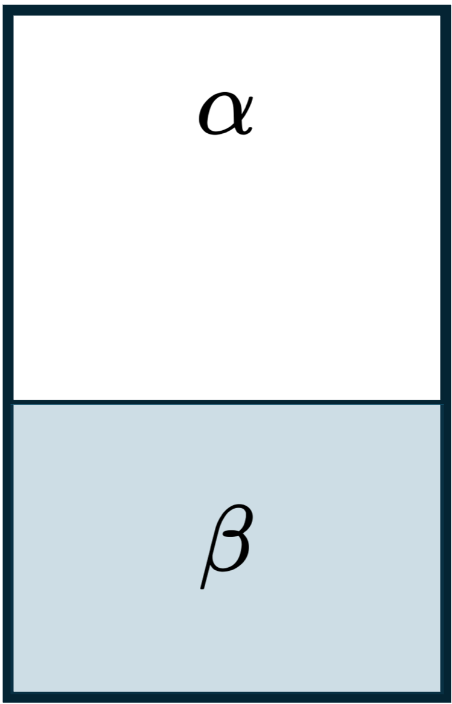
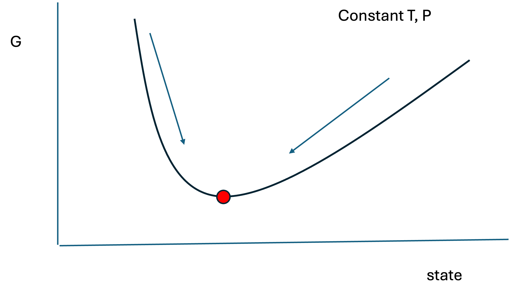
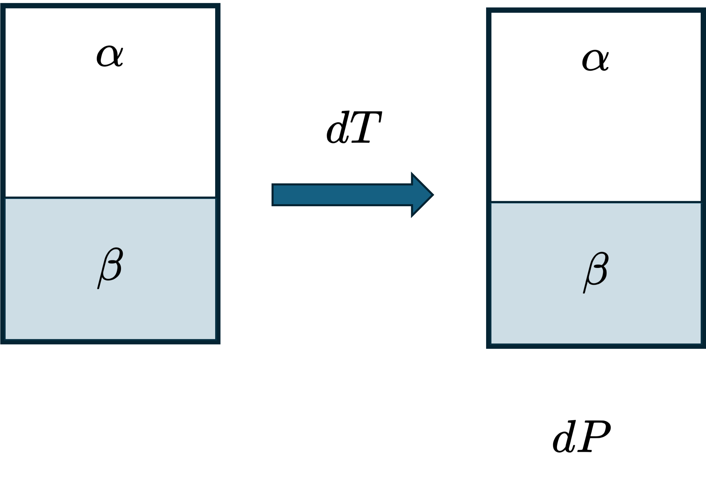
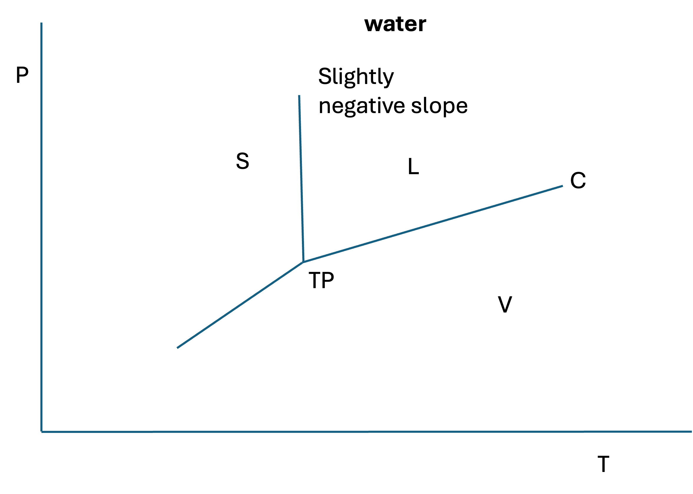
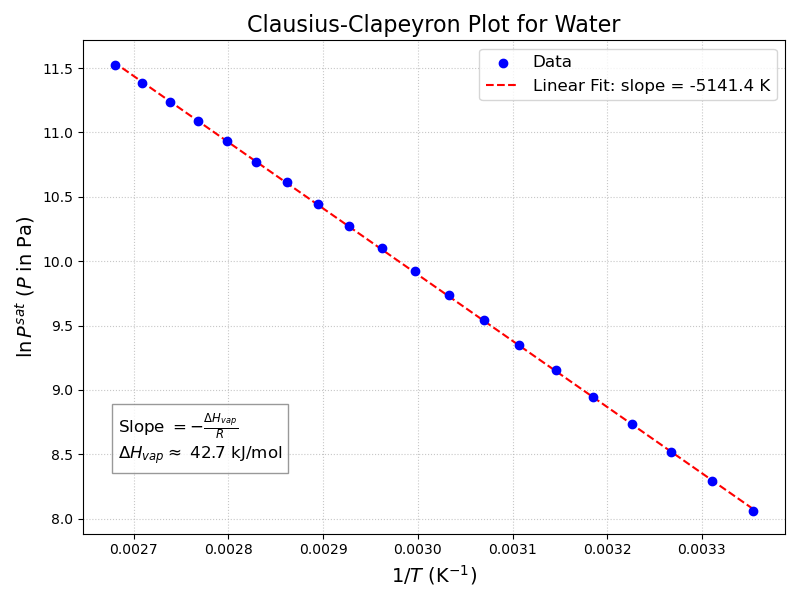

# Review and Continuation of Phase Equilibrium Discussion

Last lecture, we established two key ideas about phase equilibrium:

1. For two phases in equilibrium (see @fig-phase-eq), temperature, pressure, and chemical potential are equal:
   $$
   T^\alpha = T^\beta,\qquad
   P^\alpha = P^\beta,\qquad
   \mu^\alpha = \mu^\beta
   $$

{#fig-phase-eq width=10%}

2. For a pure fluid, the chemical potential is just the molar Gibbs energy:
   $$
   \mu = \underline{G}
   $$
So in this special case of pure fluids, phase equilibrium can be expressed as equality of molar Gibbs energies in addition to equality of temperature and pressure:
   $$
   \underline{G}^\alpha = \underline{G}^\beta
   $$

   

This lecture picks up from there. We will:

- connect chemical potential to all of the major thermodynamic potentials,
- write the general fundamental relations when $N$ is allowed to vary,
- show that maximizing entropy for a closed system at constant $T$ and $P$ implies minimization of $G$,
- derive a very important result relating the **rate of change of Gibbs energy** to the **rate of entropy generation**,
- derive the **Clapeyron equation**, and
- simplify it to the **Clausius--Clapeyron equation** for vapor-liquid equilibrium.
- introduce the semi-empirical Antoine equation for vapor pressure.

---

# Chemical Potential and Thermodynamic Potentials

<!-- I should probably revise this to start out with total differentials and an open system and motivate the 4 chemical potential partial derivatives from scratch instead of just stating what the chemical potential is. -->

The chemical potential is the **partial molar Gibbs energy**:

$$
\mu = \left( \frac{\partial G}{\partial N} \right)_{T,P} 
$$ {#eq-chemical-potential}

But $\mu$ also appears naturally when we differentiate the other thermodynamic potentials with respect to the number of moles, holding their natural variables constant (see the last derivation in the previous lecture notes where we showed that maximizing entropy yields the conditions of phase equilibria). The result is that $\mu$ can be expressed as a partial derivative of *any* of the four major thermodynamic potentials.

## Chemical potential from $U$, $H$, $A$, and $G$

For a one-component system, in addition to @eq-chemical-potential, we also have:

$$
\mu = \left( \frac{\partial U}{\partial N} \right)_{S,V} 
$$ {#eq-mu-from-U}

$$
\mu = \left( \frac{\partial H}{\partial N} \right)_{S,P}   
$$ {#eq-mu-from-H}

$$
\mu = \left( \frac{\partial A}{\partial N} \right)_{T,V} 
$$ {#eq-mu-from-A}

Note that in these expressions, $U$, $H$, $A$, and $G$ are the **extensive** thermodynamic potentials, not the molar potentials. The derivatives are taken with respect to the number of moles at constant values of the natural variables of each potential.

This means that $\mu$ is the conjugate variable to $N$, just as:

- $T$ is conjugate to $S$,
- $-P$ is conjugate to $V$.

This is why chemical potential is the natural thermodynamic quantity governing transfer of matter. When there is no net matter transferred between two phases, the chemical potentials must be equal.

---

# General Fundamental Relations with Chemical Potential

We first learned the fundamental relation for a closed, one-component system with fixed composition:

$$
d\underline{U} = T\,d\underline{S} - P\,d\underline{V}
$$
For a closed system, we could just multiply by $N$ to get the fundamental relation for the extensive internal energy:

$$
N d\underline{U} = dU = N (T\,d\underline{S} - P\,d\underline{V}) = T dS - P dV
$$

If the number of moles is allowed to vary for an open system, however, then we must add a third term involving $dN$ since the moles or mass can change in an open system. The full differential relations for the extensive potentials are:

$$
dU = T\,dS - P\,dV + \mu\,dN
$$ {#eq-fundamental-U}

$$
dH = T\,dS + V\,dP + \mu\,dN
$$ {#eq-fundamental-H}

$$
dA = -S\,dT - P\,dV + \mu\,dN
$$ {#eq-fundamental-A}

$$
dG = -S\,dT + V\,dP + \mu\,dN
$$ {#eq-fundamental-G}

Convince yourself that these are correct by looking at @eq-chemical-potential through @eq-mu-from-A to see how the chemical potential emerges as the partial derivative with respect to $N$.

@eq-fundamental-U - @eq-fundamental-G are the general fundamental relations for a one-component open system. If you look back at @fig-phase-eq, you can see that phases $\alpha$ and $\beta$ are open systems that can exchange matter with each other, so these are the correct fundamental relations to use when analyzing phase equilibrium.

## Important special case

For a **closed system**, ($dN=0$), these reduce to the familiar forms:

$$
dU = T\,dS - P\,dV
$$

$$
dH = T\,dS + V\,dP
$$

$$
dA = -S\,dT - P\,dV
$$

$$
dG = -S\,dT + V\,dP
$$

---

# Phase Equilibrium in Terms of Chemical Potential

The general condition for phase equilibrium between any two phases $\alpha$ and $\beta$ is:

$$
\mu^\alpha = \mu^\beta
$$

For a pure fluid, since $\mu = \underline{G}$, this can also be written as

$$
\underline{G}^\alpha = \underline{G}^\beta
$$

Thus:

- vapor-liquid equilibrium:
  $$
  \underline{G}^v = \underline{G}^l
  $$

- solid-liquid equilibrium:
  $$
  \underline{G}^s = \underline{G}^l
  $$

- solid-vapor equilibrium:
  $$
  \underline{G}^s = \underline{G}^v
  $$

- triple point:
  $$
  \underline{G}^s = \underline{G}^l = \underline{G}^v
  $$

If the molar Gibbs energies of the phases are not equal at a given $T$ and $P$, then the system is not at phase equilibrium.

---

# Gibbs Energy and Spontaneous Processes

Now we want to connect phase equilibrium to the **direction of spontaneous change**.

The key question is:

> At constant $T$ and $P$, what thermodynamic potential determines whether a process will proceed spontaneously?

We will show that the answer is the Gibbs energy.

---

## Closed System Energy and Entropy Balances

Consider a **closed system** at constant temperature and pressure. 

### Energy balance

Ignore kinetic and potential energy changes. The (extensive) energy balance is:

$$
\frac{dU}{dt} = \dot{Q} + \dot{W}
$$

For a simple compressible system, if the only work is boundary ("PV") work,

$$
\dot{W} = -P\frac{dV}{dt}
$$

so

$$
\frac{dU}{dt} = \dot{Q} - P\frac{dV}{dt}
$$ {#eq-energy-balance}

### Entropy balance

The entropy balance for a closed system is

$$
\frac{dS}{dt} = \frac{\dot{Q}}{T} + \dot{S}_{gen}
$$ {#eq-entropy-balance}

where:

  - $\dot{Q}/T$ accounts for entropy transfer with heat
  - $\dot{S}_{gen}$ is the rate of entropy generation

Multiply by $T$ to get:

$$
T\frac{dS}{dt} = \dot{Q} + T\dot{S}_{gen}
$$

Solve for $\dot{Q}$:

$$
\dot{Q} = T\frac{dS}{dt} - T\dot{S}_{gen}
$$

### Combined energy and entropy balances

Substitute this last expression into the energy balance @eq-energy-balance:

$$
\frac{dU}{dt} = T\frac{dS}{dt} - T\dot{S}_{gen} - P\frac{dV}{dt}
$$

Rearrange:

$$
\frac{dU}{dt} + P\frac{dV}{dt} - T\frac{dS}{dt} = -T\dot{S}_{gen}
$$

Because $T$ and $P$ are constant, they may be treated as constants with respect to time and moved inside the derivative.

$$
\frac{d}{dt}(U+PV-TS) = -T\dot{S}_{gen}
$$

But by definition,

$$
G = U + PV - TS
$$

Therefore,

$$
\frac{dG}{dt} = -T\dot{S}_{gen}
$$ {#eq-Gibbs-entropy-generation}

---

## Key Result

::: {.callout-important title="Key Result: Gibbs Energy and Entropy Generation"}

At constant $T$ and $P$, @eq-Gibbs-entropy-generation shows that the rate of change of Gibbs energy is directly related to the rate of entropy generation:

$$
\frac{dG}{dt} = -T\dot{S}_{gen}
$$

Since the second law requires

$$
\dot{S}_{gen} \ge 0
$$

it follows that

$$
\frac{dG}{dt} \le 0
$$

for any spontaneous process.

:::

---

# Interpretation: Why $G$ is Minimized at Equilibrium

This result gives immediate physical insight.

## Spontaneous process

If the process is spontaneous,

$$
\dot{S}_{gen} > 0
$$

so

$$
\frac{dG}{dt} < 0
$$

That is, **Gibbs energy decreases with time** for a spontaneous process.

## Equilibrium

At equilibrium,

$$
\dot{S}_{gen} = 0
$$

so

$$
\frac{dG}{dt} = 0
$$

Thus, at constant $T$ and $P$, a spontaneous process moves in the direction of decreasing Gibbs energy, and equilibrium corresponds to a minimum in $G$ (at constant $T$, $P$, and $N$):

> A spontaneous process moves in the direction of decreasing Gibbs energy, and equilibrium corresponds to a minimum in $G$.

{#fig-G-min width=40%}

---

# Phase Stability and Direction of Phase Change

This explains why $G$ tells us which phase is stable.

At a given $T$ and $P$:

- if $\underline{G}^v > \underline{G}^l$, vapor should spontaneously condense to liquid,
- if $\underline{G}^l > \underline{G}^v$, liquid should spontaneously vaporize,
- if $\underline{G}^v = \underline{G}^l$, the two phases are in equilibrium.

So $G$ tells us the direction a process wants to go.

> The most stable phase at equilibrium is the one with the lowest molar Gibbs energy.

Recall when we were solving cubic equations of state, we had to determine which root corresponded to the stable phase. We needed to compare the pressure to the experimental vapor pressure to choose the proper root, but that assumed the cubic equation of state captured the experimental vapor pressure. Now we see that the root with the lowest molar Gibbs energy is the stable phase. This is how we trace out phase diagrams with equations of state - we solve for the Gibbs energy of each phase, and choose the one with the lowest $\underline{G}$ as the stable phase. We will come back to this later when we discuss the concept of fugacity.

---

## Foreshadowing Mixtures

For a pure fluid,

$$
\mu = \left(\frac{\partial G}{\partial N}\right)_{T,P}
\qquad \text{and} \qquad
G = N\underline{G}
$$

For a mixture, each species $i$ has its own chemical potential:

$$
\mu_i \equiv \left(\frac{\partial G}{\partial N_i}\right)_{T,P,N_{j\ne i}}
$$

That is, when differentiating with respect to $N_i$, we hold:

- $T$ constant,
- $P$ constant,
- all other mole numbers $N_j$ constant.

This will be extremely important next semester when you study mixtures.

---

# Derivation of the Clapeyron Equation

Now we return to phase equilibrium of pure substances and ask:

> How does the equilibrium pressure change with temperature along a phase boundary?

Consider a pure fluid on a $P$-$T$ phase diagram, as shown in @fig-PT-Clapeyron.

{#fig-PT-Clapeyron width=50%}

Suppose the system is initially at a point on the coexistence line. If we change the temperature by $dT$, then the pressure must also change by $dP$ to remain on the phase boundary. That is shown by the points and dotted red lines in @fig-PT-Clapeyron.

{#fig-Clap-dTdP width=25%}

The phases will still be in equilibrium after these changes (@fig-Clap-dTdP) but they will be at a different point on the phase boundary. The question is: what is the slope of the phase boundary, i.e. what is $dP/dT$ along the coexistence curve?

For a pure fluid,

$$
d\underline{G} = \underline{V}\,dP - \underline{S}\,dT
$$

At equilibrium between phases $\alpha$ and $\beta$,

$$
\underline{G}^\alpha = \underline{G}^\beta
$$

and if we remain on the coexistence curve during the differential change,

$$
d\underline{G}^\alpha = d\underline{G}^\beta
$$

So:

$$
\underline{V}^\alpha dP - \underline{S}^\alpha dT
=
\underline{V}^\beta dP - \underline{S}^\beta dT
$$

Rearranging:

$$
(\underline{V}^\beta - \underline{V}^\alpha)dP
=
(\underline{S}^\beta - \underline{S}^\alpha)dT
$$

Therefore,

$$
\left(\frac{dP}{dT}\right)_{\alpha-\beta}
=
\frac{\underline{S}^\beta - \underline{S}^\alpha}{\underline{V}^\beta - \underline{V}^\alpha}
$$

or more compactly,

$$
\left(\frac{dP}{dT}\right)_{\alpha-\beta}
=
\frac{\Delta \underline{S}^{\alpha\to\beta}}{\Delta \underline{V}^{\alpha\to\beta}}
$$ {#eq-Clapeyron-ab}
we define all changes from $\alpha$ to $\beta$ as $(\beta - \alpha)$.

This is one form of the **Clapeyron equation**.  For the vapor-liquid coexistence line shown in @fig-PT-Clapeyron, this becomes

$$
\left(\frac{dP}{dT}\right)_{VLE}
=
\frac{\Delta \underline{S}_{vap}}{\Delta \underline{V}_{vap}}
$$ {#eq-Clapeyron-VLE}

---

# Clapeyron Equation in Terms of Enthalpy

Using the fact that for a reversible phase change at equilibrium,

$$
\Delta \underline{S}^{\alpha\to\beta}
=
\frac{\Delta \underline{H}^{\alpha\to\beta}}{T}
$$

we obtain

$$
\left(\frac{dP}{dT}\right)_{\alpha-\beta}
=
\frac{\Delta \underline{H}^{\alpha\to\beta}}{T\,\Delta \underline{V}^{\alpha\to\beta}}
$$ 

This is the most common form of the **Clapeyron equation**:

$$
\boxed{
\left(\frac{dP}{dT}\right)_{\alpha-\beta}
=
\frac{\Delta \underline{H}^{\alpha\to\beta}}{T\,\Delta \underline{V}^{\alpha\to\beta}}
}
$$ {#eq-Clapeyron-ab-enthalpy}

It is an **exact** equation and applies to **any two phases in equilibrium**. The Clapeyron equation connects measurable thermodynamic properties ($\Delta H$, $\Delta V$) to the shape of phase diagrams.

For VLE (as shown in @fig-PT-Clapeyron), this becomes the (exact) Clapeyron equation for vapor-liquid equilibrium:

$$
\left(\frac{dP}{dT}\right)_{VLE}
=
\frac{\Delta \underline{H}_{vap}}{T\,\Delta \underline{V}_{vap}}
$$ {#eq-Clapeyron}

---

# Physical Implications of the Clapeyron Equation

The sign of the slope of a coexistence curve depends on the signs of $\Delta \underline{H}$ and $\Delta \underline{V}$.

## Vapor-liquid equilibrium

For vaporization,

- $\Delta \underline{H}_{vap} > 0$,
- $\Delta \underline{V}_{vap} > 0$,

so

$$
\left(\frac{dP}{dT}\right)_{VLE} > 0
$$

Thus the vapor-liquid line has a positive slope (see @fig-PT-Clapeyron).

## Solid-liquid equilibrium

For melting,

- $\Delta \underline{H}_{fus} > 0$ almost always,
- $\Delta \underline{V}_{fus}$ is usually positive, but not always.

For most substances,

$$
\underline{V}^l > \underline{V}^s
$$

so

$$
\left(\frac{dP}{dT}\right)_{SLE} > 0
$$

This is also consistent with @fig-PT-Clapeyron, which shows a positive slope for the solid-liquid coexistence line.

## Why water is unusual

Water is unusual because ice is less dense than liquid water, so

$$
\underline{V}^s > \underline{V}^l
$$

Thus, for water,

$$
\Delta \underline{V}_{fus} = \underline{V}^l - \underline{V}^s < 0
$$

and therefore

$$
\left(\frac{dP}{dT}\right)_{SLE} < 0
$$

So the solid-liquid line for water has a **negative slope**, as shown schematically in @fig-PT-clapeyron-water.

{#fig-PT-clapeyron-water width=50%}

Other substances with this behavior include bismuth, gallium, germanium, silicon, and arsenic. The fact that $\underline{V}^s > \underline{V}^l$ for water is critical for life on Earth, because it allows ice to float on liquid water, providing insulation and a habitat for aquatic life during cold weather.

---

# Derivation of the Clausius--Clapeyron Equation

Now let's focus on the Clapeyron equation for **vapor-liquid equilibrium**.

Start with

$$
\left(\frac{dP}{dT}\right)_{VLE}
=
\frac{\Delta \underline{H}_{vap}}{T(\underline{V}^v-\underline{V}^l)}
$$ {#eq-Clapeyron-VLE-enthalpy}

To simplify this, make three assumptions.

## Assumption 1: vapor volume dominates liquid volume

Assume

$$
\underline{V}^v \gg \underline{V}^l
$$

so

$$
\underline{V}^v - \underline{V}^l \approx \underline{V}^v
$$

This is usually a good approximation except near the critical point, where the liquid and vapor densities become similar.

## Assumption 2: vapor behaves ideally

Assume the vapor is an ideal gas:

$$
\underline{V}^v = \frac{RT}{P}
$$

Combining the first two assumptions:

$$
\underline{V}^v - \underline{V}^l \approx \underline{V}^v \approx \frac{RT}{P}
$$

Substitute into the Clapeyron equation (@eq-Clapeyron-VLE-enthalpy):

$$
\frac{dP^{sat}}{dT}
\approx
\frac{\Delta \underline{H}_{vap}}{T(RT/P^{sat})}
$$

so

$$
\frac{dP^{sat}}{dT}
\approx
\frac{P^{sat}\Delta \underline{H}_{vap}}{RT^2}
$$

Rearrange:

$$
\frac{dP^{sat}}{P^{sat}}
\approx
\frac{\Delta \underline{H}_{vap}}{R}\frac{dT}{T^2}
$$

or equivalently,

$$
d\ln P^{sat}
=
-\frac{\Delta \underline{H}_{vap}}{R}\,d\left(\frac{1}{T}\right)
$$ {#eq-Clapeyron-VLE-ideal-gas}

## Assumption 3: $\Delta \underline{H}_{vap}$ is constant 

Assume $\Delta \underline{H}_{vap}$ does not vary strongly with temperature over the range of interest. Then integration gives:

$$
\ln\left(\frac{P_2^{sat}}{P_1^{sat}}\right)
=
-\frac{\Delta \underline{H}_{vap}}{R}
\left(\frac{1}{T_2}-\frac{1}{T_1}\right)
$$

This is the **Clausius--Clapeyron equation**.

---

# Clausius--Clapeyron Equation

The Clausius--Clapeyron equation may be written as

$$
\boxed{
\ln\left(\frac{P_2^{sat}}{P_1^{sat}}\right)
=
-\frac{\Delta \underline{H}_{vap}}{R}
\left(\frac{1}{T_2}-\frac{1}{T_1}\right)
}
$$ {#eq-Clausius-Clapeyron}

or, relative to an arbitrary constant,

$$
\ln P^{sat} = -\frac{\Delta \underline{H}_{vap}}{R}\frac{1}{T} + C
$$ {#eq-Clausius-Clapeyron-constant}

This is an **approximate** equation, because it relies on the three assumptions above, but it is often very useful and reasonably accurate over moderate temperature ranges.

---

# Interpretation of Clausius--Clapeyron

This equation shows that a plot of

$$
\ln P^{sat} \quad \text{vs.} \quad \frac{1}{T}
$$

should be approximately linear, with slope

$$
-\frac{\Delta \underline{H}_{vap}}{R}
$$

Therefore, vapor pressure data can be used to estimate the enthalpy of vaporization.

{#fig-cc-water width=50%}

In @fig-cc-water, we see that the Clausius--Clapeyron equation gives an excellent fit to the vapor pressure data for water over a moderate temperature range. The slope of the line can be used to estimate $\Delta \underline{H}_{vap}$, and the intercept can be used to estimate the constant $C$. The estimated enthalpy of vaporization is 42.75 kJ/mol.

How does this compare to literature?

- The true $\Delta H_{vap}$ for water at 100°C is 40.65 kJ/mol.

- The true $\Delta H_{vap}$ for water at 25°C is 44.00 kJ/mol.

Obviously, the enthalpy of vaporization is not constant. Since the Clausius--Clapeyron equation assumes it is constant, the results are not perfect. Nevertheless, the estimate of 42.75 kJ/mol is mid-way between the true values at 25°C and 100°C, which is consistent with the fact that we assumed $\Delta \underline{H}_{vap}$ was constant. For water under these conditions, the Clausius-Clapeyron equation is an excellent approximation.

# Antoine Equation
Vapor pressures are often tabulated in the form of the Antoine equation (see Appendix E in your textbook):

$$
\log_{10} P^{sat} = A - \frac{B}{T + C}
$$

This functional form is loosely related to the Clausius--Clapeyron equation, but the Antoine equation is empirical. The parameters $A$, $B$, and $C$ are fitted to experimental vapor pressure data. The Antoine equation can provide a better fit to vapor pressure data over a wider temperature range than the Clausius--Clapeyron equation, because it has more adjustable parameters. However, it does not have a direct physical interpretation like the Clausius--Clapeyron equation does.

---

# Example: Why Is Ice Slippery?

A classic hypothesis is that the pressure exerted by an ice skate melts the ice underneath the blade, creating a thin liquid water layer that reduces friction.

Let us test whether this is plausible using the Clapeyron equation.

Suppose ice is initially at $-5^\circ\text{C}$ and 1 bar. How much pressure would be needed to make it melt at $-5^\circ\text{C}$?

We cannot use the Clausius--Clapeyron equation here because this is **solid-liquid equilibrium**, not vapor-liquid equilibrium.

Instead use the exact Clapeyron equation:

$$
\left(\frac{dP}{dT}\right)_{SLE}
=
\frac{\Delta \underline{H}_{fus}}{T\,\Delta \underline{V}_{fus}}
$$

Assume $\Delta \underline{H}_{fus}$ and $\Delta \underline{V}_{fus}$ are approximately constant over the small temperature range.

Using data near $0^\circ\text{C}$ for water:

- $\rho^l \approx 1000 \text{kg/m}^3$
- $\rho^s \approx 917 \text{kg/m}^3$
- $\Delta \underline{H}_{fus} \approx 6010 \text{J/mol}$

The molar volumes are approximately

$$
\underline{V}^l \approx 1.80\times10^{-5}\ \text{m}^3/\text{mol}
$$

$$
\underline{V}^s \approx 1.97\times10^{-5}\ \text{m}^3/\text{mol}
$$

so

$$
\Delta \underline{V}_{fus} = \underline{V}^l-\underline{V}^s < 0
$$

Integrating the Clapeyron equation approximately gives a required pressure on the order of tens of bar, roughly

$$
P_2 \approx 66\ \text{bar}
$$

This is much larger than the pressure exerted by a typical skate blade, which is only a few bar. (You should verify this with a force balance and a ruler to estimate the area of contact between the blade and the ice.)

Therefore:

> Pressure melting alone does **not** explain why ice is slippery.

A better explanation is that the ice surface is not a perfect bulk solid; a thin disordered or quasi-liquid interfacial layer can exist, and frictional heating may also contribute.

---

# Summary

- Chemical potential is the conjugate variable to $N$ and can be written as:
  $$
  \mu =
  \left(\frac{\partial U}{\partial N}\right)_{S,V}
  =
  \left(\frac{\partial H}{\partial N}\right)_{S,P}
  =
  \left(\frac{\partial A}{\partial N}\right)_{T,V}
  =
  \left(\frac{\partial G}{\partial N}\right)_{T,P}
  $$

- The general fundamental relations are:
  $$
  dU = T\,dS - P\,dV + \mu\,dN
  $$
  $$
  dH = T\,dS + V\,dP + \mu\,dN
  $$
  $$
  dA = -S\,dT - P\,dV + \mu\,dN
  $$
  $$
  dG = -S\,dT + V\,dP + \mu\,dN
  $$

- For a closed system at constant $T$ and $P$, the rate of change of Gibbs energy is related to the rate of entropy generation by:
  $$
  \frac{dG}{dt} = -T\dot{S}_{gen}
  $$

- Therefore:
  - spontaneous processes decrease $G$,
  - equilibrium corresponds to a minimum in $G$.

- The exact Clapeyron equation is:
  $$
  \left(\frac{dP}{dT}\right)_{\alpha-\beta}
  =
  \frac{\Delta \underline{H}^{\alpha\to\beta}}{T\,\Delta \underline{V}^{\alpha\to\beta}}
  $$

- For vapor-liquid equilibrium, under additional assumptions, this becomes the Clausius--Clapeyron equation:
  $$
  \ln\left(\frac{P_2^{sat}}{P_1^{sat}}\right)
  =
  -\frac{\Delta \underline{H}_{vap}}{R}
  \left(\frac{1}{T_2}-\frac{1}{T_1}\right)
  $$

---

