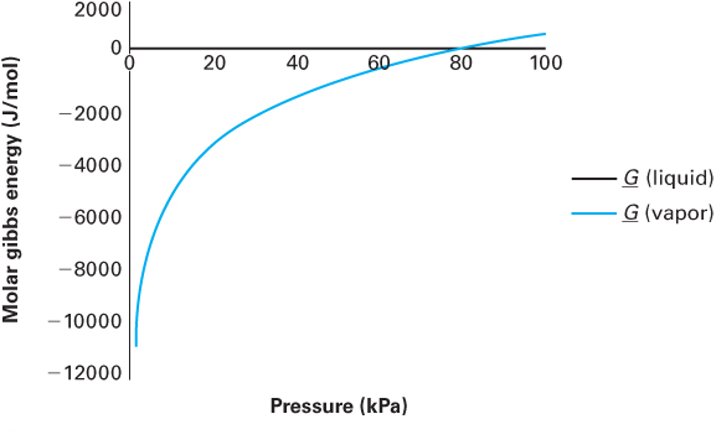

# Introduction: The Problem with Gibbs Free Energy

In our last lecture, we established that phase equilibrium requires the temperature, pressure, and chemical potential (which is the molar Gibbs energy for a pure fluid) to be equal across all phases:

$$T^\alpha = T^\beta, \quad P^\alpha = P^\beta, \quad \underline{G}^\alpha = \underline{G}^\beta$$ {#eq-phase-equil}

This is a beautiful, mathematically exact condition. But from an engineering standpoint, working directly with molar Gibbs free energy ($\underline{G}$) is unwieldy.

To see why, let's look at how Gibbs energy changes with pressure at constant temperature:
$$d\underline{G} = \underline{V}dP - \underline{S}dT$$
At constant $T$ ($dT=0$), $d\underline{G} = \underline{V}dP$.

If we assume our substance is an ideal gas ($\underline{V} = RT/P$), we can integrate from a reference pressure $P^\circ$ to a system pressure $P$:

$$\underline{G}(T, P) - \underline{G}(T, P^\circ) = \int_{P^\circ}^P \frac{RT}{P}\,dP = RT \ln\!\left(\frac{P}{P^\circ}\right)$$ {#eq-ig-gibbs}

Here is the problem: what is the absolute reference state? If we try to define our reference state at a pressure of absolute zero (a perfect vacuum, where molecules definitely behave ideally), we run into a singularity:
$$\lim_{P \to 0} \ln(P) = -\infty \implies \underline{G}^\circ \to -\infty$$

Because the absolute Gibbs energy drops to negative infinity as pressure approaches zero, tabulating absolute values of $G$ is mathematically frustrating. You can see this in @fig-g-vs-p which is from Example 8-4 of Dahm and Visco.

{#fig-g-vs-p width=50%}

We need a property that is easier to use but still holds the thermodynamic "magic" of Gibbs energy.

# The Concept of Fugacity

To overcome the $\underline{G} \to -\infty$ problem, the great American physical chemist G.N. Lewis invented a new thermodynamic property called **fugacity** ($f$) in 1901. The term comes from the Latin *fugere* (to flee), suggesting is is the "escaping tendency" of the fluid. (You may have seen the term "tempus fugit" — time flies — on a clock face.)

The strategy is elegant: choose a shared reference state for both the ideal and real fluid, write the departure from that reference for each, then subtract to cancel it out.

## Step 1: The Ideal Gas Analog

Starting from the fundamental relation for a closed system at constant $T$:
$$d\underline{G} = -\underline{S}dT + \underline{V}dP \implies d\underline{G}\big|_T = \underline{V}\,dP$$ {#eq-fund-relation}

Integrating for an ideal gas from a reference pressure $P^\circ$ to $P$:

$$\underline{G}^{ig}(T,P) - \underline{G}^{ig}(T,P^\circ) = \int_{P^\circ}^{P} \frac{RT}{P}\,dP = RT\ln\!\left(\frac{P}{P^\circ}\right)$$ {#eq-ig-departure}

All this does is define how the molar Gibbs energy change between two pressures for an ideal gas. The reference state is still arbitrary, but the departure from it is well-defined and finite at all pressures.

## Step 2: Defining Fugacity by Analogy

Lewis defined fugacity so that the **exact same logarithmic form** holds for a **real fluid**:

$$\underline{G}(T,P) - \underline{G}(T,P^\circ) \equiv RT\ln\!\left(\frac{f}{f^\circ}\right)$$ {#eq-fugacity-def}

where $f$ is the fugacity (which has units of pressure) and $f^\circ$ is its value at the reference state. The **fugacity coefficient** $\phi$ is the dimensionless ratio:

$$\phi \equiv \frac{f}{P}, \qquad f^\circ = \phi^\circ P^\circ$$ {#eq-phi-def}

For an ideal gas, $\phi = 1$ and $f = P$.

## Step 3: Choosing the Reference State

We choose $P^\circ = 1$ bar as the reference pressure, and define $\underline{G}^\circ(T, P^\circ)$ as the **ideal gas** Gibbs energy at that $T$ and $P^\circ = 1$ bar. This is a hypothetical state — it is *not* the $P \to 0$ limit, but rather a well-defined mathematical reference where the fluid behaves as an ideal gas. Because the reference state is an ideal gas, $\phi^\circ = 1$ and therefore $f^\circ = \phi^\circ P^\circ = P^\circ$.

Both the ideal gas and the real fluid are written as departures from this same reference:

$$\text{Ideal gas:} \quad \underline{G}^{ig}(T,P) - \underline{G}^\circ(T,P^\circ) = RT\ln\!\left(\frac{P}{P^\circ}\right)$$ {#eq-ig-ref-departure}
$$\text{Real fluid:} \quad \phantom{^{ig}}\underline{G}(T,P) - \underline{G}^\circ(T,P^\circ) = RT\ln\!\left(\frac{f}{P^\circ}\right)$$ {#eq-real-ref-departure}

## Step 4: Subtracting to Get the Key Result

Subtracting @eq-ig-ref-departure from @eq-real-ref-departure, the reference state $\underline{G}^\circ$ cancels exactly:
$$\underline{G}(T,P) - \underline{G}^{ig}(T,P) \equiv \underline{G}^R(T,P) = RT\ln\!\left(\frac{f}{P}\right) = RT\ln\phi$$ {#eq-gr-fugacity}

This is the **fundamental definition** linking fugacity to the residual Gibbs energy:

$$\boxed{\underline{G}^R(T,P) = RT\ln\phi = RT\ln\!\left(\frac{f}{P}\right)}$$ {#eq-gr-lnphi}

Rearranging @eq-gr-lnphi gives the fugacity directly:

$$f = P\exp\!\left[\frac{\underline{G}^R}{RT}\right] = \phi P$$ {#eq-f-phi-p}

Note what we did: we snuck the residual molar Gibbs energy into @eq-gr-fugacity.

**Why is this better?** As $P \to 0$, every real gas approaches ideal behavior: $\phi \to 1$ and $f \to P$. Consequently $\underline{G}^R \to RT\ln(1) = 0$ — a perfectly well-behaved limit. Unlike $\underline{G}$ itself, fugacity remains finite and meaningful at all pressures.

::: {.callout-note title="Fugacity: A Chemical Engineer's Best Friend"}
Fugacity has an undeserved reputation for being mysterious or difficult. It is not. Think of it simply as a **corrected pressure** — the effective pressure a molecule "feels" once intermolecular interactions are accounted for. When $\phi = 1$, the fluid is ideal and $f = P$ exactly. When $\phi > 1$, repulsive interactions dominate and molecules escape more readily than they would in an ideal gas. When $\phi < 1$, attractive interactions hold molecules back. That is all there is to it.

Why do chemical engineers use fugacity while most chemists prefer chemical potential $\mu$? Partly tradition, but mostly practicality. Chemical potential is the more fundamental quantity (it is the molar Gibbs energy) but it diverges to $-\infty$ as $P \to 0$, making it impossible to tabulate in absolute terms. Fugacity sidesteps this by encoding the same information in a quantity that is finite, has units of pressure, and is directly computable from any PVT equation of state. As we will see in the sections below, the working formulas for $\phi$ from common equations of state are compact and straightforward to implement (see @eq-lnphi-Z). That computational convenience is why fugacity became the standard language for phase equilibrium in chemical engineering.
:::

# Phase Equilibrium Revisited

We established in @eq-phase-equil that phase equilibrium for a pure fluid requires $\underline{G}^\alpha = \underline{G}^\beta$. This third condition also forces the residual Gibbs energies to be equal. Since both phases are at the same $T$ and $P$, they share the same ideal gas value $\underline{G}^{ig}(T,P)$. Subtracting it from both sides:

$$\underline{G}^\alpha - \underline{G}^{ig} = \underline{G}^\beta - \underline{G}^{ig} \implies \underline{G}^{R,\alpha} = \underline{G}^{R,\beta}$$ {#eq-gr-equil}

Now substitute @eq-gr-lnphi into @eq-gr-equil:
$$RT\ln\!\left(\frac{f^\alpha}{P^\alpha}\right) = RT\ln\!\left(\frac{f^\beta}{P^\beta}\right)$$

Since $P^\alpha = P^\beta$ at equilibrium, the pressures cancel and since the temperatures are also equal, we are left with:

$$\boxed{f^\alpha = f^\beta}$$ {#eq-vle-fugacity}

Finally, because $\phi = f/P$ (@eq-phi-def) and both phases share the same pressure, we get something amazingly simple:

$$\phi^\alpha = \phi^\beta$$ {#eq-phi-equil}

**This is the operational condition for phase equilibrium.** Rather than working with $\underline{G}$ (which diverges as $P \to 0$), we compute $f$ or $\phi$ from an equation of state and simply check whether @eq-vle-fugacity is satisfied.

::: {.callout-note title="Two Important Properties of Fugacity"}
1. **Fugacity is a state property.** It is defined entirely through $\underline{G}^R$ (@eq-gr-lnphi), which is determined by $T$, $P$, and $\underline{V}$ — all state properties. Therefore $f$ is fully specified by the thermodynamic state. It has units of pressure, but it is not a mechanical pressure; fugacity is a thermodynamic property that encodes the effects of intermolecular interactions.

2. **Fugacity applies to any phase.** We can define fugacities for vapor ($f^V$), liquid ($f^L$), solid ($f^S$), and supercritical fluid ($f^{scf}$). The phase equilibrium condition @eq-vle-fugacity is completely general.
:::

# Computing Fugacity from Equations of State

## Derivation via Residual Properties

We want to evaluate $\ln \phi = \underline{G}^R/RT$ (see @eq-gr-lnphi) from a PVT equation of state. The strategy is to use the residual property expressions for $\underline{H}^R$ and $\underline{S}^R$ that we derived earlier in the course, and substitute them into $\underline{G}^R = \underline{H}^R - T\underline{S}^R$:

$$\ln\!\left(\frac{f}{P}\right) = \frac{\underline{G}^R}{RT} = \frac{\underline{H}^R}{RT} - \frac{\underline{S}^R}{R}$$ {#eq-lnphi-HR-SR}

Recall the textbook expressions for the residual enthalpy and entropy, evaluated at constant $T$ (Text Eqs. 6.130, 6.134):

$$\underline{H}^R = \int_0^P \left[\underline{V} - T\!\left(\frac{\partial \underline{V}}{\partial T}\right)_{\!P}\right] dP$$ {#eq-HR}

$$\underline{S}^R = -\int_0^P \left[\left(\frac{\partial \underline{V}}{\partial T}\right)_{\!P} - \frac{R}{P}\right] dP$$ {#eq-SR}

Substituting @eq-HR and @eq-SR into @eq-lnphi-HR-SR gives:
$$\ln\!\left(\frac{f}{P}\right) = \frac{1}{RT}\int_0^P \left[\underline{V} - T\!\left(\frac{\partial \underline{V}}{\partial T}\right)_{\!P}\right] dP + \frac{T}{RT}\int_0^P \left[\left(\frac{\partial \underline{V}}{\partial T}\right)_{\!P} - \frac{R}{P}\right] dP$$

The $T(\partial \underline{V}/\partial T)_P$ terms appear with opposite signs and cancel exactly, leaving:

$$\boxed{\ln\!\left(\frac{f}{P}\right) = \frac{1}{RT}\int_0^P \left[\underline{V} - \frac{RT}{P}\right] dP}$$ {#eq-lnphi-VR}

The integrand is simply the residual volume $\underline{V}^R = \underline{V} - RT/P$; in other words, is is the local deviation of the real molar volume from the ideal gas value. The fugacity coefficient $\phi$ therefore captures the **cumulative** volumetric non-ideality, integrated from $P = 0$ up to the system pressure.

## Converting to the Compressibility Factor Form

We can rewrite @eq-lnphi-VR in a form more convenient for direct EOS calculations. Noting that:
$$\frac{\underline{V} - RT/P}{RT} = \frac{P\underline{V}/RT - 1}{P} = \frac{Z - 1}{P}$$

@eq-lnphi-VR becomes:

$$\boxed{\ln \phi = \int_0^P \frac{Z-1}{P}\,dP}$$ {#eq-lnphi-Z}

This is the standard working formula. Given any EOS that expresses $Z$ as a function of $T$ and $P$, @eq-lnphi-Z yields $\ln \phi$, and the fugacity follows as $f = \phi P$ (@eq-f-phi-p).

# Fugacity Coefficients from Common Equations of State

Evaluating the integral in @eq-lnphi-Z analytically for a specific EOS is a calculus exercise that has already been carried out. The results are collected here. For the cubic equations of state (vdW, SRK, PR), define the dimensionless parameters:

$$A \equiv \frac{aP}{(RT)^2}, \qquad B \equiv \frac{bP}{RT}$$ {#eq-AB-def}

For SRK and PR, $a$ includes the temperature-dependent $\alpha(T)$ correction.

**Truncated Virial EOS** ($Z = 1 + B_2 P/RT$, where $B_2$ is the second virial coefficient):

$$\ln \phi = \frac{B_2 P}{RT}$$ {#eq-lnphi-virial}

::: {.callout-note}
In @eq-lnphi-virial, $B_2$ is the **second virial coefficient** (units of L/mol or cm³/mol), which is distinct from the dimensionless parameter $B \equiv bP/RT$ defined in @eq-AB-def for the cubic equations of state.
:::

**van der Waals EOS:**

$$\ln \phi = Z - 1 - \ln(Z - B) - \frac{A}{Z}$$ {#eq-lnphi-vdw}

**Soave-Redlich-Kwong (SRK) EOS:**

$$\ln \phi = Z - 1 - \ln(Z - B) - \frac{A}{B}\ln\!\left(1 + \frac{B}{Z}\right)$$ {#eq-lnphi-srk}

**Peng-Robinson (PR) EOS:**

$$\ln \phi = Z - 1 - \ln(Z - B) - \frac{A}{2\sqrt{2}\,B}\ln\!\left(\frac{Z + (1+\sqrt{2})B}{Z + (1-\sqrt{2})B}\right)$$ {#eq-lnphi-pr}

**How to use these formulas.** The procedure is the same regardless of which EOS you choose:

1. **Determine the EOS parameters** $a$, $b$ (and $\alpha(T)$ for SRK and PR) from the critical constants $T_c$, $P_c$, and acentric factor $\omega$ using the correlations covered earlier in the course.
2. **Compute $A$ and $B$** at the temperature and pressure of interest using @eq-AB-def. Both are functions of $T$ and $P$.
3. **Solve the cubic EOS for $Z$.** Inside the two-phase envelope this yields three real roots; take the largest ($Z^V$) for vapor and the smallest ($Z^L$) for liquid. Outside the dome only one real root exists.
4. **Substitute $Z$, $A$, and $B$** into the appropriate formula above to obtain $\ln\phi$, then compute $\phi = e^{\ln\phi}$ and finally $f = \phi P$ (see @eq-f-phi-p).

---

::: {.callout-tip icon=false}
## Jupyter Notebook Example — Fugacity from Cubic EOS
I have prepared an interactive Jupyter Notebook that computes the fugacity coefficient $\phi$ and fugacity $f = \phi P$ for the vdW, SRK, and PR equations of state. Select a fluid, temperature, and pressure: the notebook solves the cubic for all physical roots, evaluates $\ln\phi$ for each root using the formulas above, and identifies the thermodynamically stable phase as the one with the lower fugacity.

::: {.content-visible when-format="html"}

[**View Interactive Notebook (.ipynb)**](fugacity-EOS.ipynb)

:::

::: {.content-visible when-format="pdf"}
*Note: This example is available as an interactive Jupyter Notebook on the course website.*
:::
:::

---

# Phase Stability and Cubic EOS Solvers

## Multiple Roots Inside the Vapor-Liquid Dome

When a cubic equation of state (SRK, PR, vdW) is evaluated at a $T$ and $P$ that falls **inside the two-phase envelope**, it yields three real positive roots for $\underline{V}$:

- **Largest root** ($\underline{V}^V$): the vapor-phase molar volume
- **Smallest root** ($\underline{V}^L$): the liquid-phase molar volume
- **Middle root**: physically meaningless — it lies in a mechanically unstable region where $(\partial P / \partial \underline{V})_T > 0$, violating mechanical stability, and is always discarded

Outside the two-phase dome, only one real root exists and that is the correct solution.

## Using Fugacity to Select the Stable Phase

Both the vapor and liquid roots are mathematically valid inside the dome, but only one represents the thermodynamically stable state. **Nature minimizes Gibbs free energy**, and since @eq-gr-lnphi gives $\underline{G}^R = RT\ln(f/P)$ at fixed $T$ and $P$, this is equivalent to selecting the **phase with the lower fugacity**.

The procedure is:

1. Solve the cubic EOS at the given $T$ and $P$ to obtain $\underline{V}^V$ and $\underline{V}^L$.
2. Compute $f^V$ using $Z^V = P\underline{V}^V/RT$ in the appropriate formula (@eq-lnphi-vdw, @eq-lnphi-srk, or @eq-lnphi-pr).
3. Compute $f^L$ using $Z^L = P\underline{V}^L/RT$ in the same formula.
4. Apply the stability criterion based on @eq-vle-fugacity:

| Condition | Physical state |
|:----------|:---------------|
| $f^V < f^L$ | Superheated vapor |
| $f^L < f^V$ | Subcooled liquid |
| $f^V = f^L$ | Vapor-liquid equilibrium (VLE) |

## Finding $T^\text{sat}$ and $P^\text{sat}$ by Iteration

The condition @eq-vle-fugacity is not just a diagnostic — it is the basis of a practical algorithm for locating the saturation curve from an EOS alone, with no experimental input.

**Given $P$, find $T^\text{sat}$:**

1. Guess $T$.
2. Solve the cubic; compute $f^V$ and $f^L$ using @eq-lnphi-srk or @eq-lnphi-pr.
3. Iterate on $T$ until @eq-vle-fugacity is satisfied. The converged value is $T^\text{sat}$.

**Given $T$, find $P^\text{sat}$:**

1. Guess $P$ (the Antoine equation gives a good starting point).
2. Solve the cubic; compute $f^V$ and $f^L$ using @eq-lnphi-srk or @eq-lnphi-pr.
3. Iterate on $P$ until @eq-vle-fugacity is satisfied. The converged value is $P^\text{sat}$.

::: {.callout-tip title="Homework Help: Fugacity from Steam Tables!"}
Your homework asks you to find the fugacity of steam at 500 °C using both the Peng-Robinson EOS and the Steam Tables. You have @eq-lnphi-pr for the PR calculation, but how do you use tables?

From @eq-gr-lnphi, $\underline{G}^R = RT \ln(f/P)$, and from $\underline{G} = \underline{H} - T\underline{S}$:
$$\ln\!\left(\frac{f}{P}\right) = \frac{\underline{H}_{real} - \underline{H}_{ideal}}{RT} - \frac{\underline{S}_{real} - \underline{S}_{ideal}}{R}$$

To find the ideal properties at 500 °C and high pressure, simply look up $\underline{H}$ and $\underline{S}$ for steam at 500 °C but at a **very low pressure** (e.g., $P^* = 0.01$ bar) where it behaves essentially as an ideal gas. You must correct the ideal entropy for the pressure difference using $\underline{S}_{ideal}(P) = \underline{S}(P^*) - R \ln(P/P^*)$ before plugging it in!
:::

---

# Example Problem: Fugacity from an Empirical EOS

*(D-V Example 8.19)*

A gas obeys the following equation of state:
$$\underline{V} = \frac{RT}{P} + aP^2, \qquad a = 0.01\ \frac{\text{L}}{\text{bar}^2{\cdot}\text{mol}}$$

**(a)** Derive a general expression for the fugacity $f(T,P)$.

**(b)** Evaluate the fugacity at $T = 500\ \text{K}$, $P = 5\ \text{bar}$.

---

**Part (a): General expression**

**Step 1: Write the EOS in terms of $Z$.**

Multiply both sides by $P/RT$:
$$Z = \frac{P\underline{V}}{RT} = 1 + \frac{aP^3}{RT}$$ {#eq-empirical-Z}

**Step 2: Substitute @eq-empirical-Z into @eq-lnphi-Z.**

$$\ln\!\left(\frac{f}{P}\right) = \int_0^P \frac{Z-1}{P}\,dP = \int_0^P \frac{aP^2}{RT}\,dP = \frac{aP^3}{3RT}$$ {#eq-empirical-lnphi}

**Step 3: Exponentiate @eq-empirical-lnphi to get the general result.**

$$\boxed{f(T,P) = P\exp\!\left(\frac{aP^3}{3RT}\right)}$$ {#eq-empirical-f}

---

**Part (b): Numerical evaluation**

Using $R = 0.08314\ \text{L·bar/(mol·K)}$, $T = 500\ \text{K}$, $P = 5\ \text{bar}$ in @eq-empirical-f:
$$\frac{aP^3}{3RT} = \frac{0.01 \times 5^3}{3 \times 0.08314 \times 500} = \frac{1.25}{124.71} = 0.01002$$
$$f = 5\ \text{bar} \times \exp(0.01002) = \mathbf{5.05\ \text{bar}}, \qquad \phi = \frac{f}{P} = 1.01$$

**Physical interpretation:** $\phi > 1$ means the fugacity exceeds the actual pressure, indicating that repulsive intermolecular interactions dominate — the molecules are being "pushed out" more readily than an ideal gas. Conversely, $\phi < 1$ signals attractive interactions, where the effective escaping tendency is reduced. Here $\phi \approx 1$ because at 500 K and only 5 bar the gas is nearly ideal, so the correction is small.

# Fugacity of Liquids and Solids (The Poynting Correction)

## Tracing a Path to the Compressed Liquid

We already know how to compute $f^V$ for a gas using @eq-lnphi-Z or @eq-lnphi-VR. For a **compressed liquid** at pressure $P > P^{sat}$, we use @eq-lnphi-VR but split the integration path into three legs:

$$P = 0 \xrightarrow{\text{vapor}} P^{sat} \xrightarrow{\text{VLE}} P^{sat} \xrightarrow{\text{liquid}} P$$

This path is illustrated on a $P$–$V$ diagram in @fig-liquid-fugacity-path.

![Integration path used to derive the fugacity of a compressed liquid on a $P$–$V$ diagram. Leg 1 follows the vapor-phase isotherm from the ideal-gas limit ($P \approx 0$, point $A$) up to the saturated vapor state (point $B$, on the vapor branch of the dome). Leg 2 crosses the two-phase region horizontally at $P^{sat}$, where $f^V = f^L$, ending at the saturated liquid state (point $C$, on the liquid branch). Leg 3 compresses the liquid along the liquid isotherm from $C$ to the target pressure $P$ (point $D$).](images/liquid-fugacity-path.png){#fig-liquid-fugacity-path width=70%}

Starting from @eq-lnphi-VR, multiplied through by $RT$, and splitting accordingly:

$$RT\ln\!\left(\frac{f^L}{P}\right) = \underbrace{\int_0^{P^{sat}}\!\!\left[\underline{V}^V - \frac{RT}{P}\right]dP}_{\text{Leg 1: vapor}} + \underbrace{0}_{\substack{\text{Leg 2: VLE}\\P = P^{sat}\ (\text{const})\\dP = 0}} + \underbrace{\int_{P^{sat}}^{P}\!\!\left[\underline{V}^L - \frac{RT}{P}\right]dP}_{\text{Leg 3: liquid}}$$ {#eq-path-split}

**Leg 1** is exactly @eq-lnphi-VR evaluated at $P = P^{sat}$, which by definition equals $RT\ln\phi^V_{sat}$:
$$\int_0^{P^{sat}}\!\!\left[\underline{V}^V - \frac{RT}{P}\right]dP = RT\ln\phi^V_{sat}$$ {#eq-leg1}

**Leg 3** is split by separating the volume integral from the logarithmic ideal-gas term:
$$\int_{P^{sat}}^{P}\!\!\left[\underline{V}^L - \frac{RT}{P}\right]dP = \int_{P^{sat}}^{P}\underline{V}^L\,dP - RT\ln\!\left(\frac{P}{P^{sat}}\right)$$ {#eq-leg3}

Substituting @eq-leg1 and @eq-leg3 into @eq-path-split and dividing through by $RT$:
$$\ln\!\left(\frac{f^L}{P}\right) = \ln\phi^V_{sat} + \ln\!\left(\frac{P^{sat}}{P}\right) + \frac{1}{RT}\int_{P^{sat}}^{P}\underline{V}^L\,dP$$

Exponentiating gives the **exact expression** for the fugacity of a compressed liquid:

$$\boxed{f^L(T,P) = \phi^V_{sat}\,P^{sat}\exp\!\left[\frac{1}{RT}\int_{P^{sat}}^{P}\underline{V}^L\,dP\right]}$$ {#eq-liquid-fugacity-exact}

The exponential in @eq-liquid-fugacity-exact is called the **Poynting Correction (PC)**. It accounts for the work done compressing the liquid from $P^{sat}$ to $P$.

## Approximations

Three successive approximations simplify @eq-liquid-fugacity-exact.

**Approximation 1 — incompressible liquid** ($\underline{V}^L \neq f(P)$): Pull the constant molar volume out of the integral:
$$\text{PC} = \exp\!\left[\frac{\underline{V}^L(P - P^{sat})}{RT}\right]$$ {#eq-poynting-correction}
This is the form most commonly used in practice.

**Approximation 2 — moderate pressure** ($P \approx P^{sat}$): If the pressure does not greatly exceed the saturation pressure, the Poynting Correction (@eq-poynting-correction) is close to unity because $(P - P^{sat})$ is small and $\underline{V}^L$ is already small. Hence $\text{PC} \approx 1$.

**Approximation 3 — ideal saturated vapor** ($\phi^V_{sat} \approx 1$): At pressures well below the critical point the saturated vapor is nearly ideal.

Applying all three simultaneously:

$$f^L \approx P^{sat}$$ {#eq-liquid-fugacity-approx}

This is often an excellent approximation for engineering calculations at moderate pressures.

## Fugacity of Solids

The derivation for a solid is identical, referenced to the sublimation curve rather than the vapor-pressure curve:

$$f^S(T,P) = \phi^V_{sub}\,P^{sat}_{sub}\exp\!\left[\frac{\underline{V}^S(P - P^{sat}_{sub})}{RT}\right]$$ {#eq-solid-fugacity}

where $P^{sat}_{sub}$ is the sublimation pressure and $\phi^V_{sub}$ is the fugacity coefficient of the vapor on the sublimation curve at temperature $T$.
